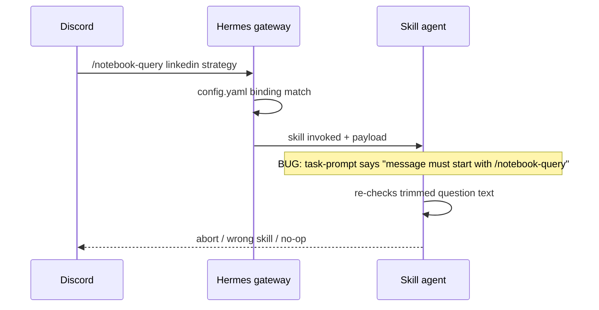

# Story 54.4: Trigger-contract audit — REFERENCE ONLY invocation language

Status: done

<!-- Ultimate context engine analysis completed — comprehensive developer guide created. -->

## Story

As the **CNS maintainer**,  
I want **every Hermes CNS skill task-prompt and SKILL.md trigger section to mark invocation-time trigger rules as REFERENCE ONLY**,  
so that **the Hermes agent does not re-evaluate `config.yaml` trigger grammar against the already-routed Discord payload and abort valid work** (the failure mode fixed for `notebook-query` in commit `0007934`).

## Context

| Topic | Detail |
|-------|--------|
| **Epic** | Epic 54: Hermes deployment parity & NotebookLM observability |
| **Predecessors** | **0007934** (notebook-query §0 pattern), **53-3** (notebook-query task-prompt), **54-1** (install gate + parity trio), **54-2** (task-prompt telemetry discipline), **54-3** (session-close slim router — no `task-prompt.md`) |
| **Problem class** | Hermes **already matched** `discord.channel_skill_bindings` before the skill runs. Task prompts that say “Match trigger”, “Treat message as trigger only if…”, or “Reject everything else” read like **runtime guards**. Models re-check the raw line, compare it to docs, and **stop** even though routing succeeded — e.g. notebook-query re-evaluating `/notebook-query` against extracted question text. |
| **In scope** | Repo mirrors under `scripts/hermes-skill-examples/`, installed copies under `~/.hermes/skills/cns/`, install scripts for every modified skill, contract tests, `verify.sh` |
| **Out of scope** | Changing `~/.hermes/config.yaml` trigger logic, `scorer`/`resolver` scripts, Convex schema, cns-dashboard, expanding 54-1 parity trio to all nine bound skills |

### Operator brief (binding)

- Audit **task-prompt.md** and **SKILL.md** for trigger-check sections that could be misread as runtime guards.
- Add **REFERENCE ONLY / invocation already confirmed** language matching `notebook-query` §0.
- Skills called out at risk: **triage**, **vault-think**, **investigate-trend**, **session-close**, **vault-lint**, **vault-graduate** (+ **notebook-query** as reference implementation).
- **AC:** Every audited skill’s trigger section is clearly reference-only; no bare “match trigger” runtime guard; installed copies match repo; `verify.sh` green; **54-1 parity gate** (notebook-query, morning-digest, session-close) still passes.

## Acceptance Criteria

### 1. Canonical REFERENCE ONLY block (AC: pattern)

**Given** any skill in the audit manifest (below) that documents Hermes routing preconditions in `references/task-prompt.md`  
**When** the dev agent reads §0 (or equivalent first trigger section)  
**Then** it includes **all** of:

1. Heading: `## 0) REFERENCE ONLY — invocation already confirmed` (or `###` only when §0 is reserved for env — then insert this block **before** the first trigger-match instruction).
2. Blockquote: *You have already been invoked.* The `config.yaml` trigger matched the incoming message. **Do not re-check or re-evaluate** the Hermes trigger prefix / binding.
3. Subordinate line: `For documentation purposes only (do not re-evaluate at runtime):` before enumerated trigger grammar.
4. Explicit instruction to **proceed** to the first operational step (§1 / “Run resolver” / “Parse subcommand”).

**Reference implementation** (do not regress):

```21:31:scripts/hermes-skill-examples/notebook-query/references/task-prompt.md
## 0) REFERENCE ONLY — invocation already confirmed
> **You have already been invoked.** The config.yaml trigger matched the
> incoming Discord message. Do not re-check or re-evaluate the trigger prefix.
> The question has already been extracted for you. Proceed directly to §1.

For documentation purposes only (do not re-evaluate at runtime):
1. Original message started with `/notebook-query ` (case-sensitive, space-terminated).
...
```

[Source: commit `0007934`]

### 2. Per-skill task-prompt audit (AC: task-prompt)

**Then** each file below is updated per the **Required change** column (or verified already compliant):

| Skill | `references/task-prompt.md` | Current risk | Required change |
|-------|----------------------------|--------------|-------------------|
| `notebook-query` | Yes | **Fixed** (`0007934`) | Verify only; add/extend contract test |
| `triage` | Yes | **High** — `## Inputs` + `references/trigger-pattern.md` imply re-validation | Insert §0 REFERENCE ONLY; reframe **Inputs** as **subcommand routing** (`/triage` vs `triage-approve` vs `triage-execute`) — not “does message match skill binding” |
| `vault-think` | Yes | **High** — `## 1) Line classification` is full trigger matrix | Insert §0; rename §1 to **“Subcommand classification”**; keep `bad-trigger` for **unknown subcommands**, not for “skill should not have run” |
| `investigate-trend` | Yes | **High** — `### 1) Match trigger` | Insert §0; rename to **“Parse payload”**; drop “If not, do not run this skill” → “If malformed, reply parse-error template” |
| `vault-lint` | Yes | **High** — `## 0) Trigger and abort gates` item 1–2 | Split: §0 REFERENCE ONLY; move exact `/vault-lint` grammar under “documentation only”; **abort** only for wrong **arguments** after invocation (extra tokens), not Hermes binding |
| `vault-graduate` | Yes | **High** — `## 0)` trigger table with `bad-trigger` | §0 REFERENCE ONLY + doc-only trigger table; `bad-trigger` only for malformed **graduate** args |
| `morning-digest` | Yes | **Medium** — no §0; SKILL says “when incoming message is manual trigger” | Add §0 REFERENCE ONLY at top of task-prompt (manual + cron pseudo-trigger documented only) |
| `session-close` | **No** (`task-prompt.legacy.md` only) | N/A task-prompt | See AC 3 (SKILL.md only) |
| `hermes-cns-verify-gate-summary` | Yes | **Low** (CLI-only, not Discord-bound) | Optional one-line REFERENCE ONLY (“operator invoked Hermes CLI”); **not** in manifest tests unless touched |

**And** no audited task-prompt retains a bare section title **`Match trigger`** without the REFERENCE ONLY preamble.

### 3. SKILL.md trigger sections (AC: skill-md)

**Then** for each skill in the audit manifest, `SKILL.md` **Trigger** / **When to use** / **Execution rule** blocks that instruct the model to **reject** messages for binding mismatch are rewritten to:

- State that **Hermes routing already selected this skill**.
- Point to `references/trigger-pattern.md` as **documentation** for operators and `config.yaml` authors.
- Limit runtime checks to **subcommand / argument** validation only.

| Skill | SKILL.md hotspot | Required change |
|-------|------------------|-----------------|
| `session-close` | `## Trigger` — “Reject everything else” | Add REFERENCE ONLY callout; reject only **invalid flags** (`/session-close` + unknown flags), not “wrong skill” |
| `vault-lint` | “When not to use” — exact `/vault-lint` | Clarify: extra args → `bad-trigger`; do not re-validate Hermes binding |
| `vault-graduate` | “Message does not match either trigger shape” | Same pattern |
| `triage` | “When to use” lists `/triage` grammar | Add REFERENCE ONLY sentence at top of trigger subsection |
| `vault-think` | “Message does not match an active trigger” | Reframe as **unknown subcommand** after invocation |
| `investigate-trend` | Trigger bullet | REFERENCE ONLY + link task-prompt payload rules |
| `morning-digest` | “Execution rule” — “When the incoming message is the manual trigger” | REFERENCE ONLY; proceed immediately (keep anti-summarize rule) |
| `notebook-query` | Trigger bullet | Add one line: trigger grammar is reference-only; see task-prompt §0 |

**And** bump `version:` in frontmatter for **every** `SKILL.md` touched (patch bump, e.g. `1.7.0` → `1.7.1`).

### 4. Subcommand vs binding (AC: semantics)

**Given** a skill supports multiple operator commands (triage-approve, vault-think `/emerge`, etc.)  
**When** the task prompt parses `raw`  
**Then** documentation distinguishes:

| Layer | Who enforces | Prompt language |
|-------|--------------|-----------------|
| Hermes `channel_skill_bindings` | Gateway before skill | REFERENCE ONLY — already matched |
| Subcommand / args | Skill task-prompt | “Parse”, “classify”, “route to §N” — never “do not run this skill” for binding |

**And** `bad-trigger` / `bad-trigger (...)` replies are only for **invalid subcommands or arguments**, not for re-checking whether Hermes should have invoked the skill.

### 5. Install + parity (AC: install)

**When** implementation completes  
**Then** for **each** modified skill, run its `scripts/install-hermes-skill-<skill>.sh` (see table below)  
**And** `diff -rq` repo mirror vs `~/.hermes/skills/cns/<skill>` is clean for each installed skill  
**And** `bash scripts/verify.sh` passes (includes 54-1 gate for **notebook-query**, **morning-digest**, **session-close**)

| Skill | Install script |
|-------|----------------|
| `triage` | `scripts/install-hermes-skill-triage.sh` |
| `vault-think` | `scripts/install-hermes-skill-vault-think.sh` |
| `investigate-trend` | `scripts/install-hermes-skill-investigate-trend.sh` |
| `vault-lint` | `scripts/install-hermes-skill-vault-lint.sh` |
| `vault-graduate` | `scripts/install-hermes-skill-vault-graduate.sh` |
| `morning-digest` | `scripts/install-hermes-skill-morning-digest.sh` |
| `notebook-query` | Only if §0/SKILL drifted — `scripts/install-hermes-skill-notebook-query.sh` |
| `session-close` | Only if SKILL drifted — `scripts/install-hermes-skill-session-close.sh` |

### 6. Contract tests (AC: tests)

**Then** `tests/hermes-trigger-contract.test.mjs` (new) asserts for each manifest skill:

- If `references/task-prompt.md` exists: file contains `REFERENCE ONLY` and `Do not re-check` (case-insensitive acceptable).
- File does **not** contain bare phrase `Match trigger` as a heading (regex: `^#+.*Match trigger` multiline).
- If `SKILL.md` exists: contains `invocation already confirmed` OR `REFERENCE ONLY` in Trigger / Execution / When to use section (first 120 lines).

**And** existing skill contract tests (`tests/hermes-*-skill.test.mjs`) remain green — update assertions only if they **required** old “match trigger” wording.

**And** `npm test` + `bash scripts/verify.sh` pass.

### 7. Scope guards (AC: scope)

**Then** this story does **not**:

- Edit `~/.hermes/config.yaml` in repo, scorer thresholds, or `resolve-notebook.mjs` logic
- Change `scripts/session-close/run-deterministic.mjs` or fan-out merge scripts
- Expand `PARITY_SKILLS` in `scripts/hermes-skill-bindings-expected.json` beyond the 54-1 trio
- Resurreate `session-close/references/task-prompt.md` (54-1 / 48-5 explicitly pruned)
- Modify WriteGate / `AGENTS.md`

## Tasks / Subtasks

- [x] **T1** Inventory — grep all `scripts/hermes-skill-examples/**/{SKILL.md,references/task-prompt.md}` for `Match trigger`, `Treat the operator message as a trigger`, `Reject everything else`, `do not run this skill` (AC: 2)
- [x] **T2** Apply REFERENCE ONLY blocks + heading renames per audit table (AC: 1, 2)
- [x] **T3** Update `SKILL.md` trigger sections + version bumps (AC: 3)
- [x] **T4** Add `tests/hermes-trigger-contract.test.mjs` with manifest constant (AC: 6)
- [x] **T5** Run install scripts for all touched skills; confirm `diff -rq` (AC: 5)
- [x] **T6** `bash scripts/verify.sh` — includes 54-1 parity trio gate (AC: 5, 6)

## Dev Notes

### Failure mode (why this story exists)



After fix: task-prompt §0 states invocation is **already confirmed**; §1 runs `resolve-notebook.mjs` with extracted question only.

[Source: `_bmad-output/implementation-artifacts/53-3-add-reason-field-to-no-route-responses.md`, commit `0007934`]

### Audit manifest (contract test SSOT)

```js
// tests/hermes-trigger-contract.test.mjs — suggested constant
export const TRIGGER_CONTRACT_SKILLS = [
  "notebook-query",
  "triage",
  "vault-think",
  "investigate-trend",
  "vault-lint",
  "vault-graduate",
  "morning-digest",
  "session-close", // SKILL.md only
];
```

`session-close`: assert `SKILL.md` only (no `references/task-prompt.md` in mirror — `tests/hermes-session-close-skill.test.mjs` already forbids router loading task-prompt).

### Per-file implementation hints

#### `triage/references/task-prompt.md`

- Insert §0 after hard constraints (before `## Inputs`).
- Replace opening of **Inputs** with: “**Subcommand routing** (invocation confirmed): parse whether the operator line is `/triage`, `triage-approve`, or `triage-execute`…”
- Keep offset/query parsing unchanged; keep Story 27.6 safety copy.

#### `vault-think/references/task-prompt.md`

- Insert §0 after title block.
- Renumber: current `## 0) Vault root…` → `## 0a) Vault root…` **or** keep env as §0 and put REFERENCE ONLY as **§0 Invocation** then env as §0b — **prefer single §0 REFERENCE ONLY** then `## 1) Environment` for vault root/REST (clearer for agents).
- `## 1) Line classification` → `## 2) Subcommand classification` (adjust all cross-refs §1b → §2b, etc.).

#### `investigate-trend/references/task-prompt.md`

- `### 1) Match trigger` → after §0, `### 1) Parse payload (4-line contract)`.
- “If not, do not run this skill” → use existing parse-error template (§3); no silent no-op.

#### `vault-lint` / `vault-graduate`

- Mirror notebook-query split: REFERENCE ONLY + doc-only exact command grammar.
- Preserve `vault-lint: bad-trigger` / `vault-graduate: bad-trigger` for **extra arguments** only.

#### `morning-digest/references/task-prompt.md`

- Add §0: manual line `morning-digest` + cron pseudo-trigger documented only; agent must not ask “should I run digest?”.

#### `session-close/SKILL.md`

- Under `## Trigger`, add blockquote REFERENCE ONLY.
- “Reject everything else” → “Reject unsupported **flags or trailing arguments** (not a binding mismatch).”

### notebook-query — regression anchor

Do **not** weaken §0. Optional: add cross-reference in `references/trigger-pattern.md` footer pointing to task-prompt §0 (operator docs only).

### 54-1 parity gate (must stay green)

Gate script: `scripts/assert-hermes-skill-install-gate.mjs`  
Parity trio: `notebook-query`, `morning-digest`, `session-close`

If `morning-digest` task-prompt changes, run `bash scripts/install-hermes-skill-morning-digest.sh` before verify on dev machine.

[Source: `_bmad-output/implementation-artifacts/54-1-skill-install-gate.md`]

### session-close — do not resurrect task-prompt

```96:101:tests/hermes-session-close-skill.test.mjs
// asserts SKILL.md body must NOT include references/task-prompt.md load
```

Fan-out / diagnostics live in `references/fanout-diagnostics.md` (54-3). Trigger fix is **SKILL.md only**.

### Anti-patterns (do not)

- Do **not** remove subcommand routing tables (vault-think `/emerge`, triage-execute grammar) — only reframe layer.
- Do **not** tell the model to “ignore” operator message content for security — Discord is still untrusted for **injection inside** the payload; only **binding** is pre-confirmed.
- Do **not** change `references/trigger-pattern.md` grammar (operator/config SSOT) except optional footers linking to REFERENCE ONLY.
- Do **not** add `task-prompt.md` to session-close mirror.

### Test contract sketch

```js
import { readFileSync, existsSync } from "node:fs";
import { join } from "node:path";
import { describe, it } from "node:test";
import assert from "node:assert/strict";

const repoRoot = "...";
const skillDir = (name) => join(repoRoot, "scripts/hermes-skill-examples", name);

for (const skill of TRIGGER_CONTRACT_SKILLS) {
  it(`${skill} task-prompt documents REFERENCE ONLY invocation`, () => {
    const tp = join(skillDir(skill), "references/task-prompt.md");
    if (!existsSync(tp)) return; // session-close
    const body = readFileSync(tp, "utf8");
    assert.match(body, /REFERENCE ONLY/i);
    assert.match(body, /Do not re-check/i);
    assert.doesNotMatch(body, /^#+\s*.*Match trigger\s*$/m);
  });
}
```

### Files in scope (expected)

| File | Action |
|------|--------|
| `scripts/hermes-skill-examples/*/references/task-prompt.md` | UPDATE (7 skills; not session-close) |
| `scripts/hermes-skill-examples/*/SKILL.md` | UPDATE (manifest skills) |
| `tests/hermes-trigger-contract.test.mjs` | **NEW** |
| `tests/hermes-*-skill.test.mjs` | UPDATE only if assertions conflict |
| `~/.hermes/skills/cns/*` | INSTALL (operator machine, not committed) |

### Previous story intelligence (54-3)

- Session-close router must **not** load `task-prompt.md`; trigger fix is SKILL-level only.
- Install uses `rsync -a --delete` for session-close — run after SKILL bump.

### Previous story intelligence (54-1)

- Parity trio enforced in `verify.sh`; other skills rely on manual install — this story requires install for **every** modified skill before claiming done.
- `cp` without `--delete` on notebook-query/morning-digest still OK for 54-1 scope; run install scripts after edits.

### Git intelligence

| Commit | Relevance |
|--------|-----------|
| `0007934` | **Canonical fix** — notebook-query §0 |
| `89de8c2` | 54-3 done — baseline for this story |
| `b3c957d` | 54-1 install gate — verify.sh hook |

### Project context reference

- **Verify gate:** `bash scripts/verify.sh` mandatory before done.
- **WriteGate:** no `AI-Context/AGENTS.md` edits.
- **Context7:** not required (markdown-only skill docs); optional `/nousresearch/hermes-agent` if documenting `channel_skill_bindings` in Operator Guide footnote — **out of scope** unless operator asks.

[Source: `project-context.md`, `CLAUDE.md`]

## References

- [Source: operator brief — Epic 54 / 54-4 trigger-contract audit]
- [Source: commit `0007934` — notebook-query REFERENCE ONLY §0]
- [Source: `_bmad-output/implementation-artifacts/53-3-add-reason-field-to-no-route-responses.md`]
- [Source: `_bmad-output/implementation-artifacts/54-1-skill-install-gate.md`]
- [Source: `_bmad-output/implementation-artifacts/54-3-session-close-fan-out-diagnostics.md`]
- [Source: `scripts/hermes-skill-examples/notebook-query/references/task-prompt.md`]
- [Source: `tests/hermes-session-close-skill.test.mjs`]

## Dev Agent Record

### Agent Model Used

(create-story workflow)

### Debug Log References

### Completion Notes List

- Added §0 **REFERENCE ONLY — invocation already confirmed** to seven task-prompts; session-close trigger fix in SKILL.md only (no task-prompt resurrection).
- Reframed runtime guards: subcommand/argument validation only (`bad-trigger` for malformed args, not binding mismatch).
- New contract test `tests/hermes-trigger-contract.test.mjs` (`TRIGGER_CONTRACT_SKILLS` manifest).
- Installed all eight manifest skills to `~/.hermes/skills/cns/`; `bash scripts/verify.sh` passed (54-1 parity trio intact).

### File List

- `scripts/hermes-skill-examples/triage/references/task-prompt.md`
- `scripts/hermes-skill-examples/triage/SKILL.md`
- `scripts/hermes-skill-examples/vault-think/references/task-prompt.md`
- `scripts/hermes-skill-examples/vault-think/SKILL.md`
- `scripts/hermes-skill-examples/investigate-trend/references/task-prompt.md`
- `scripts/hermes-skill-examples/investigate-trend/SKILL.md`
- `scripts/hermes-skill-examples/vault-lint/references/task-prompt.md`
- `scripts/hermes-skill-examples/vault-lint/SKILL.md`
- `scripts/hermes-skill-examples/vault-graduate/references/task-prompt.md`
- `scripts/hermes-skill-examples/vault-graduate/SKILL.md`
- `scripts/hermes-skill-examples/morning-digest/references/task-prompt.md`
- `scripts/hermes-skill-examples/morning-digest/SKILL.md`
- `scripts/hermes-skill-examples/notebook-query/SKILL.md`
- `scripts/hermes-skill-examples/session-close/SKILL.md`
- `tests/hermes-trigger-contract.test.mjs`
- `tests/hermes-triage-skill.test.mjs`
- `tests/hermes-vault-think-skill.test.mjs`
- `tests/hermes-vault-graduate-skill.test.mjs`
- `tests/hermes-investigate-trend-skill.test.mjs`
- `tests/hermes-morning-digest-skill.test.mjs`
- `_bmad-output/implementation-artifacts/sprint-status.yaml`

## Change Log

- 2026-06-02: Story 54-4 created — Hermes trigger-contract audit (REFERENCE ONLY invocation language across CNS skills).
- 2026-06-02: Implemented REFERENCE ONLY invocation language, contract tests, installs, verify green.
- 2026-06-02: BMAD code review — 6 patch, 3 defer, 12 dismissed.
- 2026-06-02: Code review patches applied (§ cross-refs, vault-think §2f, notebook-query SKILL/trigger-pattern, tests); verify green; status → done.

### Review Findings

- [x] [Review][Patch] **vault-lint task-prompt stale § cross-references** [`vault-lint/references/task-prompt.md:75,188,202,205`] — Fixed §1/§5/§12 cites after renumber.

- [x] [Review][Patch] **vault-think §2f cites wrong section** [`vault-think/references/task-prompt.md:95`] — Now references §2 classification table.

- [x] [Review][Patch] **notebook-query SKILL.md “When not to use” re-validates binding** [`notebook-query/SKILL.md:39`] — Reframed as question/argument validation only; version 1.0.4.

- [x] [Review][Patch] **notebook-query trigger-pattern.md binding rejection without REFERENCE ONLY** [`notebook-query/references/trigger-pattern.md:34`] — Added Runtime (agents) REFERENCE ONLY footer.

- [x] [Review][Patch] **morning-digest test case title stale version** [`tests/hermes-morning-digest-skill.test.mjs:221`] — Test title updated to v1.2.2.

- [x] [Review][Patch] **investigate-trend skill test lacks REFERENCE ONLY assertion** [`tests/hermes-investigate-trend-skill.test.mjs:22`] — Added REFERENCE ONLY assertion.

- [x] [Review][Defer] **Contract test scans only first 120 lines of SKILL.md** [`tests/hermes-trigger-contract.test.mjs:47`] — deferred, pre-existing test design bound by story AC 6 sketch; full-file scan is follow-up hardening.

- [x] [Review][Defer] **trigger-pattern.md files not in contract manifest** [`tests/hermes-trigger-contract.test.mjs`] — deferred, pre-existing; story AC 6 covers task-prompt + SKILL only; operator docs can still contradict §0 until footers added.

- [x] [Review][Defer] **session-close trigger-pattern.md lacks REFERENCE ONLY banner** [`session-close/references/trigger-pattern.md`] — deferred, pre-existing; SKILL.md fixed; operator doc alignment optional follow-up.
