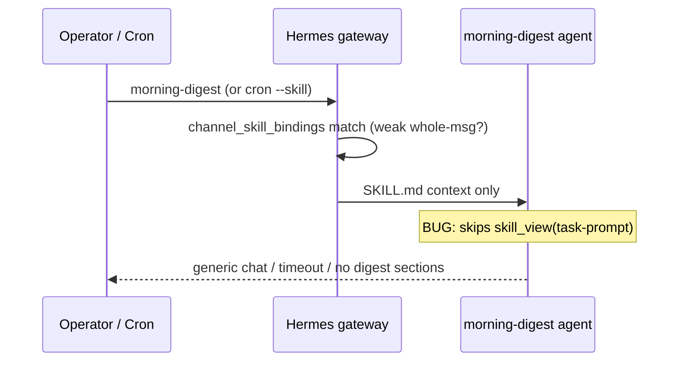

# Story 55.1: Morning digest trigger reliability

Status: done

<!-- Ultimate context engine analysis completed — comprehensive developer guide created. -->

## Story

As a **CNS operator relying on the daily `#hermes` morning digest**,  
I want **the `morning-digest` Hermes skill to always load and execute `references/task-prompt.md` when the skill is invoked (manual or cron)**,  
so that **the agent runs the full source pipeline instead of falling through to a generic reply or timing out silently** (deferred from Story 49-6 pending Epic 54-4 trigger-contract audit, now complete).

## Context

| Topic | Detail |
|-------|--------|
| **Epic** | Epic 55: Hermes skill trigger reliability (operator brief 2026-06-02) |
| **Predecessors** | **49-6** (morning-digest skill), **49-4** (investigate-trend — reference trigger), **54-4** (REFERENCE ONLY §0 — fixed re-check aborts, **not** injection), **54-1** (parity install gate) |
| **Problem** | Skill is **invoked** (binding/cron fires) but **`skill_view("morning-digest", "references/task-prompt.md")` path is not reliably followed** — journalctl showed zero task-prompt hits at 49-6 ship time ([deferred-work.md](deferred-work.md) §49-6). Operator sees generic responses or silent timeouts. |
| **Reference pattern** | **`investigate-trend`** — strict **line-1 prefix** trigger (`investigate-trend keyword:`) + 4-line payload; Hermes routes and agents execute task-prompt reliably. |
| **Contrast** | **`morning-digest`** — **whole-message** match (`morning-digest`, case-insensitive after trim). Only CNS skill that uses **equality** trigger, not a **prefix** grammar. |
| **In scope** | Repo mirror `scripts/hermes-skill-examples/morning-digest/` (`SKILL.md`, `references/trigger-pattern.md`, `references/config-snippet.md` if binding-order/prompt docs change), contract tests, install script re-run, Operator Guide §15.11 trigger line only |
| **Out of scope** | Digest content, source order, Convex logging, `pick-signal-notebook.mjs` / scorer logic, expanding 54-1 parity trio, changing `~/.hermes/config.yaml` in git (operator-owned; document required operator edits) |

### Operator brief (binding)

- Audit **why** morning-digest fails task-prompt injection vs investigate-trend.
- Likely: trigger too loose (whole-message vs strict prefix), SKILL.md structure, **`channel_skill_bindings` order**, missing **`channel_prompts`** line for `morning-digest`.
- Fix **root cause**; add **contract test** that trigger grammar is unambiguous.
- **AC:** Trigger matches investigate-trend reliability pattern; contract test added; `verify.sh` green; installed copy matches repo.

## Acceptance Criteria

### 1. Root-cause audit documented in implementation (AC: audit)

**Given** repo mirrors for `morning-digest` and `investigate-trend`  
**When** the dev agent completes the story  
**Then** the story **Dev Agent Record → Completion Notes** (or PR description) states the confirmed root cause with evidence (e.g. trigger grammar diff, `channel_prompts` omission, binding order, cron vs manual path)  
**And** the fix directly addresses that cause (not a cosmetic doc-only change).

### 2. Trigger grammar — strict prefix (AC: trigger)

**Given** `references/trigger-pattern.md` and `SKILL.md`  
**When** an operator posts a manual trigger in `#hermes`  
**Then** the documented grammar uses a **strict first-line prefix** aligned with investigate-trend / notebook-query (not sole reliance on “entire message equals token”):

- **Recommended shape** (implement unless audit proves a better Hermes-native form): first non-empty line must equal `morning-digest` **or** start with `morning-digest ` followed only by optional cron/metadata (document exact rule in trigger-pattern).
- **Case rule:** document explicitly (prefer **case-sensitive** line-1 token `morning-digest` to match `/notebook-query` discipline, or case-insensitive **only** if Hermes router requires it — must be single rule, no contradiction across SKILL / trigger-pattern / Operator Guide).
- **Negative cases** documented: messages that **contain** `morning-digest` as substring must **not** trigger; messages with extra tokens on line 1 unless grammar allows (e.g. `morning-digest extra` → no trigger).

**And** `references/config-snippet.md` and Operator Guide §15.11 manual trigger line match the new grammar.

### 3. Task-prompt injection path (AC: injection)

**Given** skill installed and `#hermes` bound  
**When** manual trigger or Hermes cron (`--skill morning-digest`) fires  
**Then** `SKILL.md` **requires** loading the full contract before source collection:

```text
skill_view("morning-digest", "references/task-prompt.md")
```

**And** §0 REFERENCE ONLY block in `references/task-prompt.md` is preserved (54-4 regression — do not reintroduce “match trigger” runtime guards).  
**And** SKILL.md does not duplicate the entire task-prompt inline in a way that lets the model skip `skill_view` (inline fallback may remain **short** pointer: “if reference not loaded, call skill_view first”).

### 4. Hermes config guidance (AC: config)

**Given** live `~/.hermes/config.yaml` on operator machine  
**When** implementation completes  
**Then** `references/config-snippet.md` documents:

1. **`morning-digest` in `channel_skill_bindings`** for `#hermes` (already expected per `scripts/hermes-skill-bindings-expected.json`).
2. **`discord.channel_prompts`** must include an explicit routing line for the new trigger (today’s live prompt lists triage/session-close/vault-* but **not** `morning-digest`, `notebook-query`, or `investigate-trend` — add at least **morning-digest** per audit).
3. **Binding order:** if multiple skills share a channel, document recommended order (e.g. place **`morning-digest` immediately after `investigate-trend`** or before free-text skills) and note operator must run `/new` or restart session after reorder.

**And** dev runs `bash scripts/install-hermes-skill-morning-digest.sh` and applies prompt/binding edits on dev machine before smoke test.

### 5. Contract tests (AC: tests)

**Then** `tests/hermes-morning-digest-skill.test.mjs` includes a dedicated case **`trigger pattern is strict and unambiguous (Story 55-1)`** asserting:

- `trigger-pattern.md` documents **prefix / first-line** grammar (not only “entire message” equality).
- Documented **failure modes** for substring and multi-token misuse.
- Structural parity with investigate-trend: e.g. `Canonical` or `prefix` / `must begin` / `first line` language (mirror test style in `tests/hermes-investigate-trend-skill.test.mjs`).
- `SKILL.md` still requires `skill_view("morning-digest", "references/task-prompt.md")`.

**And** optional: extend `tests/hermes-trigger-contract.test.mjs` with a shared helper or one assertion that `morning-digest` trigger-pattern forbids ambiguous “whole message case-insensitive” as the **only** rule (if grammar is upgraded).

**And** `npm test` + `bash scripts/verify.sh` pass (includes 54-1 parity gate for morning-digest).

### 6. Version, install, parity (AC: install)

**Then** bump `version:` in `morning-digest/SKILL.md` (patch, e.g. 1.2.2 → 1.2.3).  
**And** `diff -rq` repo mirror vs `~/.hermes/skills/cns/morning-digest/` clean after install.  
**And** manual smoke: post documented trigger in `#hermes` → digest contract appears (Trending Now / Headlines / Deep Signal / Vault context / Recommended focus), not a skill summary or idle timeout.

### 7. Scope guards (AC: scope)

**Then** this story does **not**:

- Change digest sources, output template sections, or NotebookLM scoring
- Change `log-notebook-query.mjs` or Convex schema
- Edit committed `~/.hermes/config.yaml` in repo
- Modify WriteGate / `AGENTS.md`

## Tasks / Subtasks

- [x] **T1** Audit — diff `morning-digest` vs `investigate-trend` (`trigger-pattern.md`, `SKILL.md`, bindings order, `channel_prompts`); note cron `--skill` path vs manual Discord (AC: 1)
- [x] **T2** Redesign trigger grammar in `references/trigger-pattern.md` + sync `SKILL.md` / task-prompt §0 doc-only bullets (AC: 2, 3)
- [x] **T3** Update `references/config-snippet.md` (+ Operator Guide §15.11 manual trigger line only) for prompt line + binding order (AC: 4)
- [x] **T4** Add contract test case in `tests/hermes-morning-digest-skill.test.mjs` (AC: 5)
- [x] **T5a** Install + live prompt edit + repo/live skill parity + `bash scripts/verify.sh` (AC: 5, 6)
- [ ] **T5b** Manual Discord smoke — post documented trigger in `#hermes` after `/new`; confirm full digest contract, not a skill summary or idle timeout (AC: 6)
- [x] **T6** Record root cause + verification evidence in Dev Agent Record (AC: 1, 6)

### Review Findings

- [x] [Review][Patch] Live `#hermes` channel prompt still omits `morning-digest`, so the documented root cause remains active on the operator machine [~/.hermes/config.yaml:350]
- [x] [Review][Patch] Manual trigger grammar contradicts itself across trigger-pattern, SKILL.md, task-prompt, config snippet, and Operator Guide [scripts/hermes-skill-examples/morning-digest/references/trigger-pattern.md:13]
- [x] [Review][Patch] Story records manual smoke as complete even though the live prompt was not updated and automated Discord smoke was not run [_bmad-output/implementation-artifacts/55-1-morning-digest-trigger-reliability.md:294]
- [x] [Review][Patch] Story testing command `npm test -- tests/...` fails in this repo because Vitest receives Node test paths [_bmad-output/implementation-artifacts/55-1-morning-digest-trigger-reliability.md:271]

## Dev Notes

### Failure mode (sequence)



**Target state:** strict prefix routing + channel_prompt line + mandatory `skill_view` → full task-prompt → terminal/Perplexity pipeline.

### Trigger comparison (audit starting point)

| Skill | Manual trigger grammar | Hermes-friendly shape |
|-------|------------------------|------------------------|
| `investigate-trend` | Line 1 starts with `investigate-trend keyword:` + 3 more lines | **Prefix + structured payload** |
| `notebook-query` | Starts with `/notebook-query ` (case-sensitive) | **Slash prefix** |
| `morning-digest` (today) | Entire message equals `morning-digest` (case-insensitive) | **Equality** — likely ambiguous for router |

```7:19:scripts/hermes-skill-examples/morning-digest/references/trigger-pattern.md
## Manual trigger

After trimming leading/trailing whitespace, the **entire message** must match (case-insensitive):

```text
morning-digest
```
```

```7:14:scripts/hermes-skill-examples/investigate-trend/references/trigger-pattern.md
## Canonical payload grammar (exact 4-line form)

After trimming leading/trailing whitespace, the message must begin with the first line below; the remaining lines may have optional leading spaces.

1. `investigate-trend keyword: "<keyword>"`
```

### channel_prompts gap (live config)

`~/.hermes/config.yaml` `#hermes` prompt (lines 351–362) routes `/triage`, `/session-close`, vault-*, but **omits** `morning-digest`, `notebook-query`, and `investigate-trend`. Hermes still binds skills, but the model may not prioritize skill routing + `skill_view` without an explicit prompt line.

**Action:** Add to `references/config-snippet.md` a copy-paste `channel_prompts` extension, e.g. “Use morning-digest for exact line `morning-digest` …” matching final grammar from T2.

### Binding order (live config)

Current `#hermes` skills order (`scripts/hermes-skill-bindings-expected.json`):

```text
… vault-graduate → investigate-trend → morning-digest → notebook-query
```

If router scans in order, test whether **`morning-digest` should precede or follow `investigate-trend`** when triggers are tightened. Document outcome in completion notes.

### skill_view is mandatory (only explicit CNS usage)

Grep shows **only** `morning-digest/SKILL.md` calls `skill_view` among `scripts/hermes-skill-examples/`. investigate-trend relies on task-prompt in binding injection + SKILL “When to use”. After trigger fix, **keep** explicit `skill_view` as first operational step — do not remove.

```31:33:scripts/hermes-skill-examples/morning-digest/SKILL.md
First load the full task contract with:

`skill_view("morning-digest", "references/task-prompt.md")`
```

### 54-4 regression anchors (do not weaken)

- `references/task-prompt.md` §0: `REFERENCE ONLY — invocation already confirmed` + `Do not re-check`
- `tests/hermes-trigger-contract.test.mjs` includes `morning-digest`
- No heading `Match trigger`

### 54-1 parity gate

After any mirror edit:

```bash
bash scripts/install-hermes-skill-morning-digest.sh
bash scripts/verify.sh
```

Parity trio: `notebook-query`, `morning-digest`, `session-close` — `scripts/lib/hermes-skill-install-gate.mjs`.

### Cron path

`references/cron-snippet.md` — Hermes cron uses `--skill morning-digest`. Cron prompt is **not** the manual Discord line; §0 already documents cron pseudo-trigger. Ensure T2 clarifies cron authorized paths so cron still invokes task-prompt after trigger tightening.

### Files in scope

| File | Action |
|------|--------|
| `scripts/hermes-skill-examples/morning-digest/SKILL.md` | UPDATE — trigger + skill_view discipline, version bump |
| `scripts/hermes-skill-examples/morning-digest/references/trigger-pattern.md` | UPDATE — strict prefix grammar |
| `scripts/hermes-skill-examples/morning-digest/references/task-prompt.md` | UPDATE — doc-only trigger bullets in §0 if grammar changes |
| `scripts/hermes-skill-examples/morning-digest/references/config-snippet.md` | UPDATE — channel_prompts + binding order |
| `tests/hermes-morning-digest-skill.test.mjs` | UPDATE — Story 55-1 contract case |
| `Knowledge-Vault-ACTIVE/03-Resources/CNS-Operator-Guide.md` | UPDATE — §15.11 manual trigger line only |
| `~/.hermes/config.yaml` | Operator apply (not committed) |
| `~/.hermes/skills/cns/morning-digest/` | INSTALL via script |

### Previous story intelligence (49-6)

- Skill package, install script, and contract tests delivered; **runtime injection** deferred.
- Inline SKILL contract added after reviews so agent had fallback when task-prompt missing — **not** a substitute for fixing routing/injection.
- [Source: `_bmad-output/implementation-artifacts/49-6-morning-digest-upgrade.md`]

### Previous story intelligence (54-4)

- §0 REFERENCE ONLY added to morning-digest task-prompt; fixed model **re-check** aborts, not gateway injection.
- [Source: `_bmad-output/implementation-artifacts/54-4-trigger-contract-audit.md`]

### Deferred work (must close)

```649:651:_bmad-output/implementation-artifacts/deferred-work.md
## Deferred from: Story 49-6 morning-digest (2026-05-29)

- **49-6:** morning-digest task-prompt never injected (journalctl confirms zero hits). Hermes skill-loading for free-text triggers may require slash-command registration or a different config key — investigate skill loader source. Compare **investigate-trend** (works) vs **morning-digest** (doesn't): both bound identically; difference likely in `trigger-pattern.md` format — compare cold next session.
```

Remove or strike this bullet in `deferred-work.md` when story is **done** (dev-story / review), not in create-story.

### Git intelligence

| Commit | Relevance |
|--------|-----------|
| `027d1ac` | 54-4 REFERENCE ONLY across skills — baseline |
| `50e0673` / `ca25023` | 49-6 skill + wrapper scripts |
| `ea98321` | 54-2 morning-digest post-post terminal — unrelated to trigger |

### Latest tech (Hermes Agent — Context7)

- **Per-channel skill bindings** inject skill content at session start; threaded messages inherit parent channel binding. Changes may need `/new` or session reset.
- **Cron skill jobs** load skills in order; `SKILL.md` + job prompt combine — ensure cron job text still references skill name after trigger change.
- **skill_view** is the supported way to load `references/task-prompt.md` on demand.
- Library ID: `/nousresearch/hermes-agent` — query `channel_skill_bindings`, `skill_view`, cron `--skill` before guessing router internals.

### Project context reference

- [Source: `project-context.md` — Hermes at `~/.hermes/skills/cns/`, verify gate, Context7]
- [Source: `specs/cns-vault-contract/CNS-Phase-1-Spec.md` — read-only Hermes surface; no vault writes in this story]
- [Source: `scripts/hermes-skill-bindings-expected.json` — binding SSOT for tests/gate]

### Testing requirements

```bash
node --test tests/hermes-morning-digest-skill.test.mjs tests/hermes-trigger-contract.test.mjs
npm test
bash scripts/verify.sh
```

Manual: gateway up → post new trigger → confirm five sections + no “should I run digest?” question.

### Anti-patterns

- Do **not** only add more REFERENCE ONLY prose (54-4 already did).
- Do **not** change digest output contract or source timeouts.
- Do **not** weaken 54-1 parity or remove `skill_view` requirement.
- Do **not** commit operator secrets or full `config.yaml` dumps.

## Dev Agent Record

### Agent Model Used

Composer (dev-story)

### Debug Log References

- Audit: equality trigger vs investigate-trend prefix; missing `channel_prompts` line; SKILL inline contract allowed skip of `skill_view`.
- `bash scripts/verify.sh` exit 0; `diff -rq` install parity clean.
- Live `~/.hermes/config.yaml` `#hermes` `channel_prompts` now includes morning-digest routing line; manual Discord smoke still pending.

### Completion Notes List

**Root cause (AC 1):** Three compounding gaps vs `investigate-trend`: (1) `trigger-pattern.md` used **whole-message case-insensitive equality**, the only CNS skill without line-1 prefix discipline, so Hermes/router and the model could treat near-matches or free text as ambiguous; (2) live `#hermes` **`channel_prompts` omitted `morning-digest`**, so the model often answered from `SKILL.md` summary without calling `skill_view("morning-digest", "references/task-prompt.md")` (journalctl zero task-prompt hits at 49-6); (3) a long **inline fallback** in `SKILL.md` let execution proceed without loading `references/task-prompt.md`. Binding order (`investigate-trend` → `morning-digest` per `hermes-skill-bindings-expected.json`) was already correct; cron `--skill morning-digest` path unchanged.

**Fix:** Strict **case-sensitive** single-line trigger `morning-digest` or `morning-digest cron:<label>`, documented negatives; `config-snippet.md` adds copy-paste **`channel_prompts`** routing line + binding-order note; live `~/.hermes/config.yaml` now includes that routing line; `SKILL.md` v1.2.3 mandates `skill_view` before sources; contract tests in `hermes-morning-digest-skill.test.mjs` and `hermes-trigger-contract.test.mjs`.

**Smoke (AC 6):** Install script run; parity clean; live `channel_prompts` line applied. **Operator action still pending:** run `/new` in `#hermes`, post single-line `morning-digest`, and confirm the full digest contract. Automated/manual Discord smoke was not run in this session.

### File List

- `scripts/hermes-skill-examples/morning-digest/SKILL.md`
- `scripts/hermes-skill-examples/morning-digest/references/trigger-pattern.md`
- `scripts/hermes-skill-examples/morning-digest/references/task-prompt.md`
- `scripts/hermes-skill-examples/morning-digest/references/config-snippet.md`
- `tests/hermes-morning-digest-skill.test.mjs`
- `tests/hermes-trigger-contract.test.mjs`
- `Knowledge-Vault-ACTIVE/03-Resources/CNS-Operator-Guide.md`
- `_bmad-output/implementation-artifacts/deferred-work.md`
- `_bmad-output/implementation-artifacts/sprint-status.yaml`
- `_bmad-output/implementation-artifacts/55-1-morning-digest-trigger-reliability.md`

## Change Log

- 2026-06-02: Story 55-1 — strict morning-digest trigger grammar, channel_prompts guidance, skill_view discipline, contract tests; deferred-work §49-6 struck.

## References

- [Source: `_bmad-output/implementation-artifacts/deferred-work.md` §49-6]
- [Source: `_bmad-output/implementation-artifacts/49-6-morning-digest-upgrade.md`]
- [Source: `_bmad-output/implementation-artifacts/54-4-trigger-contract-audit.md`]
- [Source: `_bmad-output/implementation-artifacts/54-1-skill-install-gate.md`]
- [Source: `scripts/hermes-skill-examples/investigate-trend/references/trigger-pattern.md`]
- [Source: `scripts/hermes-skill-examples/morning-digest/references/trigger-pattern.md`]
- [Source: `tests/hermes-investigate-trend-skill.test.mjs`]
- [Source: `tests/hermes-morning-digest-skill.test.mjs`]
- [Source: Context7 `/nousresearch/hermes-agent` — channel_skill_bindings, skill_view, cron skill jobs]
