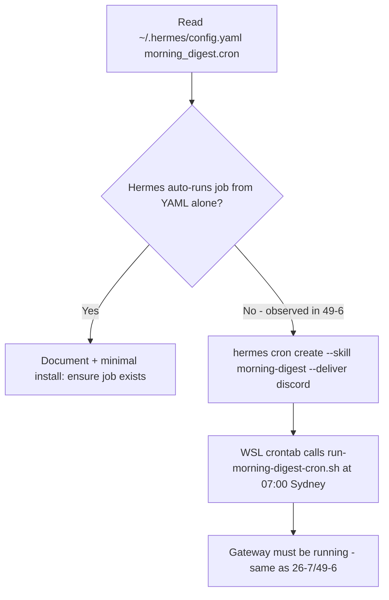

# Story 55.3: Morning digest cron automation

Status: done

<!-- Ultimate context engine analysis completed — comprehensive developer guide created. -->

## Story

As a **CNS operator**,  
I want **the `morning-digest` Hermes skill to run automatically every morning at a configurable time (default 07:00 Australia/Sydney)**,  
so that **I receive the trend briefing in `#hermes` without manually posting `morning-digest` each day**.

## Context

| Topic | Detail |
|-------|--------|
| **Epic** | Epic 55: Hermes morning-digest trigger reliability (operator brief 2026-06-02) |
| **Predecessors** | **55-1** (strict trigger + `skill_view` + `channel_prompts`); **55-2** (Google Trends scores); **49-6** (skill mirror); **26-7** (legacy Mode B cron — **disabled** in Operator Guide) |
| **Problem** | Daily digest requires a manual Discord post of `morning-digest`. Schedule keys (`morning_digest.cron`, `MORNING_DIGEST_CRON`) and `references/cron-snippet.md` exist but **no repo install path** wires them (49-6 review finding). |
| **Goal** | Executable cron: Hermes job `--skill morning-digest` + WSL `crontab` tick at **07:00 `Australia/Sydney`** (operator-adjustable). |
| **In scope** | `scripts/install-morning-digest-cron.sh`, `scripts/run-morning-digest-cron.sh`, crontab tag line, optional `~/.hermes/config.yaml` schedule read, `references/cron-snippet.md` + `config-snippet.md` default alignment, Operator Guide §15.11, contract tests |
| **Out of scope** | Digest content, skill/task-prompt changes, Convex, dashboard, NotebookLM routing, retiring 26-7 scripts (keep as manual fallback) |

### Operator brief (binding)

- Default **07:00 AEST/AEDT** via `CRON_TZ=Australia/Sydney` (not 08:00 machine-local from 49-6 docs).
- UTC equivalent for operators on pure UTC crontab: **21:00 UTC previous calendar day** during standard time; **document Sydney civil time as normative** — do not hard-code UTC offset only (DST).
- Check Hermes **native** cron/`config.yaml` first; if `morning_digest.cron` is reference-only, implement **install script + WSL crontab** like `install-trend-ingest-cron.sh` / `run-trend-ingest-cron.sh`.
- Automated path must honor **55-1 trigger contract**: cron uses **`--skill morning-digest`** (pseudo-trigger `cron:morning-digest`), **not** a Discord webhook that posts free text unless Hermes cron is provably unavailable (then document operator sign-off).
- Manual path remains: operator posts single-line **`morning-digest`** (case-sensitive, no prefix).

## Acceptance Criteria

### 1. Hermes cron job (AC: hermes-job)

**Given** Hermes gateway can run `hermes cron create`  
**When** the operator runs `bash scripts/install-morning-digest-cron.sh` once  
**Then** a Hermes cron job exists named **`morning-digest`** with:
- `--skill morning-digest`
- `--deliver discord`
- Schedule expression from **`MORNING_DIGEST_CRON`** env, else **`morning_digest.cron`** in `~/.hermes/config.yaml` if present, else default **`0 7 * * *`**
**And** job id is persisted to **`~/.hermes/morning-digest-skill-cron-job-id`** (documented path; overridable via env if install script supports it)
**And** install is **idempotent** (re-run replaces prior tagged WSL line and recreates/updates job without duplicate digests).

### 2. WSL crontab tick (AC: wsl-cron)

**Given** WSL user `crontab`  
**When** install completes  
**Then** exactly one line tagged **`cns-morning-digest-skill`** exists:

```cron
0 7 * * * CRON_TZ=Australia/Sydney /bin/bash "<repo>/scripts/run-morning-digest-cron.sh" >>"$HOME/.hermes/logs/morning-digest-skill-cron.log" 2>&1 # cns-morning-digest-skill
```

**And** `run-morning-digest-cron.sh`:
- Resolves repo root from script location
- **Aborts non-zero** if `hermes gateway status` does not show gateway running (same posture as `scripts/hermes-morning-digest.sh` and `references/cron-snippet.md`)
- Runs `hermes cron run <job-id>` then `hermes cron tick` for the skill cron job id file
- Does **not** require posting Discord text `morning-digest` (skill cron path per 55-1)

**And** operator can change schedule by editing **`MORNING_DIGEST_CRON`** / `morning_digest.cron` and re-running install (document recreate semantics in Operator Guide).

### 3. Schedule default 07:00 Sydney (AC: schedule)

**Given** fresh install with no overrides  
**When** operator inspects installed crontab + Hermes job  
**Then** civil-time target is **07:00 `Australia/Sydney`** daily (handles AEDT/AEST)  
**And** repo docs (`cron-snippet.md`, `config-snippet.md`, Operator Guide §15.11) no longer claim **08:00 machine-local** as the default for this skill.

### 4. Trigger contract preserved (AC: trigger)

**Given** Story 55-1 trigger grammar  
**When** cron fires  
**Then** invocation uses Hermes **`--skill morning-digest`** (authorized cron pseudo-trigger per `references/trigger-pattern.md`)  
**And** manual smoke remains: single-line **`morning-digest`** in `#hermes` still works unchanged  
**And** implementation does **not** introduce ambiguous triggers (no `Morning-Digest`, no `please run morning-digest` cron posts).

### 5. Operator guide (AC: docs)

**Given** `Knowledge-Vault-ACTIVE/03-Resources/CNS-Operator-Guide.md`  
**When** story closes  
**Then** §15.11 documents:
- One-command install: `bash scripts/install-morning-digest-cron.sh`
- Log path: `~/.hermes/logs/morning-digest-skill-cron.log`
- Schedule overrides (`MORNING_DIGEST_CRON`, `morning_digest.cron`)
- Gateway dependency and failure posture (no false “digest delivered” when gateway down)
- Confirmation §15.2 legacy line stays **commented/disabled**
**And** Version History row references **`55-3-morning-digest-cron-automation`**.

### 6. Tests and verify gate (AC: verify)

**Then** contract tests assert install + runner scripts exist and install script references tag **`cns-morning-digest-skill`** and default **`0 7`** / Sydney TZ (extend `tests/hermes-morning-digest-skill.test.mjs` or add focused test file)  
**And** `npm test` + `bash scripts/verify.sh` pass  
**And** Dev Agent Record includes one **manual or dry-run** evidence line: `crontab -l | grep cns-morning-digest-skill` and `hermes cron list | grep morning-digest` (redact secrets).

### 7. Scope guards (AC: scope)

**Then** no changes to `scripts/hermes-skill-examples/morning-digest/references/task-prompt.md` digest contract, `scripts/trend-ingest.py`, Convex, or cns-dashboard  
**And** `scripts/hermes-morning-digest.sh` / 26-7 files remain for manual fallback only.

## Tasks / Subtasks

- [x] **T1** Audit Hermes scheduling — read live `~/.hermes/config.yaml` for `morning_digest:` keys; confirm whether Hermes auto-schedules from YAML or only via `hermes cron create` (Context7: `/nousresearch/hermes-agent` cron docs) (AC: 1)
- [x] **T2** Add `scripts/run-morning-digest-cron.sh` — gateway guard, job id file, `hermes cron run` + `tick` (mirror `scripts/hermes-morning-digest.sh` lines 22–53, different id file) (AC: 2)
- [x] **T3** Add `scripts/install-morning-digest-cron.sh` — idempotent crontab tag `cns-morning-digest-skill`, create Hermes job, write job id (mirror `install-dashboard-sync-cron.sh` / `install-trend-ingest-cron.sh`) (AC: 1, 2, 3)
- [x] **T4** Align repo defaults — `references/cron-snippet.md`, `references/config-snippet.md`, `install-hermes-skill-morning-digest.sh` echo line (AC: 3)
- [x] **T5** Operator Guide §15.11 + version history (AC: 5)
- [x] **T6** Contract tests + `bash scripts/verify.sh` (AC: 6)
- [x] **T7** Operator smoke — after install, optional manual `bash scripts/run-morning-digest-cron.sh` with gateway up; confirm `#hermes` digest or document blocker in Completion Notes (AC: 6)

## Dev Notes

### Decision tree (implement in this order)



**Observed (49-6, 55-1):** `morning_digest.cron` in config is an **operator reference** for the expression passed to `hermes cron create`; Hermes stores schedule on the job object. Changing YAML alone does **not** reschedule until job recreate (`hermes cron remove` + install).

### Hermes CLI (Context7 — do not guess flags)

```bash
hermes cron create "0 7 * * *" \
  "Run morning-digest skill: trends, NewsAPI, Perplexity, NotebookLM vault context." \
  --skill morning-digest \
  --name morning-digest \
  --deliver discord
hermes cron list
hermes cron run <id>
hermes cron tick
```

Schedule strings also accept natural language (`every day at 7am`) per upstream docs; **prefer explicit 5-field cron** in install script for parity with WSL line.

### WSL crontab pattern (normative — copy into install script)

| Item | Value |
|------|--------|
| Tag | `cns-morning-digest-skill` |
| TZ | `CRON_TZ=Australia/Sydney` on the cron line |
| Default fields | `0 7 * * *` |
| Runner | `scripts/run-morning-digest-cron.sh` |
| Log | `$HOME/.hermes/logs/morning-digest-skill-cron.log` |
| Job id file | `$HOME/.hermes/morning-digest-skill-cron-job-id` |

**Do not** `. env` in the crontab line — use bash wrapper (dashboard-sync / trend-ingest lesson).

### Gateway + env

| Requirement | Source |
|-------------|--------|
| Gateway running | `hermes gateway status` grep `gateway is running` |
| Discord token | `.env.live-chain` → `HERMES_DISCORD_TOKEN` / `DISCORD_BOT_TOKEN` export (copy from `scripts/hermes-morning-digest.sh` if cron runner needs it for tick delivery) |
| Skill installed | `bash scripts/install-hermes-skill-morning-digest.sh` |
| Bindings + prompts | `references/config-snippet.md` (55-1) |
| Trend env | `~/.hermes/trend-ingest.env`, `~/.hermes/trend-watchlist.yaml` (digest sources) |

### 55-1 trigger contract (cron vs manual)

| Path | Trigger mechanism | Must satisfy |
|------|-------------------|--------------|
| **Cron (this story)** | `hermes cron create ... --skill morning-digest` | `references/trigger-pattern.md` § Cron — pseudo-trigger `cron:morning-digest`; agent loads task-prompt via skill binding |
| **Manual** | Operator posts `morning-digest` | Case-sensitive line-1 token |
| **Do not use for cron** | Discord webhook posting `morning-digest` | Adds infra; only if `--skill` path fails — requires Completion Notes + operator sign-off |

### Legacy 26-7 coexistence

| Artifact | Status |
|----------|--------|
| `scripts/hermes-morning-digest.sh` | Keep — Mode B inbox digest |
| `~/.hermes/morning-digest-cron-job-id` | Legacy job — do not confuse with **`morning-digest-skill-cron-job-id`** |
| Operator Guide §15.2 WSL line | Must stay **commented** after this story |

### Files to create/update

| File | Action |
|------|--------|
| `scripts/run-morning-digest-cron.sh` | **NEW** |
| `scripts/install-morning-digest-cron.sh` | **NEW** |
| `scripts/hermes-skill-examples/morning-digest/references/cron-snippet.md` | UPDATE — default 07:00 Sydney + install script reference |
| `scripts/hermes-skill-examples/morning-digest/references/config-snippet.md` | UPDATE — `cron: "0 7 * * *"` + Sydney note |
| `scripts/install-hermes-skill-morning-digest.sh` | UPDATE — point to install-morning-digest-cron.sh |
| `Knowledge-Vault-ACTIVE/03-Resources/CNS-Operator-Guide.md` | UPDATE — §15.11 |
| `tests/hermes-morning-digest-skill.test.mjs` | UPDATE — cron install contract cases |

**Not in repo:** operator `crontab -e` state — install script mutates user crontab like other CNS installers.

### Testing

```bash
node --test tests/hermes-morning-digest-skill.test.mjs
bash scripts/verify.sh
# Optional manual:
bash scripts/install-morning-digest-cron.sh
bash scripts/run-morning-digest-cron.sh
```

Assert install script:
- Uses `grep -v cns-morning-digest-skill` before append
- `chmod +x` runner
- Documents `MORNING_DIGEST_CRON` override

### Previous story intelligence

**55-1:** Cron `--skill morning-digest` path unchanged by trigger tightening; WSL external tick pattern validated in 26-7. Live `channel_prompts` line required for manual path only.

**55-2:** Trend scores now rankable; automated digest more valuable at 07:00 before operator starts day.

**49-6 deferred item resolved here:** “Schedule override documented but not wired to executable cron setup path” [`49-6-morning-digest-upgrade.md` Review Finding].

### Git intelligence

| Commit | Relevance |
|--------|-----------|
| `d9df5f9` | 55-2 — digest data quality |
| `38218d3` | 55-1 — trigger + skill_view baseline for cron skill path |

### Architecture compliance

- **No Vault IO / WriteGate changes** — digest remains read-only (49-6).
- **No MCP tool signature changes.**
- **Operator Guide** is vault path `Knowledge-Vault-ACTIVE/03-Resources/` — edit in repo mirror only if your workflow copies to vault separately; follow existing epic pattern (commit repo copy).

### References

- [Source: `_bmad-output/implementation-artifacts/55-1-morning-digest-trigger-reliability.md`]
- [Source: `_bmad-output/implementation-artifacts/55-2-google-trends-normalized-value-fix.md`]
- [Source: `_bmad-output/implementation-artifacts/49-6-morning-digest-upgrade.md`]
- [Source: `_bmad-output/implementation-artifacts/26-7-hermes-daily-digest-cron-aedt.md`]
- [Source: `_bmad-output/implementation-artifacts/44-4-1-cron-install-documentation-env-example.md`]
- [Source: `scripts/hermes-skill-examples/morning-digest/references/cron-snippet.md`]
- [Source: `scripts/hermes-skill-examples/morning-digest/references/trigger-pattern.md`]
- [Source: `scripts/hermes-morning-digest.sh`]
- [Source: `scripts/install-dashboard-sync-cron.sh`]
- [Source: `scripts/install-trend-ingest-cron.sh`]
- [Source: Context7 `/nousresearch/hermes-agent` — cron CLI]
- [Source: `Knowledge-Vault-ACTIVE/03-Resources/CNS-Operator-Guide.md` §15.2, §15.11]

## Dev Agent Record

### Agent Model Used

(create-story workflow) / Claude Sonnet 4.6 (dev-story)

### Debug Log References

- T1: Context7 `/nousresearch/hermes-agent` — cron jobs created via `hermes cron create`; no auto-schedule from `morning_digest.cron` YAML alone. Live `~/.hermes/config.yaml` has no `morning_digest:` block.
- T3: Fixed install script — removed invalid `--accept-hooks` on `hermes cron create`; parse job list by ID + `Name: morning-digest` (not grep on multiline output).

### Completion Notes List

- Added idempotent `install-morning-digest-cron.sh` + `run-morning-digest-cron.sh` (WSL tag `cns-morning-digest-skill`, default `0 7 * * *` + `CRON_TZ=Australia/Sydney`, job id `~/.hermes/morning-digest-skill-cron-job-id`).
- Updated skill reference docs and Operator Guide §15.11 (v1.37.0) for 07:00 Sydney default and one-command install.
- Extended `tests/hermes-morning-digest-skill.test.mjs` with cron install contract cases (15 tests pass).
- Smoke: `crontab -l | grep cns-morning-digest-skill` → installed line present; `hermes cron list` → job `morning-digest` id `72cd9d1e3ebd` schedule `0 7 * * *`. `run-morning-digest-cron.sh` correctly aborts when gateway down (systemd unit loaded but `gateway is running` not reported). Full `#hermes` digest smoke deferred until gateway restart.

### File List

- `scripts/install-morning-digest-cron.sh` (new)
- `scripts/run-morning-digest-cron.sh` (new)
- `scripts/install-hermes-skill-morning-digest.sh` (updated echo)
- `scripts/hermes-skill-examples/morning-digest/references/cron-snippet.md` (updated)
- `scripts/hermes-skill-examples/morning-digest/references/config-snippet.md` (updated)
- `tests/hermes-morning-digest-skill.test.mjs` (updated)
- `Knowledge-Vault-ACTIVE/03-Resources/CNS-Operator-Guide.md` (§15.11 + version history)
- `_bmad-output/implementation-artifacts/sprint-status.yaml` (status → review)

### Change Log

- 2026-06-02: Story 55-3 — morning-digest cron automation (install script, WSL crontab, Hermes job, docs, tests). Resolves 49-6 deferred “schedule not wired” finding.

### Review Findings

- [x] [Review][Decision→Patch] Hermes job uses dummy schedule (`0 0 1 1 *`) like 26-7 — operator chose option 2: WSL crontab is sole civil-time trigger; Hermes job schedule must not auto-fire at 07:00. [`scripts/install-morning-digest-cron.sh`]
- [x] [Review][Patch] Install commits WSL crontab before Hermes job create succeeds [`scripts/install-morning-digest-cron.sh:82-110`]
- [x] [Review][Patch] §15.2 supersession note still references ~08:00 trend digest [`Knowledge-Vault-ACTIVE/03-Resources/CNS-Operator-Guide.md:611`]
- [x] [Review][Patch] Contract tests omit `--deliver discord` and `--name morning-digest` [`tests/hermes-morning-digest-skill.test.mjs:215-239`]
- [x] [Review][Patch] Install lacks `.env.live-chain` preflight — install succeeds but daily runner fails until env exists [`scripts/install-morning-digest-cron.sh`]
- [x] [Review][Defer] SKILL.md still documents 08:00 machine-local default [`scripts/hermes-skill-examples/morning-digest/SKILL.md:20`] — deferred, out of 55-3 scope
- [x] [Review][Defer] Gateway status grep substring brittleness [`scripts/run-morning-digest-cron.sh:19`] — deferred, matches 26-7 pattern
- [x] [Review][Defer] E2E `#hermes` digest smoke deferred in dev record — deferred, operational gate
- [x] [Review][Defer] Concurrent install race without flock — deferred, not in sibling cron installers
- [x] [Review][Defer] Log rotation / failure alerting absent — deferred, pre-existing cron pattern
- [x] [Review][Defer] Optional env overrides (`MORNING_DIGEST_SKILL_CRON_*`) undocumented in Operator Guide — deferred, minor
