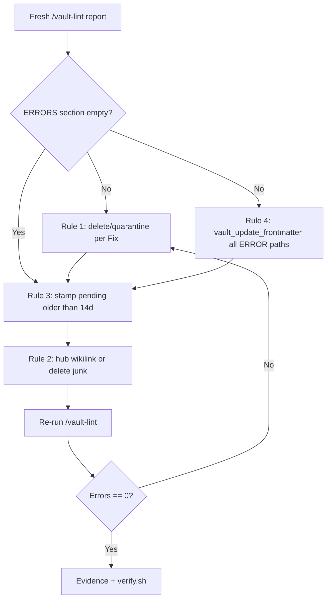

# Story 56.2: Vault lint remediation

Status: done

<!-- Ultimate context engine analysis completed — comprehensive developer guide created. -->

Epic: **56** (operator brief 2026-06-02 — vault health after routing calibration)  
Tracked in sprint-status as: **`56-2-vault-lint-remediation`**

## Story

As the **CNS operator**,  
I want **a fresh vault-lint report and full remediation of ERRORS plus critical WARNINGS** (stale pending, orphans, duplicate `source_uri`),  
so that **governed vault health is restored to `ERRORS: 0`**, stale verification debt is burned down, and orphan linkage debt is materially reduced without silent degradation.

## Context

| Topic | Detail |
|-------|--------|
| **Epic** | Epic 56 — operator brief spans NotebookLM calibration (56-1) and vault hygiene (this story) |
| **Story class** | **Operator / vault curation** — live `Knowledge-Vault-ACTIVE/` edits; **no** Omnipotent.md or Convex code changes |
| **Problem** | May 2026 lint (`vault-lint-2026-05-17.md`) showed **60** Rule 2 orphan WARNINGs and **68** Rule 3 stale-pending WARNINGs; no structured remediation pass since. A later report (`vault-lint-2026-05-21.md`) showed **0/0** but is **≥12 days stale** as of 2026-06-02 — do **not** treat it as current state without a fresh scan |
| **Authoritative lint** | Hermes **`/vault-lint`** in `#hermes` → `_meta/reports/vault-lint-YYYY-MM-DD.md` |
| **Vault root** | `CNS_VAULT_ROOT` → `/mnt/c/Users/Christopher Taylor/Knowledge-Vault-ACTIVE` |
| **Normative rules** | `specs/cns-vault-contract/modules/vault-lint.md` |
| **Evidence artifact** | `_bmad-output/implementation-artifacts/epic-56-vault-lint-remediation-evidence.md` |
| **Predecessor** | **56-1** (code — unrelated); vault lineage: **34-2** (Rule 1+4 ERRORS), **34-3** / **35-2** / **36-3** / **37-1** (stale pending), **35-3** / **37-2** (orphan hubs) |

### Operator brief (binding)

1. Run **`/vault-lint`** in `#hermes` for a fresh report.
2. Read **`_meta/reports/vault-lint-YYYY-MM-DD.md`** (today’s date after run).
3. **Rule 3** (`stale_pending`, `days_pending > 14`): stamp via `vault_update_frontmatter` (`verification_status: verified` or `disputed`, `modified: <today>`) or `/verify` for **SynthesisNote** only.
4. **Rule 2** (`orphan_note`): delete junk notes **or** add wikilinks from hub `_README.md` / index notes in the same folder.
5. **Rule 1** (`duplicate_source_uri`): merge or delete oldest duplicate per report `Fix:` line.
6. **Rule 4** (`missing_frontmatter` ERROR): patch all critical PAKE fields per report `Fix:` JSON.
7. Re-run **`/vault-lint`** until **`ERRORS: 0`** in Summary.

### Historical baseline (May 2026 — planning only)

From **`vault-lint-2026-05-17.md`** (do not remediate from this file without refreshing):

| Rule | Severity | Count (2026-05-17) |
|------|----------|-------------------|
| Rule 1 duplicate `source_uri` | ERROR | 0 |
| Rule 4 missing frontmatter | ERROR | 0 |
| Rule 2 orphan | WARNING | 60 |
| Rule 3 stale pending | WARNING | 68 |

Post-epic-37 accepted orphan floor: **23** perplexity research notes may remain WARNING when hubs use `[[path\|display]]` links — vault-lint counts **filename-stem** targets only ([Source: `deferred-work.md` — Vault-lint Rule 2 filename-stem matching]). This story still **must** fix all **ERRORS** and remediate **actionable** orphans; document residual Rule 2 count in evidence.

## Acceptance Criteria

### 1. Fresh lint report (AC: scan)

**Given** Hermes gateway is running and `#hermes` is bound to `vault-lint`  
**When** the operator (or dev agent via Discord MCP if allowlisted) runs **`/vault-lint`**  
**Then** `_meta/reports/vault-lint-<UTC-run-date>.md` exists with current Summary counts  
**And** Dev Agent Record cites **Scanned**, **Errors**, **Warnings**, and per-rule counts from that file (not from May 2026 reports alone).

### 2. ERRORS zero (AC: errors — blocking)

**Given** the fresh report’s **`## ERRORS`** section  
**When** remediation completes  
**Then** a **second** `/vault-lint` run shows **`Errors: 0`** in `## Summary`  
**And** every Rule **1** and Rule **4** ERROR class from the **pre-remediation** report is cleared (delete duplicate, `vault_update_frontmatter` patches, or operator-approved quarantine `vault_move` per `vault-lint.md`).

### 3. Stale pending burned down (AC: rule-3)

**Given** Rule **3** WARNING rows in the fresh report (`verification_status: pending`, valid `created`, `days_pending > 14`)  
**When** each listed path is processed  
**Then** none remain in Rule 3 on the post-remediation report  
**And** each note has `verification_status` ∈ `{verified, disputed}` and `modified` updated to run date  
**And** **SynthesisNote** rows prefer **`/verify verified <path>`** or **`/verify disputed <path>`** in `#hermes` when `vault-think` is bound; other `pake_type` values use **`vault_update_frontmatter`** only (same contract as **34-3**).

### 4. Orphan debt reduced (AC: rule-2)

**Given** Rule **2** WARNING rows in the fresh report  
**When** remediation runs  
**Then** orphan WARNING count is **materially lower** than the pre-remediation fresh report (record before/after in evidence)  
**And** for each remaining orphan, evidence documents **one** of: (a) relinked via hub/index wikilink, (b) deleted as junk/E2E artifact with audit note, (c) **accepted residual** with reason (stem-match limitation per deferred-work).  
**And** hub updates use **exact `[[title]]`** or `[[vault/relative/path.md]]` forms that Rule 2 resolves — not display-only aliases unless paired with a resolvable stem/path target.

### 5. Rule 1 duplicates (AC: rule-1)

**If** the fresh report lists Rule **1** ERROR groups  
**Then** execute each report **`Fix:`** line (filesystem delete of oldest duplicate or audited `vault_move` to `_meta/archive/vault-lint-quarantine/`)  
**And** Rule 1 ERROR count is **0** post-run.

### 6. Verification gate (AC: repo)

**Then** `bash scripts/verify.sh` passes with **no** Omnipotent.md source changes (baseline unchanged)  
**And** no edits under `specs/cns-vault-contract/modules/vault-lint.md` or Hermes skill rule definitions.

### 7. Evidence and audit (AC: evidence)

**Then** `_bmad-output/implementation-artifacts/epic-56-vault-lint-remediation-evidence.md` exists with:

| Section | Content |
|---------|---------|
| Pre-lint | Report path, date, Summary + per-rule counts |
| Actions | Tables: path, rule, action (stamp / hub link / delete / patch), tool (`/vault-lint`, `vault_update_frontmatter`, `/verify`, `rm`) |
| Post-lint | Second report path, **Errors: 0**, Warning deltas |
| Residual | Any accepted Rule 2 orphans + deferred-work pointer |

**And** each governed **`vault_update_frontmatter`** success appends to `_meta/logs/agent-log.md` (WriteGate audit).

### 8. Scope guards (AC: scope)

**Then** this story does **not**:

- Change vault-lint rules, scorer, or `bulk_scan.py` algorithm
- Modify Omnipotent.md `src/`, tests, or Hermes install scripts except optional evidence under `_bmad-output/`
- Touch Convex, cns-dashboard, or NotebookLM routing (56-1)
- Direct-edit **`AI-Context/AGENTS.md`** (WriteGate — session-close only)

## Tasks / Subtasks

- [ ] **T1** Confirm Hermes gateway + `vault-lint` skill on `#hermes`; run **`/vault-lint`**; save report path (AC: 1)
- [ ] **T2** Parse fresh report `## ERRORS` and `## WARNINGS`; build remediation queue sorted ERROR → Rule 3 → Rule 2 → optional Rule 4 optional-field WARNINGs (AC: 2–5)
- [ ] **T3** Rule **1**: execute each `Fix:` delete or quarantine move (AC: 5)
- [ ] **T4** Rule **4** ERROR rows: `vault_read_frontmatter` → `vault_update_frontmatter` with full critical PAKE set per `vault-lint.md` § Rule 4 (reuse patterns from **34-2**; optional helper: `npx tsx scripts/vault-lint-remediate-34-2.ts` **verify-only** for parity check — Hermes report remains authoritative) (AC: 2)
- [ ] **T5** Rule **3**: process every stale-pending row; `/verify` for SynthesisNotes where practical; MCP for other types (AC: 3)
- [ ] **T6** Rule **2**: per path — delete junk, or add incoming link from folder `_README.md` / topic hub (see **35-3**, **37-2** hub patterns under `03-Resources/`) (AC: 4)
- [ ] **T7** Re-run **`/vault-lint`**; confirm **Errors: 0**; capture Warning before/after (AC: 2, 4)
- [ ] **T8** Write evidence artifact; run `bash scripts/verify.sh` (AC: 6, 7)
- [ ] **T9** Standing: Operator guide — update only if new operator-facing remediation checklist is warranted; otherwise “no update required” in Dev Agent Record

## Dev Notes

### Fresh scan is non-negotiable

The newest on-disk report before this story may be **`vault-lint-2026-05-21.md`** (0 errors / 0 warnings). Vault note count and ingest activity since then can reintroduce orphans and stale pending. **Story completion requires a report dated on or after the remediation session** (expected `2026-06-02` or later).

**Cursor / IDE agents:** Discord `#hermes` is the acceptance oracle. If Discord MCP is not allowlisted, document “operator must run `/vault-lint`” in evidence and block **done** until post-remediation report path is pasted or readable from vault.

### Remediation decision tree



### Rule 3 — stamping stale pending

| `pake_type` | Preferred method |
|-------------|------------------|
| `SynthesisNote` | `/verify verified <path>` or `/verify disputed <path>` in `#hermes` |
| `WorkflowNote`, `InsightNote`, `SourceNote`, `ValidationNote` | `vault_update_frontmatter` with `verification_status` + `modified` |

**Judgment:** Use `verified` for operator-trusted or auto-ingested content reviewed in this pass; `disputed` for obsolete or low-trust captures. Do **not** leave `pending` on rows the report flagged.

**Do not** use `confidence_score` alone to clear Rule 3 — lint keys off **`verification_status`** and **`created`**.

### Rule 2 — orphan strategies

| Situation | Action |
|-----------|--------|
| E2E / test artifact (`e2e-`, `dedup-test`, empty body) | Filesystem delete per lint `Fix:` or operator approval |
| Legitimate note in active project/area | Add `[[Exact frontmatter title]]` to same-folder `_README.md` or parent hub |
| `03-Resources/` research cluster | Extend **`03-Resources/Research/_README.md`** or topic hubs from **37-2** — prefer **stem** `[[perplexity-...]]` links when targeting perplexity orphans |
| Display-text-only hub links | Insufficient for Rule 2 — add stem or path link ([Source: epic-37-retro-2026-05-21.md]) |

**Hub manifests:** `_README.md` uses contract frontmatter (`purpose`, `schema_required`, …) — create/update via **`vaultCreateNoteFromMarkdown`** pipeline when WriteGate applies, not raw body overwrite on governed PAKE notes.

### Rule 1 — duplicates

Follow report **`Fix:`** exactly. Default: **`FS_DELETE_DUPLICATE_OLDEST`**. Keep the note with minimum valid `created`; tie-break lexicographic path. Log delete in evidence (filesystem deletes are **not** in `agent-log.md` unless followed by `vault_log_action`).

### Rule 4 — if ERRORS reappear

May 2026 critical ERRORS were cleared in **34-2** (77 paths). New ingest or Nexus writes can reintroduce missing `pake_id` / invalid enums. Patch **all** critical fields per finding text, not only the minimal JSON in `Fix:`.

Reference defaults ([Source: **34-2** completion notes]):

- `pake_id`: new UUID v4 when missing
- `pake_type`: infer from folder (`SourceNote` in `03-Resources/`, `WorkflowNote` in `01-Projects/` / `02-Areas/`)
- `confidence_score`: `0.7` when missing
- `verification_status`: `pending` vs `verified` per content review
- `creation_method`: `hybrid`
- `tags`: `["lint-auto"]` minimum when empty
- Invalid `status` enums: map to `draft` | `in-progress` | `reviewed` | `archived`

### MCP workflow pattern

```
1. vault_read_frontmatter { path }
2. vault_update_frontmatter { path, updates: { ...fields, modified: "<today>" } }
```

- Preserve unspecified keys (merge semantics).
- Do **not** use `vault_create_note` to patch existing notes.
- Do **not** write `AI-Context/AGENTS.md` or mutate `_meta/logs/agent-log.md` directly.

### Local scan (secondary)

`python3 scripts/hermes-skill-examples/vault-lint/scripts/bulk_scan.py` with `CNS_VAULT_ROOT` set can **preview** Rule 2/3 counts during triage. **Hermes `/vault-lint` post-run is authoritative** for AC sign-off ([Source: epic-37-retro — dual lint sources]).

### WriteGate and surfaces

| Surface | Use |
|---------|-----|
| Vault IO MCP (`vault_update_frontmatter`, `vault_move`) | Governed note mutations + audit |
| Direct filesystem | Lint report is written by skill; Rule 1 delete; optional Nexus-class note body edits when MCP impractical — document in evidence |
| Discord `/vault-lint`, `/verify` | Operator acceptance scans |

### Anti-patterns

- Marking done from **May 2026** reports without June refresh
- Clearing Rule 3 by only bumping `confidence_score`
- Creating display-text wikilinks that do not resolve under Rule 2 stem rules, then claiming orphan zero
- Editing `vault-lint.md` rules or `bulk_scan.py` in this story
- Bulk body rewrites across dozens of notes (frontmatter-first)

### Previous story intelligence (56-1)

- **56-1** was pure repo code (notebook routing) — no vault mutations. No shared code paths with this story.
- Same verify gate: `bash scripts/verify.sh` before done.
- [Source: `_bmad-output/implementation-artifacts/56-1-notebooklm-routing-threshold-tuning.md`]

### Previous vault remediation patterns

| Story | Reuse |
|-------|-------|
| **34-2** | Rule 1 delete + Rule 4 bulk frontmatter; `scripts/vault-lint-remediate-34-2.ts` |
| **34-3** | Rule 3 queue table; SynthesisNote vs other types |
| **35-3** | Research `_README.md` hub wikilink index |
| **37-1** | fs delete + stamp + evidence file pattern |
| **37-2** | Topic hubs; **23** orphan accepted baseline documentation |

### Git context

Recent commits are **56-1** routing (`31df2bc`), **55-3** cron, **55-2** trends — no vault files in repo root `Knowledge-Vault-ACTIVE/` fixture may lag live vault. Always remediate **live** `CNS_VAULT_ROOT`.

### Architecture compliance

| Rule | Action |
|------|--------|
| Spec-first | `vault-lint.md`, `AGENTS.md` §3–4 |
| Verify gate | `bash scripts/verify.sh` — expect green with zero code diff |
| WriteGate | No `AI-Context/AGENTS.md` direct edit |
| Mutation audit | `vault_update_frontmatter` → `agent-log.md` per **5-2** |

### Deferred work (do not implement here)

- Rule 2 title/path-alias matching in linter ([Source: `deferred-work.md`])
- Shared lint module / `vault-lint-remediate-34-2.ts` refactor
- Per-skill Hermes model routing for vault-lint

### References

- [Source: `specs/cns-vault-contract/modules/vault-lint.md`]
- [Source: `specs/cns-vault-contract/AGENTS.md` — §3 Frontmatter, §4 Vault IO]
- [Source: `scripts/hermes-skill-examples/vault-lint/SKILL.md`]
- [Source: `Knowledge-Vault-ACTIVE/_meta/reports/vault-lint-2026-05-17.md` — historical WARNING volume]
- [Source: `Knowledge-Vault-ACTIVE/_meta/reports/vault-lint-2026-05-21.md` — last clean snapshot (may be stale)]
- [Source: `_bmad-output/implementation-artifacts/34-2-vault-lint-remediation-critical-issues.md`]
- [Source: `_bmad-output/implementation-artifacts/34-3-stale-pending-review-via-verify.md`]
- [Source: `_bmad-output/implementation-artifacts/35-3-orphan-wikilink-pass-research-index.md`]
- [Source: `_bmad-output/implementation-artifacts/37-2-03-resources-topic-hub-indexes.md`]
- [Source: `_bmad-output/implementation-artifacts/deferred-work.md`]
- [Source: `_bmad-output/implementation-artifacts/epic-37-retro-2026-05-21.md`]

## Dev Agent Record

### Agent Model Used

_(filled by dev agent)_

### Debug Log References

### Completion Notes List

### File List

## Change Log

- 2026-06-02: Story created — vault lint remediation after May 2026 debt; fresh `/vault-lint` + ERRORS: 0 AC.
