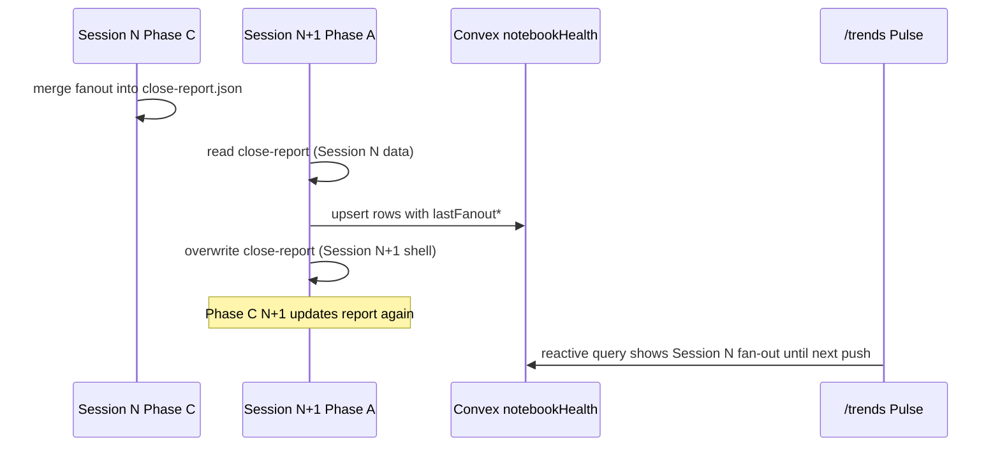

# Story 56.3: Session-close fan-out error_class dashboard widget

Status: in-progress

<!-- Ultimate context engine analysis completed — comprehensive developer guide created. -->

Epic: **56** (NotebookLM routing calibration + vault hygiene — operator brief 2026-06-02)  
Tracked in sprint-status as: **`56-3-session-close-fan-out-error-class-dashboard-widget`**

## Story

As the **CNS operator on `/trends`**,  
I want **Knowledge Pulse rings to show each notebook’s last NotebookLM fan-out status and `error_class`**,  
so that **I do not have to open Discord after every `/session-close` to see whether AI Factory Blueprint failed again**.

## Context

| Topic | Detail |
|-------|--------|
| **Epic** | Epic 56 — observability after routing/hygiene stories **56-1**, **56-2** |
| **Predecessor (data)** | **54-3** — `close-report.json` rows now have `fanout_status` (`ok` \| `failed`), `error_class`, `export_bytes`, etc. via `merge-notebooklm-fanout.mjs` after Phase C |
| **Predecessor (push)** | Session-close Phase A already calls `pushNotebookHealthSnapshot` → Convex `notebookHealth:upsertNotebookHealthSnapshot` (Knowledge Pulse strip on `/trends`) |
| **Problem** | Fan-out diagnostics only appear in Discord + `close-report.json`. `/trends` Knowledge Pulse shows registry freshness (green/amber/red) only — no fan-out health. |
| **Split delivery** | **Part A** (this repo + Convex schema) **first** and commit. **Part B** (`cns-dashboard` UI) in a **separate Cursor chat** after Part A is committed. |

### Operator brief (binding)

1. Extend `buildNotebookHealthRows()` to merge fan-out fields from `close-report.json` `notebooklm_targets`.
2. Push three optional fields per row to Convex `notebookHealth`.
3. Dashboard badge on each ring (Part B): green = success, orange + hover `error_class` = error, grey = unknown.
4. `bash scripts/verify.sh` green in **both** repos when sibling `../cns-dashboard` exists.
5. After Part A commit: `bash scripts/install-hermes-skill-session-close.sh` (standard deploy step; Part A may not edit SKILL — still run per AC).

## Acceptance Criteria

### Part A — Omnipotent.md + Convex (implement first)

#### 1. Convex schema accepts fan-out fields (AC: schema)

**Given** `cns-dashboard/convex/validators.ts` and `schema.ts`  
**When** Part A ships  
**Then** `notebookHealthInputValidator` and `notebookHealthRowValidator` include **optional**:

| Field | Type | Notes |
|-------|------|--------|
| `lastFanoutStatus` | `"success" \| "error" \| "unknown"` | Convex camelCase — matches existing `notebookId`, `lastUpdated` |
| `lastErrorClass` | `string \| null` | optional; omit or `null` on success |
| `lastFanoutAt` | `number` | epoch ms |

**And** `upsertNotebookHealthSnapshot` persists these fields unchanged (spread `...row` already does — verify optional keys are not stripped).

#### 2. Row builder merges close-report fan-out (AC: merge)

**Given** `scripts/session-close/run-deterministic.mjs`  
**When** `buildNotebookHealthRows(registry, routingNotebooks, fanoutTargets)` runs  
**Then** each output row includes the three fan-out fields using **notebook_id** join against `fanoutTargets` (same id as `notebookId` on rows):

| `close-report` `fanout_status` | `lastFanoutStatus` |
|-------------------------------|-------------------|
| `ok` | `success` |
| `failed` | `error` |
| absent / other | `unknown` |

| Source | `lastErrorClass` | `lastFanoutAt` |
|--------|------------------|----------------|
| target `error_class` when `failed` | string value | parse `closeReportGeneratedAt` (ISO) to epoch ms when fan-out status is known; if missing ISO, omit `lastFanoutAt` or use `null` per validator (prefer report-level `generated_at`) |
| success | `null` or omit | same |
| unknown | `null` or omit | omit or `null` |

**And** merge is **non-destructive** for existing fields (`notebookId`, `title`, `domain`, `watch`, `lastUpdated`).

#### 3. Push reads previous close-report before overwrite (AC: timing)

**Given** real session-close Phase A order in `runDeterministicPipeline`:

1. `pushNotebookHealthSnapshot` (line ~652)
2. `writeFile(close-report.json)` (line ~681)
3. Phase C fan-out (Hermes skill) updates the **same** report later

**When** `pushNotebookHealthSnapshot` runs on a **non-dry-run** close  
**Then** it reads **existing** `.session-close/close-report.json` if present (from the **previous** session’s completed close, including Phase C fan-out merges)  
**And** passes `notebooklm_targets` from that report into `buildNotebookHealthRows`  
**And** does **not** require Phase C of the **current** session to have run (fan-out visibility appears on the **next** Phase A push — operator AC: “Blueprint shows orange on **next** close”).

**When** `close-report.json` is missing or unreadable  
**Then** fan-out fields default to `lastFanoutStatus: "unknown"` (and null/omit companions) — push still succeeds.

**When** `dryRun === true`  
**Then** push remains skipped (unchanged).

#### 4. Tests (AC: tests)

**Then** `tests/session-close-pipeline.test.mjs` adds cases for:

- `buildNotebookHealthRows` with fan-out target fixtures (`ok` → `success`, `failed` + `error_class` → `error` + class, no fan-out → `unknown`)
- `pushNotebookHealthSnapshot` HTTP body includes fan-out fields when a temp prior `close-report.json` is supplied (mock read path or inject `fanoutTargets` / `closeReportPath` option — prefer explicit opt param over global paths in tests)

**And** existing notebook health tests remain green.

#### 5. Verify + skill install (AC: gate)

**Then** `bash scripts/verify.sh` passes in Omnipotent.md  
**And** `bash scripts/verify.sh` passes with `CNS_DASHBOARD_ROOT` pointing at sibling `cns-dashboard` (schema + validators compile)  
**And** operator runs `bash scripts/install-hermes-skill-session-close.sh` after Part A commit (document in Dev Agent Record).

### Part B — cns-dashboard UI (separate chat — do not block Part A)

#### 6. Knowledge Pulse badge (AC: ui — Part B only)

**Given** Part A deployed and Convex snapshot includes fan-out fields  
**When** operator opens `/trends` Knowledge Pulse strip  
**Then** each ring shows a **bottom-right overlay badge** (no layout change to strip height):

| `lastFanoutStatus` | Badge |
|--------------------|--------|
| `success` | Green check |
| `error` | Orange dot; **hover/title** shows `lastErrorClass` (e.g. `size_limit`) |
| `unknown` or field absent | Grey dot |

**File:** `cns-dashboard/src/lib/components/trends/KnowledgePulseStrip.svelte`  
**And** extend local `NotebookHealthRow` type with optional fan-out fields  
**And** `npm test` / `bash scripts/verify.sh` green in cns-dashboard.

## Tasks / Subtasks

### Part A (this implementation)

- [x] **T1** Add optional validators in `../cns-dashboard/convex/validators.ts` (AC: 1)
- [x] **T2** Export `mapFanoutTargetToHealthFields(target, reportGeneratedAt)` (or inline in `run-deterministic.mjs`) + extend `buildNotebookHealthRows` signature (AC: 2)
- [x] **T3** In `pushNotebookHealthSnapshot`, read prior `close-report.json` from `.session-close/` (use `resolvePaths` / `paths.closeReportPath`) before building rows (AC: 3)
- [x] **T4** Extend `tests/session-close-pipeline.test.mjs` (AC: 4)
- [x] **T5** Run `bash scripts/verify.sh` from Omnipotent.md repo root (AC: 5)
- [x] **T6** `bash scripts/install-hermes-skill-session-close.sh`; note version in Dev Agent Record (AC: 5)

### Part B (defer — separate Cursor session)

- [ ] **T7** Update `KnowledgePulseStrip.svelte` badge overlay (AC: 6)
- [ ] **T8** Tooltip/title for `lastErrorClass`; verify with live Convex row after one real close

### Review Findings

- [x] [Review][Patch] Revert unrelated cns-dashboard `.playwright-mcp/console-*.log` before commit [`cns-dashboard/.playwright-mcp/`] — applied 2026-06-02 (`git restore`)
- [x] [Review][Decision] Story status after Part A — **keep `in-progress`** until Part B (T7/T8 Knowledge Pulse badge) ships; Part A AC 1–5 accepted
- [x] [Review][Defer] Part B Knowledge Pulse badge overlay (AC 6) — deferred per story split; separate Cursor session [`KnowledgePulseStrip.svelte`]
- [x] [Review][Defer] `lastFanoutAt` uses report `generated_at` from Phase A write, not Phase C fan-out completion time — accepted in story Dev Notes (next-close visibility model) [`run-deterministic.mjs:122-126`]

## Dev Notes

### Phase A vs Phase C — do not get this wrong



**Do not** move Phase A push to after Phase C in this story — that would require Hermes skill + orchestration changes. The “next close” latency is **accepted**.

### Current code anchors (read before editing)

**`buildNotebookHealthRows`** — today only registry + routing; no fan-out:

```93:120:scripts/session-close/run-deterministic.mjs
export function buildNotebookHealthRows(registry, routingNotebooks = []) {
  const rows = registry
    .filter((notebook) => notebook.watch)
    .map((notebook) => ({
      notebookId: notebook.id,
      title: notebook.title,
      domain: notebook.domain || "unknown",
      watch: true,
      lastUpdated: getNotebookLastUpdated(notebook),
    }));
  // ... routed-only rows appended ...
  return rows;
}
```

**Push site** — before close-report write:

```650:681:scripts/session-close/run-deterministic.mjs
  let convexPush;
  try {
    convexPush = await pushNotebookHealthSnapshot({
      dryRun,
      pack,
      env: process.env,
      fetchFn: globalThis.fetch,
      registryPath: DEFAULT_REGISTRY_PATH,
    });
  } catch (err) {
    // non-fatal warn
  }
  const report = buildCloseReport({ ... });
  await writeFile(paths.closeReportPath, `${JSON.stringify(report, null, 2)}\n`, "utf8");
```

**54-3 close-report row shape** (Phase C merge):

| Field | Values |
|-------|--------|
| `fanout_status` | `ok`, `failed` |
| `error_class` | `size_limit`, `auth_error`, `duplicate_source`, `api_error`, `unknown` |

Reference: `scripts/session-close/merge-notebooklm-fanout.mjs` → `applyFanoutFields`.

**Convex today** — `../cns-dashboard/convex/notebookHealth.ts` replaces full table on each snapshot; new fields flow through spread insert.

**Validators today** — only five fields; extend here:

```67:82:../cns-dashboard/convex/validators.ts
export const notebookHealthInputValidator = v.object({
	notebookId: v.string(),
	title: v.string(),
	domain: v.string(),
	watch: v.boolean(),
	lastUpdated: v.union(v.string(), v.null())
});
```

### Suggested implementation sketch (Part A)

```javascript
// run-deterministic.mjs — illustrative
function mapFanoutFields(target, reportGeneratedAt) {
  const status = target?.fanout_status;
  let lastFanoutStatus = "unknown";
  if (status === "ok") lastFanoutStatus = "success";
  else if (status === "failed") lastFanoutStatus = "error";
  const lastErrorClass =
    lastFanoutStatus === "error" && typeof target?.error_class === "string"
      ? target.error_class
      : null;
  let lastFanoutAt = null;
  if (lastFanoutStatus !== "unknown" && reportGeneratedAt) {
    const t = Date.parse(reportGeneratedAt);
    if (!Number.isNaN(t)) lastFanoutAt = t;
  }
  return { lastFanoutStatus, lastErrorClass, lastFanoutAt };
}
```

- Join key: `target.notebook_id` === `row.notebookId`
- If multiple targets same id (should not happen), last wins
- Export `buildNotebookHealthRows` JSDoc return type with optional fan-out keys

**`pushNotebookHealthSnapshot` opts extension:**

```javascript
// Add optional closeReportPath; default paths.closeReportPath from resolvePaths
// readFile close-report → notebooklm_targets + generated_at
```

### Part B UI hints (for follow-up chat)

- `KnowledgePulseStrip.svelte` uses ECharts pie rings — badge is **DOM overlay** on `.ti-knowledge-pulse-strip` per ring (absolute position bottom-right), not ECharts `graphic` unless you already use chart coordinates
- Freshness color (`freshnessColor`) stays the ring fill; fan-out badge is **orthogonal** (do not conflate red freshness with orange fan-out error)
- Reuse palette: green `#34d399`, orange `#fbbf24` (already in `notebook-pulse.ts`), grey `#64748b`
- Drawer payload unchanged (`createNotebookDrawerPayload`)

### Files to touch

| Repo | File | Action |
|------|------|--------|
| Omnipotent.md | `scripts/session-close/run-deterministic.mjs` | UPDATE — builder + push read |
| Omnipotent.md | `tests/session-close-pipeline.test.mjs` | UPDATE — new cases |
| cns-dashboard | `convex/validators.ts` | UPDATE — optional fields |
| cns-dashboard | `convex/schema.ts` | no change if validator-only |
| cns-dashboard | `convex/notebookHealth.ts` | VERIFY only (spread insert) |
| cns-dashboard | `src/lib/components/trends/KnowledgePulseStrip.svelte` | Part B |

### Testing

```bash
cd /home/christ/ai-factory/projects/Omnipotent.md
npm test -- tests/session-close-pipeline.test.mjs
bash scripts/verify.sh

# Convex schema — sibling dashboard
cd ../cns-dashboard && npm test
```

### Security / governance

- No WriteGate / `vault_log_action` changes
- No MCP tool signature changes
- Fan-out fields are already sanitized in close-report (`error_snippet` ≤160 chars) — push only **`error_class` enum string**, not stderr
- Convex mutation remains “personal internal dashboard” trust model ([Source: `convex/notebookHealth.ts`])

### Previous story intelligence

| Story | Relevant learning |
|-------|-------------------|
| **54-3** | `fanout_status` values are `ok`/`failed`, not `success`/`error` — map at Convex boundary |
| **54-3** | Blueprint (`dc6abf1a`) often `size_limit` — use as manual test case on next close |
| **56-2** | Operator/vault story — no code patterns for this story |
| **56-1** | Routing-only — unrelated to Pulse UI |
| **51-2** / commit `e3f8979` | Established `pushNotebookHealthSnapshot` + Knowledge Pulse wiring |

### Git intelligence (recent)

- `a87396d` — 56-2 vault lint (no session-close changes)
- `31df2bc` — 56-1 routing (`notebook-route.mjs`, scorer) — unrelated files
- Fan-out merge landed in 54-3 era — grep `merge-notebooklm-fanout.mjs` if blame needed

### Project references

- [Source: `_bmad-output/implementation-artifacts/54-3-session-close-fan-out-diagnostics.md`]
- [Source: `scripts/hermes-skill-examples/session-close/references/fanout-diagnostics.md`]
- [Source: `../cns-dashboard/convex/notebookHealth.ts`]
- [Source: `../cns-dashboard/src/lib/components/trends/KnowledgePulseStrip.svelte`]
- [Source: `../cns-dashboard/src/lib/utils/notebook-pulse.ts` — freshness vs fan-out]
- [Source: `project-context.md` — verify.sh runs both repos]
- Dashboard UI normative when touching Part B: `_bmad-output/planning-artifacts/epic-46-ui-spec.md` (ECharts client-only, reactive Convex)

### Out of scope

- Second Convex push after Phase C (future enhancement)
- Fixing Blueprint `size_limit` root cause
- Changing `merge-notebooklm-fanout.mjs` field names
- Discord template changes (54-3 done)
- Operator Guide updates (optional one line in completion notes only)

## Dev Agent Record

### Agent Model Used

Composer (dev-story)

### Debug Log References

_(none)_

### Completion Notes List

- **Part A complete (2026-06-02):** Extended Convex `notebookHealthInputValidator` / `notebookHealthRowValidator` with optional `lastFanoutStatus`, `lastErrorClass`, `lastFanoutAt`. Added `mapFanoutTargetToHealthFields`, `loadFanoutTargetsFromCloseReport`, and fan-out merge in `buildNotebookHealthRows`. `pushNotebookHealthSnapshot` reads the **previous** session’s `close-report.json` before Phase A overwrites it (fan-out visible on next close). Tests cover mapping, row merge, and push body with prior report fixture.
- **Hermes skill:** `bash scripts/install-hermes-skill-session-close.sh` → `~/.hermes/skills/cns/session-close` at **version 1.0.10** (unchanged; Part A did not edit SKILL).
- **Part B deferred:** Knowledge Pulse badge overlay in `KnowledgePulseStrip.svelte` — separate Cursor session per story split.

### File List

- `../cns-dashboard/convex/validators.ts`
- `scripts/session-close/run-deterministic.mjs`
- `tests/session-close-pipeline.test.mjs`

### Change Log

- 2026-06-02 — Code review: Part A accepted; story `in-progress` until Part B; playwright log reverted in cns-dashboard (Chris / code-review)
- 2026-06-02 — Part A: session-close → Convex fan-out health fields; prior close-report read on push (Chris / dev-story)
