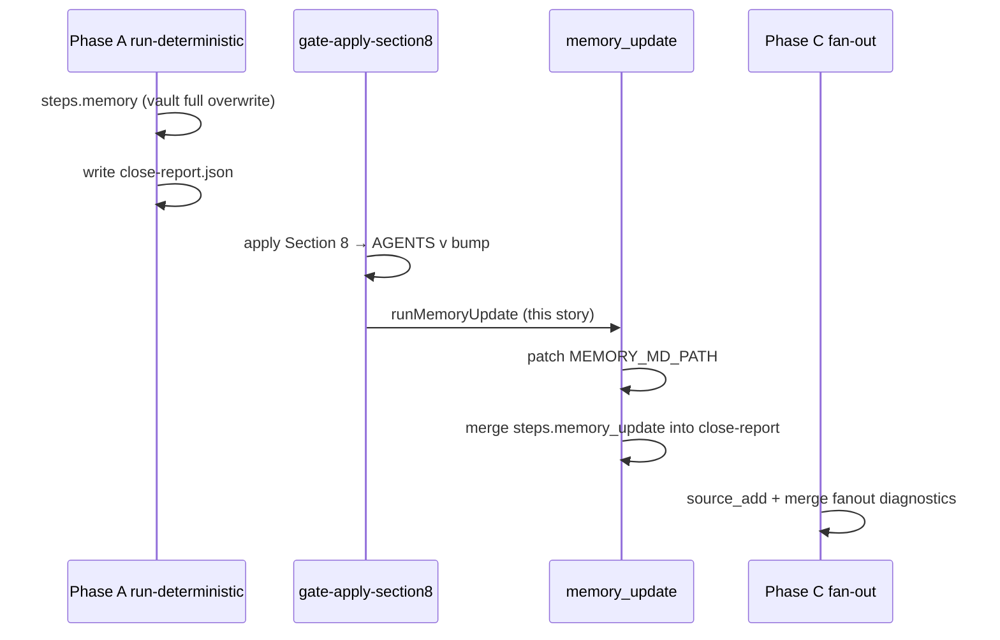

# Story 57.2: Session-close MEMORY.md auto-update

Status: done

<!-- Ultimate context engine analysis completed — comprehensive developer guide created. -->

Epic: **57** (Hermes memory freshness — operator brief 2026-06-02)  
Tracked in sprint-status as: **`57-2-session-close-memory-md-auto-update`**

## Story

As the **CNS operator running `/session-close`**,  
I want **the `## CNS State` block in Hermes `MEMORY.md` refreshed with live sprint/close telemetry after Section 8 apply**,  
so that **Hermes cold-start memory reflects post-close AGENTS version, tests, vault health, and last fan-out status without manual edits and without overwriting operator-owned sections below `## CNS State`**.

## Context

| Topic | Detail |
|-------|--------|
| **Epic** | Epic 57 — Hermes `MEMORY.md` parity with session-close state |
| **Existing SC-3 step** | Phase A `runWriteMemory` **fully overwrites** vault `AI-Context/MEMORY.md` (`steps.memory`) — keep unchanged |
| **This story** | New **`steps.memory_update`**: **block-replace** only `## CNS State` in **`MEMORY_MD_PATH`** (default `~/.hermes/memories/MEMORY.md`) |
| **Timing** | **After** `gate-apply-section8.mjs` succeeds (post-§8 AGENTS version), **before** NotebookLM fan-out (Phase C) |
| **Pattern** | Same boundary splice as `replaceSection8InAgents` in `lib/apply-section8-body.mjs` — not a full-file overwrite |
| **Operator reality** | On WSL, `~/.hermes/memories/MEMORY.md` may be a **regular file** (758 chars observed 2026-06-02), not always a vault symlink — this step targets Hermes load path explicitly |

### Problem

Phase A `write-memory.mjs` runs **before** Section 8 apply, so vault `MEMORY.md` § CNS State lacks post-close AGENTS version and priorities. Hermes loads from `~/.hermes/memories/MEMORY.md`; when decoupled from vault symlink, stale CNS State persists across closes. Operators want a compact, deterministic telemetry block updated every real close without touching `## Last Session Decisions`, `## Environment`, or `## Next Session`.

## Acceptance Criteria

### 1. Block replace `## CNS State` after Section 8 (AC: replace)

**Given** a real `/session-close` (not dry-run) and successful Section 8 apply  
**When** the memory-update step runs  
**Then** it reads `MEMORY_MD_PATH` (env, default `join(homedir(), ".hermes", "memories", "MEMORY.md")`)  
**And** replaces the region from heading `## CNS State` through the line before the next `## ` heading (or EOF if none)  
**And** preserves all content outside that region byte-for-byte  
**And** the new block includes these fields (compact markdown bullets or single dense paragraph — dev choice, must be deterministic):

| Field | Source |
|-------|--------|
| Last close timestamp | ISO from current `close-report.json` `generated_at` (Phase A) or `new Date().toISOString()` at update time — pick one, document in code |
| AGENTS.md version | Post-apply `> Version: X.Y.Z` from vault/repo AGENTS (same paths as `apply-section8.mjs`) |
| Active epics | `in-progress` epic keys from `sprint-status.yaml` (reuse `parseDevelopmentStatus` + epic filter from `write-memory-body.mjs` / rhythm helpers) |
| Test count | `close-report.json` → `steps.tests.message` or `deterministic.tests` |
| Vault health | Reuse vault-lint summary shape from `buildAutoMarkerValues` (`VAULT_HEALTH` line: clean/scanned, errors, warnings, stale suffix) |
| Last fanout summary | Compact summary of **prior session** fan-out: read targets with `fanout_status`/`error_class` from close-report captured **before** Phase A overwrote it (same read window as `loadFanoutTargetsFromCloseReport` in 56-3); if none, `fanout: unknown` |
| `failure_class` | Current `close-report.json` `failure_class` or `null` → render `none` |

**When** dry-run  
**Then** no write to `MEMORY_MD_PATH`; record preview in step message or skip write with `skipped (dry-run)` — match existing dry-run posture for §8 apply.

### 2. File size budget (AC: budget)

**Then** total `MEMORY.md` file length after update is **≤ 2,200 characters** UTF-8  
**And** if the splice would exceed the cap, truncate **only inside the new CNS State body** (never drop trailing sections)  
**And** do not throw on truncate — prefer silent trim with optional `[truncated]` suffix inside CNS State

**Note:** Constitution §6.5 lists MEMORY at 2,000 chars; this story **raises the enforced cap to 2,200** for Hermes path only. Do not change AGENTS §6.5 in this story.

### 3. Missing path — skip cleanly (AC: skip)

**When** `MEMORY_MD_PATH` env is empty after trim, parent dir missing, or file not found  
**Then** skip write (no throw)  
**And** log `memory_update: skipped` to stderr  
**And** `close-report.json` → `steps.memory_update = { status: "skipped", message: "memory_update: skipped" }`  
**And** do **not** set `failure_class` for skip

### 4. close-report step record (AC: report)

**Then** every real close patches existing `.session-close/close-report.json` (merge like `recordSection8Failure`, do not rebuild whole report)  
**And** exposes `steps.memory_update` with `status`: `ok` | `skipped` | `failed` and `message`  
**When** write succeeds  
**Then** message includes char count, e.g. `memory_update: ok (NNN chars)`

### 5. Implementation placement (AC: placement)

**Then** core logic lives in **`scripts/session-close/lib/`** (suggested: `update-memory-cns-state.mjs` or extend `write-memory-body.mjs`)  
**And** is invoked from **`gate-apply-section8.mjs`** immediately after successful `runApplySection8` (real close only; skip when Phase B token ABORTED or apply failed)  
**And** **no new top-level script file** in `scripts/session-close/` (no `update-memory.mjs` CLI entry)  
**And** export testable functions from lib; optional thin call in `run-deterministic.mjs` only if re-export needed for tests — prefer gate hook

**Env documentation (code comment only):**

```javascript
// MEMORY_MD_PATH — optional override for Hermes memory file (default ~/.hermes/memories/MEMORY.md).
// Operator sets in shell env or Hermes service environment; session-close does not write .env files.
```

### 6. Distinct from `steps.memory` (AC: no-regression)

**Then** existing Phase A `runWriteMemory` / `steps.memory` behavior is unchanged  
**And** vault `AI-Context/MEMORY.md` full overwrite still runs in Phase A  
**And** tests for SC-3 memory remain green

### 7. Tests (AC: tests)

**Then** extend `tests/session-close-pipeline.test.mjs`:

- `replaceCnsStateBlock` (or equivalent) splices block, preserves `## Environment` tail
- Missing file → skipped result, no throw
- Over-budget input → file ≤ 2200 chars
- Gate integration test with temp `MEMORY.md` + temp `close-report.json` — **never** read/write real `~/.hermes/memories/MEMORY.md`
- Fanout summary fixture using mock prior-report targets

**And** `bash scripts/verify.sh` passes

## Tasks / Subtasks

- [x] **T1** Add `resolveMemoryMdPath(env)` + `replaceCnsStateInMemory(text, newBlock)` in lib (AC: 1, 5)
- [x] **T2** Add `buildCnsStateBlock(input)` assembling the seven fields from close-report, AGENTS, sprint, vault-lint (AC: 1)
- [x] **T3** Add `runMemoryUpdate(opts)` — read, splice, enforce 2200 cap, write; return `{ status, message, charCount }` (AC: 1, 2, 3)
- [x] **T4** Add `recordMemoryUpdateStep(closeReportPath, result)` merge helper (AC: 4)
- [x] **T5** Hook `runMemoryUpdate` in `gate-apply-section8.mjs` after successful apply; dry-run + ABORT paths skip (AC: 5)
- [x] **T6** Stash prior fan-out summary during Phase A prior-report read OR re-read before overwrite in push path — expose to gate via close-report `deterministic.prior_fanout_summary` or context-pack field (AC: 1 — coordinate with 56-3 `loadFanoutTargetsFromCloseReport`)
- [x] **T7** Tests in `session-close-pipeline.test.mjs` with temp dirs only (AC: 7)
- [x] **T8** Run `bash scripts/verify.sh` (AC: 7)

## Dev Notes

### Pipeline position (do not invert)



**Do not** move memory_update to Phase A — AGENTS version and §8 priorities would be stale.

### Block-replace pattern (copy from Section 8)

Reference implementation:

```53:62:scripts/session-close/lib/apply-section8-body.mjs
export function replaceSection8InAgents(agentsText, section8Block) {
  const start = agentsText.indexOf("## 8.");
  const end = agentsText.indexOf("## 9.");
  // ...
}
```

For MEMORY, anchor on **`## CNS State`** (exact match per 29-2 schema) and find next `\n## ` or EOF. If heading missing, **prepend** new block at file start (document behavior in tests).

### Data source helpers (reuse, do not duplicate)

| Need | Existing helper |
|------|-----------------|
| Sprint epics | `parseDevelopmentStatus`, `primaryInProgressEpic` — `lib/write-memory-body.mjs` |
| AGENTS version | `parseAgentsSection8` — `lib/read-sources.mjs` |
| Vault health | `readVaultLintSummary` + rhythm formatting — `lib/rhythm-markers.mjs` `buildAutoMarkerValues` |
| Prior fan-out | `loadFanoutTargetsFromCloseReport` — `run-deterministic.mjs` |
| Tests line | `close-report.json` `steps.tests.message` |

### Prior fan-out timing (56-3 parity)

At memory_update (pre Phase C), **current** session fan-out has not run. "Last fanout summary" means **previous close's** merged targets. Capture during Phase A when `pushNotebookHealthSnapshot` reads prior `close-report.json` — persist a one-line summary on the report or context-pack, e.g.:

`3/4 ok; 1 failed (size_limit: AI Factory Blueprint)`

Implement in Phase A, consume in Phase B gate — avoids re-reading an already-overwritten report.

### Two memory paths (critical)

| Path | Step | Behavior |
|------|------|----------|
| `{vaultRoot}/AI-Context/MEMORY.md` | `steps.memory` (Phase A) | Full file overwrite via `write-memory.mjs` |
| `MEMORY_MD_PATH` (default `~/.hermes/memories/MEMORY.md`) | `steps.memory_update` (post-§8) | CNS State block only |

When symlinked, both may alias — block replace on Hermes path still safe if vault full overwrite ran earlier in same close (Phase A template already includes `## CNS State`; post-§8 update refreshes telemetry fields).

### close-report merge pattern

Follow `recordSection8Failure` in `apply-section8.mjs`: read JSON, patch `steps.memory_update`, write back. Do not clobber Phase C fan-out merges later in the same file.

### Suggested CNS State block shape (illustrative)

```markdown
## CNS State (auto — /session-close)
Closed: 2026-06-02T04:00:00.000Z | AGENTS v2.1.25 | failure_class: none
Epics: 54, 56 in-progress | Tests: 612 passing
Vault: 115/115 clean — ERRORS: 0, WARNINGS: 0
Fan-out (prev): 4/4 ok
```

Keep deterministic; no relative dates ("today").

### Files to touch

| File | Action |
|------|--------|
| `scripts/session-close/lib/update-memory-cns-state.mjs` (or `write-memory-body.mjs`) | NEW lib — build block, replace, cap |
| `scripts/session-close/gate-apply-section8.mjs` | UPDATE — invoke after apply |
| `scripts/session-close/run-deterministic.mjs` | UPDATE — optional: stash prior fanout summary on report/pack |
| `tests/session-close-pipeline.test.mjs` | UPDATE — unit + gate tests |
| `scripts/hermes-skill-examples/session-close/SKILL.md` | OPTIONAL — one line noting memory_update post-§8; bump version only if operator-visible |

**Out of scope:** Vault IO mutators, AGENTS §6.5 edit, auto-writing `MEMORY_MD_PATH` to any `.env`, new CLI script, changing Phase C fan-out.

### Testing guardrails

```javascript
// GOOD: temp file
const memoryPath = join(fixtureRoot, "MEMORY.md");

// BAD: never in tests
join(homedir(), ".hermes", "memories", "MEMORY.md");
```

Use `mkdtemp` fixtures like existing SC-3 memory tests (`session-close-memory-*`).

### Previous story intelligence

- **29-2:** Locked MEMORY schema with four sections; this story **only** replaces section 1 telemetry — preserve sections 2–4 unless operator later requests sync.
- **48-3 / 48-4:** Phase A memory vs post-§8 ordering deferred to SC-5; this story implements the post-§8 half for Hermes path.
- **56-3:** Prior close-report read before overwrite — reuse for fanout summary field.

### Git intelligence

Recent session-close commits: `0ee2180` (nlm_source_rejected classifier), `c2d0399` (56-3 fanout badge). Follow lib-first + pipeline test patterns from 56-3.

## Dev Agent Record

### Agent Model Used

Composer (Cursor)

### Debug Log References

### Completion Notes List

- Added `scripts/session-close/lib/update-memory-cns-state.mjs`: block-replace `## CNS State`, 2200-byte cap with in-block truncation, `MEMORY_MD_PATH` resolution, `steps.memory_update` merge.
- `gate-apply-section8.mjs` invokes `runMemoryUpdate` after real §8 apply (skips dry-run / ABORT).
- Phase A stashes `deterministic.prior_fanout_summary` from prior `close-report.json` before overwrite (56-3 parity).
- Seven unit/integration tests in `session-close-pipeline.test.mjs`; `bash scripts/verify.sh` passed.

### File List

- `scripts/session-close/lib/update-memory-cns-state.mjs` (new)
- `scripts/session-close/gate-apply-section8.mjs`
- `scripts/session-close/run-deterministic.mjs`
- `tests/session-close-pipeline.test.mjs`
- `_bmad-output/implementation-artifacts/sprint-status.yaml`

## Change Log

- 2026-06-02: Story 57-2 created — post-§8 Hermes MEMORY.md `## CNS State` block auto-update with 2,200 char cap and `steps.memory_update` reporting.
- 2026-06-02: Code review patches applied — fanout prefix, prepend test, cap safety, read-error failed status.

### Review Findings

- [x] [Review][Patch] Double fanout prefix when prior fan-out unknown [`scripts/session-close/lib/update-memory-cns-state.mjs:177-183`]
- [x] [Review][Patch] Missing test for prepend when `## CNS State` heading absent [`tests/session-close-pipeline.test.mjs`]
- [x] [Review][Patch] `enforceMemoryFileCharLimit` no-heading fallback truncates entire file, can drop trailing sections [`scripts/session-close/lib/update-memory-cns-state.mjs:117-120`]
- [x] [Review][Patch] Byte-cap trim uses UTF-16 `slice`, can split multibyte UTF-8 sequences [`scripts/session-close/lib/update-memory-cns-state.mjs:141-142`]
- [x] [Review][Patch] `runMemoryUpdate` rethrows on agents/sprint/vault-lint read errors instead of `steps.memory_update: failed` [`scripts/session-close/lib/update-memory-cns-state.mjs:330-334`]
- [x] [Review][Defer] Gate stdout does not echo `memory_update` result (operator visibility) [`scripts/session-close/gate-apply-section8.mjs:89-98`] — deferred, pre-existing gate logging pattern
- [x] [Review][Defer] Cap enforced on UTF-8 bytes not grapheme/code-point count per AC wording [`scripts/session-close/lib/update-memory-cns-state.mjs:112-114`] — deferred, MEMORY content is ASCII-only in practice
