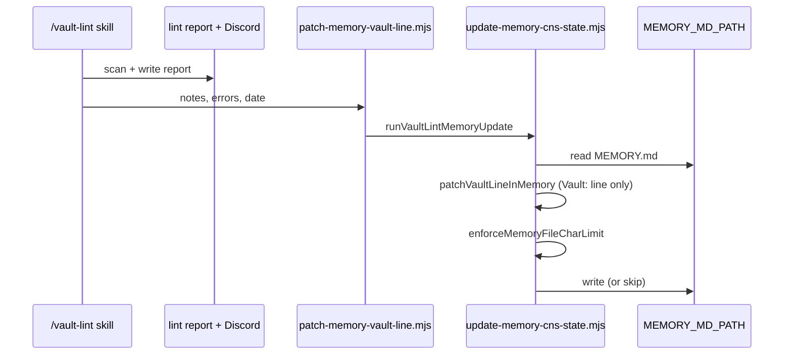

# Story 57.3: Vault-lint result auto-memory

Status: done

<!-- Ultimate context engine analysis completed — comprehensive developer guide created. -->

Epic: **57** (Hermes memory freshness — operator brief 2026-06-02)  
Tracked in sprint-status as: **`57-3-vault-lint-result-auto-memory`**

## Story

As the **CNS operator running `/vault-lint`**,  
I want **the `Vault:` line inside the `## CNS State` block of Hermes `MEMORY.md` updated with the latest scan summary when lint completes**,  
so that **Hermes cold-start memory reflects fresh vault health between session closes without manual edits and without overwriting other CNS State telemetry (AGENTS version, epics, tests, fan-out)**.

## Context

| Topic | Detail |
|-------|--------|
| **Epic** | Epic 57 — Hermes `MEMORY.md` CNS State freshness |
| **Predecessor** | **57-2** — `update-memory-cns-state.mjs` block-replace on `/session-close`; exports `resolveMemoryMdPath`, `replaceCnsStateInMemory`, `enforceMemoryFileCharLimit`, `MEMORY_FILE_CHAR_LIMIT` |
| **This story** | **Line-level patch** of the `Vault:` row inside existing `## CNS State` after successful `/vault-lint` |
| **Trigger** | End of vault-lint skill execution (`scripts/hermes-skill-examples/vault-lint/` → `~/.hermes/skills/cns/vault-lint/`) |
| **Target path** | `MEMORY_MD_PATH` env (default `~/.hermes/memories/MEMORY.md`) — same as 57-2 |
| **Format delta** | Session-close (57-2) writes `Vault: 115/115 clean — ERRORS: 0, WARNINGS: 0`; vault-lint writes **`Vault: N notes, ERRORS: X, last lint: YYYY-MM-DD`** — intentional; last writer wins per event |

### Problem

Between `/session-close` runs, vault health in Hermes memory can go stale (lint report age, new orphans, post-remediation counts). Operators run `/vault-lint` regularly but must manually reconcile MEMORY. Story 57-2 established the Hermes memory path and block-replace helpers; this story adds a **narrow, lint-triggered patch** so a successful scan immediately refreshes the vault telemetry line.

## Acceptance Criteria

### 1. Patch vault line after successful lint (AC: patch)

**Given** `/vault-lint` completes a full scan (Discord summary + on-disk report written)  
**When** the memory-update hook runs at skill end  
**Then** it reads `MEMORY_MD_PATH` via `resolveMemoryMdPath(env)` from `scripts/session-close/lib/update-memory-cns-state.mjs`  
**And** locates the `## CNS State` region (same boundary rules as `replaceCnsStateInMemory`: from `## CNS State` through line before next `\n## ` or EOF)  
**And** replaces **only** the line matching `/^Vault:/m` within that region with:

```text
Vault: <N> notes, ERRORS: <X>, last lint: <YYYY-MM-DD>
```

Where:

| Token | Source |
|-------|--------|
| `<N>` | `counts.scanned` from lint run (same as Discord `Scanned: N notes`) |
| `<X>` | `counts.errors` from lint run |
| `<YYYY-MM-DD>` | UTC run date (`today` in task-prompt — same as report filename date) |

**And** preserves all other lines inside and outside `## CNS State` byte-for-byte except the single `Vault:` line  
**And** if `## CNS State` heading is **absent**, skip write (no throw, no prepend)  
**And** if `Vault:` line is absent inside the region, **insert** one new line immediately after the CNS State heading line (before other body lines)

**When** lint aborts early (`bad-trigger`, `no-vault-root`, `incomplete`)  
**Then** memory hook does **not** run (no partial writes)

### 2. Reuse 57-2 helpers — no duplicate block logic (AC: reuse)

**Then** shared logic lives in **`scripts/session-close/lib/update-memory-cns-state.mjs`** (extend, do not fork)  
**And** new exports are minimal, e.g.:

- `formatVaultLintMemoryLine({ notes, errors, lintDate })` → formatted line (no trailing newline required; patch function adds `\n`)
- `patchVaultLineInMemory(memoryText, vaultLine)` → returns patched text
- `runVaultLintMemoryUpdate({ notes, errors, lintDate, memoryMdPath?, env? })` → read / patch / cap / write; returns `{ status, message }` where `status` is `ok` | `skipped`

**And** `enforceMemoryFileCharLimit` runs after patch (2200-byte cap unchanged)  
**And** **do not** call `buildCnsStateBlock` or `replaceCnsStateInMemory` for vault-lint — line patch only

### 3. Missing path — skip silently (AC: skip)

**When** `MEMORY_MD_PATH` env is empty after trim, parent dir missing, or file not found  
**Then** skip write (no throw, no stderr requirement — silent skip per operator brief)  
**And** return `{ status: "skipped", message: "vault_lint_memory: skipped" }`  
**And** `/vault-lint` Discord reply and report write still succeed (memory patch is best-effort)

### 4. Hermes skill integration (AC: skill)

**Then** add thin CLI under vault-lint skill package:

`scripts/hermes-skill-examples/vault-lint/scripts/patch-memory-vault-line.mjs`

Usage (document in task-prompt):

```bash
VAULT_LINT_NOTES=<N> VAULT_LINT_ERRORS=<X> VAULT_LINT_DATE=<YYYY-MM-DD> \
  node "$SKILL_DIR/scripts/patch-memory-vault-line.mjs"
```

Or positional args — dev choice; env vars preferred (morning-digest pattern).

**And** `references/task-prompt.md` adds **Step 14** after Discord reply + report write:

1. Invoke `patch-memory-vault-line.mjs` with scan counts and `<today>`.
2. Do not fail the skill if memory patch returns skipped.
3. Do not include memory patch status in Discord reply (operator-visible lint output unchanged).

**And** `SKILL.md` Steps section references Step 14; bump skill `version` patch (e.g. `1.0.1` → `1.0.2`)  
**And** `bash scripts/install-hermes-skill-vault-lint.sh` copies the new script (existing `cp -a` — no installer change unless path missing)

**Script resolution:** Import lib via `OMNIPOTENT_REPO` when set (absolute path), else `/home/christ/ai-factory/projects/Omnipotent.md` — same fallback as session-close / morning-digest.

### 5. File size budget (AC: budget)

**Then** total `MEMORY.md` length after patch is **≤ 2,200** UTF-8 bytes (reuse `MEMORY_FILE_CHAR_LIMIT`)  
**And** if cap exceeded, `enforceMemoryFileCharLimit` truncates per 57-2 rules (in-block trim, preserve trailing `## Environment` / `## Next Session`)

### 6. No regression (AC: no-regression)

**Then** 57-2 `runMemoryUpdate` / session-close gate behavior unchanged  
**And** vault-lint read-only policy unchanged (memory write is Hermes path only, not vault IO)  
**And** `bash scripts/verify.sh` passes

### 7. Tests (AC: tests)

**Then** add tests (prefer extending `tests/session-close-pipeline.test.mjs` for lib functions + new `tests/vault-lint-memory-patch.test.mjs` or extend `tests/hermes-vault-lint-skill.test.mjs` for skill wiring):

| Case | Expect |
|------|--------|
| `patchVaultLineInMemory` replaces `Vault:` inside CNS State, preserves `Closed:` / `Epics:` / `Fan-out:` lines | pass |
| `patchVaultLineInMemory` preserves `## Environment` tail | pass |
| Missing `## CNS State` → `runVaultLintMemoryUpdate` skipped | pass |
| Missing MEMORY file → skipped, no throw | pass |
| `formatVaultLintMemoryLine` deterministic | `Vault: 115 notes, ERRORS: 0, last lint: 2026-06-02` |
| Post-patch file ≤ 2200 bytes | pass |
| `patch-memory-vault-line.mjs` exists in skill dir after install mirror check | pass |

**Guardrail:** tests use `mkdtemp` fixtures only — **never** read/write real `~/.hermes/memories/MEMORY.md`.

### 8. Commit (AC: commit)

**When** implementation complete  
**Then** commit message: `feat(vault-lint): write lint result to MEMORY.md CNS State (57-3)`

## Tasks / Subtasks

- [x] **T1** Add `formatVaultLintMemoryLine`, `patchVaultLineInMemory`, `runVaultLintMemoryUpdate` to `update-memory-cns-state.mjs` (AC: 1, 2, 3, 5)
- [x] **T2** Add `scripts/hermes-skill-examples/vault-lint/scripts/patch-memory-vault-line.mjs` thin CLI (AC: 4)
- [x] **T3** Update `vault-lint/references/task-prompt.md` Step 14 + `SKILL.md` version/steps (AC: 4)
- [x] **T4** Unit tests for lib patch + CLI wiring assertion (AC: 7)
- [x] **T5** Run `bash scripts/verify.sh` (AC: 6)
- [x] **T6** Commit with specified message (AC: 8)

## Dev Notes

### Line patch vs block replace (57-2)



Session-close **block-replace** refreshes all CNS State fields; vault-lint **line-patch** refreshes vault health only. After session-close, vault line reverts to 57-2 shape until next lint.

### Region boundary (reuse 57-2 anchor)

```104:122:scripts/session-close/lib/update-memory-cns-state.mjs
export function replaceCnsStateInMemory(memoryText, newBlock) {
  const block = newBlock.endsWith("\n") ? newBlock : `${newBlock}\n`;
  const start = memoryText.indexOf(CNS_STATE_HEADING);
  // ... find next \n## or EOF
}
```

Extract shared `findCnsStateRegion(memoryText) → { start, regionEnd } | null` if it avoids duplication; `patchVaultLineInMemory` operates on `memoryText.slice(start, regionEnd)` then splices back.

### Vault line regex

- Match: `/^Vault:.*$/m` within CNS State region only (not `## Environment` or other sections).
- Replacement line: no `WARNINGS` count in vault-lint format (operator brief) — errors + note count + date only.

### Illustrative MEMORY fragment after lint

```markdown
## CNS State (auto — /session-close)
Closed: 2026-06-02T04:00:00.000Z | AGENTS v2.1.25 | failure_class: none
Epics: 57 in-progress | Tests: 612 passing
Vault: 115 notes, ERRORS: 0, last lint: 2026-06-02
Fan-out (prev): 4/4 ok

## Environment
- Gateway: manual start required (not systemd)
```

Only the `Vault:` line changes; other rows from last session-close remain.

### CLI import pattern (morning-digest parity)

```javascript
const repoRoot =
  process.env.OMNIPOTENT_REPO?.trim() ||
  "/home/christ/ai-factory/projects/Omnipotent.md";
const { runVaultLintMemoryUpdate, resolveMemoryMdPath } = await import(
  join(repoRoot, "scripts/session-close/lib/update-memory-cns-state.mjs")
);
```

Exit 0 on `ok` and `skipped`; exit 1 only on unexpected throw (should be rare — lib should swallow missing-file cases).

### Files to touch

| File | Action |
|------|--------|
| `scripts/session-close/lib/update-memory-cns-state.mjs` | UPDATE — line patch exports |
| `scripts/hermes-skill-examples/vault-lint/scripts/patch-memory-vault-line.mjs` | NEW — thin CLI |
| `scripts/hermes-skill-examples/vault-lint/references/task-prompt.md` | UPDATE — Step 14 |
| `scripts/hermes-skill-examples/vault-lint/SKILL.md` | UPDATE — step ref + version bump |
| `tests/session-close-pipeline.test.mjs` and/or `tests/vault-lint-memory-patch.test.mjs` | UPDATE/NEW |
| `tests/hermes-vault-lint-skill.test.mjs` | UPDATE — assert patch script exists |

**Out of scope:** Vault IO mutators, changing 57-2 session-close vault line format, AGENTS §6.5, writing vault `AI-Context/MEMORY.md`, Discord reply format changes, lint rule algorithm changes.

### Testing guardrails

```javascript
// GOOD
const memoryPath = join(fixtureRoot, "MEMORY.md");

// BAD — never in tests
join(homedir(), ".hermes", "memories", "MEMORY.md");
```

Fixture template:

```markdown
## CNS State (auto — /session-close)
Closed: 2026-06-01T00:00:00.000Z | AGENTS v2.1.25 | failure_class: none
Epics: 57 in-progress | Tests: 100 passing
Vault: 100/100 clean — ERRORS: 0, WARNINGS: 0
Fan-out (prev): unknown

## Environment
- fixture
```

After patch: assert `Vault: 115 notes, ERRORS: 2, last lint: 2026-06-02` and `Closed:` unchanged.

### Previous story intelligence

- **57-2:** `resolveMemoryMdPath`, `enforceMemoryFileCharLimit`, CNS State heading constant, skip-on-missing-file pattern — extend here; do not copy block-replace into vault-lint.
- **29-5 / 29-2:** MEMORY schema has four sections; this story touches only the vault telemetry **line** inside section 1.
- **56-2:** Authoritative lint via Hermes `/vault-lint`; counts come from live scan, not stale `_meta/reports/` read in the hook.

### Git intelligence

Recent related commit: `b8d0605` — `feat(session-close): auto-update MEMORY.md CNS State block on session-close (57-2)`. Follow lib-first + pipeline test patterns; vault-lint skill version bump only when operator-visible steps change.

### Spec references

- [Source: `specs/cns-vault-contract/modules/vault-lint.md`] — scan counts, report path
- [Source: `_bmad-output/implementation-artifacts/57-2-session-close-memory-md-auto-update.md`] — MEMORY_MD_PATH, cap, block-replace precedent
- [Source: `scripts/hermes-skill-examples/vault-lint/references/task-prompt.md` §10–13] — Discord + report completion gate before Step 14

## Dev Agent Record

### Agent Model Used

Composer (Cursor)

### Debug Log References

- verify.sh passed after removing unused `fileURLToPath` import in patch CLI (eslint no-unused-vars).

### Completion Notes List

- Extended `update-memory-cns-state.mjs` with shared `findCnsStateRegion`, `formatVaultLintMemoryLine`, `patchVaultLineInMemory`, and `runVaultLintMemoryUpdate`; refactored `replaceCnsStateInMemory` / `enforceMemoryFileCharLimit` to reuse region helper.
- Added vault-lint skill CLI `patch-memory-vault-line.mjs` (env-driven counts + date; exit 0 on ok/skipped).
- task-prompt §14 + SKILL.md v1.0.2 document post-scan MEMORY patch (best-effort, not in Discord reply).
- Added `tests/vault-lint-memory-patch.test.mjs` (9 cases) and extended `hermes-vault-lint-skill.test.mjs` for patch script presence.

### File List

- `scripts/session-close/lib/update-memory-cns-state.mjs`
- `scripts/hermes-skill-examples/vault-lint/scripts/patch-memory-vault-line.mjs`
- `scripts/hermes-skill-examples/vault-lint/references/task-prompt.md`
- `scripts/hermes-skill-examples/vault-lint/SKILL.md`
- `tests/vault-lint-memory-patch.test.mjs`
- `tests/hermes-vault-lint-skill.test.mjs`
- `_bmad-output/implementation-artifacts/57-3-vault-lint-result-auto-memory.md`
- `_bmad-output/implementation-artifacts/sprint-status.yaml`

## Change Log

- 2026-06-02: Story 57-3 created — vault-lint post-scan MEMORY.md `Vault:` line auto-update via 57-2 helpers.
- 2026-06-02: Code review patches — CLI validates finite notes + YYYY-MM-DD lint date; 2 CLI guard tests added.

### Review Findings

- [x] [Review][Patch] CLI accepts NaN notes when env/argv missing [`scripts/hermes-skill-examples/vault-lint/scripts/patch-memory-vault-line.mjs:44-54`] — fixed: reject non-finite notes
- [x] [Review][Patch] lintDate not validated — arbitrary string can corrupt MEMORY line [`scripts/hermes-skill-examples/vault-lint/scripts/patch-memory-vault-line.mjs:31-54`] — fixed: require YYYY-MM-DD
- [x] [Review][Defer] No CLI subprocess integration test — AC 7 only requires script presence [`tests/vault-lint-memory-patch.test.mjs:156`] — deferred, pre-existing test-gap pattern
- [x] [Review][Defer] `findCnsStateRegion` uses prefix `indexOf("## CNS State")` — could match unintended headings [`scripts/session-close/lib/update-memory-cns-state.mjs:104`] — deferred, pre-existing 57-2 pattern
