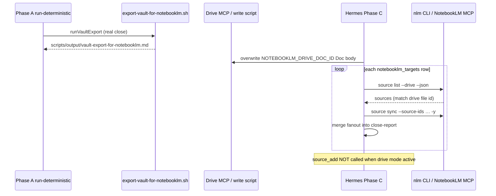

# Story 58.1: Migrate vault export sync to Drive-backed Doc — eliminate destructive source churn

Status: review

<!-- Ultimate context engine analysis completed — comprehensive developer guide created. -->

Epic: **58** (NotebookLM vault export reliability — operator brief 2026-06-03)  
Tracked in sprint-status as: **`58-1-migrate-vault-export-drive-doc-sync`**

## Story

As the **CNS operator running `/session-close`**,  
I want **the vault export pushed to NotebookLM by overwriting one stable Google Drive Doc and triggering Drive source sync per watched notebook**,  
so that **notebooks never accumulate duplicate `vault-export-for-notebooklm.md` file sources, source limits are not hit, and fan-out stays reliable until Google Drive auto-sync rolls out (~June 10, 2026)**.

## Context

| Topic | Detail |
|-------|--------|
| **Epic** | Epic 58 — NotebookLM vault export sync architecture |
| **Problem** | Phase C calls `mcp__notebooklm__source_add` with `source_type: "file"` on **every** real close. Each call adds a **new** source. Notebooks fill up; `dc6abf1a` (AI Factory Blueprint) hit `nlm_source_rejected` / source limit. Operator manually cleaned duplicates on **2026-06-03**. |
| **Root cause** | File upload fan-out is additive. NotebookLM has no replace-by-name semantics for file sources. |
| **Fix class** | **Architectural:** one Drive Doc (stable file ID) overwritten each session; NotebookLM holds one Drive-backed source per notebook; sync refreshes content. |
| **Deferred work** | `deferred-work.md` P2: "replace vault export source instead of adding new one" — **this story resolves it**. |
| **Out of scope (58-2)** | WatchedSurface / Tier 2 multi-surface design — do not touch. |

### Watched notebooks (current production)

Three notebooks from `~/.hermes/session-close.env` / registry `watch: true`:

| Short ID | Notebook |
|----------|----------|
| `981466f0…` | CNS Vault Architecture |
| `dc6abf1a…` | AI Factory Blueprint |
| `f037c741…` | (third watched notebook) |

Full IDs in `tests/session-close-pipeline.test.mjs` env fixture.

### Architecture (binding)



1. **Phase A** (unchanged): `runVaultExport` writes local `scripts/output/vault-export-for-notebooklm.md`; `close-report.json` still has `notebooklm_targets[]` with `{ notebook_id, title, export_path }` and `deterministic.export_bytes`.
2. **Drive write** (new): After export on real close, overwrite the designated Google Drive Doc via **connected Drive MCP** (`https://drivemcp.googleapis.com/mcp/v1`) **or** a thin Node wrapper the skill invokes — content from `export_path`. Stable Doc ID from `NOTEBOOKLM_DRIVE_DOC_ID` in `~/.hermes/session-close.env`.
3. **Drive sync fan-out** (replaces `source_add` when env set): For each `notebooklm_targets` row, `nlm source list <notebook_id> --drive --json`, find source whose **Drive file ID** equals `NOTEBOOKLM_DRIVE_DOC_ID` (not title/name), then `nlm source sync <notebook_id> --source-ids <source_uuid> -y` (or `mcp__notebooklm__source_sync_drive` with `confirm: true` when MCP preferred).
4. **Legacy fallback**: When `NOTEBOOKLM_DRIVE_DOC_ID` missing/empty, skip drive path; run existing `source_add` fan-out with **deprecation** flag in close-report.
5. **Auto-sync future**: After Google Drive auto-sync rollout (~June 10), manual sync becomes best-effort; sync failure = warning only.

### Operator migration (after deploy — manual)

1. Create Google Drive folder: `CNS Exports`
2. Create a **Google Doc** in that folder named `vault-export-for-notebooklm` (do not auto-create via automation)
3. In NotebookLM UI, add that Doc as a **Drive source** to each of the 3 watched notebooks
4. Copy the Drive Doc **file ID** from the URL into `~/.hermes/session-close.env`:
   ```bash
   NOTEBOOKLM_DRIVE_DOC_ID=<google-drive-file-id>
   ```
5. Add Google OAuth credentials to `~/.hermes/session-close.env`:
   ```bash
   GOOGLE_CLIENT_ID=
   GOOGLE_CLIENT_SECRET=
   GOOGLE_REFRESH_TOKEN=
   ```
   (Docs API scope on the refresh token)
6. Restart `hermes-gateway.service`
7. Run `@Hermes /session-close` and confirm close-report shows `notebooklm_fanout_mode: drive-sync` with `fanout_status: ok` on all 3 notebooks

**Note:** `@googleapis/mcp-server-drive` is not on npm (404). Production path uses REST via `write-vault-export-to-drive.mjs`; Drive MCP registration is optional future work.

## Acceptance Criteria

### 1. No duplicate sources after consecutive closes (AC: stability)

**Given** operator completed migration (Drive Doc added to all 3 notebooks, `NOTEBOOKLM_DRIVE_DOC_ID` set)  
**When** two consecutive real `/session-close` runs complete  
**Then** each watched notebook has **exactly one** vault-export Drive source (backed by `NOTEBOOKLM_DRIVE_DOC_ID`), not two  
**And** Phase C never called `source_add` for vault export on either run.

### 2. Drive write + sync fan-out (AC: drive-mode)

**Given** `NOTEBOOKLM_DRIVE_DOC_ID` is non-empty (process env or `~/.hermes/session-close.env`)  
**And** Phase A export succeeded (`steps.export.status === "ok"`)  
**When** Hermes completes Phase C  
**Then**:

| Step | Behavior |
|------|----------|
| Drive overwrite | Doc content replaced from `deterministic.export_path` / row `export_path` |
| Source lookup | Per notebook: list Drive sources; match on **Drive file ID** === `NOTEBOOKLM_DRIVE_DOC_ID` |
| Sync trigger | `nlm source sync … -y` or `source_sync_drive` with `confirm: true` |
| Report merge | Each `notebooklm_targets` row gets `fanout_status: ok` on sync success |

**And** `close-report.json` includes `notebooklm_fanout_mode: "drive-sync"`.  
**And** Discord template still renders per-target lines from merged rows (54-3 contract).

### 3. Drive write failure — non-blocking (AC: drive_write_error)

**When** Drive overwrite fails (MCP error, auth, missing Doc)  
**Then** affected notebooks (or a report-level step) record `fanout_status: failed` with `error_class: drive_write_error`  
**And** session-close **does not abort** (`failure_class` unchanged unless other steps failed)  
**And** sanitized `error_snippet` ≤ 160 chars (reuse `sanitizeFanoutErrorText`).

### 4. Sync failure — warning only (AC: sync-graceful)

**When** Drive write succeeded but sync trigger fails (CLI timeout, source not found, MCP unavailable)  
**Then** row records `fanout_status: failed` with appropriate `error_class` (`unknown`, `auth_error`, etc.)  
**And** session-close continues; auth watchdog still runs  
**And** stderr logged; no retry loop.

### 5. Legacy fallback when env missing (AC: fallback)

**When** `NOTEBOOKLM_DRIVE_DOC_ID` is missing or empty  
**Then** drive write + sync steps **skip** with clear stderr warning  
**And** Phase C falls back to existing `source_add` fan-out (`title: "My Knowledge Base"`, `source_type: "file"`, `wait: false`)  
**And** `close-report.json` includes `notebooklm_fanout_mode: "legacy-source-add"` and `legacy_fanout_deprecation: true`  
**And** `nlm_source_rejected` error class **remains** in classifier for fallback path.

### 6. Dry-run unchanged (AC: dry-run)

**When** `/session-close --dry-run`  
**Then** no Drive write, no sync, no `source_add`, no fan-out result fields on targets  
**And** Discord shows NotebookLM as skipped in dry-run.

### 7. Tests + verify (AC: tests)

**Then** new unit tests cover:

- Drive doc ID env loading from `session-close.env` (mirror `NOTEBOOKLM_NOTEBOOK_IDS` parser in `read-sources.mjs`)
- Matching notebook source by Drive **file ID** from fixture `nlm source list --drive --json` payload (not name)
- Fallback mode selection when env missing
- `drive_write_error` classification path
- Merge into close-report without clobbering `nlm_auth`, `notebooklm_routing`, `steps`

**And** `tests/hermes-session-close-skill.test.mjs` asserts drive-sync reference + SKILL contract (no `source_add` when drive mode documented).  
**And** `bash scripts/verify.sh` green.

### 8. Commit message (AC: commit)

```
feat(session-close): migrate vault export to Drive-backed Doc sync (58-1)
```

## Tasks / Subtasks

- [x] **T1 — Env + config** (AC: 2, 5)
  - [x] Extend `read-sources.mjs` (or new `load-session-close-env.mjs`) to read `NOTEBOOKLM_DRIVE_DOC_ID` from process env then `~/.hermes/session-close.env`
  - [x] Document Drive MCP registration snippet for `~/.hermes/config.yaml` in `references/drive-export-sync.md` (do not commit secrets)
- [x] **T2 — Drive write** (AC: 2, 3)
  - [x] Implement drive overwrite helper (MCP contract in skill + optional `write-vault-export-to-drive.mjs` for testability)
  - [x] Record `steps.drive_write = { status, message }` in close-report when write attempted
- [x] **T3 — Sync fan-out script** (AC: 2, 4)
  - [x] `scripts/session-close/sync-vault-export-drive.mjs` + `hermes-run-sync-vault-export-drive.sh` (nvm PATH wrapper)
  - [x] Per notebook: `nlm source list --drive --json` → match file id → `nlm source sync -y --source-ids`
  - [x] Reuse `merge-notebooklm-fanout.mjs` for per-target status
- [x] **T4 — SKILL + references** (AC: 2, 5, 6)
  - [x] Add `references/drive-export-sync.md`; update `SKILL.md` Phase C (bump version e.g. 1.0.10 → 1.0.11)
  - [x] Replace primary fan-out path: drive write → sync loop; legacy `source_add` only when env missing
  - [x] Update `fanout-diagnostics.md` cross-link; add `drive_write_error` to error_class table
  - [x] Update `discord-reply-template.md` if new report fields need rendering (`notebooklm_fanout_mode`, deprecation notice one line)
- [x] **T5 — Tests** (AC: 7)
  - [x] `tests/vault-export-drive-sync.test.mjs`
  - [x] Extend `tests/hermes-session-close-skill.test.mjs`
- [x] **T6 — Deploy** (AC: 7)
  - [x] `bash scripts/install-hermes-skill-session-close.sh` after SKILL changes
  - [x] Operator migration checklist in completion notes (not Operator Guide unless operator asks)

## Dev Notes

### Current code state (READ BEFORE EDIT)

| File | Current behavior | This story changes |
|------|------------------|-------------------|
| `scripts/session-close/run-deterministic.mjs` | `runVaultExport` → local md; builds `notebooklm_targets` via `readNotebookLmTargetsWithMeta` | Optionally record `NOTEBOOKLM_DRIVE_DOC_ID` in report `deterministic` block when env set; **do not** call `source_add` here |
| `scripts/session-close/lib/read-sources.mjs` | Loads `NOTEBOOKLM_NOTEBOOK_IDS` from env file; targets use `source_type: "file"`, `file_path: exportPath` | Add `NOTEBOOKLM_DRIVE_DOC_ID` loader; targets may add `drive_doc_id` hint when set |
| `scripts/hermes-skill-examples/session-close/SKILL.md` v1.0.10 | Phase C: loop `mcp__notebooklm__source_add` per row | Primary: Drive write + sync; fallback: legacy source_add |
| `scripts/hermes-skill-examples/session-close/references/fanout-diagnostics.md` | Documents `source_add` + merge | Cross-link drive-sync path; add `drive_write_error` |
| `scripts/session-close/merge-notebooklm-fanout.mjs` | Merges `fanout_status`, `error_class`, etc. | **Reuse** — extend classifier if needed for sync-specific errors |
| `scripts/session-close/lib/classify-source-add-error.mjs` | Includes `nlm_source_rejected` | **Keep** `nlm_source_rejected`; add `drive_write_error` only if merge path needs it (or set explicitly on drive step) |
| `tests/session-close-pipeline.test.mjs` | Asserts file-type targets from env/registry | Add drive env fixture tests |

### Phase boundaries (do not blur)

| Phase | Owner | NotebookLM vault export |
|-------|-------|---------------------------|
| **A** | `run-deterministic.mjs` (terminal) | Local export file + close-report targets |
| **B** | `gate-apply-section8.mjs` | No NotebookLM |
| **C** | Hermes skill (MCP + terminal) | Drive write, sync fan-out, legacy fallback, merge, auth watchdog |

Drive MCP is **not** available in Phase A. Drive overwrite orchestration belongs in **Phase C** (Hermes calls `mcp__drive__…` after Phase A export). If a Node script wraps the same API for unit tests, keep it invocable from Phase C via `hermes-run-*.sh` wrapper — mirror `hermes-run-merge-notebooklm-fanout.sh`.

### Drive MCP registration (operator / dev setup)

Drive MCP is **not** in current `~/.hermes/config.yaml` (only `cns_vault_io`, `notebooklm`, `perplexity`). Story must document registration, e.g.:

```yaml
# Example — verify current Drive MCP docs before shipping
drive:
  url: https://drivemcp.googleapis.com/mcp/v1
  # OAuth / transport per Google Drive MCP setup guide
```

Hermes tool prefix will be `mcp__drive__…` (confirm tool names from live MCP descriptor after registration). **Context7:** resolve Drive MCP / Hermes agent docs before implementing tool calls — do not guess signatures.

### Source matching — Drive file ID, not name

**Critical:** Dedup key is Google Drive **file ID** (`NOTEBOOKLM_DRIVE_DOC_ID`), not source title `"My Knowledge Base"` / `"CNS Vault Export"`.

Use `nlm source list <notebook_id> --drive --json` (or `mcp__notebooklm__source_list_drive`). Parse JSON for field carrying Drive document/file id (inspect live CLI output once during dev; fixture in tests).

If no source matches doc id for a notebook → `fanout_status: failed`, `error_class: unknown`, message hints operator to add Drive source in UI (migration step 3).

### Sync invocation options (prefer CLI for Phase C script)

| Method | When |
|--------|------|
| `nlm source sync <notebook_id> --source-ids <uuid> -y` | Default in `sync-vault-export-drive.mjs` — testable, matches 51-2 CLI pattern |
| `mcp__notebooklm__source_sync_drive` | Alternative in skill if CLI subprocess undesirable; requires `confirm: true` |

If sync tool unavailable, log warning and exit 0 per row (auto-sync fallback).

### close-report.json new fields

```json
{
  "notebooklm_fanout_mode": "drive-sync",
  "legacy_fanout_deprecation": false,
  "steps": {
    "drive_write": { "status": "ok", "message": "drive doc overwritten" }
  },
  "notebooklm_targets": [
    {
      "notebook_id": "dc6abf1a-99d2-428d-af63-107591ff2c2e",
      "title": "AI Factory Blueprint",
      "export_path": "/…/scripts/output/vault-export-for-notebooklm.md",
      "fanout_status": "ok",
      "export_bytes": 1847293,
      "drive_doc_id": "<NOTEBOOKLM_DRIVE_DOC_ID>",
      "drive_source_id": "<notebooklm-source-uuid>"
    }
  ]
}
```

Optional fields `drive_doc_id`, `drive_source_id` aid debugging — omit on legacy path.

### Preserve (must not regress)

- All 3 notebooks still targeted every real close (watch registry / env IDs unchanged)
- `notebooklm_routing` block in close-report (50-7)
- `merge-notebooklm-fanout.mjs` in-place merge on `notebook_id`
- `nlm_auth` watchdog after fan-out (53-1)
- `buildNotebookHealthRows` fan-out merge for Convex push (56-3) — new error classes must map to `lastErrorClass`
- Dry-run skips all fan-out writes
- Slim skill router — **do not** load `references/task-prompt.md`
- WriteGate — no direct vault AGENTS edits

### Do NOT (story guardrails)

- Touch WatchedSurface / Tier 2 multi-surface (58-2)
- Remove `nlm_source_rejected` from classifier
- Auto-create the Drive Doc or auto-add NotebookLM sources
- Change `source_add` payload for **fallback** path (file upload semantics unchanged)
- Retry `source_add` on `ready: false` or sync failure
- Set `failure_class` for drive/sync best-effort failures alone

### Testing patterns

- Isolate `HOME`, `NOTEBOOKLM_NOTEBOOK_IDS`, `NOTEBOOKLM_DRIVE_DOC_ID` per test (`withIsolatedEnv` from `smart-routing.test.mjs`)
- Fixture JSON for `nlm source list --drive --json` — no live network in unit tests
- Mock `execFile` for sync script subprocess tests
- `tests/notebooklm-fanout-diagnostics.test.mjs` — extend only if classifier changes

### Git intelligence

Recent commits: `4b9cc3f` (deferred-work log for source replace), `b8d0605` (57-2 MEMORY), `0ee2180` (nlm_source_rejected). Follow lib-first + `hermes-run-*.sh` wrapper + skill reference doc pattern from 54-3 / 57-2.

### Spec references

- Session-close architecture: `_bmad-output/planning-artifacts/architecture-session-close-fr17-19.md`
- Fan-out diagnostics: `_bmad-output/implementation-artifacts/54-3-session-close-fan-out-diagnostics.md`
- Watch-flag fan-out: `_bmad-output/implementation-artifacts/50-2-watch-flag-fanout.md`
- Deferred: `deferred-work.md` (root) — close when story ships
- NotebookLM workflow module: `Knowledge-Vault-ACTIVE/AI-Context/modules/notebooklm-workflow.md` (Workflow F — update export upload guidance in completion notes only; WriteGate on AI-Context)

### WriteGate / security

- No vault AGENTS.md edits in this story
- No new npm packages < 14 days without operator approval
- Do not log Drive OAuth tokens, cookies, or export body in close-report or Discord

## Dev Agent Record

### Agent Model Used

Composer (Cursor)

### Debug Log References

- PATH C: `@googleapis/mcp-server-drive` npm 404 → Google Docs REST via `google-drive-doc-write.mjs`
- PATH B: no OAuth in `~/.hermes/` → legacy `source_add` + `GOOGLE_OAUTH_SETUP_REQUIRED` stderr when Doc ID set without creds
- Fixed `defaultSessionCloseEnvPath()` at call time (not module load) for test HOME isolation

### Completion Notes List

- Drive-sync: overwrite Doc → `nlm source list --drive --json` → match `drive_doc_id` → `nlm source sync -y`
- Legacy fallback when `NOTEBOOKLM_DRIVE_DOC_ID` or OAuth missing; `nlm_source_rejected` classifier unchanged
- `~/.hermes/session-close.env` commented placeholders added (no secret values)
- Hermes skill v1.0.11 installed to `~/.hermes/skills/cns/session-close/`
- `bash scripts/verify.sh` green

### File List

- scripts/session-close/lib/load-session-close-env.mjs
- scripts/session-close/lib/match-drive-source.mjs
- scripts/session-close/lib/google-drive-doc-write.mjs
- scripts/session-close/write-vault-export-to-drive.mjs
- scripts/session-close/sync-vault-export-drive.mjs
- scripts/session-close/record-notebooklm-fanout-mode.mjs
- scripts/session-close/hermes-run-write-vault-export-to-drive.sh
- scripts/session-close/hermes-run-sync-vault-export-drive.sh
- scripts/session-close/hermes-run-record-notebooklm-fanout-mode.sh
- scripts/session-close/merge-notebooklm-fanout.mjs
- scripts/session-close/lib/read-sources.mjs
- scripts/hermes-skill-examples/session-close/SKILL.md
- scripts/hermes-skill-examples/session-close/references/drive-export-sync.md
- scripts/hermes-skill-examples/session-close/references/fanout-diagnostics.md
- scripts/hermes-skill-examples/session-close/references/discord-reply-template.md
- tests/vault-export-drive-sync.test.mjs
- tests/hermes-session-close-skill.test.mjs
- eslint.config.js
- deferred-work.md
- _bmad-output/implementation-artifacts/sprint-status.yaml

## Change Log

- 2026-06-03: Implemented Drive-backed vault export sync (REST write + nlm sync); legacy source_add fallback; tests + skill v1.0.11
