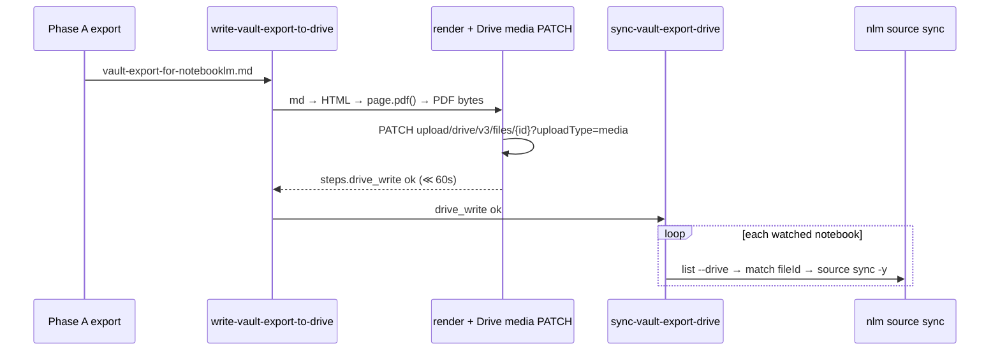

# Story 58.3: Session-close NotebookLM fan-out — switch Drive Doc → PDF source

Status: review

<!-- Ultimate context engine analysis completed — comprehensive developer guide created. -->

Epic: **58** (NotebookLM vault export reliability — reopened for durable write-path fix)  
Tracked in sprint-status as: **`58-3-session-close-notebooklm-pdf-source-fix`**  
Source brief (normative ACs): `_bmad-output/planning-artifacts/brief-session-close-notebooklm-pdf-source-fix.md`

## Story

As the **CNS operator running `/session-close`**,  
I want **the vault export written to NotebookLM as a stable Google Drive PDF (media byte-swap) instead of a native Google Doc body overwrite**,  
so that **drive-sync fan-out succeeds every run** under the ~60 s Hermes command budget as the vault export grows past ~1.5 MB.

## Context

| Topic | Detail |
|-------|--------|
| **Problem** | Every `/session-close` reports `notebooklm: drive-sync — 3 failed (drive_write_error)` for all watched notebooks (~1493 KB each). Continuously mislabeled "known intermittent." |
| **Root cause (measured 2026-07-08)** | Export = **1,519,619 chars / ~1.49 MB**. `overwriteGoogleDocContent` (Docs API `insertText` via `scripts/session-close/lib/google-drive-doc-write.mjs`) takes **~134 s**. Hermes agent command budget ≈ **60 s** → write killed mid-flight → `steps.drive_write` never `ok` → `sync-vault-export-drive.mjs` stamps every target `error_class: drive_write_error`. |
| **Not the cause** | OAuth refresh works (HTTP 200, Drive scope). Stale-token failures from 07-05→07-06 were a **separate already-fixed** issue. Drive media upload of markdown-as-Doc still slow because Google **server-side converts** to native Doc. |
| **Chosen fix** | PDF Drive source. NotebookLM `source_add` `doc_type` enum: `doc \| slides \| sheets \| pdf`. PDF is the only binary → overwrite = raw `uploadType=media` byte-swap (no conversion). |
| **Rejected** | Raising drive-write command budget to 240 s as the durable fix (allowed only as interim **if AC#1 spike proves PDF re-sync fails**). |
| **Deferred work** | Resolves `_bmad-output/implementation-artifacts/deferred-work.md` item "NotebookLM drive-sync 60s write timeout on large exports". |
| **Out of scope** | WatchedSurface / Tier 2 multi-surface — this is **58-2 and remains open/reserved** (per 58-1); this PDF fix does **not** supersede it. No WriteGate / `vault_log_action` / `security.md` changes. Do not edit `AI-Context/AGENTS.md`. |

### Production evidence (do not re-diagnose)

```
notebooklm: drive-sync — 3 failed (drive_write_error)
Untitled (981466f0…): failed — error_class: drive_write_error (1493 KB)
Untitled (dc6abf1a…): failed — error_class: drive_write_error (1493 KB)
Untitled (f037c741…): failed — error_class: drive_write_error (1493 KB)
Drive write timed out (60s budget exceeded) — NLM sync skipped this run. Known intermittent.
```

Existing Doc ID (after uninterrupted diagnostic write 2026-07-08): `1_UbhuhLj1uPcscFy5DdfMJL_W21KlmvfsOCNb3815h4`. Immediate unblock without code: re-run NotebookLM **sync** alone to push already-written Doc content.

### Watched notebooks (migration targets)

| Short ID | Full UUID |
|----------|-----------|
| `981466f0…` | `981466f0-de1c-4551-93a9-f3bc2a24b184` |
| `dc6abf1a…` | `dc6abf1a-99d2-428d-af63-107591ff2c2e` |
| `f037c741…` | `f037c741-f7e1-4a90-880f-d2d38986767b` |

Verified production notebook `981466f0` currently has only `type: "google_docs"` in `drive_sources`.

## Acceptance Criteria

### AC#1 — Spike first, STOP for operator confirmation (HARD GATE)

**Given** production Google OAuth credentials in `~/.hermes/session-close.env`  
**When** the developer spikes PDF Drive-source round-trip **before** deleting/replacing the Docs write path in production session-close  
**Then**:

1. Create a **scratch** test PDF on Google Drive (do not mutate production vault-export Doc/`NOTEBOOKLM_DRIVE_DOC_ID` yet).
2. Add it to a **scratch** NotebookLM notebook via `source_add(source_type=drive, doc_type=pdf, document_id=<pdfFileId>)` (NotebookLM MCP or equivalent `nlm` CLI).
3. Overwrite PDF bytes via Drive `PATCH https://www.googleapis.com/upload/drive/v3/files/{fileId}?uploadType=media` with `Content-Type: application/pdf`.
4. Confirm `source_list_drive` shows the source as Drive-syncable **and capture its exact payload** — specifically the source `type` string and every id-ish field. **This is the real sync-matching dependency:** `match-drive-source.mjs` (`extractDriveDocIdFromSource`) tries five id fields (`drive_doc_id`, `driveDocId`, `drive_file_id`, `file_id`, `document_id`) **and** parses `/document/d/` + `/file/d/` URLs. If a PDF source populates none of those and has `url: null`, ID-matching yields nothing and AC#4 needs a type-based fallback.
   - **SPIKE RESULT (2026-07-08):** PDF sources list as `type: "word_doc"`, `url: null`, `is_stale: true`, with **none** of the five id fields populated. Production Docs remain `type: "google_docs"` + `drive_doc_id`. → AC#4 must add a `word_doc` type fallback (mirroring `matchGoogleDocsSourceFallback`). **Dev: before coding, paste the FULL payload and confirm `file_id`/`document_id` are truly absent (not just `drive_doc_id`) — if either is present, prefer ID-matching over a loose type fallback.**
5. Confirm `source_sync_drive` (or `nlm source sync … -y`) refreshes NotebookLM to the **new** PDF content.
6. Report wall-clock timing for media update + sync, and paste the raw `source_list_drive` payload for the PDF source.

**STOP:** After the spike report, **halt implementation of the production path change** until the operator explicitly confirms proceed.

**If PDF re-sync fails:** stop and report. Only then may propose interim budget raise to **240 s** (band-aid — not the chosen durable fix).

Dev-story MUST leave the Docs `insertText` path intact until this confirmation is recorded in the story Dev Agent Record.

### AC#2 — md→PDF render (extractable text)

**Given** `scripts/output/vault-export-for-notebooklm.md` (~1.5 MB)  
**When** the render step runs  
**Then** it produces a PDF with **extractable text** (not a raster-only image dump)  
**And** uses Playwright/Chromium already available at `~/.cache/ms-playwright` via `page.pdf()` (md → minimal HTML → PDF)  
**And** any `playwright` npm add pin is a stable version **≥ 14 days old** (as of story date: `1.61.1` published 2026-06-23 clears; prefer pin `1.58.2` / `1.61.0+` stable — **never** `1.62.0-alpha-*`)  
**And** Context7 is consulted for Playwright `page.pdf` / launch API **before** coding the renderer.

### AC#3 — Fast upload (well under 60 s)

**Given** a PDF ≈ current export size (~1.5 MB)  
**When** Drive media update overwrites the **same** PDF `fileId` in place  
**Then** the upload completes **well under 60 s**  
**And** OAuth refresh path is reuse of existing `fetchGoogleAccessToken` (already working).

### AC#4 — Sync path accepts PDF Drive sources

**Given** `NOTEBOOKLM_DRIVE_DOC_ID` points at the PDF file ID and notebooks have the PDF as a Drive source  
**When** session-close drive-sync runs after a successful write  
**Then** because the spike proved PDF sources carry no id field and `url: null`, add a **`word_doc` type fallback** alongside the existing `matchGoogleDocsSourceFallback` — try `matchDriveSourceByDocId` first (still correct if any id field ever appears), then `google_docs` type, then `word_doc` type.  
**And** harden the `word_doc` fallback against grabbing the wrong source: anchor it to the export title (`vault-export-for-notebooklm`) rather than matching the first `word_doc` blindly, since during migration a notebook may transiently hold both the old Doc and the new PDF.  
**And** update the "no Drive source matched … add the Doc as a Drive source" error text (add the **PDF**).  
**And** end-to-end reports `fanout_status: ok` with `notebooklm_fanout_mode: drive-sync`.

### AC#5 — Verify gate

**Then** `bash scripts/verify.sh` passes (CNS tests + sibling `cns-dashboard` when present).

### Operator migration (after AC#1 pass + code land — not automated)

1. Host `vault-export-for-notebooklm.pdf` on Drive; set its file ID as `NOTEBOOKLM_DRIVE_DOC_ID` in `~/.hermes/session-close.env`.
2. In each of the three watched notebooks: add the PDF as a Drive source; remove the old `google_docs` source once PDF sync works.
3. Restart `hermes-gateway.service`; run `/session-close`; confirm `fanout_status: ok`.

## Tasks / Subtasks

- [x] **T0 — AC#1 spike (STOP gate)** (AC: #1)
  - [x] Context7: Playwright `page.pdf` + Drive `files.update` media upload (done for story; re-confirm if APIs drift)
  - [x] Render a small test markdown → extractable-text PDF via Playwright/Chromium
  - [x] Upload/create scratch PDF on Drive; add to scratch notebook `doc_type=pdf`
  - [x] Media-update overwrite; `source_list_drive` + `source_sync_drive`; record timings
  - [x] Write spike findings into Dev Agent Record; **STOP and ask operator to confirm before T1+**
- [x] **T1 — PDF render module** (AC: #2) — **only after operator confirms spike**
  - [x] Add `scripts/session-close/lib/render-vault-export-pdf.mjs` (or equivalent): read md → escape/wrap HTML → `chromium.launch` → `page.setContent` → `page.pdf({ path })`
  - [x] Prefer browser binaries under `~/.cache/ms-playwright` (set `PLAYWRIGHT_BROWSERS_PATH` or `executablePath` as needed)
  - [x] Pin `playwright` dependency ≥ 14 days old if added to `package.json`; no package younger than 14 days
  - [x] Unit/integration test: fixture md → PDF buffer/file exists; optional lightweight text-extract smoke (e.g. `%PDF` header + non-trivial size)
- [x] **T2 — Drive PDF media overwrite** (AC: #3)
  - [x] Extend `google-drive-doc-write.mjs` **or** replace with `google-drive-pdf-write.mjs`: `overwriteDrivePdfContent({ fileId, pdfBytes, …oauth })`
  - [x] HTTP: `PATCH https://www.googleapis.com/upload/drive/v3/files/{fileId}?uploadType=media` with `Authorization: Bearer …`, `Content-Type: application/pdf`, body = raw PDF bytes
  - [x] Keep `fetchGoogleAccessToken` + `GOOGLE_OAUTH_SCOPE` reuse
  - [x] Wire `write-vault-export-to-drive.mjs`: render PDF → media upload → patch `steps.drive_write`
  - [x] Update success message (e.g. `drive pdf overwritten`) and tests mocking `fetchFn`
  - [x] **Remove / stop calling** Docs `insertText` path only after AC#1 confirmation
- [x] **T3 — Sync matcher accepts PDF sources** (AC: #4)
  - [x] Update `matchGoogleDocsSourceFallback` in `sync-vault-export-drive.mjs` (~L89–103): also accept NLM PDF Drive source `type` values observed in spike (expect something like `pdf` / `google_drive` / similar — **use live spike list payload**, do not guess exclusively)
  - [x] Keep primary `matchDriveSourceByDocId` (already parses `/file/d/` URLs)
  - [x] Extend `tests/vault-export-drive-sync.test.mjs` fixtures for PDF-type sources + ID match
  - [x] Fix migration-miss message text that still says "add the Doc"
- [x] **T4 — Hermes skill docs + install** (AC: #4)
  - [x] Update `scripts/hermes-skill-examples/session-close/references/drive-export-sync.md` — Doc → PDF, media upload, operator migration
  - [x] Update `fanout-diagnostics.md` `drive_write_error` row wording if needed
  - [x] Bump session-close skill version; `bash scripts/install-hermes-skill-session-close.sh`
  - [x] Mirror must stay parity with `~/.hermes/skills/cns/session-close/` (verify gate)
- [x] **T5 — Deferred-work + verify** (AC: #5)
  - [x] Mark deferred-work timeout item resolved / replaced with this story pointer
  - [x] `bash scripts/verify.sh` green
  - [x] Operator migration checklist in completion notes (env PDF ID + notebook source swap)

## Dev Notes

### HARD GATE — AC#1

```
T0 spike → report timings + sync proof → OPERATOR CONFIRM → then T1–T5
```

Do **not** rip out `overwriteGoogleDocContent` before confirmation. Spike may use a one-off script under `scripts/session-close/` or a temporary branch path; production wiring waits.

### Current code state (READ BEFORE EDIT)

| File | Today | This story |
|------|-------|------------|
| `scripts/session-close/lib/google-drive-doc-write.mjs` | Docs API get + `deleteContentRange` + `insertText` (~134 s on 1.5 MB) | After gate: PDF media `PATCH …?uploadType=media` (reuse OAuth helpers) |
| `scripts/session-close/write-vault-export-to-drive.mjs` | Reads md → `overwriteGoogleDocContent` → `steps.drive_write` | Render PDF from md → media overwrite; still exit 0 on failure (non-blocking) |
| `scripts/session-close/sync-vault-export-drive.mjs` | Requires `steps.drive_write.status === "ok"`; fallback `type === "google_docs"` only | Accept PDF Drive source types in fallback; keep write-ok gate |
| `scripts/session-close/lib/match-drive-source.mjs` | Tries 5 id fields (`drive_doc_id`/`driveDocId`/`drive_file_id`/`file_id`/`document_id`) + parses `/document/d/` & `/file/d/` URLs | Spike proved PDF sources populate none of these (`url: null`) → sync matcher needs a `word_doc` type fallback, not a change here |
| `scripts/hermes-skill-examples/session-close/references/drive-export-sync.md` | Documents Doc overwrite | Document PDF + media upload + migration |
| `tests/vault-export-drive-sync.test.mjs` | Doc fixtures + `drive_write_error` paths | PDF fixtures; assert write mocks use media upload |
| `package.json` | **No** `playwright` dependency | May add pinned stable `playwright` (≥14 days); browsers from `~/.cache/ms-playwright` |

### Preserve (do not break)

- Non-blocking write: `process.exit(0)` on write failure; session-close continues.
- Sync **must not** run unless `steps.drive_write.status === "ok"` (58-1 review patch).
- Legacy `source_add` fan-out when `NOTEBOOKLM_DRIVE_DOC_ID` / OAuth missing (`resolveVaultExportFanoutMode`).
- Dry-run: no Drive write / sync.
- Env loader: process env wins over `~/.hermes/session-close.env`; `NOTEBOOKLM_DRIVE_DOC_ID` name retained (ID now points at PDF file — document in skill refs).
- Full Drive OAuth scope `https://www.googleapis.com/auth/drive` (not `drive.file`).
- Phase A still writes local `vault-export-for-notebooklm.md` only; PDF render is Phase C write-step side effect (or adjacent script).

### Architecture (target)



### Library / API requirements (Context7-backed)

**Playwright** (`/microsoft/playwright`):

```js
import { chromium } from 'playwright';
const browser = await chromium.launch(); // headless default
const page = await browser.newPage();
await page.setContent(html, { waitUntil: 'load' }); // preferred for local HTML
await page.pdf({ path: outPath, format: 'A4' }); // returns Buffer; print CSS media
await browser.close();
```

- `page.pdf()` is Chromium-only and uses print media by default.
- Prefer `tagged: true` if available and cheap (accessible/extractable text) — verify against pinned version options.
- Large HTML (~1.5 MB text): keep CSS minimal (`pre-wrap` / monospace body); avoid loading remote assets.

**Google Drive** (`/websites/developers_google_workspace_drive`):

- Simple upload/update: `uploadType=media` for ≤5 MB (export PDF stays under this).
- **Update existing file:** `PATCH` (not `POST`) to `/upload/drive/v3/files/{fileId}?uploadType=media`.
- Headers: `Authorization: Bearer {accessToken}`, `Content-Type: application/pdf`, body = raw bytes.
- Do **not** use Docs `documents.batchUpdate` for the durable path.
- Do **not** upload markdown with Doc conversion MIME (proven >120 s).

**NotebookLM MCP** (local schema):

- `source_add`: `source_type=drive`, `document_id`, `doc_type=pdf`.
- `source_list_drive` / `source_sync_drive` with `confirm: true` for MCP sync path; production script uses `nlm` CLI (`confirm` via `-y`).

### Package age rule

| Candidate | Published | Verdict (as of 2026-07-08) |
|-----------|-----------|----------------------------|
| `playwright@1.61.1` | 2026-06-23 | OK (~15 days) |
| `playwright@1.61.0` | 2026-06-15 | OK |
| `playwright@1.58.2` | 2026-02-06 | OK (safer pin) |
| `playwright@1.62.0-alpha-*` | daily | **FORBIDDEN** |

Chromium already cached under `~/.cache/ms-playwright` (chromium-1208/1217/1223). Align browser revision with pinned Playwright or set path explicitly.

> ⚠️ **Verify the dates above at pin time.** The version/publish-date rows are auto-generated and unverified — some sit right on the 14-day line. Before adding any `playwright` pin, run `npm view playwright@<version> time` and confirm the chosen version was published **≥ 14 days** before the actual install date. Do not trust the baked-in table. If Chromium is already cached and usable, prefer NOT adding a new `playwright` dependency at all.

### Spec / constitution touchpoints

- Spec-first: `specs/cns-vault-contract/` — no vault WriteGate mutators in this story; session-close operator FS + Drive/NLM only.
- NotebookLM workflow module mentions Drive sources (`Knowledge-Vault-ACTIVE/AI-Context/modules/notebooklm-workflow.md`) — optional one-line doc note in skill refs is enough; **do not** edit vault `AGENTS.md`.
- Mutation/audit: **N/A** (no `vault_log_action`).

### Previous story intelligence (58-1)

- REST Docs overwrite chosen because `@googleapis/mcp-server-drive` 404 on npm — keep REST.
- Review patches that must remain: `drive_source_id` on merge; sync gated on `drive_write === ok`; migration-miss `error_class: unknown`.
- Deferred unit tests for drive-write module — **this story should cover PDF media write with mocked `fetchFn`**.
- Skill install after reference edits: `bash scripts/install-hermes-skill-session-close.sh`.
- Hermes wrappers `hermes-run-write-vault-export-to-drive.sh` / `hermes-run-sync-vault-export-drive.sh` already source `npm-env.sh` — keep them as Phase C entrypoints.

### Git intelligence (recent patterns)

Recent commits favor small, scoped feat commits (`feat(84-3): …`). Suggested commit after verify:

```
fix(session-close): NotebookLM drive sync via PDF media upload (58-3)
```

### Testing requirements

| Case | Expected |
|------|----------|
| Spike (manual) | PDF syncable + content refresh + timings logged |
| Render unit | md fixture → PDF file with `%PDF` magic |
| Media upload mock | `fetchFn` sees `PATCH` + `uploadType=media` + `application/pdf` |
| Sync PDF fixture | `matchDriveSourceByDocId` / updated fallback finds PDF source |
| `drive_write` failed | still `drive_write_error` on all targets; no nlm sync |
| `drive_write` ok | sync runs; `fanout_status: ok` |
| Env missing | skip drive path (unchanged) |
| Skill contract | `drive-export-sync.md` mentions PDF / media upload |

### Anti-patterns (common LLM mistakes)

1. **Skipping AC#1 STOP** — removing Docs path before operator confirmation = story failure.
2. **Raising timeout as the fix** — rejected unless spike proves PDF re-sync impossible.
3. **Uploading `.md` as Drive file / native Doc** — conversion bottleneck returns.
4. **New PDF library** (`puppeteer`, `md-to-pdf`, etc.) without Context7 + age check — use Playwright.
5. **Installing playwright alpha** or any package < 14 days old.
6. **Assuming fallback `type === "google_docs"` works for PDF** — must extend after inspecting live `source_list_drive` payload.
7. **Auto-creating Drive files in production notebooks** during spike — use scratch notebook/file.
8. **Editing `AI-Context/AGENTS.md` directly**.
9. **Claiming done without `bash scripts/verify.sh`**.
10. **Breaking non-blocking exit(0)** on write failure.

### Project structure notes

- Implementation lives under `scripts/session-close/` (+ Hermes skill mirror under `scripts/hermes-skill-examples/session-close/`).
- Output PDF may live beside md under `scripts/output/vault-export-for-notebooklm.pdf` (deterministic path; document in refs).
- No `src/` Vault IO MCP changes expected.

### References

- [Source: `_bmad-output/planning-artifacts/brief-session-close-notebooklm-pdf-source-fix.md`] — normative problem, ACs, migration
- [Source: `_bmad-output/implementation-artifacts/58-1-migrate-vault-export-drive-doc-sync.md`] — architecture, non-blocking write, sync gate
- [Source: `_bmad-output/implementation-artifacts/deferred-work.md` L13] — timeout deferral this story closes
- [Source: `scripts/session-close/lib/google-drive-doc-write.mjs`] — current Docs overwrite
- [Source: `scripts/session-close/write-vault-export-to-drive.mjs`] — write orchestration
- [Source: `scripts/session-close/sync-vault-export-drive.mjs` L89–170] — `google_docs` fallback + sync
- [Source: `scripts/session-close/lib/match-drive-source.mjs`] — 5 id-field candidates + `/document/d/` & `/file/d/` URL parsing; PDF sources match none → needs `word_doc` type fallback
- [Source: `scripts/hermes-skill-examples/session-close/references/drive-export-sync.md`] — operator docs
- [Source: Context7 `/microsoft/playwright` — `Page.pdf`] 
- [Source: Context7 `/websites/developers_google_workspace_drive` — simple upload / PATCH update]
- [Source: NotebookLM MCP `source_add` schema — `doc_type: doc|slides|sheets|pdf`]
- [Source: `project-context.md` — verify gate, Context7, 14-day package rule]

## Dev Agent Record

### Agent Model Used

Composer (Cursor Agent)

### Debug Log References

- Spike script: `scripts/session-close/spike-58-3-pdf-drive-roundtrip.mjs`
- Full spike report: `scripts/output/spike-58-3/spike-report.json`
- Scratch notebook: `ac68c12b-768b-44c9-9475-f10eb0410f05` (safe to delete)
- Scratch Drive PDF fileId: `14030tT1MWtKrUJXNbevL-My8WuPCOGZq`
- Verify: `bash scripts/verify.sh` → **VERIFY PASSED** (2026-07-08)

### Completion Notes List

- Story context generated from brief + 58-1 + live code paths + Context7 Playwright/Drive docs (2026-07-08).
- **Ultimate context engine analysis completed — comprehensive developer guide created.**

#### AC#1 Spike (PASS) + operator proceed

Operator confirmed proceed with **title-anchored `word_doc` fallback**. Pre-code payload reconfirm (CLI + `--full` + `source get`):

```json
{
  "id": "e617733f-991f-40f9-ab5a-b5bd2aefdbcb",
  "title": "CNS-SPIKE-58-3-1783518355580.pdf",
  "type": "word_doc",
  "url": null,
  "is_stale": false
}
```

No `drive_doc_id` / `file_id` / `document_id` in CLI JSON (Drive file id exists only in raw RPC, not in matcher fields) → title-anchored fallback required.

| Step | Wall-clock |
|------|------------|
| Media PATCH | ~2763 ms |
| NLM sync | ~4953 ms |
| Content | V2 present / V1 absent |

#### T1–T5 implemented

- **T1:** `render-vault-export-pdf.mjs` — md → escaped HTML → Playwright `page.pdf({ tagged: true })`; `PLAYWRIGHT_BROWSERS_PATH=~/.cache/ms-playwright`; pin `playwright@^1.58.2` (published 2026-02-06).
- **T2:** `google-drive-pdf-write.mjs` + wire `write-vault-export-to-drive.mjs` to render PDF beside md then `PATCH …?uploadType=media`; success message `drive pdf overwritten`; Docs `insertText` no longer called from write path (helpers kept for OAuth reuse).
- **T3:** Match cascade: `matchDriveSourceByDocId` → `matchGoogleDocsSourceFallback` → `matchWordDocVaultExportFallback` (title `vault-export-for-notebooklm` / `.pdf`); migration-miss text mentions PDF.
- **T4:** Skill refs + `fanout-diagnostics` updated; skill **v1.0.17** installed to `~/.hermes/skills/cns/session-close/`.
- **T5:** deferred-work timeout item marked RESOLVED; verify green.

#### Operator migration checklist (manual — not automated)

1. Host `vault-export-for-notebooklm.pdf` on Drive; keep a stable fileId.
2. Add PDF as Drive source in each watched notebook (`981466f0…`, `dc6abf1a…`, `f037c741…`) titled `vault-export-for-notebooklm`.
3. **Remove old `google_docs` vault-export source before** flipping env (matcher prefers `google_docs` over `word_doc`).
4. Set `NOTEBOOKLM_DRIVE_DOC_ID=<pdf-file-id>` in `~/.hermes/session-close.env`.
5. Restart `hermes-gateway.service`; `/session-close` → expect `fanout_status: ok`, `notebooklm_fanout_mode: drive-sync`.

### File List

- `package.json` / `package-lock.json` (`playwright@^1.58.2` devDependency)
- `scripts/session-close/lib/render-vault-export-pdf.mjs` (new)
- `scripts/session-close/lib/google-drive-pdf-write.mjs` (new)
- `scripts/session-close/write-vault-export-to-drive.mjs`
- `scripts/session-close/sync-vault-export-drive.mjs`
- `scripts/session-close/record-notebooklm-fanout-mode.mjs`
- `scripts/session-close/spike-58-3-pdf-drive-roundtrip.mjs` (spike)
- `scripts/hermes-skill-examples/session-close/SKILL.md` (v1.0.17)
- `scripts/hermes-skill-examples/session-close/references/drive-export-sync.md`
- `scripts/hermes-skill-examples/session-close/references/fanout-diagnostics.md`
- `tests/vault-export-drive-sync.test.mjs`
- `tests/hermes-session-close-skill.test.mjs`
- `_bmad-output/implementation-artifacts/deferred-work.md`
- `_bmad-output/implementation-artifacts/sprint-status.yaml`
- `scripts/output/spike-58-3/*` (spike artifacts)

## Change Log

| Date | Change |
|------|--------|
| 2026-07-08 | Story created (`ready-for-dev`) from PDF-source fix brief (originally 58-2) |
| 2026-07-08 | Verifier corrections: renumbered 58-2 → 58-3; AC#1 ID-field capture; package-age caveat |
| 2026-07-08 | AC#1 spike PASS — PDF media ~2.8s + sync V2; type=`word_doc`, no CLI id fields; STOP for confirm |
| 2026-07-09 | Operator proceed: title-anchored word_doc; T1–T5 landed; skill v1.0.17; verify PASSED; status → review |
