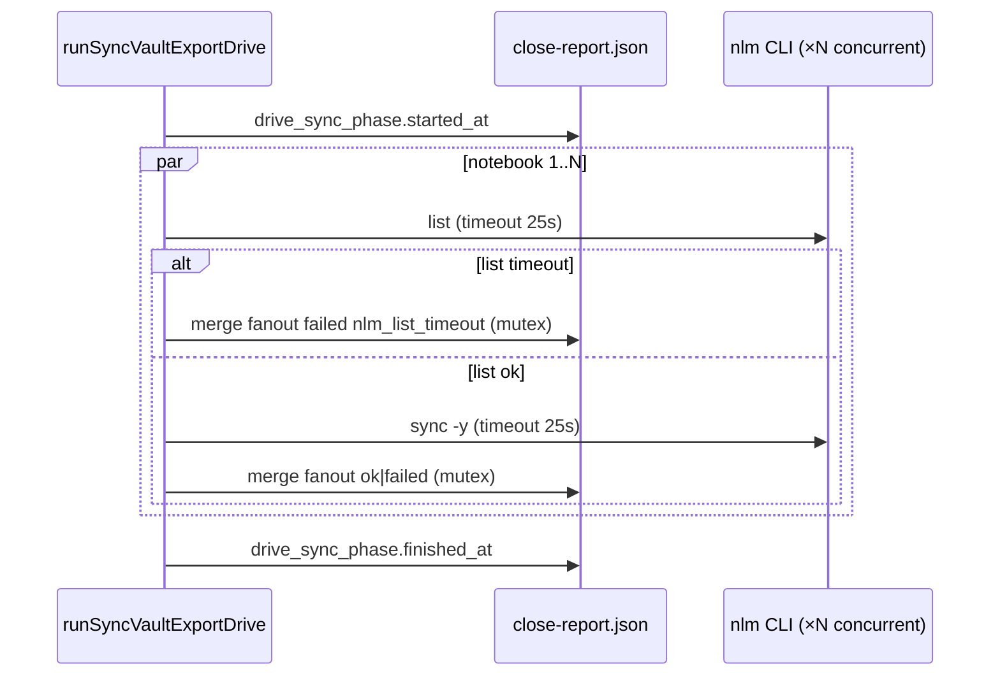

# Story 58.4: Drive-sync phase hardening and diagnostics integrity

Status: done

<!-- Ultimate context engine analysis completed — comprehensive developer guide created. -->

Epic: **58** (NotebookLM vault export Drive sync)  
Tracked in sprint-status as: **`58-4-drive-sync-phase-hardening-and-diagnostics-integrity`**  
Predecessor: **58-3** (PDF write path verified live 2026-07-09; this story fixes the **sync phase** residual)

## Story

As the **CNS operator running `/session-close`**,  
I want **the drive-sync phase to stamp per-notebook `fanout_status` incrementally, bound each `nlm` call with a timeout, run notebooks concurrently, and emit phase start/end markers — and I want unit tests to stop writing fake failures into the real operator drive-sync log**,  
so that **wall-clock kills leave diagnosable partial results, worst-case sync time ≈ slowest notebook (not 3×), and operator diagnostics are trustworthy**.

## Context (verified — do not re-diagnose)

| Topic | Detail |
|-------|--------|
| **Gate fired** | Epic 58 residual decision gate: drive-sync left all 3 `notebooklm_targets` **UNSTAMPED** (no `fanout_status`) on **both** 2026-07-09 and 2026-07-10 closes |
| **Evidence** | `.session-close/close-report.json` (`generated_at` 2026-07-10T06:09:24Z): steps all `ok` + `drive_write` ok, but **zero** `fanout_status` on targets. `merge-notebooklm-fanout.mjs:59` proves a completed sync always stamps — so merge never ran / never finished |
| **RC1** | All-or-nothing merge: `mergeFanoutUpdatesAtPath` runs **once after** the full sequential 3-notebook loop (`sync-vault-export-drive.mjs` ~L323–344). Wall-clock kill → **all** status lost |
| **RC2** | No per-call `timeout` on default `execFileAsync` for `nlm source list` (the slow call; `nlm source sync` is instant/fire-and-forget). Sequential loop triples exposure under the ~90 s Hermes budget |
| **RC3** | No phase start/end marker → killed vs never-invoked is undiagnosable |
| **Separate bug** | `tests/vault-export-drive-sync.test.mjs:538` and `:564` call `runSyncVaultExportDrive` **without** `driveSyncLogPath`; `FIXTURE_NOTEBOOK` (L37) is the **real** production id `981466f0-de1c-4551-93a9-f3bc2a24b184`. `appendDriveSyncFailureLogs` defaults to `~/.hermes/logs/session-close-drive-sync.log` → **382** fake `Google OAuth token refresh failed` entries since 07-03 (confirmed `rg -c` = 382). Already caused one misdiagnosis in `brief-session-close-notebooklm-pdf-source-fix.md` |
| **Out of scope** | Raising the 90 s wall-clock budget (AC1+AC2 make it moot); legacy `source_add` path; WriteGate / `AI-Context` / `security.md` / `vault_log_action`; **58-2** WatchedSurface Tier 2 |
| **Constraints** | Spec-first; `bash scripts/verify.sh` green; small commits; **no new npm packages** |

### Production notebooks (for operator awareness only — never as test fixtures)

| Short | Full UUID |
|-------|-----------|
| `981466f0…` | `981466f0-de1c-4551-93a9-f3bc2a24b184` |
| `dc6abf1a…` | `dc6abf1a-99d2-428d-af63-107591ff2c2e` |
| `f037c741…` | `f037c741-f7e1-4a90-880f-d2d38986767b` |

## Acceptance Criteria

### AC1 — Per-notebook incremental merge

**Given** `steps.drive_write.status === "ok"` and N `notebooklm_targets`  
**When** each notebook's sync attempt completes (ok or failed)  
**Then** that notebook's fan-out row is merged into `.session-close/close-report.json` **immediately** via `mergeFanoutUpdatesAtPath` (single-row or equivalent)  
**And** a wall-clock kill mid-loop leaves already-finished notebooks with `fanout_status` stamped  
**And** failure stderr still goes through `appendDriveSyncFailureLogs` before/with merge (sanitized snippet in report; full stderr in log)

### AC2 — Per-call timeout + concurrent notebooks

**Given** the default `nlm` runner (not a test `runNlm` mock)  
**When** `nlm source list` or `nlm source sync` is invoked  
**Then** `execFile` uses `timeout: ~25000` (ms; constant e.g. `NLM_EXEC_TIMEOUT_MS = 25_000`)  
**And** on expiry the fan-out row gets a **distinct** explicit `error_class`:
  - list timeout → `nlm_list_timeout`
  - sync timeout → `nlm_sync_timeout`
**And** detect timeout like `nlm-auth-watchdog.mjs` `isTimeoutError` (`signal === "SIGTERM"` \| `killed === true` \| `code === "ETIMEDOUT"`)  
**And** the N notebooks run via `Promise.allSettled` (or equivalent) so worst-case wall clock ≈ slowest single notebook, not the sum  
**And** concurrency is safe: `nlm list` is read-only; `nlm sync` is fire-and-forget  
**And** **HARD:** concurrent workers must **serialize** close-report merges (async mutex / merge queue) so read-modify-write of `close-report.json` cannot clobber sibling notebook rows

### AC3 — Drive-sync phase markers

**Given** `runSyncVaultExportDrive` enters the sync path (after write-ok gate)  
**When** the phase starts / finishes  
**Then** close-report gains `drive_sync_phase: { started_at: <ISO>, finished_at?: <ISO> }`  
**And** `started_at` is written **before** notebook work begins  
**And** `finished_at` is written after all notebook attempts settle (success, failure, or timeout)  
**And** a kill after start leaves `started_at` without `finished_at` → diagnosable as mid-phase kill (vs never-invoked)

### AC4 — Test-log isolation + fixture hygiene + one-time cleanup

**Given** any test that touches `appendDriveSyncFailureLogs` / `runSyncVaultExportDrive` / `mergeDriveWriteFailure`  
**Then** every call passes an explicit temp `driveSyncLogPath` (never rely on the default operator path)  
**And** `FIXTURE_NOTEBOOK` is replaced with an **obviously fake** UUID (e.g. `00000000-0000-4000-a000-ffffffffffff`) — never a production notebook id  
**And** a regression test proves exercising the previously-polluting paths leaves `~/.hermes/logs/session-close-drive-sync.log` **untouched** (mtime/size fingerprint or equivalent)  
**And** one-time ops: rotate polluted log → `session-close-drive-sync.log.bak-2026-07-13` and leave a short dated note (in deferred-work or story completion notes) that the 382 fake OAuth lines were test pollution, not live auth failure

### AC5 — Deferred-work + sprint-status

**Then** update `deferred-work.md` "WATCH NEXT SESSION-CLOSE" entry with this corrected diagnosis (all-or-nothing merge + no per-call timeout + sequential ×3 + no phase markers; **not** "just raise 90s") and mark **gate-fired / being-fixed by 58-4**  
**And** `sprint-status.yaml` lists `58-4-drive-sync-phase-hardening-and-diagnostics-integrity` under `epic-58`

### AC6 — Skill-mirror parity + verify

**Then** reference-doc updates land in **both** `scripts/hermes-skill-examples/session-close/` and live `~/.hermes/skills/cns/session-close/` via `bash scripts/install-hermes-skill-session-close.sh`  
**And** bump session-close skill version (currently `1.0.17` → `1.0.18`)  
**And** `bash scripts/verify.sh` stays green (Hermes skill install gate included)

## Tasks / Subtasks

- [x] **T1 — Incremental merge + merge mutex** (AC: #1, #2)
  - [x] Refactor `runSyncVaultExportDrive` sync loop: per notebook → sync → append failure log (if any) → merge **that** update immediately
  - [x] Remove single end-of-loop batch merge as the only stamp path
  - [x] Add in-process async mutex/queue around `mergeFanoutUpdatesAtPath` + phase `patchCloseReport` writes so concurrent workers cannot clobber the report
- [x] **T2 — Timeouts + concurrency** (AC: #2)
  - [x] Constant `NLM_EXEC_TIMEOUT_MS ≈ 25_000`; pass `timeout` into default `execFileAsync` runner in `syncNotebookDriveSource`
  - [x] Wrap list vs sync separately; map timeout → `nlm_list_timeout` / `nlm_sync_timeout` on the returned update (`error_class` explicit — wins over classifier)
  - [x] Reuse timeout detection pattern from `nlm-auth-watchdog.mjs` `isTimeoutError` (export shared helper **or** copy the 3-field check — prefer tiny shared helper only if DRY is clean; do not invent a new package)
  - [x] Drive notebook work with `Promise.allSettled`; return synced count from settled ok rows
- [x] **T3 — Phase markers** (AC: #3)
  - [x] Before notebook work: `patchCloseReport({ drive_sync_phase: { started_at } })` (preserve other fields)
  - [x] After all settle: set `finished_at` (merge into existing `drive_sync_phase` object)
  - [x] Skip markers on early exits (`missing-doc-id`, `export-not-ok`, empty targets) — or document if you stamp a `skipped` reason; prefer **no** phase object on skip paths that never enter sync
  - [x] Drive-write-failure path may omit phase markers (sync never started) — keep current `drive_write_error` behavior
- [x] **T4 — Test isolation + fixtures** (AC: #4)
  - [x] Replace `FIXTURE_NOTEBOOK` with fake UUID
  - [x] Pass `driveSyncLogPath: join(tmp, "session-close-drive-sync.log")` on **every** `runSyncVaultExportDrive` / `appendDriveSyncFailureLogs` call (including L538 / L564 / success path L606)
  - [x] Add regression: fingerprint operator log → run write-fail + ok sync with tmp logs → assert fingerprint unchanged
  - [x] Add unit coverage: (a) incremental stamp survives simulated mid-run (merge after notebook 1 before notebook 2); (b) list timeout → `nlm_list_timeout`; (c) concurrent 3 notebooks all stamped; (d) `drive_sync_phase.started_at` / `finished_at` present
- [x] **T5 — Ops cleanup + docs** (AC: #4, #5, #6)
  - [x] Rotate `~/.hermes/logs/session-close-drive-sync.log` → `.bak-2026-07-13` (shell `mv`; leave empty/new log or let next run create)
  - [x] Update `deferred-work.md` WATCH entry (gate-fired / 58-4)
  - [x] Update `scripts/hermes-skill-examples/session-close/references/drive-export-sync.md` — concurrent sync, 25s per-call timeout, incremental merge, `drive_sync_phase`, new error classes
  - [x] Update `fanout-diagnostics.md` error_class table with `nlm_list_timeout` / `nlm_sync_timeout`
  - [x] Bump `SKILL.md` version → `1.0.18`; run `bash scripts/install-hermes-skill-session-close.sh`
  - [x] `bash scripts/verify.sh`

### Review Findings

- [x] [Review][Patch] Surface rejected concurrent workers instead of returning ok:true with unstamped rows [`scripts/session-close/sync-vault-export-drive.mjs:443`]

## Dev Notes

### Current code state (READ BEFORE EDIT)

| File | Today | This story |
|------|-------|------------|
| `scripts/session-close/sync-vault-export-drive.mjs` | Sequential `for` loop; batch merge at end (~L323–344); `execFileAsync` **no** `timeout` (~L174–178); no phase markers; `appendDriveSyncFailureLogs` defaults to operator log | Concurrent + per-notebook merge + mutex; 25s timeout; `nlm_*_timeout` classes; `drive_sync_phase` |
| `scripts/session-close/merge-notebooklm-fanout.mjs` | `mergeFanoutUpdatesAtPath` read-modify-write entire report; L59 stamps `fanout_status` | **Reuse** — call more often (per notebook); do not change stamp semantics |
| `scripts/session-close/lib/nlm-auth-watchdog.mjs` | Already uses `timeout` + `isTimeoutError` | Pattern to mirror for nlm list/sync |
| `tests/vault-export-drive-sync.test.mjs` | Real notebook UUID; two `runSyncVaultExportDrive` calls omit `driveSyncLogPath` | Fake UUID; always pass tmp log; regression + new ACs |
| `scripts/hermes-skill-examples/session-close/references/drive-export-sync.md` | Sequential per-notebook prose | Concurrent + timeout + phase markers + error classes |
| `~/.hermes/logs/session-close-drive-sync.log` | ~2349 lines / 382 fake OAuth refresh failures | Rotate to `.bak-2026-07-13` once |

### Preserve (do not break)

- Sync **must not** run unless `steps.drive_write.status === "ok"` (58-1 review patch)
- Non-blocking: script `process.exit(0)` on unexpected failure; session-close continues
- Legacy `source_add` when Drive env/OAuth missing (`resolveVaultExportFanoutMode`)
- Dry-run: no Drive write/sync
- Match cascade: `matchDriveSourceByDocId` → `matchGoogleDocsSourceFallback` → `matchWordDocVaultExportFallback` (title-anchored)
- Migration-miss still sets `error_class: "unknown"` when stderr mentions `NOTEBOOKLM_DRIVE_DOC_ID`
- `drive_source_id` / `drive_doc_id` persistence on successful sync
- Hermes wrappers `hermes-run-sync-vault-export-drive.sh` remain the Phase C entrypoint (no PATH rewrite needed unless docs change)

### Target control flow



### Implementation sketch (normative intent, not copy-paste)

```js
const NLM_EXEC_TIMEOUT_MS = 25_000;

// default runner — both list and sync
await execFileAsync(cmd, args, {
  env: nlmEnv,
  encoding: "utf8",
  maxBuffer: 16 * 1024 * 1024,
  timeout: NLM_EXEC_TIMEOUT_MS,
});

// concurrent notebooks + serialized merge
const mergeLock = createAsyncMutex(); // simple promise-chain mutex is enough
await patchCloseReport(reportPath, {
  drive_sync_phase: { started_at: new Date().toISOString() },
});
const settled = await Promise.allSettled(
  notebookIds.map(async (notebookId) => {
    const update = await buildFanoutUpdateForNotebook(...); // includes timeout class
    await appendDriveSyncFailureLogs([update], { logPath: opts.driveSyncLogPath });
    await mergeLock(async () => mergeFanoutUpdatesAtPath(reportPath, [update]));
    return update;
  }),
);
await patchCloseReport(reportPath, {
  drive_sync_phase: {
    started_at, // re-read or keep in locals
    finished_at: new Date().toISOString(),
  },
});
```

> **Node docs (Context7 `/nodejs/node`):** `execFile` options include `timeout` (ms, default `0`) and `killSignal` (default `'SIGTERM'`). On timeout the child is killed; promisified rejection includes the error (often `killed: true`, `signal: 'SIGTERM'`, and/or `code: 'ETIMEDOUT'`). Mirror watchdog detection — do not rely on message-string matching alone.

### Anti-patterns (LLM foot-guns)

1. **Batch merge only at end** — recreates UNSTAMPED kill failure  
2. **`Promise.allSettled` without merge mutex** — last writer wins; lost stamps under concurrency  
3. **Raising the 90 s Hermes budget** as the fix — **out of scope / rejected**  
4. **Timeout only on sync** — list is the slow call; both need timeout  
5. **Omitting `driveSyncLogPath` in any test** — will re-pollute operator log  
6. **Keeping production UUID as fixture** — forbids AC4  
7. **Editing only live `~/.hermes/skills/...`** without repo mirror (or vice versa) — breaks verify skill gate  
8. **New npm packages** / WriteGate / AGENTS.md edits  
9. **Claiming done without `bash scripts/verify.sh`**  
10. **Re-diagnosing** the 07-09/07-10 UNSTAMPED evidence — treat as given

### Spec / constitution

- Session-close operator FS + nlm CLI only — **no** Vault IO mutators, **no** WriteGate, **no** `vault_log_action`
- Skill docs are operator-facing contract; keep Discord template report-driven (no raw stderr)

### Previous story intelligence (58-3)

- PDF media write path is live and correct — **do not** revisit Docs `insertText` or PDF render
- Skill install after reference edits: `bash scripts/install-hermes-skill-session-close.sh`
- Review invariants from 58-1 that still hold: sync gated on `drive_write === ok`; `drive_source_id` on merge; migration-miss `unknown`
- Deferred unit-test gap for drive-write module is unrelated — leave alone

### Git intelligence

- Last drive-sync commit: `f013c58 fix(session-close): NotebookLM drive sync via PDF media upload (58-3)`
- Prefer small scoped commits, e.g. `fix(session-close): harden drive-sync phase + isolate test logs (58-4)`

### Testing requirements

| Case | Expected |
|------|----------|
| Mid-run kill simulation | After notebook-1 merge, report has `fanout_status` on nb1; nb2 still unstamped until its merge |
| `nlm_list_timeout` | Mock/runner throws timeout-shaped error on list → `error_class: nlm_list_timeout` |
| `nlm_sync_timeout` | List ok; sync times out → `nlm_sync_timeout` |
| Concurrent 3 notebooks | All three stamped; no lost rows under parallel merges |
| `drive_sync_phase` | `started_at` + `finished_at` ISO strings after full run |
| Drive write failed | Still `drive_write_error`; still requires tmp `driveSyncLogPath` |
| Operator log fingerprint | Unchanged after suite paths that previously polluted it |
| Fixture id | Not equal to any production notebook UUID |
| Skill contract | Refs mention timeout / concurrent / phase markers; verify gate green |

### Project structure notes

- Implementation: `scripts/session-close/sync-vault-export-drive.mjs` (+ tests + skill refs)
- Optional tiny shared `isTimeoutError` export from watchdog or a new `lib/exec-timeout.mjs` — keep minimal
- No `src/` Vault IO MCP changes

### References

- [Source: operator diagnosis 2026-07-13 — UNSTAMPED targets + test log pollution] — normative problem statement for this story
- [Source: `_bmad-output/implementation-artifacts/deferred-work.md` — WATCH NEXT SESSION-CLOSE] — gate entry to rewrite
- [Source: `_bmad-output/implementation-artifacts/58-3-session-close-notebooklm-pdf-source-fix.md`] — predecessor; write path OK
- [Source: `_bmad-output/implementation-artifacts/58-1-migrate-vault-export-drive-doc-sync.md`] — drive-sync architecture + non-blocking invariants
- [Source: `scripts/session-close/sync-vault-export-drive.mjs` L174–178, L323–344] — missing timeout + all-or-nothing merge
- [Source: `scripts/session-close/merge-notebooklm-fanout.mjs` L58–59] — stamp proof
- [Source: `scripts/session-close/lib/nlm-auth-watchdog.mjs` L131–137, L169–173] — timeout + detection pattern
- [Source: `tests/vault-export-drive-sync.test.mjs` L37, L538, L564] — pollution sources
- [Source: Context7 `/nodejs/node` — `child_process.execFile` `timeout` / `killSignal`]
- [Source: `project-context.md` — verify gate, skill mirror, no packages < 14 days (N/A — no new pkgs)]

## Dev Agent Record

### Agent Model Used

Composer (Cursor agent router)

### Debug Log References

- Context7 `/nodejs/node`: `execFile` `timeout` (ms) + default `killSignal` SIGTERM; timeout-shaped rejection via `killed` / `signal` / `ETIMEDOUT`
- Ops: rotated `~/.hermes/logs/session-close-drive-sync.log` → `.bak-2026-07-13` (382 fake OAuth lines confirmed)

### Completion Notes List

- Incremental per-notebook merge under `createAsyncMutex`; concurrent `Promise.allSettled` for N notebooks
- Default `nlm` runner uses `NLM_EXEC_TIMEOUT_MS = 25_000`; exported `isTimeoutError` from watchdog; explicit `nlm_list_timeout` / `nlm_sync_timeout`
- `drive_sync_phase`: `started_at` before work; `finished_at` merged into existing phase object (preserves started_at); omitted on skip / drive-write-fail paths
- AC4 regression uses sandboxed `opts.env.HOME` (never fingerprints real operator HOME); all tests pass explicit `driveSyncLogPath` or sandboxed env; fake fixture UUID
- Skill mirror 1.0.18 installed; deferred-work WATCH rewritten (gate-fired / 58-4); `bash scripts/verify.sh` PASS
- Code review patch: stamp-before-append + surface `partial-merge-failed` when a concurrent worker rejects (35/35 drive-sync tests)

### File List

- `scripts/session-close/sync-vault-export-drive.mjs`
- `scripts/session-close/lib/nlm-auth-watchdog.mjs`
- `tests/vault-export-drive-sync.test.mjs`
- `scripts/hermes-skill-examples/session-close/SKILL.md`
- `scripts/hermes-skill-examples/session-close/references/drive-export-sync.md`
- `scripts/hermes-skill-examples/session-close/references/fanout-diagnostics.md`
- `_bmad-output/implementation-artifacts/deferred-work.md`
- `_bmad-output/implementation-artifacts/sprint-status.yaml`
- `_bmad-output/implementation-artifacts/58-4-drive-sync-phase-hardening-and-diagnostics-integrity.md`

## Change Log

| Date | Change |
|------|--------|
| 2026-07-13 | Story created (`ready-for-dev`) — gate-fired residual + test-log integrity |
| 2026-07-13 | Implemented 58-4: concurrent+timeout sync, incremental merge, phase markers, test isolation, skill 1.0.18 → `review` |
| 2026-07-13 | Code review: stamp-before-append + `partial-merge-failed` on worker reject → `done` |
