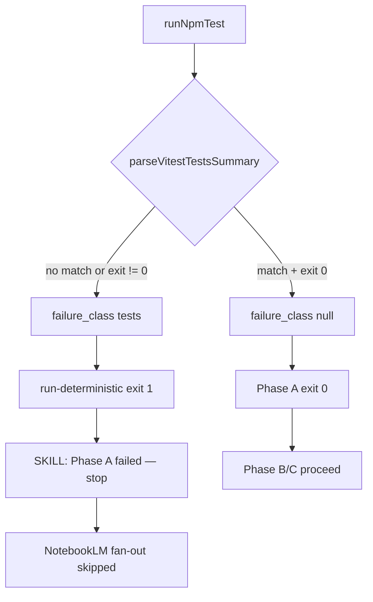

# Story 59.2: Fix session-close tests always reporting FAILED

Status: review

<!-- Ultimate context engine analysis completed — comprehensive developer guide created. -->

Epic: **59** (Session-close runtime context reduction — operator brief 2026-06-03)  
Tracked in sprint-status as: **`59-2-fix-session-close-tests-failure`**

## Story

As the **CNS operator running `/session-close`**,  
I want **Phase A test capture to reflect real `npm test` success**,  
so that **`close-report.json` shows an accurate passing count, `failure_class` stays null when tests pass, and Phase C NotebookLM fan-out is not blocked by a false `failure_class: tests`**.

## Problem statement

| Symptom | Impact |
|---------|--------|
| Every real `/session-close` ends with `failure_class: tests` | `run-deterministic.mjs` exits **1**; Hermes SKILL treats Phase A as failed |
| `close-report.json` shows `deterministic.tests: "FAILED (see session-close log)"` | `AUTO:TESTS` and MEMORY CNS State show FAILED despite green local runs |
| Phase C skipped | SKILL.md: *"If Phase A fails, stop"* — NotebookLM fan-out never runs |
| Operator runs `npm test` manually | **642 tests**, exit **0**; stdout contains `Tests  642 passed (642)` |

### Root cause (investigate — do not guess)

`parseVitestTestsSummary` in `scripts/session-close/run-deterministic.mjs` (lines ~415–421) combines `stdout + stderr` and matches:

```javascript
/Tests\s+(\d+)\s+passed/
```

Only when **`exitCode === 0` AND regex matches** does it return `{ tests: "N passing", failureClass: null }`. Otherwise it sets `failureClass: "tests"`.

`runNpmTest` (lines ~543–560) runs:

```bash
source scripts/session-close/lib/npm-env.sh && npm test
```

via `execFileAsync("bash", ["-c", cmd], { cwd: OMNIPOTENT_INSTALL_ROOT, env, maxBuffer: 16MB })`.

**Known-good locally (2026-06-03):** Reproducing `execFileAsync` + `parseVitestTestsSummary` in the repo returns `{"tests":"642 passing","failureClass":null}`. The bug is likely **Hermes / minimal-PATH / env divergence**, not the regex alone — but the fix must make capture reliable in production.

**Deferred-work note:** Story 48-2 review explicitly deferred "Vitest summary regex is format-specific" — this story **closes** that deferral for the operator-blocking false failure.

### Downstream effects (must verify after fix)



## Acceptance Criteria

### 1. Correct test summary on passing run (AC: report)

**Given** `npm test` exits 0 in the same environment Phase A uses (Hermes terminal / `hermes-run-session-close.sh`)  
**When** `node scripts/session-close/run-deterministic.mjs` runs a **real** close (not `--dry-run`)  
**Then** `.session-close/close-report.json` has:

- `failure_class: null` (or absent / JSON null)
- `deterministic.tests` matching `^\d+ passing$` (e.g. `"642 passing"`)
- `steps.tests.status: "ok"`
- `steps.tests.message` equal to the passing summary string

### 2. Phase A gate and process exit (AC: gate)

**When** tests pass per AC-1  
**Then** `run-deterministic.mjs` writes `session-close: deterministic phase complete` and exits **0**  
**And** `evaluatePhaseACompletion` returns `PASSED` (no `failure_class: tests` blocker)

### 3. NotebookLM fan-out unblocked (AC: parity)

**Given** export and other Phase A steps succeed  
**When** operator runs full `/session-close` after fix  
**Then** Hermes proceeds to Phase C per `SKILL.md` (not stopped solely by false `failure_class: tests`)  
**And** close-report records fan-out attempts (drive-sync or legacy) — not skipped because Phase A falsely failed

### 4. True failures still detected (AC: regression)

**When** `npm test` exits non-zero  
**Then** `failure_class: tests` is set, `deterministic.tests` is `FAILED (see session-close log)`, `steps.tests.status: failed`  
**And** prior completed Phase A steps remain (partial-close policy unchanged — Story 48-2)

**When** exit code is 0 but output lacks a parseable vitest summary  
**Then** still set `failure_class: tests` (do not silently pass)

### 5. Tests and verify gate (AC: verify)

**When** shipped  
**Then**:

- Unit tests cover hardened parser edge cases (ANSI, last-match, CI reporter) in `tests/session-close-pipeline.test.mjs`
- At least one test uses **fixture stdout** from `execFileAsync` capture (committed under `tests/fixtures/session-close/` if needed) so regex drift is caught in CI
- Optional: integration test runs `runNpmTest` under **minimal `PATH`** (no pre-set nvm) to assert `npm-env.sh` prelude works
- `npm test` and `bash scripts/verify.sh` green

### 6. Operator smoke (AC: smoke)

**When** fix is deployed  
**Then** operator runs one real `/session-close` in `#hermes` and confirms Discord / close-report show passing tests and `failure_class` none  
**And** Dev Agent Record notes observed `deterministic.tests` value

## Tasks / Subtasks

- [x] **T1 — Reproduce capture mismatch** (AC: 1)
  - [x] Run `hermes-run-session-close.sh` (no dry-run) or instrument `runNpmTest` to write last 4KB of combined output to a temp file on parse failure
  - [x] Compare captured bytes vs interactive `npm test` (Hermes PATH, `OMNIPOTENT_REPO`, node version)
  - [x] Record findings in Dev Agent Record (exit code, whether vitest summary line present, truncation)

- [x] **T2 — Harden parser and capture** (AC: 1, 4)
  - [x] Fix root cause in `parseVitestTestsSummary` and/or `runNpmTest` (see Dev Notes)
  - [x] Preserve partial-close policy; do not reorder Phase A steps

- [x] **T3 — Regression tests** (AC: 5)
  - [x] Extend `tests/session-close-pipeline.test.mjs`
  - [x] Add fixture-based test if Hermes capture artifact available

- [x] **T4 — Verify + operator smoke** (AC: 2, 3, 6)
  - [x] `bash scripts/verify.sh`
  - [ ] Real close smoke; confirm NotebookLM phase runs *(pending operator — run `/session-close` in #hermes after deploy)*

## Dev Notes

### Architecture compliance

- **Normative:** `_bmad-output/planning-artifacts/architecture-session-close-fr17-19.md` (Phase A deterministic layer, SC-2).
- **Do not change:** WriteGate, Vault IO, AGENTS sync semantics, Phase B token gate, Epic 59-1 slim LLM path (`section8-input.json`, render-discord-reply).
- **Do not reorder** export / fast-scan / tests / memory / rhythm without operator approval.

### Files to read before editing (UPDATE)

| File | Today | Change |
|------|-------|--------|
| `scripts/session-close/run-deterministic.mjs` | `parseVitestTestsSummary`, `runNpmTest`, `buildCloseReport`, pipeline sets `failureClass` from test result | Fix capture/parser; optional debug snippet on parse failure |
| `scripts/session-close/lib/npm-env.sh` | Prepends nvm node to PATH | Verify under Hermes minimal PATH; align with `hermes-run-session-close.sh` hardcoded node if needed |
| `scripts/session-close/hermes-run-session-close.sh` | Exports `PATH=~/.nvm/.../v24.14.0/bin:...` before `node run-deterministic.mjs` | Ensure child `bash -c npm test` inherits node/npm |
| `tests/session-close-pipeline.test.mjs` | Unit tests for parser (609 passed fixture only) | Add 642-line fixture, ANSI, last-match, minimal PATH spawn |
| `scripts/session-close/lib/update-memory-cns-state.mjs` | Reads `deterministic.tests` for MEMORY | No change expected — consumes fixed report |
| `scripts/session-close/lib/phase-a-completion-gate.mjs` | Fails on `failure_class: pipeline` only | **No change** — `tests` failure blocks via exit code 1, not gate JSON |

### Investigation checklist (ordered)

1. **Exit code:** On false failure, is `npm test` actually non-zero inside `execFileAsync`? (OOM, missing `node`, missing `vitest` in PATH without `npm-env.sh`.)
2. **Output shape:** Is vitest summary missing in non-TTY/CI mode? (Test with `CI=true`, `TERM=dumb`, empty `PATH` + source `npm-env.sh`.)
3. **Truncation:** Is combined output > `maxBuffer` (16MB)? (Unlikely today ~47KB; log `stdout.length + stderr.length` on failure.)
4. **ANSI / unicode:** Strip `\x1b\[[0-9;]*m` before regex if capture includes color codes.
5. **Wrong summary line:** Node `--test` prints `# tests N` / `ℹ fail 0` — ensure parser targets **vitest** footer `Tests N passed`, prefer **last** match in combined output.
6. **Repo split:** `OMNIPOTENT_INSTALL_ROOT` vs `OMNIPOTENT_REPO` — `runNpmTest` uses install root `cwd`; confirm Hermes `OMNIPOTENT_REPO` matches install tree (48-2 contract).

### Suggested fix patterns (pick minimal correct fix)

- **Strip ANSI** then apply regex on combined output.
- **`matchAll` / last match:** `/Tests\s+(\d+)\s+passed/g` — use final match (vitest summary is last).
- **Secondary pattern:** `Test Files\s+(\d+)\s+passed` only as corroboration, not sole signal (files ≠ test cases).
- **Env:** Pass explicit `env` into `runNpmTest` that merges `npm-env.sh` PATH into `process.env` **before** spawn (duplicate prelude in Node if `source` in bash is fragile under Hermes).
- **Diagnostics (dev only):** On parse failure with exit 0, append last 8 lines of combined output to `steps.tests.message` or `deterministic.tests_debug` — remove or gate behind env flag before merge if operator-visible noise is unwanted.

**Anti-pattern:** Do not treat `verify.sh` success as substitute for parsing — session-close runs **`npm test` only**, not dashboard tests.

### `npm test` composition (reference)

From `package.json`:

```json
"test": "npm run -s test:node && npm run -s test:vitest"
```

- `test:node` — `node --test tests/*.test.mjs` (includes session-close pipeline tests)
- `test:vitest` — `vitest run --config vitest.config.ts` (emits `Tests  N passed`)

Parser must succeed when **both** succeed; vitest summary is the parse target.

### Testing requirements

- Extend `tests/session-close-pipeline.test.mjs` — do not create parallel parser modules.
- Fixtures: `tests/fixtures/session-close/` (optional `npm-test-capture-hermes.txt` if operator provides failing capture).
- Merge gate: `bash scripts/verify.sh`.

### WriteGate / security

- No WriteGate or `vault_log_action` changes.
- Do not commit secrets from close-report debug fields.

## Previous story intelligence

| Story | Relevant learning |
|-------|-------------------|
| **48-2** | Introduced `parseVitestTestsSummary` + `npm-env.sh`; deferred regex brittleness — **this story resolves**. |
| **48-2** | Partial close: test failure sets `failure_class` but does not roll back export/fast-scan. |
| **59-1** | Slim LLM path shipped; Phase A orchestrator unchanged for tests — do not break 59-1 token fixtures. |
| **53-1** | Pattern: merge sidecar fields without clearing existing `failure_class` — tests for nlm_auth preservation. |

## Git intelligence

Recent session-close commits:

- `dc60aa4` — feat(session-close): slim LLM path (59-1)
- `c434f01` / `90fbb2b` — 58-1 drive sync fixes (test failures in review)
- `1f5ae3d` — 58-1 drive export migration

Constitution §8 still lists "Investigate tests failure in session-close deterministic phase" — remove or reword on successful operator smoke (via session-close §8 apply, not direct AGENTS edit).

## Project context reference

- Constitution: `specs/cns-vault-contract/AGENTS.md` §8 priority #2 documents this bug.
- Deferred: `_bmad-output/implementation-artifacts/deferred-work.md` (48-2 vitest regex deferral).
- Operator guide: `Knowledge-Vault-ACTIVE/03-Resources/CNS-Operator-Guide.md` §15.4 (session-close).
- Epic 59-1: `_bmad-output/implementation-artifacts/59-1-session-close-context-reduction.md`.

## References

- [Source: operator brief 2026-06-03 — Epic 59 / Story 59-2]
- [Source: `scripts/session-close/run-deterministic.mjs` — `parseVitestTestsSummary`, `runNpmTest`]
- [Source: `_bmad-output/implementation-artifacts/48-2-session-close-deterministic-orchestrator.md`]
- [Source: `_bmad-output/implementation-artifacts/deferred-work.md` — 48-2 vitest regex]
- [Source: `scripts/hermes-skill-examples/session-close/SKILL.md` — Phase A fail-stop]
- [Source: `tests/session-close-pipeline.test.mjs`]

## Dev Agent Record

### Agent Model Used

Composer (dev-story)

### Debug Log References

T1 reproduction (2026-06-03):

| Scenario | exit | stdout+stderr | vitest line | parse (before fix) |
|----------|------|---------------|-------------|-------------------|
| `execFileAsync` + full env | 0 | ~46KB | `Tests  642 passed (642)` present | 642 passing |
| `env -i HOME=… PATH=/usr/bin:/bin` + npm-env.sh | 0 | ~46KB | present | 642 passing |
| `CI=true TERM=dumb` minimal PATH | 0 | ~46KB | present | 642 passing |

**Confirmed parser bugs (unit repro, not env):**

- `Tests\x1b[1m  642 passed` → **FAILED** (ANSI between label and count breaks `\s+(\d+)`)
- Two `Tests N passed` lines → first match (609) wins instead of vitest footer (642)

No truncation observed (combined output ≪ 16MB maxBuffer).

### Completion Notes List

- Added `stripAnsi`, `resolveNpmTestEnv`, hardened `parseVitestTestsSummary` (ANSI strip + last `Tests N passed` match).
- `runNpmTest` now merges `npm-env.sh` PATH into spawn env before `bash -c npm test`.
- Regression tests: ANSI mid-line, last-match, 642 fixture, minimal-PATH env resolution.
- `bash scripts/verify.sh` green (645 node tests + 642 vitest + lint + dashboard).
- **AC-6 operator smoke pending:** Chris should run one real `/session-close` in #hermes and confirm `deterministic.tests: "642 passing"`, `failure_class: null`, Phase C fan-out proceeds.

### File List

- `scripts/session-close/run-deterministic.mjs`
- `tests/session-close-pipeline.test.mjs`
- `tests/fixtures/session-close/npm-test-capture-vitest-642.txt`

## Change Log

| Date | Change |
|------|--------|
| 2026-06-03 | Story 59-2 created from operator brief — false `failure_class: tests` blocks clean close |
| 2026-06-03 | Harden vitest summary parser (ANSI + last-match); resolve npm PATH before spawn; regression tests + fixture |
