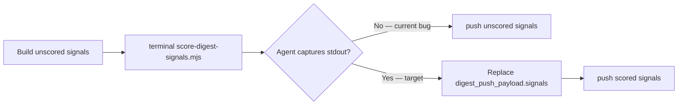

# Story 64.8: Fix scoring pipeline push threading

Status: done

<!-- Ultimate context engine analysis completed — comprehensive developer guide created. -->

## Story

As a **CNS operator relying on Nexus intelligence ranking**,
I want **the morning-digest Hermes agent to capture `score-digest-signals.mjs` stdout and thread the scored `signals[]` into `DIGEST_PUSH_JSON` before Convex push**,
so that **production digest runs store `rank`, `rankScore`, `disposition`, and all five dimension `scores` — not legacy unscored section-order signals that omit scoring fields**.

## Context

| Topic | Detail |
|-------|--------|
| **Epic** | Epic 64: Intelligence Scoring Engine v1 — **64-8 is a post-64-5 hotfix** (epic retro action; closes live pipeline gap) |
| **Repo** | **Omnipotent.md only** — task-prompt + tests; **no** `score-digest-signals.mjs` logic changes unless regression found; **no** cns-dashboard changes |
| **Predecessors** | **64-5** (orchestrator + CLI + task-prompt scoring step); **64-1** (Convex schema + push passthrough test) |
| **Root cause** | 64-5 documents a scoring `terminal(...)` call and says "Parse stdout as a JSON array", but does **not** use the same imperative capture pattern as Sources 1–6 (`Parse stdout JSON` → assign variable → mutate pipeline state). Hermes agents run the scoring terminal then **reuse pre-scoring `digest_push_payload.signals`** when building `DIGEST_PUSH_JSON`, so Convex receives unscored signals (legacy `rank` from section index, no `rankScore` / `scores` / `disposition`). |
| **Out of scope** | `computeRankScore` / dimension formula changes; `DIGEST_NOVELTY_HISTORY_JSON` Convex read wiring (epic-64 retro T1); `push-digest-convex.mjs` passthrough logic (already correct per 64-1); cns-dashboard UI; WriteGate / vault mutations |

### Problem (observed behavior)



**64-5 assumed** step 2 in "After terminal returns" was sufficient. **Live Hermes runs** treat scoring as fire-and-forget like push — terminal fires, agent does not bind stdout to `digest_push_payload.signals` before `JSON.stringify(digest_push_payload)`.

### What already works (do not reimplement)

| Component | State |
|-----------|-------|
| `score-digest-signals.mjs` CLI | Writes scored JSON array to **stdout**; exit 0; §9 degraded passthrough on failure |
| `push-digest-convex.mjs` | Passthrough `{ ...signal }` to `addDigestSignal` — test `passes scored signal fields through` green |
| `scoreDigestSignals` orchestrator | Sort by `rankScore`, assign `rank` 1..N, populate all scoring fields |
| Unit tests | `morning-digest-score-signals.test.mjs` CLI + orchestrator coverage |

**This story fixes the orchestration contract in `task-prompt.md` (and skill mirror) plus adds an end-to-end fixture test proving score stdout → push payload threading.**

## Acceptance Criteria

### 1. Explicit stdout capture contract in task-prompt (AC: Hermes threading)

**Given** `scripts/hermes-skill-examples/morning-digest/references/task-prompt.md` §9 "Score signals before push"
**When** the dev agent updates the scoring step
**Then** documentation **immediately after** the scoring `terminal(...)` block requires this **non-optional** sequence (mirror Source 6 pick/query stdout patterns):

1. **Capture** the scoring terminal's **stdout** (trim whitespace; ignore stderr except for observability).
2. **Parse** stdout as JSON: `scored_signals = JSON.parse(<stdout>)`.
3. **Validate** `Array.isArray(scored_signals) && scored_signals.length > 0`.
4. On valid parse with non-empty array → **`digest_push_payload.signals = scored_signals`** (replace entire array; do not merge).
5. **Only after step 4** (or degraded fallback below) may the agent call `JSON.stringify(digest_push_payload)` for `DIGEST_PUSH_JSON` in the push terminal.

**And** documentation includes an explicit **anti-pattern** line: *Do not pass pre-scoring `digest_push_payload.signals` to `push-digest-convex.mjs` when scoring stdout parsed successfully.*

**And** degraded mode (architecture §9) remains documented: on empty stdout, invalid JSON, or `[]` from scoring → keep unscored signals and push anyway (fire-and-forget).

**And** wording uses imperative assignment (`scored_signals`, `digest_push_payload.signals = ...`) — not passive "parse stdout" without variable binding.

### 2. Push step ordering invariant (AC: pipeline order)

**Given** the updated task-prompt
**When** an agent follows §9
**Then** the documented order is fixed:

```
build digest_push_payload (unscored signals)
  → scoring terminal
  → capture stdout → replace signals
  → push terminal (DIGEST_PUSH_JSON uses post-scoring payload)
  → keyword candidates terminal (same post-scoring payload)
```

**And** `DIGEST_PUSH_JSON` in the push command must reference the payload **after** signal replacement, not a stale copy from before scoring.

### 3. SKILL.md mirror (AC: skill-level guardrail)

**Given** `scripts/hermes-skill-examples/morning-digest/SKILL.md`
**When** this story completes
**Then** the inline task contract or pitfalls section states that scoring stdout **must** replace `digest_push_payload.signals` before either Convex push
**And** version bump per existing convention if skill body changes (currently `1.4.1`)

### 4. End-to-end fixture test: score stdout → push payload (AC: regression lock)

**Given** a fixture of **unscored** `digest_push_payload` with at least two signals including one HN signal with `sourceMetadata.points` / `commentCount`
**When** a test runs the production pipeline shape:

1. `execFile('node', [score-digest-signals.mjs], { env: { DIGEST_SIGNALS_JSON, DIGEST_RUN_AT, ... } })`
2. `scored_signals = JSON.parse(stdout.trim())`
3. `payload.signals = scored_signals`
4. `pushDigestToConvex({ env: { DIGEST_PUSH_JSON: JSON.stringify(payload) }, fetchFn: mock })`

**Then** at least one `addDigestSignal` mutation call includes:

| Field | Requirement |
|-------|-------------|
| `rank` | number (1..N from scoring sort) |
| `rankScore` | number 0–100 |
| `disposition` | one of `priority` \| `watch` \| `ignore` \| `escalate` |
| `scores` | object with **all five** keys: `relevance`, `personalRelevance`, `novelty`, `momentum`, `urgency` (each number 0–100) |

**And** test lives in `tests/` (new `morning-digest-score-push-pipeline.test.mjs` **or** extend `morning-digest-push-convex.test.mjs` — prefer dedicated file if >1 case)
**And** test does **not** call live Convex HTTP

### 5. Task-prompt documentation test (AC: contract lock)

**Given** `tests/hermes-morning-digest-skill.test.mjs`
**When** this story completes
**Then** a new or extended test asserts the post-post §9 section includes **all** of:

- `scored_signals` (or equivalent explicit assignment variable name documented in task-prompt)
- `digest_push_payload.signals =` (assignment, not passive mention only)
- anti-pattern wording against using pre-scoring signals when scoring succeeded
- `JSON.parse` + stdout capture language adjacent to scoring terminal block

### 6. Scope boundary and verify gate (AC: verify)

**Given** implementation complete
**When** inspecting diffs
**Then** `score-digest-signals.mjs` dimension formulas and `push-digest-convex.mjs` passthrough loop are **unchanged** unless a regression test proves a bug
**And** `bash scripts/install-hermes-skill-morning-digest.sh` run after task-prompt / SKILL edits
**And** `bash scripts/verify.sh` green (Omnipotent.md `npm test` + sibling cns-dashboard when present)

## Tasks / Subtasks

- [x] **T1** Strengthen `task-prompt.md` §9 scoring stdout threading (AC: 1, 2)
  - [x] Add imperative capture block after scoring `terminal(...)` (variable `scored_signals`, assignment to `digest_push_payload.signals`)
  - [x] Add explicit anti-pattern: do not push pre-scoring signals when scoring stdout valid
  - [x] Clarify push + §10 reuse **post-scoring** `digest_push_payload`
  - [x] Optional: add one-line comment in `digest_push_payload` example noting scores appear after scoring step
- [x] **T2** Update `SKILL.md` mirror (AC: 3)
  - [x] Pitfalls or inline contract: scoring stdout replaces signals before push
  - [x] Bump `version:` if body changes
- [x] **T3** Add end-to-end score→push fixture test (AC: 4)
  - [x] CLI exec → parse stdout → assign → mock `pushDigestToConvex`
  - [x] Assert `rank`, `rankScore`, `disposition`, five `scores` keys on mutation args
- [x] **T4** Extend `hermes-morning-digest-skill.test.mjs` (AC: 5)
  - [x] New test case for explicit threading language in §9
- [x] **T5** Hermes skill sync + verify gate (AC: 6)
  - [x] `bash scripts/install-hermes-skill-morning-digest.sh`
  - [x] `bash scripts/verify.sh`

## Dev Notes

### Architecture compliance (normative)

| ADR / Section | Requirement for 64-8 |
|---------------|---------------------|
| ADR-E64-001 | No Convex-side scoring — threading fix is prompt/test only |
| ADR-E64-002 | `rankScore` SSOT for order; `rank` reflects post-sort position — must reach Convex |
| §9 (architecture) | Scoring failure → unscored push OK; **scoring success → scored push required** |
| FR-14 | Pre-scored `DIGEST_PUSH_JSON` — this story ensures Hermes actually produces it |

### Current file state — what to change

#### `task-prompt.md` §9 (UPDATE — primary deliverable)

**Today (64-5):** Scoring terminal block exists; "After terminal returns" lists parse + replace but lacks imperative Hermes-agent steps comparable to Source 6:

```450:453:scripts/hermes-skill-examples/morning-digest/references/task-prompt.md
**After terminal returns:**

1. Parse stdout as a JSON array. On valid parse → replace `digest_push_payload.signals` with the scored array (sorted by `rankScore` desc, `rank` 1..N).
2. On scoring failure, empty stdout, or invalid JSON → **continue with unscored signals** (architecture §9 degraded mode); push still fires (fire-and-forget).
```

**Contrast — working pattern (Source 6 pick):**

```187:187:scripts/hermes-skill-examples/morning-digest/references/task-prompt.md
Parse stdout JSON: `{ route, winning_signal, winning_score, elapsed_ms }`.
```

**Target shape (normative — dev may tighten prose but must preserve semantics):**

```text
After the scoring terminal returns:

1. Let `score_stdout` = terminal stdout (trimmed).
2. Try `scored_signals = JSON.parse(score_stdout)`.
3. If `Array.isArray(scored_signals) && scored_signals.length > 0`:
     `digest_push_payload.signals = scored_signals`
   Else:
     keep existing unscored `digest_push_payload.signals` (§9 degraded mode).
4. Do **not** stringify `digest_push_payload` for push until step 3 completes.
5. **Anti-pattern:** never pass pre-scoring signals to `push-digest-convex.mjs` when step 3 assigned scored signals.
```

Push command must use the **same** `digest_push_payload` object after step 3 (not a closure over the pre-scoring array).

#### `score-digest-signals.mjs` (NO CHANGE expected)

CLI main already writes scored array to stdout:

```859:859:scripts/hermes-skill-examples/morning-digest/scripts/score-digest-signals.mjs
  process.stdout.write(`${JSON.stringify(scored)}\n`);
```

Exports: `scoreDigestSignals`, `computeRankScore`, CLI via `DIGEST_SIGNALS_JSON`. Do not modify formulas.

#### `push-digest-convex.mjs` (NO CHANGE expected)

Passthrough loop already spreads signal fields. Existing test:

```108:108:tests/morning-digest-push-convex.test.mjs
	it('passes scored signal fields through to addDigestSignal unchanged', async () => {
```

64-8 e2e test differs: it starts from **unscored** fixture, runs real score CLI, then push — proving the **pipeline** not just passthrough.

### E2E test implementation sketch

```javascript
// tests/morning-digest-score-push-pipeline.test.mjs (suggested)
import { execFile } from 'node:child_process';
import { promisify } from 'node:util';
import { scoreScript, pushDigestToConvex, mockFetch } from '...';

const unscoredPayload = { run: { date: '2026-06-09', ranAt: ... }, signals: [ /* trends + hn with points */ ] };
const { stdout } = await execFileAsync('node', [scoreScript], { env: { DIGEST_SIGNALS_JSON: JSON.stringify(unscoredPayload.signals), ... } });
const scored = JSON.parse(stdout.trim());
payload.signals = scored;
await pushDigestToConvex({ env: { DIGEST_PUSH_JSON: JSON.stringify(payload) }, fetchFn: mock });
// assert addDigestSignal args for HN row: rank, rankScore, disposition, scores.* all five
```

Reuse env isolation from `morning-digest-score-signals.test.mjs` CLI tests (`HOME` / `CNS_REPO_ROOT` tmp paths).

### Five dimension keys (assert exactly these names)

From architecture §5 and Convex validators:

- `relevance`
- `personalRelevance`
- `novelty`
- `momentum`
- `urgency`

### Previous story intelligence (64-5)

- 64-5 implemented orchestrator + CLI + initial task-prompt wiring; marked done with verify green.
- 64-5 review did not catch Hermes **agent** stdout capture gap — behavioral contract vs. code contract.
- Epic 64 retro (2026-06-09) notes live digest smoke test (P1) — 64-8 unblocks meaningful P1 by fixing prompt threading.
- Hermes skill sync is mandatory after task-prompt edits (`install-hermes-skill-morning-digest.sh`).

### Git intelligence

Recent epic-64 commits (newest first):

- `807c9a1` — 64-5 orchestrator + task-prompt scoring step
- `a7a1fc5` — 64-4 normalization
- `f1513d3` — 64-3 disposition

Follow 64-5 patterns: Omnipotent.md only, node:test, no new dependencies.

### Project structure

| File | Action |
|------|--------|
| `scripts/hermes-skill-examples/morning-digest/references/task-prompt.md` | **UPDATE** — explicit stdout threading |
| `scripts/hermes-skill-examples/morning-digest/SKILL.md` | **UPDATE** — mirror guardrail |
| `tests/morning-digest-score-push-pipeline.test.mjs` | **NEW** (or extend push-convex test) |
| `tests/hermes-morning-digest-skill.test.mjs` | **EXTEND** — task-prompt threading assertions |
| `score-digest-signals.mjs` | **NO CHANGE** |
| `push-digest-convex.mjs` | **NO CHANGE** |
| `pick-signal-notebook.mjs` | **NO CHANGE** (FR-15) |

### Testing standards

- `npm test` discovers `tests/**/*.test.mjs` automatically
- No live network; mock Convex `fetchFn` only
- `bash scripts/verify.sh` is the done gate

### References

- [Source: `_bmad-output/implementation-artifacts/64-5-ranked-push-integration.md` — AC 5–6 scoring terminal intent]
- [Source: `_bmad-output/implementation-artifacts/64-1-digest-signals-schema-extension.md` — scored push passthrough AC]
- [Source: `_bmad-output/planning-artifacts/architecture-epic-64-scoring-engine.md` — §9 degraded mode, integration point]
- [Source: `_bmad-output/implementation-artifacts/epic-64-retro-2026-06-09.md` — P1 live smoke depends on scored push]
- [Source: `scripts/hermes-skill-examples/morning-digest/references/task-prompt.md` — §9 scoring + push]
- [Source: `tests/morning-digest-score-signals.test.mjs` — CLI stdout fixture patterns]
- [Source: `tests/morning-digest-push-convex.test.mjs` — mock push + scored passthrough]

## Dev Agent Record

### Agent Model Used

Claude Sonnet 4.6 (Cursor)

### Debug Log References

### Completion Notes List

- Strengthened `task-prompt.md` §9 with imperative stdout capture (`score_stdout` → `scored_signals = JSON.parse(...)` → `digest_push_payload.signals = scored_signals`), explicit anti-pattern, fixed pipeline order, and post-scoring payload note on §10.
- Updated `SKILL.md` v1.4.2: execution steps 10–12 now include scoring before push; Pitfalls guardrail mirrors §9 threading contract.
- Added `tests/morning-digest-score-push-pipeline.test.mjs` — e2e fixture runs real score CLI, threads stdout into push payload, asserts full scoring fields on `addDigestSignal`.
- Extended `tests/hermes-morning-digest-skill.test.mjs` with Story 64-8 contract assertions for task-prompt and SKILL.md.
- `score-digest-signals.mjs` and `push-digest-convex.mjs` unchanged (orchestration-only fix).
- `bash scripts/install-hermes-skill-morning-digest.sh` + `bash scripts/verify.sh` green.

### File List

- `scripts/hermes-skill-examples/morning-digest/references/task-prompt.md`
- `scripts/hermes-skill-examples/morning-digest/SKILL.md`
- `tests/morning-digest-score-push-pipeline.test.mjs`
- `tests/hermes-morning-digest-skill.test.mjs`
- `_bmad-output/implementation-artifacts/sprint-status.yaml`

## Change Log

- 2026-06-09 — Story 64-8: fix Hermes orchestration contract so scoring stdout replaces `digest_push_payload.signals` before Convex push (prompt + tests; no scorer/pusher logic changes).

### Review Findings

- 2026-06-09 — **Clean review.** Primary regression lock: `tests/morning-digest-score-push-pipeline.test.mjs` (real `execFile` → `JSON.parse(stdout.trim())` → `payload.signals = scored_signals` → mock `pushDigestToConvex`; asserts `rank`, `rankScore`, `disposition`, all five `scores.*` on `addDigestSignal`). Scorer/pusher unchanged; `verify.sh` green; Hermes skill mirror synced.
