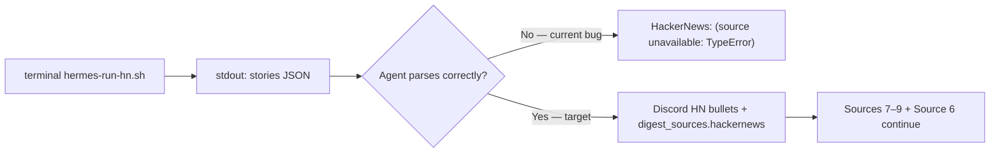

# Story 65.6: Fix HN TypeError in morning digest task-prompt

Status: done

<!-- Ultimate context engine analysis completed — comprehensive developer guide created. -->

## Story

As a **CNS operator receiving the morning digest in `#hermes`**,
I want **Source 5 HackerNews to parse `fetch-hn-rss.mjs` stdout reliably after Epic 65 Sources 7–9 landed**,
so that **live Hermes runs show real HN stories (not `- (source unavailable: TypeError)`) while GitHub, Reddit, and RSS collection continues unchanged**.

## Context

| Topic | Detail |
|-------|--------|
| **Epic** | Epic 65: Native Source Adapter Expansion v1 — **65-6 is a post-65-4 hotfix** (same bug class as **64-8**; closes live HN regression) |
| **Repo** | **Omnipotent.md only** — task-prompt + SKILL mirror + contract tests; **no** `fetch-hn-rss.mjs` logic changes unless audit proves a script bug |
| **Predecessors** | **61-4** (HN fetch + Source 5 contract); **65-1** (Source 7 GitHub inserted after HN); **65-3** (Source 8 Reddit); **65-4** (Source 9 RSS); **64-8** (imperative stdout threading pattern for scoring — **reuse this pattern for HN**) |
| **Root cause (hypothesis — dev must confirm during audit)** | `fetch-hn-rss.mjs` and `hermes-run-hn.sh` are healthy standalone. Live digest shows `(source unavailable: TypeError)` — a **Hermes agent orchestration** failure in Source 5, not fetch. Epic 65 inserted Sources 7–9 (`repos[]`, `posts[]`, `entries[]`) immediately after Source 5 and renumbered flow (5 → 7 → 8 → 9 → 6). Source 5 still uses passive "Parse stdout JSON" wording **without** the imperative capture block 64-8 added for scoring. Agents likely: (a) access `.stories` on unparsed stdout, (b) apply wrong stdout key from adjacent sources, or (c) follow stale "continue to Source 6" muscle memory. |
| **Out of scope** | `fetch-hn-rss.mjs` RSS parsing changes; 65-5 optional HN `sourceMetadata` alignment; scoring formula changes; Convex/dashboard; adding GitHub/Reddit/RSS Discord output sections (separate UX story — not required for HN TypeError fix); WriteGate / vault mutations |

### Problem (observed behavior)



**Standalone proof:** `node scripts/hermes-skill-examples/morning-digest/scripts/fetch-hn-rss.mjs` (with fixture env or live fetch) prints `{"stories":[...]}` and exits 0. `tests/morning-digest-hn-rss.test.mjs` is green. **Regression is prompt-level.**

### What already works (do not reimplement)

| Component | State |
|-----------|-------|
| `fetch-hn-rss.mjs` | stdout `{"stories":[{title,link,score,comments},...]}` or `{"error":"..."}`; exit 0 on failure |
| `hermes-run-hn.sh` | exec node on fetch script (mirror arXiv/GitHub wrappers) |
| `buildDigestSignals` / `extractHnSignals` | HN titles after arXiv, cap 3 |
| `tests/morning-digest-hn-rss.test.mjs` | Fixture parse tests green |
| `tests/hermes-morning-digest-skill.test.mjs` | Asserts `stories[]` string present in Source 5 slice — **insufficient** (passive mention only; no imperative parse contract) |

**This story fixes the orchestration contract in `task-prompt.md` Source 5 (and SKILL mirror) plus adds a regression-lock contract test — same class as 64-8.**

## Acceptance Criteria

### 1. Audit Source 5 and identify regression (AC: root cause)

**Given** `scripts/hermes-skill-examples/morning-digest/references/task-prompt.md` after 65-4
**When** the dev agent audits Source 5 against Sources 7–9 insertions
**Then** the story's Dev Agent Record documents the **confirmed** regression (one of: stdout key confusion, missing `JSON.parse`, stale source numbering, or other prompt defect)
**And** the fix targets the prompt/orchestration layer — not `fetch-hn-rss.mjs` unless audit proves otherwise

### 2. Imperative HN stdout capture in task-prompt Source 5 (AC: Hermes threading — mirror 64-8)

**Given** `task-prompt.md` § "Source 5 — HackerNews"
**When** the dev agent updates the parse block
**Then** documentation **immediately after** the HN `terminal(...)` block requires this **non-optional** sequence (mirror §9 scoring / Source 6 pick stdout patterns):

1. **Capture** HN terminal **stdout** (trim whitespace).
2. **Parse** stdout: `hn_json = JSON.parse(<stdout>)` inside try/catch or equivalent safe parse.
3. On `hn_json.error` (string) → treat as failure; reason = that string.
4. On valid parse: read **`hn_json.stories`** (array) — **not** `repos`, `posts`, or `entries`.
5. Validate `Array.isArray(hn_json.stories) && hn_json.stories.length > 0` before rendering bullets.
6. Each story uses `title`, `link`, `score`, `comments` (integers from stdout).
7. On parse failure, empty `stories`, or `error` key → section header **HackerNews** + `- (source unavailable: <short reason>)` and **continue to Source 7** (not Source 6).

**And** documentation includes explicit **stdout shape** reminder:

```json
{ "stories": [{ "title": "...", "link": "...", "score": 142, "comments": 12 }] }
```

**And** an explicit **anti-pattern** line: *Do not read `repos[]`, `posts[]`, or `entries[]` from HN stdout — those keys belong to Sources 7–9 only.*

**And** wording uses imperative assignment (`hn_stdout`, `hn_json`, `hn_json.stories`) — not passive "parse stdout" without variable binding.

### 3. Stale source-numbering cleanup (AC: flow invariant)

**Given** Epic 65 source order: 1 → 2 → 3 → 4 → 5 → **7 → 8 → 9** → 6
**When** task-prompt hard constraints and cross-references are audited
**Then** any stale "Sources 1–6 only" or "continue to Source 6" after Source 5 is corrected to reflect the 5 → 7 → 8 → 9 → 6 pipeline
**And** minimum fixes (if still present after audit):

| Location | Required text |
|----------|---------------|
| Hard constraint §7 | Cross-source failures cover Sources **1–5, 7–9, and 6** (in collection order) |
| Source 5 failure path | **continue to Source 7** (already correct in HEAD — preserve) |
| Post-post §9 precondition | "Sources 1–5, 7–9, and 6 were attempted" (replace "Sources 1–6" if still stale) |

**And** Source 5 terminal invocation remains `hermes-run-hn.sh` with timeout **45s** — unchanged

### 4. SKILL.md mirror (AC: skill-level guardrail)

**Given** `scripts/hermes-skill-examples/morning-digest/SKILL.md`
**When** this story completes
**Then** inline contract step 7 (HackerNews) and/or **Pitfalls** section state that HN stdout **must** be `JSON.parse`‑d and stories read from **`hn_json.stories`** before Discord rendering
**And** Pitfalls includes anti-pattern against `repos`/`posts`/`entries` on HN stdout
**And** version bump per convention if skill body changes (currently `1.4.3`)

### 5. Hermes skill contract test: `stories[]` regression lock (AC: contract lock)

**Given** `tests/hermes-morning-digest-skill.test.mjs`
**When** this story completes
**Then** a new test case **"task-prompt documents imperative HN stdout parsing (Story 65-6)"** asserts the Source 5 slice (between `## Source 5` and `## Source 7`) includes **all** of:

- `stories[]` (stdout array key)
- `hn_json` (or equivalent explicit assignment variable documented in task-prompt)
- `JSON.parse` adjacent to HN terminal / "After terminal returns" block
- anti-pattern wording against `repos[]` / `posts[]` / `entries[]` for HN
- `continue** to Source 7` (not Source 6)

**And** optional SKILL.md assertions: HN stdout parsing guardrail in Pitfalls or inline step 7

### 6. Scope boundary and verify gate (AC: verify)

**Given** implementation complete
**When** inspecting diffs
**Then** `fetch-hn-rss.mjs` is **unchanged** unless audit proves a script bug with a failing test
**And** `bash scripts/install-hermes-skill-morning-digest.sh` run after task-prompt / SKILL edits
**And** `bash scripts/verify.sh` green (Omnipotent.md `npm test` + sibling cns-dashboard when present)

## Tasks / Subtasks

- [x] **T1** Audit Source 5 vs Sources 7–9 insertions; document confirmed regression in Dev Agent Record (AC: 1)
- [x] **T2** Strengthen `task-prompt.md` Source 5 imperative stdout capture (AC: 2)
  - [x] Add `hn_stdout` → `hn_json = JSON.parse(...)` → `hn_json.stories` block after terminal
  - [x] Add stdout shape example + anti-pattern against repos/posts/entries
  - [x] Preserve failure → unavailable bullet + continue to Source 7
- [x] **T3** Fix stale source-numbering cross-references (AC: 3)
  - [x] Hard constraint §7 and post-post §9 precondition if still "1–6" only
- [x] **T4** Update `SKILL.md` mirror + version bump (AC: 4)
- [x] **T5** Extend `hermes-morning-digest-skill.test.mjs` with Story 65-6 contract test (AC: 5)
- [x] **T6** Hermes skill sync + verify gate (AC: 6)
  - [x] `bash scripts/install-hermes-skill-morning-digest.sh`
  - [x] `bash scripts/verify.sh`

### Review Findings

**Acceptance Auditor (operator priorities): AC 2 PASS, AC 3 PASS — all AC 1–6 satisfied.**

- [x] [Review][Patch] SKILL inline step 7 uses `hn_stdout` before explicit assignment [SKILL.md:65] — fixed: `Let hn_stdout` before `JSON.parse(hn_stdout)` in inline step 7 and Pitfalls.
- [x] [Review][Defer] Sources 7–9 still use passive "Parse stdout JSON" bullets [task-prompt.md:153+] — deferred, pre-existing; same bug class as pre-65-6 HN but out of 65-6 scope.
- [x] [Review][Defer] Output contract / SKILL template omit GitHub, Reddit, RSS Discord sections [task-prompt.md Output contract] — deferred, pre-existing; separate UX story per story Out of scope.

## Dev Notes

### Architecture compliance (normative)

| ADR / Section | Requirement for 65-6 |
|---------------|---------------------|
| architecture-epic-65 §7.1 | Source 5 (HN) unchanged position; 7–9 after HN, before Source 6 |
| ADR-E65-001 | Adapter stdout JSON contracts — HN uses `stories[]` only |
| 61-4 / Epic 61 | HN fetch module contract unchanged |
| 64-8 pattern | Imperative stdout capture for Hermes agents — apply to Source 5 |

### Current file state — what to change

#### `task-prompt.md` Source 5 (UPDATE — primary deliverable)

**Today (post-65-4):** Terminal block exists; passive parse bullets; failure says continue to Source 7 (correct). **Missing:** imperative steps comparable to §9 scoring (64-8):

```134:141:scripts/hermes-skill-examples/morning-digest/references/task-prompt.md
Parse stdout JSON:

- `stories[]` with `title`, `link`, `score`, `comments` (integers).
- Emit up to **N** stories (default **5**, configurable via `MORNING_DIGEST_HN_MAX_STORIES`).

For Discord **HackerNews**, list each story as `- <title> — <score> pts, <comments> comments`.

On failure (`error` key, empty `stories`, or invalid stdout): section header **HackerNews** + `- (source unavailable: <short reason>)` and **continue** to Source 7.
```

**Contrast — working pattern (§9 scoring, 64-8):**

```519:526:scripts/hermes-skill-examples/morning-digest/references/task-prompt.md
1. Let `score_stdout` = scoring terminal **stdout** (trim whitespace; stderr is observability only).
2. Try `scored_signals = JSON.parse(score_stdout)`.
3. If `Array.isArray(scored_signals) && scored_signals.length > 0`:
   - `digest_push_payload.signals = scored_signals` (replace the entire array; do not merge).
```

**Target shape (normative — dev may tighten prose but must preserve semantics):**

```text
After the HN terminal returns:

1. Let `hn_stdout` = terminal stdout (trimmed).
2. Try `hn_json = JSON.parse(hn_stdout)`.
3. If `hn_json.error` (string) → failure; reason = hn_json.error.
4. Else if `Array.isArray(hn_json.stories) && hn_json.stories.length > 0`:
     render Discord bullets from hn_json.stories (title, score, comments).
   Else → failure (empty stories or invalid shape).
5. On failure: **HackerNews** + `- (source unavailable: <short reason>)`; continue to Source 7.
6. **Anti-pattern:** never read `repos`, `posts`, or `entries` from HN stdout.
```

**Regression context:** Immediately after Source 5, task-prompt documents Sources 7–9 with `repos[]`, `posts[]`, `entries[]`. Without step 6, agents cross-apply keys → `TypeError` when mapping undefined arrays.

#### Stale cross-references to fix (if still present)

```21:21:scripts/hermes-skill-examples/morning-digest/references/task-prompt.md
7. **Cross-source failures**: run Sources 1–6 independently.
```

Should reflect full collection order (1–5, 7–9, 6).

```405:405:scripts/hermes-skill-examples/morning-digest/references/task-prompt.md
Run **after** Sources 1–6 were attempted, `digest_sources` was assembled, ...
```

Should say Sources 1–5, 7–9, and 6.

#### `fetch-hn-rss.mjs` (NO CHANGE expected)

CLI contract (61-4):

```json
{ "stories": [{ "title": "...", "link": "...", "score": 14, "comments": 2 }] }
```

Exports: `runHnFetch`, `parseHnRss`, `parseHnItemBlock`. Tests in `tests/morning-digest-hn-rss.test.mjs`.

#### `SKILL.md` inline step 7 (UPDATE)

**Today:** `Parse stories[]` — one line, passive. Mirror task-prompt imperative block in step 7 and/or Pitfalls (mirror 64-8 "Scoring stdout threading" pitfall).

### Contract test implementation sketch

```javascript
// tests/hermes-morning-digest-skill.test.mjs — add after existing Source 5 assertions
it("task-prompt documents imperative HN stdout parsing (Story 65-6)", () => {
  const taskBody = readFileSync(taskPromptPath, "utf8");
  const source5End = taskBody.indexOf("## Source 7");
  const source5 = taskBody.slice(taskBody.indexOf("## Source 5"), source5End);
  assert.ok(source5.includes("stories[]"));
  assert.ok(source5.includes("hn_json") || source5.includes("hn_stdout"));
  assert.ok(source5.includes("JSON.parse"));
  assert.ok(
    source5.includes("repos[]") === false ||
    source5.match(/anti-pattern|Do not read.*repos/i),
    "must anti-pattern repos/posts/entries for HN",
  );
  assert.ok(source5.includes("continue** to Source 7"));
  assert.ok(!source5.includes("continue** to Source 6"));
});
```

Adjust assertions to match final task-prompt variable names — test must fail on current HEAD (passive parse only) and pass after fix.

### Previous story intelligence

**64-8 (done):** Passive "parse stdout" insufficient for Hermes agents; imperative capture + anti-pattern + contract test prevented scoring regression. **Same fix class for HN.**

**65-1 / 65-3 / 65-4 (done):** Inserted Sources 7–9 between HN and NotebookLM; updated `digest_sources` and §9 mapping; did not strengthen Source 5 parse contract. Contract test checks `stories[]` string exists but not imperative parse — gap 65-6 closes.

**61-4 (done):** Established HN stdout `stories[]` contract and Source 5 numbering. Epic 65 renumbered failure path to Source 7 — correct in HEAD.

### Git intelligence

Recent Epic 65 commits (newest first):

- `aa26222` — 65-4 RSS adapter Source 9
- `e751756` — 65-3 Reddit OAuth adapter Source 8
- `b2ccb86` — 65-1 GitHub adapter Source 7 (inserted after HN, renumbered Source 6 continue → Source 7)

Follow 64-8 / 65-4 patterns: Omnipotent.md only, node:test, no new dependencies, Hermes skill sync mandatory.

### Project structure

| File | Action |
|------|--------|
| `scripts/hermes-skill-examples/morning-digest/references/task-prompt.md` | **UPDATE** — Source 5 imperative parse + numbering cleanup |
| `scripts/hermes-skill-examples/morning-digest/SKILL.md` | **UPDATE** — HN stdout guardrail + version bump |
| `tests/hermes-morning-digest-skill.test.mjs` | **EXTEND** — Story 65-6 contract test |
| `scripts/hermes-skill-examples/morning-digest/scripts/fetch-hn-rss.mjs` | **NO CHANGE** |
| `scripts/session-close/hermes-run-hn.sh` | **NO CHANGE** |

### Testing standards

- `npm test` discovers `tests/**/*.test.mjs` automatically
- No live network required for new contract test (file content assertions only)
- `bash scripts/verify.sh` is the done gate
- Existing `morning-digest-hn-rss.test.mjs` must remain green

### References

- [Source: `_bmad-output/implementation-artifacts/64-8-fix-scoring-pipeline-push-threading.md` — imperative stdout pattern, contract test model]
- [Source: `_bmad-output/implementation-artifacts/61-4-morning-digest-hackernews-source.md` — HN stdout contract, Source 5 foundation]
- [Source: `_bmad-output/implementation-artifacts/65-1-digest-source-types-github-adapter.md` — Source 7 insertion after HN]
- [Source: `_bmad-output/implementation-artifacts/65-4-rss-adapter.md` — Source 9 ordering 7→8→9→6]
- [Source: `_bmad-output/planning-artifacts/architecture-epic-65-native-source-adapters.md` §7.1 — source numbering]
- [Source: `scripts/hermes-skill-examples/morning-digest/references/task-prompt.md` — Source 5 HN + Sources 7–9]
- [Source: `scripts/hermes-skill-examples/morning-digest/scripts/fetch-hn-rss.mjs` — stdout shape (standalone healthy)]
- [Source: `tests/hermes-morning-digest-skill.test.mjs` — existing Source 5 slice test (extend for 65-6)]
- [Source: `tests/morning-digest-hn-rss.test.mjs` — fetch module regression suite]

## Dev Agent Record

### Agent Model Used

Claude Sonnet 4.6 (Cursor Agent)

### Debug Log References

- Audit (T1): Source 5 had passive "Parse stdout JSON" bullets only — no `hn_stdout`/`JSON.parse`/`hn_json.stories` imperative block unlike §9 scoring (64-8). Sources 7–9 immediately follow with `repos[]`/`posts[]`/`entries[]` imperative contracts, creating key-confusion risk → `TypeError` when agents access wrong keys or `.stories` on unparsed stdout. Stale hard-constraint §7 ("Sources 1–6") and post-post §9 precondition ("Sources 1–6 were attempted") omitted Sources 7–9 from collection-order invariant. `fetch-hn-rss.mjs` unchanged — standalone stdout healthy.

### Completion Notes List

- Replaced Source 5 passive parse with 7-step imperative block: `hn_stdout` → `JSON.parse` → `hn_json.stories` + anti-pattern against `repos[]`/`posts[]`/`entries[]`.
- Fixed stale numbering: hard constraint §7 and post-post §9 precondition now "Sources 1–5, 7–9, and 6".
- SKILL.md v1.4.4: inline step 7 + Pitfalls "HackerNews stdout threading" guardrail.
- Added contract test `task-prompt documents imperative HN stdout parsing (Story 65-6)`; bumped version assertions to 1.4.4.
- `bash scripts/install-hermes-skill-morning-digest.sh` + `bash scripts/verify.sh` green.

### File List

- `scripts/hermes-skill-examples/morning-digest/references/task-prompt.md`
- `scripts/hermes-skill-examples/morning-digest/SKILL.md`
- `tests/hermes-morning-digest-skill.test.mjs`
- `~/.hermes/skills/cns/morning-digest/` (installed mirror via sync script)

## Change Log

- 2026-06-09 — Story 65-6: fix Hermes Source 5 HN orchestration contract (TypeError regression after Epic 65 Sources 7–9); prompt + contract test; no fetch script changes expected.
- 2026-06-09 — Implemented: imperative HN stdout threading in task-prompt Source 5, stale 1–6 numbering cleanup, SKILL.md v1.4.4 guardrails, Story 65-6 contract test; verify green.
