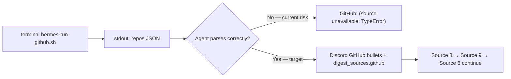

# Story 65.7: Imperative stdout threading for Sources 7–9 (GitHub, Reddit, RSS)

Status: done

<!-- Ultimate context engine analysis completed — comprehensive developer guide created. -->

## Story

As a **CNS operator receiving the morning digest in `#hermes`**,
I want **Sources 7–9 (GitHub, Reddit, RSS) to parse adapter stdout reliably using the same imperative threading pattern as Source 5 HN and §9 scoring**,
so that **live Hermes runs show real GitHub repos, Reddit posts, and RSS entries (not `(source unavailable: TypeError)`) while fetch scripts and scoring/push pipelines remain unchanged**.

## Context

| Topic | Detail |
|-------|--------|
| **Epic** | Epic 65: Native Source Adapter Expansion v1 — **65-7 is a post-65-6 hotfix** (closes deferred-work P2 from Epic 65 retro; same bug class as **64-8** and **65-6**) |
| **Repo** | **Omnipotent.md only** — `task-prompt.md` + `SKILL.md` mirror + contract tests; **no** changes to `fetch-github-signals.mjs`, `fetch-reddit-signals.mjs`, or `fetch-rss-signals.mjs` unless audit proves a script bug |
| **Predecessors** | **65-1** (Source 7 GitHub adapter); **65-3** (Source 8 Reddit); **65-4** (Source 9 RSS); **65-6** (Source 5 HN imperative pattern — **mirror for 7–9**); **64-8** (imperative stdout threading for scoring — canonical pattern) |
| **Root cause (confirmed — audit in 65-6 review)** | All three fetch scripts are healthy standalone (`tests/morning-digest-github-adapter.test.mjs`, `morning-digest-reddit-adapter.test.mjs`, `morning-digest-rss-adapter.test.mjs` green). `task-prompt.md` Sources 7–9 still use passive **"Parse stdout JSON:"** bullets without `gh_stdout`/`rd_stdout`/`rss_stdout` → `JSON.parse` → keyed array assignment. Hermes agents adjacent to Source 5 (`stories[]`) and each other (`repos[]`/`posts[]`/`entries[]`) cross-apply keys or access properties on unparsed stdout → **`TypeError`** at orchestration time. |
| **Out of scope** | Fetch script logic changes; Discord output contract sections for GitHub/Reddit/RSS (separate UX story per 65-6 defer); `buildDigestSignals` github/reddit cap slots; scoring formula changes; Convex/dashboard; WriteGate / vault mutations |

### Problem (observed behavior class)



Same failure class applies to Reddit (`posts[]`) and RSS (`entries[]`). **Regression is prompt-level**, not adapter compute.

### What already works (do not reimplement)

| Component | State |
|-----------|-------|
| `fetch-github-signals.mjs` | stdout `{"repos":[...]}` or `{"error":"..."}`; exit 0 on failure |
| `fetch-reddit-signals.mjs` | stdout `{"posts":[...]}` or `{"error":"..."}`; exit 0 on failure |
| `fetch-rss-signals.mjs` | stdout `{"entries":[...]}` or `{"error":"..."}`; exit 0 on failure |
| `hermes-run-github.sh` / `hermes-run-reddit.sh` / `hermes-run-rss.sh` | exec node on fetch scripts (mirror HN/arXiv wrappers) |
| `tests/morning-digest-github-adapter.test.mjs` | Fixture parse tests green |
| `tests/morning-digest-reddit-adapter.test.mjs` | Fixture parse tests green |
| `tests/morning-digest-rss-adapter.test.mjs` | Fixture parse tests green |
| `tests/hermes-morning-digest-skill.test.mjs` | Asserts `repos[]`/`posts[]`/`entries[]` strings in Source slices — **insufficient** (passive mention only; no imperative parse contract) |

**This story fixes the orchestration contract in `task-prompt.md` Sources 7–9 (and SKILL mirror) plus adds regression-lock contract tests — same class as 64-8 / 65-6.**

## Acceptance Criteria

### 1. Audit Sources 7–9 and confirm passive-parse regression (AC: root cause)

**Given** `scripts/hermes-skill-examples/morning-digest/references/task-prompt.md` after 65-6
**When** the dev agent audits Sources 7, 8, and 9 against Source 5 imperative pattern
**Then** the story's Dev Agent Record documents the **confirmed** regression: passive "Parse stdout JSON" bullets without imperative `*_stdout` → `JSON.parse` → `*_json.<key>[]` binding
**And** the fix targets the prompt/orchestration layer — not fetch scripts unless audit proves otherwise

### 2. Imperative GitHub stdout capture in task-prompt Source 7 (AC: Hermes threading — mirror 65-6)

**Given** `task-prompt.md` § "Source 7 — GitHub"
**When** the dev agent replaces the passive parse block
**Then** documentation **immediately after** the GitHub `terminal(...)` block requires this **non-optional** sequence:

1. **Capture** GitHub terminal **stdout** (trim whitespace; stderr observability only).
2. **Parse** stdout: `gh_json = JSON.parse(<stdout>)` inside try/catch or equivalent safe parse.
3. On `gh_json.error` (string) → treat as failure; reason = that string.
4. On valid parse: read **`gh_json.repos`** (array) — **not** `stories`, `posts`, or `entries`.
5. Validate `Array.isArray(gh_json.repos) && gh_json.repos.length > 0` before rendering bullets.
6. Each repo uses `title`, `url`, `stars`, `forks` (numbers), optional `publishedAt` (ISO string).
7. Preserve §9 `sourceMetadata` mapping bullets (`repos[].stars` → `sourceMetadata.stars`, etc.).
8. On parse failure, empty `repos`, or `error` key → section header **GitHub** + `- (source unavailable: <short reason>)` and **continue to Source 8**.

**And** documentation includes explicit **stdout shape** reminder:

```json
{ "repos": [{ "title": "owner/repo", "url": "https://github.com/...", "stars": 1200, "forks": 45 }] }
```

**And** an explicit **anti-pattern** line: *Do not read `stories[]`, `posts[]`, or `entries[]` from GitHub stdout — those keys belong to Sources 5, 8, and 9 only.*

**And** wording uses imperative assignment (`gh_stdout`, `gh_json`, `gh_json.repos`) — not passive "parse stdout" without variable binding.

### 3. Imperative Reddit stdout capture in task-prompt Source 8 (AC: Hermes threading)

**Given** `task-prompt.md` § "Source 8 — Reddit"
**When** the dev agent replaces the passive parse block
**Then** documentation **immediately after** the Reddit `terminal(...)` block requires this **non-optional** sequence:

1. Let `rd_stdout` = Reddit terminal stdout (trimmed).
2. Try `rd_json = JSON.parse(rd_stdout)`.
3. On `rd_json.error` (string) → failure; reason = that string.
4. Else if `Array.isArray(rd_json.posts) && rd_json.posts.length > 0`:
   - Read **`rd_json.posts`** (`posts[]` stdout array key) only.
   - Each post uses `title`, `url`, `upvotes`, `commentCount` (numbers), optional `publishedAt`.
   - Preserve §9 `sourceMetadata` mapping (`posts[].upvotes` → `sourceMetadata.upvotes`, etc.).
5. Else → failure (empty `posts`, invalid shape, or parse error).
6. On failure: **Reddit** + `- (source unavailable: <short reason>)`; **continue to Source 9**.
7. **Anti-pattern:** Do not read `stories[]`, `repos[]`, or `entries[]` from Reddit stdout.

**And** stdout shape example:

```json
{ "posts": [{ "title": "...", "url": "https://reddit.com/...", "upvotes": 42, "commentCount": 7 }] }
```

### 4. Imperative RSS stdout capture in task-prompt Source 9 (AC: Hermes threading)

**Given** `task-prompt.md` § "Source 9 — Newsletters / RSS"
**When** the dev agent replaces the passive parse block
**Then** documentation **immediately after** the RSS `terminal(...)` block requires this **non-optional** sequence:

1. Let `rss_stdout` = RSS terminal stdout (trimmed).
2. Try `rss_json = JSON.parse(rss_stdout)`.
3. On `rss_json.error` (string) → failure; reason = that string.
4. Else if `Array.isArray(rss_json.entries) && rss_json.entries.length > 0`:
   - Read **`rss_json.entries`** (`entries[]` stdout array key) only.
   - Each entry uses `title`, `url`, optional `publishedAt`, optional `author`.
   - Preserve §9 `sourceMetadata` mapping (`entries[].publishedAt` → `sourceMetadata.publishedAt`, etc.).
5. Else → failure.
6. On failure: **Newsletters / RSS** + `- (source unavailable: <short reason>)`; **continue to Source 6**.
7. **Anti-pattern:** Do not read `stories[]`, `repos[]`, or `posts[]` from RSS stdout.

**And** stdout shape example:

```json
{ "entries": [{ "title": "...", "url": "https://...", "publishedAt": "2026-06-09T08:00:00.000Z", "author": "..." }] }
```

### 5. SKILL.md mirror (AC: skill-level guardrails)

**Given** `scripts/hermes-skill-examples/morning-digest/SKILL.md` (currently `version: 1.4.4`)
**When** this story completes
**Then** inline contract steps 8–10 (GitHub, Reddit, RSS) mirror the imperative stdout threading blocks from task-prompt — not passive "Parse `repos[]`" one-liners
**And** **Pitfalls** section adds three guardrails (or one consolidated subsection) for:
- **GitHub stdout threading (Source 7):** `gh_stdout` → `gh_json.repos` only; anti-pattern against `stories`/`posts`/`entries`
- **Reddit stdout threading (Source 8):** `rd_stdout` → `rd_json.posts` only; anti-pattern against other source keys
- **RSS stdout threading (Source 9):** `rss_stdout` → `rss_json.entries` only; anti-pattern against other source keys
**And** version bump to **1.4.5** (or next patch per convention) when skill body changes

### 6. Hermes skill contract tests: stdout key regression lock (AC: contract lock)

**Given** `tests/hermes-morning-digest-skill.test.mjs`
**When** this story completes
**Then** three new test cases (or one parameterized block with three slices) assert:

| Test name | Slice boundaries | Required strings |
|-----------|------------------|------------------|
| `task-prompt documents imperative GitHub stdout parsing (Story 65-7)` | `## Source 7` → `## Source 8` | `repos[]`, `gh_json` or `gh_stdout`, `JSON.parse`, anti-pattern against `stories[]`/`posts[]`/`entries[]`, `continue** to Source 8` |
| `task-prompt documents imperative Reddit stdout parsing (Story 65-7)` | `## Source 8` → `## Source 9` | `posts[]`, `rd_json` or `rd_stdout`, `JSON.parse`, anti-pattern against wrong keys, `continue** to Source 9` |
| `task-prompt documents imperative RSS stdout parsing (Story 65-7)` | `## Source 9` → `## Source 6` | `entries[]`, `rss_json` or `rss_stdout`, `JSON.parse`, anti-pattern against wrong keys, `continue** to Source 6` |

**And** optional SKILL.md assertions: GitHub/Reddit/RSS stdout threading guardrails in Pitfalls or inline steps 8–10

**And** tests must **fail on current HEAD** (passive parse only) and **pass after fix**

### 7. Scope boundary and verify gate (AC: verify)

**Given** implementation complete
**When** inspecting diffs
**Then** `fetch-github-signals.mjs`, `fetch-reddit-signals.mjs`, and `fetch-rss-signals.mjs` are **unchanged** unless audit proves a script bug with a failing test
**And** `bash scripts/install-hermes-skill-morning-digest.sh` run after task-prompt / SKILL edits
**And** `bash scripts/verify.sh` green (Omnipotent.md `npm test` + sibling cns-dashboard when present)

## Tasks / Subtasks

- [x] **T1** Audit Sources 7–9 vs Source 5 / §9 imperative patterns; document confirmed regression in Dev Agent Record (AC: 1)
- [x] **T2** Strengthen `task-prompt.md` Source 7 imperative stdout capture (AC: 2)
  - [x] Replace passive block with `gh_stdout` → `JSON.parse` → `gh_json.repos` + anti-pattern
  - [x] Preserve failure → unavailable bullet + continue to Source 8
  - [x] Preserve §9 `sourceMetadata` mapping bullets
- [x] **T3** Strengthen `task-prompt.md` Source 8 imperative stdout capture (AC: 3)
  - [x] Replace passive block with `rd_stdout` → `JSON.parse` → `rd_json.posts` + anti-pattern
  - [x] Preserve failure path + continue to Source 9
- [x] **T4** Strengthen `task-prompt.md` Source 9 imperative stdout capture (AC: 4)
  - [x] Replace passive block with `rss_stdout` → `JSON.parse` → `rss_json.entries` + anti-pattern
  - [x] Preserve failure path + continue to Source 6
- [x] **T5** Update `SKILL.md` mirror + version bump to 1.4.5 (AC: 5)
  - [x] Inline steps 8–10 imperative threading
  - [x] Pitfalls guardrails for Sources 7–9
- [x] **T6** Extend `hermes-morning-digest-skill.test.mjs` with Story 65-7 contract tests (AC: 6)
- [x] **T7** Hermes skill sync + verify gate (AC: 7)
  - [x] `bash scripts/install-hermes-skill-morning-digest.sh`
  - [x] `bash scripts/verify.sh`

## Dev Notes

### Architecture compliance (normative)

| ADR / Section | Requirement for 65-7 |
|---------------|---------------------|
| architecture-epic-65 §7.1 | Sources 7–9 after HN (5), before Source 6; stdout keys `repos[]`/`posts[]`/`entries[]` |
| ADR-E65-001 | Adapter stdout JSON contracts — fetch scripts are SSOT; prompt must mirror |
| 64-8 / 65-6 pattern | Imperative stdout capture for Hermes agents — apply to Sources 7–9 |
| Epic 65 retro P2 | Deferred from 65-6 review — this story closes it |

### Current file state — what to change

#### `task-prompt.md` Source 7 (UPDATE — primary deliverable)

**Today (post-65-6):** Terminal block exists; passive parse bullets at lines 161–169:

```161:169:scripts/hermes-skill-examples/morning-digest/references/task-prompt.md
Parse stdout JSON:

- `repos[]` with `title` (owner/repo), `url`, `stars`, `forks` (numbers), optional `publishedAt` (ISO string).
- When building §9 push signals, nest engagement under `sourceMetadata`: `repos[].stars` → `sourceMetadata.stars`, `repos[].forks` → `sourceMetadata.forks` (omit `forks` when absent), `repos[].publishedAt` → `sourceMetadata.publishedAt` when present.
- Emit up to **N** repos (default **5**, configurable via `MORNING_DIGEST_GITHUB_MAX_REPOS`); requires `MORNING_DIGEST_GITHUB_QUERIES` (comma-separated search strings) when enabled.

For Discord **GitHub**, list each repo as `- <title> — <stars> stars, <forks> forks`.

On failure (`error` key, empty `repos`, or invalid stdout): section header **GitHub** + `- (source unavailable: <short reason>)` and **continue** to Source 8.
```

**Contrast — working pattern (Source 5, 65-6):**

```140:151:scripts/hermes-skill-examples/morning-digest/references/task-prompt.md
**After the HN terminal returns** (mandatory stdout threading — mirror §9 scoring / Source 6 pick stdout patterns):

1. Let `hn_stdout` = HN terminal **stdout** (trim whitespace; stderr is observability only).
2. Try `hn_json = JSON.parse(hn_stdout)` inside try/catch or equivalent safe parse.
...
7. **Anti-pattern:** Do not read `repos[]`, `posts[]`, or `entries[]` from HN stdout — those keys belong to Sources 7–9 only.
```

**Target shape for Source 7 (normative — dev may tighten prose but must preserve semantics):**

```text
**After the GitHub terminal returns** (mandatory stdout threading — mirror Source 5 / §9 scoring):

1. Let `gh_stdout` = GitHub terminal stdout (trimmed).
2. Try `gh_json = JSON.parse(gh_stdout)`.
3. If `gh_json.error` (string) → failure; reason = gh_json.error.
4. Else if `Array.isArray(gh_json.repos) && gh_json.repos.length > 0`:
     read gh_json.repos; render Discord bullets; preserve §9 sourceMetadata mapping.
   Else → failure.
5. On failure: **GitHub** + unavailable bullet; continue to Source 8.
6. **Anti-pattern:** never read `stories`, `posts`, or `entries` from GitHub stdout.
```

#### `task-prompt.md` Source 8 (UPDATE)

**Today:** Passive "Parse stdout JSON:" at lines 179–187. **Target:** `rd_stdout` → `rd_json.posts` block mirroring Source 7 pattern. Failure → continue to Source 9.

#### `task-prompt.md` Source 9 (UPDATE)

**Today:** Passive "Parse stdout JSON:" at lines 197–205. **Target:** `rss_stdout` → `rss_json.entries` block. Failure → continue to Source 6.

**Regression context:** Source 5 immediately precedes Source 7 with `stories[]`; Sources 7–9 are back-to-back with distinct keys. Without imperative binding + anti-patterns, agents cross-apply keys → `TypeError` when mapping undefined arrays (same class as pre-65-6 HN).

#### Fetch scripts (NO CHANGE expected)

| Script | stdout contract | Adapter tests |
|--------|-----------------|---------------|
| `fetch-github-signals.mjs` | `{"repos":[{title,url,stars,forks,publishedAt?}]}` | `tests/morning-digest-github-adapter.test.mjs` |
| `fetch-reddit-signals.mjs` | `{"posts":[{title,url,upvotes,commentCount,publishedAt?}]}` | `tests/morning-digest-reddit-adapter.test.mjs` |
| `fetch-rss-signals.mjs` | `{"entries":[{title,url,publishedAt?,author?}]}` | `tests/morning-digest-rss-adapter.test.mjs` |

#### `SKILL.md` inline steps 8–10 + Pitfalls (UPDATE)

**Today:** Steps 8–10 are passive one-liners ("Parse `repos[]`", "Parse `posts[]`", "Parse `entries[]`"). Pitfalls has HN + scoring guardrails only — no Sources 7–9 threading.

**Target:** Mirror task-prompt imperative blocks in steps 8–10; add Pitfalls entries (or consolidated "Sources 7–9 stdout threading" pitfall) with anti-patterns against wrong keys.

### Contract test implementation sketch

```javascript
// tests/hermes-morning-digest-skill.test.mjs — add after Story 65-6 test

function sliceSource(taskBody, startMarker, endMarker) {
  const start = taskBody.indexOf(startMarker);
  const end = taskBody.indexOf(endMarker);
  return taskBody.slice(start, end);
}

it("task-prompt documents imperative GitHub stdout parsing (Story 65-7)", () => {
  const taskBody = readFileSync(taskPromptPath, "utf8");
  const source7 = sliceSource(taskBody, "## Source 7", "## Source 8");
  assert.ok(source7.includes("repos[]"));
  assert.ok(source7.includes("gh_json") || source7.includes("gh_stdout"));
  assert.ok(source7.includes("JSON.parse"));
  assert.ok(/anti-pattern|Do not read.*stories/i.test(source7));
  assert.ok(source7.includes("continue** to Source 8"));
});

it("task-prompt documents imperative Reddit stdout parsing (Story 65-7)", () => {
  const taskBody = readFileSync(taskPromptPath, "utf8");
  const source8 = sliceSource(taskBody, "## Source 8", "## Source 9");
  assert.ok(source8.includes("posts[]"));
  assert.ok(source8.includes("rd_json") || source8.includes("rd_stdout"));
  assert.ok(source8.includes("JSON.parse"));
  assert.ok(/anti-pattern|Do not read.*repos/i.test(source8));
  assert.ok(source8.includes("continue** to Source 9"));
});

it("task-prompt documents imperative RSS stdout parsing (Story 65-7)", () => {
  const taskBody = readFileSync(taskPromptPath, "utf8");
  const source9 = sliceSource(taskBody, "## Source 9", "## Source 6");
  assert.ok(source9.includes("entries[]"));
  assert.ok(source9.includes("rss_json") || source9.includes("rss_stdout"));
  assert.ok(source9.includes("JSON.parse"));
  assert.ok(/anti-pattern|Do not read.*stories/i.test(source9));
  assert.ok(source9.includes("continue** to Source 6"));
});
```

Adjust assertions to match final task-prompt variable names — tests must fail on current HEAD and pass after fix.

### Previous story intelligence

**65-6 (done):** Fixed Source 5 HN with imperative `hn_stdout` → `hn_json.stories`; deferred Sources 7–9 passive parse bullets to this story. Contract test pattern is the template.

**64-8 (done):** Established imperative stdout threading + anti-pattern + contract test for §9 scoring. Canonical pattern for all Hermes terminal stdout consumption.

**65-1 / 65-3 / 65-4 (done):** Implemented fetch adapters and inserted Sources 7–9 into task-prompt with passive parse bullets. Existing contract test `task-prompt Source 4 arXiv... Source 7 GitHub...` checks key strings exist but not imperative parse — gap 65-7 closes.

### Git intelligence

Recent Epic 65 commits (newest first):

- `6514019` — 65-6 imperative HN stdout threading + stale source numbering fix
- `aa26222` — 65-4 RSS adapter Source 9
- `e751756` — 65-3 Reddit OAuth adapter Source 8
- `b2ccb86` — 65-1 GitHub adapter Source 7

Follow 64-8 / 65-6 patterns: Omnipotent.md only, node:test, no new dependencies, Hermes skill sync mandatory.

### Project structure

| File | Action |
|------|--------|
| `scripts/hermes-skill-examples/morning-digest/references/task-prompt.md` | **UPDATE** — Sources 7–9 imperative parse blocks |
| `scripts/hermes-skill-examples/morning-digest/SKILL.md` | **UPDATE** — inline steps 8–10 + Pitfalls + version bump |
| `tests/hermes-morning-digest-skill.test.mjs` | **EXTEND** — Story 65-7 contract tests (3 cases) |
| `scripts/hermes-skill-examples/morning-digest/scripts/fetch-github-signals.mjs` | **NO CHANGE** |
| `scripts/hermes-skill-examples/morning-digest/scripts/fetch-reddit-signals.mjs` | **NO CHANGE** |
| `scripts/hermes-skill-examples/morning-digest/scripts/fetch-rss-signals.mjs` | **NO CHANGE** |
| `scripts/session-close/hermes-run-github.sh` | **NO CHANGE** |
| `scripts/session-close/hermes-run-reddit.sh` | **NO CHANGE** |
| `scripts/session-close/hermes-run-rss.sh` | **NO CHANGE** |

### Testing standards

- `npm test` discovers `tests/**/*.test.mjs` automatically
- No live network required for new contract tests (file content assertions only)
- `bash scripts/verify.sh` is the done gate
- Existing adapter tests (`morning-digest-github-adapter`, `reddit-adapter`, `rss-adapter`) must remain green

### References

- [Source: `_bmad-output/implementation-artifacts/65-6-fix-hn-typeerror-morning-digest-task-prompt.md` — HN imperative pattern, deferred Sources 7–9]
- [Source: `_bmad-output/implementation-artifacts/64-8-fix-scoring-pipeline-push-threading.md` — canonical imperative stdout pattern]
- [Source: `_bmad-output/implementation-artifacts/epic-65-retro-2026-06-09.md` — P2 action: apply threading to Sources 7–9]
- [Source: `_bmad-output/implementation-artifacts/deferred-work.md` — 65-6 defer: Sources 7–9 passive parse]
- [Source: `_bmad-output/implementation-artifacts/65-1-digest-source-types-github-adapter.md` — Source 7 stdout contract]
- [Source: `_bmad-output/implementation-artifacts/65-3-reddit-credential-adapter.md` — Source 8 stdout contract]
- [Source: `_bmad-output/implementation-artifacts/65-4-rss-adapter.md` — Source 9 stdout contract]
- [Source: `_bmad-output/planning-artifacts/architecture-epic-65-native-source-adapters.md` §7.1 — source numbering]
- [Source: `scripts/hermes-skill-examples/morning-digest/references/task-prompt.md` — Sources 7–9 current passive state]
- [Source: `scripts/hermes-skill-examples/morning-digest/SKILL.md` — inline steps 8–10 passive state]
- [Source: `tests/hermes-morning-digest-skill.test.mjs` — extend with 65-7 contract tests]

## Dev Agent Record

### Agent Model Used

Claude Sonnet 4.6 (Cursor Agent)

### Debug Log References

- Audit (T1): Sources 7–9 had passive "Parse stdout JSON" bullets only — no `gh_stdout`/`rd_stdout`/`rss_stdout` → `JSON.parse` → keyed array imperative blocks unlike Source 5 (65-6) and §9 scoring (64-8). Sources 7–9 are back-to-back with distinct stdout keys (`repos[]`, `posts[]`, `entries[]`) immediately after Source 5 (`stories[]`), creating key-confusion risk → `TypeError` when agents cross-apply keys or access properties on unparsed stdout. Fetch scripts unchanged — standalone adapter tests green.

### Completion Notes List

- Replaced Source 7 passive parse with 7-step imperative block: `gh_stdout` → `JSON.parse` → `gh_json.repos` + anti-pattern against `stories[]`/`posts[]`/`entries[]`.
- Replaced Source 8 passive parse with 7-step imperative block: `rd_stdout` → `JSON.parse` → `rd_json.posts` + anti-pattern against wrong keys.
- Replaced Source 9 passive parse with 7-step imperative block: `rss_stdout` → `JSON.parse` → `rss_json.entries` + anti-pattern against wrong keys.
- SKILL.md v1.4.5: inline steps 8–10 + Pitfalls guardrails for GitHub, Reddit, RSS stdout threading.
- Added 3 contract tests (Story 65-7); bumped version assertions to 1.4.5.
- `bash scripts/install-hermes-skill-morning-digest.sh` + `bash scripts/verify.sh` green.

### File List

- `scripts/hermes-skill-examples/morning-digest/references/task-prompt.md`
- `scripts/hermes-skill-examples/morning-digest/SKILL.md`
- `tests/hermes-morning-digest-skill.test.mjs`
- `~/.hermes/skills/cns/morning-digest/` (installed mirror via sync script)

### Review Findings

**Acceptance Auditor:** AC 1–7 PASS — Sources 7–9 match Source 5 imperative template with explicit anti-patterns.

- [x] [Review][Patch] SKILL inline steps 9–10 omit explicit unavailable bullet format [SKILL.md:67-68] — fixed: aligned Reddit/RSS inline steps with `- (source unavailable: <short reason>)` wording.

## Change Log

- 2026-06-09 — Story 65-7: imperative stdout threading for Sources 7–9 (GitHub, Reddit, RSS); closes 65-6 defer and Epic 65 retro P2; prompt + contract tests; fetch scripts unchanged.
- 2026-06-09 — Implemented: imperative stdout threading in task-prompt Sources 7–9, SKILL.md v1.4.5 guardrails, 3 Story 65-7 contract tests; verify green.
- 2026-06-09 — Code review: SKILL inline steps 9–10 unavailable bullet format aligned; story done.
