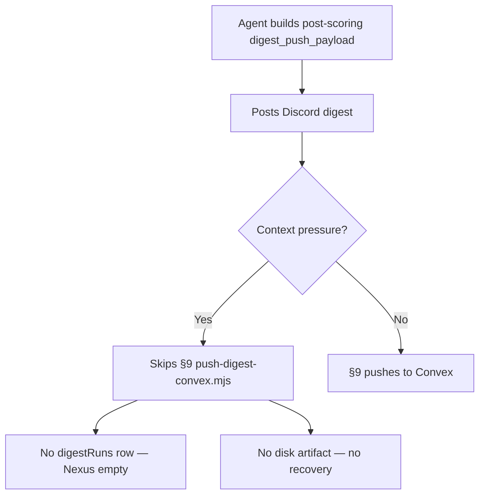
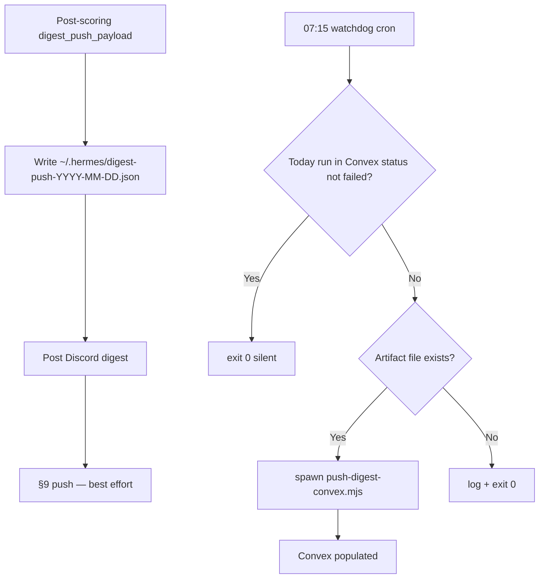

# Story 67.10: §9 Push Watchdog — Make Convex Push Failure-Safe

Status: done

<!-- Ultimate context engine analysis completed — comprehensive developer guide created. -->

## Story

As a **CNS operator who relies on Nexus digest data after the morning Discord post**,
I want **a persisted `DIGEST_PUSH_JSON` recovery artifact and a cron watchdog that backfills Convex when the Hermes agent skips §9**,
so that **`digestRuns` / `digestSignals` are populated even when prompt-level §9 execution fails under context compression**.

## Context

| Topic | Detail |
|-------|--------|
| **Epic** | Epic 67 — Signal Quality + Source Expansion — **67-10 closes the §9 reliability gap after 67-7 prompt hardening failed live validation** (deferred-work.md §Session kickoff 2026-06-11, item #2) |
| **Priority** | **P1** — Discord digest delivers; Convex feed empty when agent skips `push-digest-convex.mjs` |
| **Repo** | **Omnipotent.md only** — task-prompt, new watchdog script, cron installer, tests; **no** cns-dashboard schema changes |
| **Predecessors** | **67-7** (§9 DO NOT improvise — insufficient alone); **67-8** (07:00 cron gateway gate); **61-5** (`push-digest-convex.mjs`); **64-8** (post-scoring payload threading) |
| **Root cause (confirmed)** | Morning-digest agent **reliably posts Discord** but **skips §9** (`push-digest-convex.mjs`) under context pressure despite maximally hardened task-prompt. **No intermediate payload is written to disk**, so manual or automated recovery is impossible today. |
| **Structural fix** | Two-part: **(A)** persist post-scoring `digest_push_payload` to `~/.hermes/digest-push-YYYY-MM-DD.json` **before** Discord post; **(B)** cron watchdog at **07:15 Australia/Sydney** checks Convex and replays push from artifact when needed. |
| **Out of scope** | §10 keyword-candidates watchdog (separate story if needed); Convex idempotency / unique-per-date constraint (deferred 61-5); Hermes gateway changes (67-9); rewriting `push-digest-convex.mjs` mutation logic; dashboard UI |

### Problem flow (today)



### Target flow (after 67-10)



## Acceptance Criteria

### 1. Recovery artifact written before Discord post (AC: artifact-write)

**Given** the morning-digest agent has completed scoring stdout replacement (`digest_push_payload.signals` = scored array or degraded unscored fallback per 64-8)
**When** the agent proceeds toward the Output Contract Discord post
**Then** it **first** invokes a Hermes `terminal(...)` call that writes **post-scoring** `JSON.stringify(digest_push_payload)` to:

```text
~/.hermes/digest-push-<YYYY-MM-DD>.json
```

where `<YYYY-MM-DD>` is **`digest_push_payload.run.date`** (same machine-local date used elsewhere in the task).

**And** the write step is documented in `task-prompt.md` **immediately before** the §9 "Post-post — Push digest entities to Convex" section (after scoring pipeline / `digest_push_payload` shape blocks).

**And** the write step appears in the **Hard constraints** / completion-gate narrative as **mandatory before Discord post** — the agent cannot post `#hermes` digest without having fired the artifact terminal.

**And** under Hermes HOME isolation, the path resolves via **`resolveOperatorHome`** semantics (same as `mergeTrendIngestEnv` / Epic 59) — not the isolated profile's nested `.hermes`.

**And** `tests/hermes-morning-digest-skill.test.mjs` asserts the task-prompt contains the artifact path pattern `digest-push-` and ordering language (artifact **before** Discord / §9).

### 2. Watchdog exits 0 when Convex already has today's successful run (AC: skip-path)

**Given** `scripts/push-digest-watchdog.mjs` runs with valid `CONVEX_URL` + `CONVEX_DEPLOY_KEY` (via `resolveConvexPushEnv` / `mergeTrendIngestEnv`)
**When** `digest:getRecentDigestRuns` returns at least one row where `date === todayLocalDate` and `status !== 'failed'`
**Then** the watchdog **exits 0** without calling `push-digest-convex.mjs`
**And** produces **no stdout** on the happy skip path (stderr logging to file only is OK)

**Note for implementer:** `getRecentDigestRuns({ limit: 1 })` returns the **latest run by `ranAt`**, not necessarily today's date. **Scan recent runs** (e.g. `limit: 10`) and match on `date === todayLocalDate`. Do not assume `recent[0].date` is today.

Valid non-failed statuses (Convex `digestRunStatusValue`): `started`, `completed`, `published`, `archived`.

### 3. Watchdog pushes when §9 was skipped and artifact exists (AC: recovery-path)

**Given** no non-failed `digestRuns` row exists for `todayLocalDate` (missing row **or** only `status === 'failed'`)
**And** `~/.hermes/digest-push-<todayLocalDate>.json` exists and parses as `{ run: { date }, signals[] }` with non-empty `run.date`
**When** the watchdog runs
**Then** it invokes `push-digest-convex.mjs` with `DIGEST_PUSH_JSON` set to the file contents (via `child_process.spawn` / `execFile` **or** direct import of `pushDigestToConvex` in tests — CLI spawn required for production main path per AC)
**And** exits **0** after push completes (push script always exit 0; watchdog mirrors that posture)
**And** appends a timestamped line to **`~/.hermes/logs/push-digest-watchdog.log`** including action (`skipped-already-pushed` | `recovered-push` | `skipped-no-artifact` | `skipped-no-convex-env` | `recovered-push-failed`) — no secrets, no full payload body

### 4. Cron installed 15 minutes after digest (AC: cron)

**Given** `scripts/install-morning-digest-cron.sh` runs on the operator machine
**When** installation completes
**Then** a **second** WSL crontab line exists:

```cron
15 7 * * * CRON_TZ=Australia/Sydney <runner> >>"$HOME/.hermes/logs/push-digest-watchdog.log" 2>&1 # cns-push-digest-watchdog
```

(15 minutes after the default `0 7` morning-digest line.)

**And** the installer is **idempotent** (replace tagged line on re-run, same pattern as `cns-morning-digest-skill` tag).

**And** a thin bash runner (e.g. `scripts/run-push-digest-watchdog-cron.sh`) sets `OMNIPOTENT_REPO`, optionally sources `.env.live-chain` if needed for Convex env parity, and execs `node scripts/push-digest-watchdog.mjs`.

### 5. Tests cover both watchdog paths (AC: tests)

**Given** `tests/push-digest-watchdog.test.mjs`
**When** `npm test` runs
**Then** tests cover at minimum:

| Case | Mock | Expected |
|------|------|----------|
| Skip | `getRecentDigestRuns` returns today's row `status: 'published'` | No push spawn; exit 0 |
| Recover | No today row (or only `failed`); artifact file present | Push invoked with artifact JSON; exit 0 |

**And** tests use injectable `fetchFn` / spawn mocks — no live Convex or Hermes required.

**And** `bash scripts/verify.sh` passes.

## Tasks / Subtasks

- [x] **Part A — task-prompt artifact step** (AC: 1)
  - [x] Add "Persist digest push artifact (REQUIRED — before Discord post)" section immediately before §9 block in `scripts/hermes-skill-examples/morning-digest/references/task-prompt.md`
  - [x] Document exact `terminal(...)` invocation with `shellQuote(JSON.stringify(digest_push_payload))` and operator-home path
  - [x] Cross-reference from Hard constraints item 9 / REQUIRED SOURCES gate table if present
  - [x] Extend `tests/hermes-morning-digest-skill.test.mjs` for artifact path + ordering
- [x] **Part B — watchdog script** (AC: 2, 3)
  - [x] Create `scripts/push-digest-watchdog.mjs` with exported `runPushDigestWatchdog(opts)` for testability
  - [x] Reuse `resolveConvexPushEnv` from `push-digest-convex.mjs` (import — do not duplicate env merge)
  - [x] Implement Convex HTTP **query** POST to `/api/query` for `digest:getRecentDigestRuns` (mirror `postMutation` in `push-digest-convex.mjs` — **no existing query helper in repo**)
  - [x] Resolve today via same civil-date logic as cron (`CRON_TZ` / `Australia/Sydney` when set, else local)
  - [x] Read artifact via `resolveOperatorHome` + `digest-push-${date}.json`
  - [x] Spawn `node …/push-digest-convex.mjs` with `DIGEST_PUSH_JSON` from file
- [x] **Cron wiring** (AC: 4)
  - [x] Add `scripts/run-push-digest-watchdog-cron.sh`
  - [x] Update `scripts/install-morning-digest-cron.sh` with second tagged crontab line + log dir mkdir
- [x] **Tests + verify** (AC: 5)
  - [x] Create `tests/push-digest-watchdog.test.mjs`
  - [x] Run `bash scripts/verify.sh`
- [x] **Hermes skill sync** (if task-prompt changed)
  - [x] Run `bash scripts/install-hermes-skill-morning-digest.sh` on dev machine; note in Completion Notes

### Review Findings

- [x] [Review][Decision] Artifact date vs watchdog `todayDate` timezone alignment — **Resolved 1A:** task-prompt pins digest date to `Australia/Sydney` (Step 0 terminal + hard constraint #6); matches cron `CRON_TZ`.
- [x] [Review][Decision] Convex query failure aborts recovery — **Resolved 2B:** `fetchRecentDigestRuns` retries 3× then falls through to artifact push; recovery logs `detail=query-retries-exhausted` when applicable.
- [x] [Review][Patch] Scoring instructions remain after Output contract while Pre-Discord gate requires scoring first [`task-prompt.md`] — scoring terminal moved into Pre-Discord section before artifact write.
- [x] [Review][Patch] Strict collection order line not updated [`task-prompt.md:17`] — now includes build → score → artifact → Discord → §9 → §10.
- [x] [Review][Patch] Misleading watchdog log action on query failure [`push-digest-watchdog.mjs`] — query failures no longer log `recovered-push-failed`; fall through to recovery with explicit detail.

## Dev Notes

### Files to touch

| File | Action |
|------|--------|
| `scripts/hermes-skill-examples/morning-digest/references/task-prompt.md` | **UPDATE** — Part A artifact step |
| `scripts/push-digest-watchdog.mjs` | **NEW** |
| `scripts/run-push-digest-watchdog-cron.sh` | **NEW** |
| `scripts/install-morning-digest-cron.sh` | **UPDATE** — 07:15 watchdog cron |
| `tests/push-digest-watchdog.test.mjs` | **NEW** |
| `tests/hermes-morning-digest-skill.test.mjs` | **UPDATE** — artifact contract assertions |

**Do not modify** `push-digest-convex.mjs` unless a shared query helper extraction is ≤30 lines and reduces duplication (optional; not required).

### Current `task-prompt.md` state (what changes)

**Today (lines ~611–698):** Pipeline order is `build → score → Discord post → §9 push → §10 push`. Scoring replacement must complete before `JSON.stringify(digest_push_payload)` for §9, but **nothing persists payload to disk**.

**This story inserts** after the scoring pipeline block (~line 662) and **before** §9 (~line 523):

1. Mandatory artifact `terminal(...)` write to `~/.hermes/digest-push-${digest_push_payload.run.date}.json`
2. Explicit gate: **Discord post forbidden until artifact terminal returns**

**Preserve:** All existing §9 DO NOT improvise guards (67-7), post-scoring threading (64-8), §10 keyword push, fire-and-forget result semantics.

### Suggested artifact terminal (normative shape)

Use a dedicated one-liner or tiny inline Node write — must handle JSON size and quoting:

```text
terminal(
  command="ARTIFACT_SCRIPT=<shellQuote(artifact_script)> DIGEST_PUSH_JSON=<shellQuote(JSON.stringify(digest_push_payload))> node \"$ARTIFACT_SCRIPT\"",
  workdir=resolved_repo_root,
  timeout=15
)
```

Implementer may add `scripts/write-digest-push-artifact.mjs` (~40 lines) if `node -e` quoting is too fragile — **prefer a small script** for testability and Operator Guide clarity. If added, place under `scripts/hermes-skill-examples/morning-digest/scripts/` and mirror to Hermes skill on install.

Script behavior:

- Parse `DIGEST_PUSH_JSON`; require `run.date`
- Resolve operator home via `resolveOperatorHome`
- Write `join(operatorHome, '.hermes', \`digest-push-${date}.json\`)` with `JSON.stringify(payload, null, 2)`
- Exit 0; stderr only on invalid input

### Watchdog implementation guide

**Env:** Import and reuse:

```javascript
import { resolveConvexPushEnv, pushDigestToConvex } from './hermes-skill-examples/morning-digest/scripts/push-digest-convex.mjs';
import { resolveOperatorHome } from './hermes-skill-examples/morning-digest/scripts/fetch-arxiv-rss.mjs';
```

**Convex query HTTP** (no repo precedent — copy mutation pattern from `push-digest-convex.mjs`):

```javascript
// POST ${normalizeConvexUrl(convexUrl)}/api/query
// body: { path: 'digest:getRecentDigestRuns', args: { limit: 10 }, format: 'json' }
// Authorization: Convex ${convexDeployKey}
```

Parse `payload.value` as array of `{ date, status, … }`.

**Today date:** For cron runner, export `CRON_TZ=Australia/Sydney` on the crontab line (matches morning-digest installer). Watchdog should compute `YYYY-MM-DD` with:

```javascript
new Intl.DateTimeFormat('en-CA', { timeZone: process.env.CRON_TZ || process.env.TZ || undefined }).format(new Date())
```

(`en-CA` → `YYYY-MM-DD`.)

**Recovery decision table:**

| Convex state for today | Artifact file | Action |
|------------------------|---------------|--------|
| Row exists, `status !== 'failed'` | any | exit 0, log `skipped-already-pushed` |
| No row or only `failed` | missing | exit 0, log `skipped-no-artifact` |
| No row or only `failed` | valid JSON | spawn push, log `recovered-push` or `recovered-push-failed` |
| Missing Convex env | any | exit 0, log `skipped-no-convex-env` (mirror push script) |

**Push invocation (production):**

```javascript
import { spawn } from 'node:child_process';
// node ${REPO_ROOT}/scripts/hermes-skill-examples/morning-digest/scripts/push-digest-convex.mjs
// env: { ...process.env, DIGEST_PUSH_JSON: fileContents }
```

Resolve script path: `OMNIPOTENT_REPO` or `/home/christ/ai-factory/projects/Omnipotent.md` (same as task-prompt `resolved_repo_root`).

**Logging:** Append-only to `~/.hermes/logs/push-digest-watchdog.log`. Create dir if missing. One line per run:

```text
2026-06-11T07:15:01+10:00 action=recovered-push date=2026-06-11 exit=0
```

### Cron installer pattern (mirror 55-3)

From `scripts/install-morning-digest-cron.sh`:

- Existing tag: `cns-morning-digest-skill` @ `0 7 * * *`
- Add tag: `cns-push-digest-watchdog` @ `15 7 * * *`
- Use `install_wsl_crontab_line` pattern or extend to install **both** lines in one crontab write (grep -v both tags, append both)

Watchdog runner **does not** need Hermes gateway check (no Discord). It **may** source `.env.live-chain` for Convex vars if not already in `~/.hermes/trend-ingest.env`.

### Testing requirements

**`tests/push-digest-watchdog.test.mjs`:**

- Export `runPushDigestWatchdog({ env, fetchFn, readFileFn, spawnFn, todayDate })`
- **Skip path:** mock query returning `[{ date: '2026-06-11', status: 'published', … }]` with `todayDate: '2026-06-11'` → assert spawn not called
- **Recover path:** mock query returning `[]` or `[{ date: '2026-06-10', … }]`; artifact fixture `{ run: { date: '2026-06-11' }, signals: [...] }` → assert spawn/env contains `DIGEST_PUSH_JSON`
- **Failed-today triggers recovery:** query returns `[{ date: '2026-06-11', status: 'failed' }]` + artifact → push called

**Task-prompt test additions:**

- Assert `digest-push-` path before `Output contract (post to` or before `Post-post — Push digest entities`
- Assert "before Discord" or equivalent ordering language

### Architecture compliance

| Spec | Relevance |
|------|-----------|
| `architecture-epic-64-scoring-engine.md` §9 | Push receives **post-scoring** payload — artifact must capture same |
| `architecture-epic-67-signal-quality-source-expansion.md` | Prompt/orchestration reliability chain |
| `../cns-dashboard/convex/digest.ts` | `getRecentDigestRuns`, statuses `published`/`failed`/etc. |
| deferred-work.md §2026-06-11 kickoff #2 | Operator motivation |

**WriteGate / vault:** Not touched — artifact is `~/.hermes/` only, not vault.

**Security:** Log lines must not include `CONVEX_DEPLOY_KEY`, full `DIGEST_PUSH_JSON`, or vault context text.

### Previous story intelligence

| Story | Lesson |
|-------|--------|
| **67-7** | Prompt-only §9 guards insufficient under context compression — **structural** recovery required |
| **67-8** | Cron reliability = shell + gateway; watchdog is independent of Hermes gateway |
| **64-8** | Artifact must be **post-scoring** — never write pre-scoring signals |
| **61-5** | `push-digest-convex.mjs` always exit 0; duplicate runs per date possible — watchdog skip logic uses `date` + `status`, not idempotency keys |
| **53-1** | Watchdog pattern: exported `run*()` + injectable deps + stderr/ log file + non-blocking exit 0 |

### Project structure notes

- Watchdog lives at **`scripts/push-digest-watchdog.mjs`** (repo root scripts, like other cron runners) — **not** inside `hermes-skill-examples/` (not part of Hermes skill package).
- Task-prompt artifact write references morning-digest scripts path under `hermes-skill-examples/` if helper script added.

### References

- [Source: `scripts/hermes-skill-examples/morning-digest/references/task-prompt.md` — scoring pipeline, §9 push, `digest_push_payload` shape]
- [Source: `scripts/hermes-skill-examples/morning-digest/scripts/push-digest-convex.mjs` — `resolveConvexPushEnv`, `pushDigestToConvex`, `postMutation` pattern]
- [Source: `../cns-dashboard/convex/digest.ts` — `getRecentDigestRuns` query]
- [Source: `scripts/install-morning-digest-cron.sh` — WSL crontab idempotent install]
- [Source: `_bmad-output/implementation-artifacts/deferred-work.md` — §9 not firing observed pre/post 67-7]
- [Source: `_bmad-output/implementation-artifacts/67-7-fix-morning-digest-execution-reliability.md` — predecessor prompt hardening]

## Dev Agent Record

### Agent Model Used

Claude Sonnet 4.6

### Debug Log References

### Completion Notes List

- Part A: Added `write-digest-push-artifact.mjs` and Pre-Discord **Persist digest push artifact** section in `task-prompt.md` (mandatory before Discord post; uses `resolveOperatorHome`). Updated gate, hard constraint 9, and pipeline order.
- Part B: Added `scripts/push-digest-watchdog.mjs` with injectable `runPushDigestWatchdog`, Convex query scan (`limit: 10`), artifact replay via spawn, and append-only log at `~/.hermes/logs/push-digest-watchdog.log`.
- Cron: `run-push-digest-watchdog-cron.sh` + `install-morning-digest-cron.sh` now installs `cns-push-digest-watchdog` at `15 7 * * *` (idempotent dual-line crontab).
- Tests: `tests/push-digest-watchdog.test.mjs` (skip/recover/failed-today paths) + task-prompt artifact assertions in `hermes-morning-digest-skill.test.mjs`.
- Hermes skill synced via `bash scripts/install-hermes-skill-morning-digest.sh`.
- `bash scripts/verify.sh` passed.

### File List

- `scripts/hermes-skill-examples/morning-digest/scripts/write-digest-push-artifact.mjs` (NEW)
- `scripts/hermes-skill-examples/morning-digest/scripts/push-digest-convex.mjs` (export `normalizeConvexUrl`)
- `scripts/hermes-skill-examples/morning-digest/references/task-prompt.md` (UPDATE)
- `scripts/push-digest-watchdog.mjs` (NEW)
- `scripts/run-push-digest-watchdog-cron.sh` (NEW)
- `scripts/install-morning-digest-cron.sh` (UPDATE)
- `tests/push-digest-watchdog.test.mjs` (NEW)
- `tests/hermes-morning-digest-skill.test.mjs` (UPDATE)

### Change Log

- 2026-06-11: Story 67-10 — digest push artifact persistence + 07:15 Convex push watchdog cron
