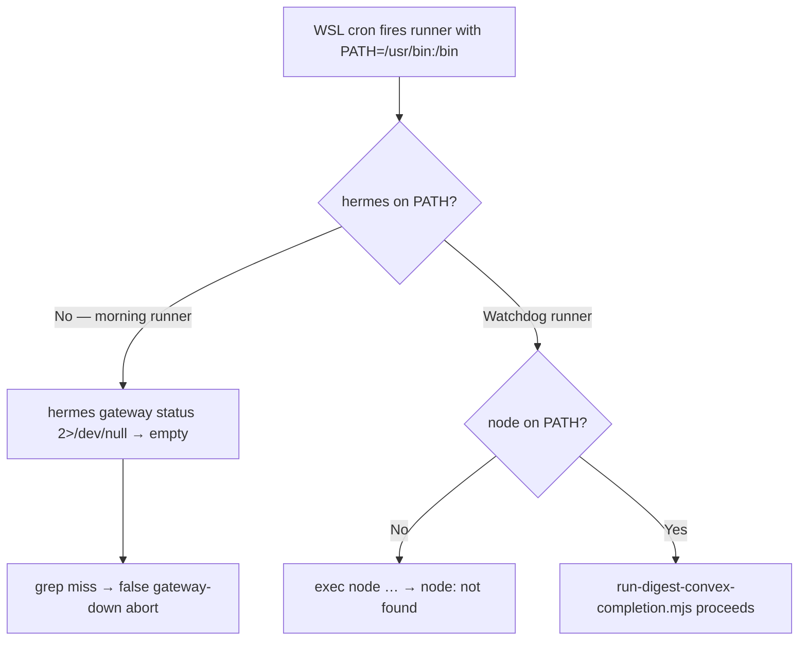

# Story 67.11: Fix Cron Environment PATH for Morning-Digest and Watchdog Scripts

Status: review

<!-- Ultimate context engine analysis completed — comprehensive developer guide created. -->

## Story

As a **CNS operator relying on WSL cron for morning-digest and Convex push watchdog**,
I want **both cron runner scripts to bootstrap NVM `node`, `hermes`, and systemd user-session env before doing any work**,
so that **07:00 / 07:15 / 13:00 / 18:30 cron jobs succeed under cron's minimal shell instead of failing silently**.

## Context

| Topic | Detail |
|-------|--------|
| **Epic** | Epic 67 — Signal Quality + Source Expansion — **67-11 is an ops hotfix discovered after 67-8 (gateway grep) and 67-10 (watchdog cron) shipped** |
| **Priority** | **P0** — cron jobs fail silently today; digest and Convex backfill never run |
| **Repo** | **Omnipotent.md only** — two bash cron wrappers; **no** Hermes skill, Convex, dashboard, or test file changes |
| **Predecessors** | **55-3** (morning cron runner); **67-8** (gateway grep fix — still fails if `hermes` not on PATH); **67-10** (watchdog cron + `run-digest-convex-completion.mjs`); **42-9** / **44-4-1** (established NVM PATH bootstrap pattern in sibling cron wrappers) |
| **Root cause (confirmed)** | WSL `cron` runs with a **minimal environment**: no NVM sourced, `~/.local/bin` absent from `PATH`, `XDG_RUNTIME_DIR` unset. Morning digest: `hermes gateway status` not found → `2>/dev/null` swallows error → grep fails → script aborts before digest. Watchdog: `exec node …` → `node: not found` → immediate death. |
| **Out of scope** | `install-morning-digest-cron.sh`; `hermes-morning-digest.sh`; contract test updates; Operator Guide; `deferred-work.md`; any file beyond the two runners listed below |

### Problem flow



### Sibling precedent (reuse — do not reinvent)

| Script | NVM PATH bootstrap | `~/.local/bin` | Notes |
|--------|-------------------|----------------|-------|
| `scripts/run-dashboard-sync-cron.sh` | ✅ lines 8–9 | ❌ (not needed for `npx`) | **Copy pattern** — dynamic `NODE_BIN` + fallback `v24.14.0` |
| `scripts/run-trend-ingest-cron.sh` | ❌ | ❌ | Uses system `python3` only |
| `scripts/run-morning-digest-cron.sh` | ❌ **broken** | ❌ **broken** | Needs `hermes` from `~/.local/bin` |
| `scripts/run-push-digest-watchdog-cron.sh` | ❌ **broken** | ❌ **broken** | Needs `node` from NVM |

**Operator paths (WSL):**

- `hermes` → `$HOME/.local/bin/hermes`
- `node` → `$HOME/.nvm/versions/node/v24.14.0/bin/node` (newest NVM install via `sort -V`)

## Acceptance Criteria

### 1. Morning digest runner succeeds from minimal env (AC: morning-minimal-env)

**Given** a shell with **no** NVM sourced and **no** `~/.local/bin` on `PATH` (simulate cron: `env -i HOME="$HOME" USER="$USER" LOGNAME="$LOGNAME" SHELL=/bin/bash`)
**When** the bootstrap block in `scripts/run-morning-digest-cron.sh` runs (extract and test, or run full script with valid `.env.live-chain` + job-id file + live gateway)
**Then** `command -v hermes` resolves to `$HOME/.local/bin/hermes` (or equivalent on PATH)
**And** `hermes gateway status` is invocable (not swallowed as "command not found")
**And** the script does **not** abort solely because `hermes` was missing from PATH

**Verification command (bootstrap only):**

```bash
env -i HOME="$HOME" USER="$USER" LOGNAME="${LOGNAME:-$USER}" SHELL=/bin/bash bash -c '
  set -euo pipefail
  # paste bootstrap lines from run-morning-digest-cron.sh here
  command -v hermes
  command -v node
'
```

### 2. Watchdog runner succeeds from minimal env (AC: watchdog-minimal-env)

**Given** the same minimal cron-like environment
**When** the bootstrap block in `scripts/run-push-digest-watchdog-cron.sh` runs
**Then** `command -v node` resolves to the NVM `node` binary
**And** `bash scripts/run-push-digest-watchdog-cron.sh` does **not** die with `node: not found` before entering `run-digest-convex-completion.mjs`

**Note:** Full watchdog success may still exit 0 with `skipped-no-convex-env` if `.env.live-chain` is absent — that is OK. AC is satisfied when `node` is found and the `.mjs` entrypoint executes.

### 3. Bootstrap placement and shape (AC: bootstrap-shape)

**Given** both runner scripts
**When** implementing the fix
**Then** insert the bootstrap block **immediately after** `set -euo pipefail` and **before** `REPO_ROOT=…`

**Morning script (`run-morning-digest-cron.sh`) — exactly 3 lines:**

```bash
NODE_BIN="$(ls -d "$HOME/.nvm/versions/node/"*/bin 2>/dev/null | sort -V | tail -1)"
export PATH="${NODE_BIN:-$HOME/.nvm/versions/node/v24.14.0/bin}:$HOME/.local/bin:${PATH:-}"
export XDG_RUNTIME_DIR="${XDG_RUNTIME_DIR:-/run/user/$(id -u)}"
```

**Watchdog script (`run-push-digest-watchdog-cron.sh`) — 2 lines (PATH only; no XDG_RUNTIME_DIR required):**

```bash
NODE_BIN="$(ls -d "$HOME/.nvm/versions/node/"*/bin 2>/dev/null | sort -V | tail -1)"
export PATH="${NODE_BIN:-$HOME/.nvm/versions/node/v24.14.0/bin}:$HOME/.local/bin:${PATH:-}"
```

**And** do **not** source NVM (`nvm.sh`) — hardcoded PATH prepend only (matches `run-dashboard-sync-cron.sh` posture).

**And** `XDG_RUNTIME_DIR` enables `hermes gateway status` to talk to the **user systemd** gateway service from cron (same session bus path interactive shells get via pam_systemd).

### 4. Verify gate passes (AC: verify)

**Given** changes are limited to the two runner scripts
**When** `bash scripts/verify.sh` runs
**Then** all tests pass with **no** modifications to test files

### 5. Scope lock (AC: scope)

**Given** this story's tight ops scope
**When** the story closes
**Then** **only** these files are modified:

| File | Action |
|------|--------|
| `scripts/run-morning-digest-cron.sh` | **UPDATE** — add 3-line bootstrap |
| `scripts/run-push-digest-watchdog-cron.sh` | **UPDATE** — add 2-line bootstrap |

**No** changes to `install-morning-digest-cron.sh`, tests, Operator Guide, or Hermes skill.

## Tasks / Subtasks

- [x] Add 3-line bootstrap to `scripts/run-morning-digest-cron.sh` after `set -euo pipefail` (AC: 1, 3)
- [x] Add 2-line bootstrap to `scripts/run-push-digest-watchdog-cron.sh` after `set -euo pipefail` (AC: 2, 3)
- [x] Verify minimal-env `command -v hermes` / `command -v node` (AC: 1, 2)
- [x] Run `bash scripts/verify.sh` (AC: 4)
- [x] Dev Agent Record: paste minimal-env test output (AC: 1, 2)

## Dev Notes

### Current broken state

**Morning runner** — `hermes` invoked with no PATH bootstrap:

```19:22:scripts/run-morning-digest-cron.sh
# Matches: "✓ User gateway service is running" (current) and legacy "gateway is running"
if ! hermes gateway status 2>/dev/null | grep -qiE 'gateway service is running|gateway is running'; then
  echo "run-morning-digest-cron: Hermes gateway is not running; aborting (no Discord delivery, no digest run)." >&2
  exit 1
```

Under cron: `hermes` not found → stderr discarded → grep on empty stdin → false "gateway not running".

**Watchdog runner** — `node` not on PATH:

```17:17:scripts/run-push-digest-watchdog-cron.sh
exec node "$REPO_ROOT/scripts/run-digest-convex-completion.mjs"
```

Under cron: immediate `node: not found` (often only visible in `push-digest-watchdog.log`).

### Implementation checklist

1. Open `scripts/run-dashboard-sync-cron.sh` — mirror lines 8–9, **add** `$HOME/.local/bin` to the `export PATH=…` segment.
2. Morning only: add `XDG_RUNTIME_DIR` as third line (systemd user session for `hermes gateway status`).
3. Do **not** add bootstrap to `install-morning-digest-cron.sh` — crontab already calls the runners; fix belongs in runners only.
4. Re-run install **not required** after this change (runner paths unchanged).

### Manual testing (operator machine)

```bash
# 1. Bootstrap smoke (must print paths, exit 0)
env -i HOME="$HOME" USER="$USER" bash -c '…bootstrap…; command -v hermes; command -v node'

# 2. Morning runner (needs .env.live-chain, job-id file, gateway running)
env -i HOME="$HOME" USER="$USER" bash scripts/run-morning-digest-cron.sh

# 3. Watchdog runner (should reach .mjs — not node: not found)
env -i HOME="$HOME" USER="$USER" bash scripts/run-push-digest-watchdog-cron.sh
echo "exit=$?"
```

### Previous story intelligence

| Story | Lesson |
|-------|--------|
| **67-8** | Fixed gateway **grep** false negative — but cron still fails earlier if `hermes` not on PATH; `2>/dev/null` masks "command not found" |
| **67-10** | Watchdog cron at 07:15 / 13:00 / 18:30 — runner never worked under real cron PATH |
| **55-3** | Established cron runner pattern; assumed interactive-shell PATH |
| **42-9** | Dashboard sync cron **required** NVM PATH export — same class of bug |
| **44-4-1** | Trend ingest cron hardens `/usr/bin` for `python3` — parallel precedent for minimal cron env |

### Architecture compliance

| Spec | Relevance |
|------|-----------|
| `project-context.md` | Verify gate before done |
| deferred-work.md §55-3 | Cron reliability theme — PATH gap distinct from gateway grep (67-8) |

**WriteGate / vault:** Not touched.

**Security:** No secrets in scripts; PATH hardening only.

### References

- [Source: `scripts/run-morning-digest-cron.sh`]
- [Source: `scripts/run-push-digest-watchdog-cron.sh`]
- [Source: `scripts/run-dashboard-sync-cron.sh`:8-9 — NVM PATH precedent]
- [Source: `_bmad-output/implementation-artifacts/67-8-fix-morning-digest-cron-gateway-check.md`]
- [Source: `_bmad-output/implementation-artifacts/67-10-push-watchdog-convex-push-failure-safe.md`]
- [Source: `_bmad-output/implementation-artifacts/55-3-morning-digest-cron-automation.md`]
- [Source: `_bmad-output/implementation-artifacts/42-9-vercel-production-deploy.md` — dashboard cron NVM fix]

## Dev Agent Record

### Agent Model Used

Claude Sonnet 4.6 (Cursor)

### Debug Log References

None — straight-line ops hotfix.

### Completion Notes List

- Added NVM + `~/.local/bin` PATH bootstrap immediately after `set -euo pipefail` in both cron runners (matches `run-dashboard-sync-cron.sh` precedent).
- Morning runner also exports `XDG_RUNTIME_DIR` for systemd user-session gateway checks.
- Minimal-env smoke tests pass; watchdog reaches `.mjs` entrypoint (exit 0) under `env -i`.
- `bash scripts/verify.sh` passed (exit 0).

**Minimal-env test output:**

```
hermes=/home/christ/.local/bin/hermes
node=/home/christ/.nvm/versions/node/v24.14.0/bin/node
XDG_RUNTIME_DIR=/run/user/1000
```

```
node=/home/christ/.nvm/versions/node/v24.14.0/bin/node
```

Watchdog under minimal env: `exit=0`

### File List

- `scripts/run-morning-digest-cron.sh` (modified)
- `scripts/run-push-digest-watchdog-cron.sh` (modified)

### Change Log

- 2026-06-11: Added NVM/`~/.local/bin` PATH bootstrap to morning-digest and push-digest-watchdog cron runners; morning runner adds `XDG_RUNTIME_DIR` for gateway status under cron.
