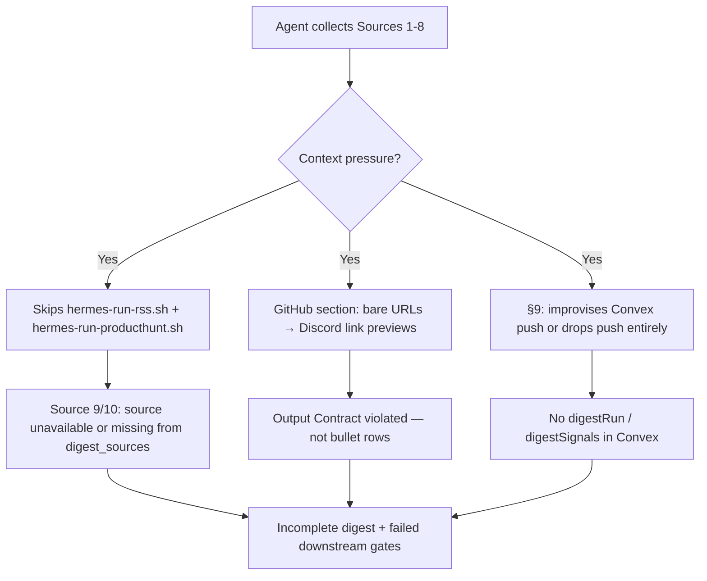

# Story 67.7: Fix Morning Digest Execution Reliability

Status: done

<!-- Ultimate context engine analysis completed — comprehensive developer guide created. -->

## Story

As a **CNS operator receiving the morning digest in `#hermes`**,
I want **Hermes agents to always fire Sources 9–10 terminals, post GitHub rows as bullet lines (not link previews), and invoke `push-digest-convex.mjs` via the exact §9 terminal template without improvisation**,
so that **live digest runs remain reliable under context pressure, Convex receives scored signals every run, and Discord output matches the Output Contract**.

## Context

| Topic | Detail |
|-------|--------|
| **Epic** | Epic 67 — Signal Quality + Source Expansion — **67-7 is a post-67-5 execution hotfix** (prompt-level; same bug class as 65-6 / 65-7 / 64-8) |
| **Repo** | **Omnipotent.md only** — `task-prompt.md`, `SKILL.md`, contract tests; **no** adapter script changes (`fetch-*.mjs`, `push-digest-convex.mjs`, wrappers) unless audit proves a script defect |
| **Predecessors** | **67-5** (Product Hunt Source 10); **67-5c** (Convex `producthunt` validators); **65-7** (Sources 7–9 imperative stdout threading — **mirror pattern for checklist + §9**); **64-8** (scoring stdout threading + push ordering); **05fc9f5** (pinned REQUIRED SOURCES checklist + Output Contract Sources 7–10) |
| **Root cause (confirmed — operator brief 2026-06-10)** | Under context compression, Hermes agents **deviate from `task-prompt.md`**: skip `hermes-run-rss.sh` / `hermes-run-producthunt.sh` terminals; post GitHub `url` values (Discord link previews) instead of `- owner/repo — N stars, M forks` bullets; **improvise §9 Convex push** (direct HTTP, MCP, or skip) instead of the mandated `push-digest-convex.mjs` terminal call |
| **Normative spec** | `architecture-epic-67-signal-quality-source-expansion.md` §1.1 (Sources 7–10); ADR-E67-001 (Node adapters only — no subprocess improvisation); `docs/ADR-E67-001-last30days-codebook-only.md` |
| **Out of scope** | `push-digest-convex.mjs` logic changes; cns-dashboard validators; Reddit OAuth (67-2); Compare smoke (67-6); new automation scripts; operator live re-validation (note in Completion Notes only) |

### Problem (observed live behavior)



**Regression is prompt/orchestration-level**, not adapter compute. Fixture tests for RSS, Product Hunt, and push scripts are already green.

### What already works (do not reimplement)

| Component | State |
|-----------|-------|
| `hermes-run-rss.sh` / `hermes-run-producthunt.sh` | Wrappers exec fetch scripts; exit 0 on failure |
| `fetch-rss-signals.mjs` / `fetch-producthunt-launches.mjs` | stdout contracts tested |
| `push-digest-convex.mjs` | `DIGEST_PUSH_JSON` → `createDigestRun` + `addDigestSignal` + `finalizeDigestRun`; always exit 0 |
| `task-prompt.md` Sources 9–10 | Imperative stdout threading blocks (65-7 / 67-5) |
| `task-prompt.md` REQUIRED SOURCES checklist | Steps 9–10 listed (commit `05fc9f5`) |
| `tests/hermes-morning-digest-skill.test.mjs` | Source 9/10 stdout threading tests; basic §9 push mentions |

**Gaps this story closes:**

1. **SKILL.md drift** — execution rule and inline contract **omit Source 10**; step 10 RSS says "continue to Source 6" (skips Product Hunt); Pitfalls lack Product Hunt threading.
2. **§9 lacks anti-improvisation guard** — unlike Sources 7–9 anti-patterns, no explicit "DO NOT call Convex HTTP directly / DO NOT skip `push-digest-convex.mjs`".
3. **Sources 9–10 lack terminal-fire confirmation** — checklist table exists but no imperative "terminal MUST fire before Source 6" gate mirroring 65-7's post-terminal blocks.
4. **GitHub Discord format** — no anti-pattern against bare `url` lines (Discord renders link preview embeds instead of `- title — stars/forks` bullets).

## Acceptance Criteria

### 1. Audit confirms orchestration gaps (AC: root cause)

**Given** `scripts/hermes-skill-examples/morning-digest/references/task-prompt.md` and `SKILL.md` on HEAD
**When** the dev agent audits against live failure modes (§9 improvisation, skipped Sources 9–10, GitHub link previews)
**Then** Dev Agent Record documents **confirmed** gaps: SKILL.md missing Source 10 terminal step; §9 missing DO NOT improvise guard; GitHub section missing bare-URL anti-pattern
**And** fix targets prompt/skill/contract tests only — not fetch or push scripts unless audit proves script bug

### 2. §9 push: exact terminal template + DO NOT improvise (AC: operator brief #1)

**Given** `task-prompt.md` § "Post-post — Push digest entities to Convex" (§9)
**When** hardened
**Then** a **pinned** subsection immediately before the push `terminal(...)` block states:

- **DO NOT improvise this call** — non-negotiable even under context compression
- **Forbidden:** direct `fetch` to Convex `/api/mutation`; MCP Convex tools; hand-rolled `createDigestRun` / `addDigestSignal` loops; summarizing push as "done" without a `terminal` invocation; substituting `log-notebook-query.mjs` or any other script for digest entity push
- **Required:** exactly one `terminal` call executing `node "$PUSH_SCRIPT"` where `PUSH_SCRIPT` resolves to `push-digest-convex.mjs` (repo path or `~/.hermes/skills/cns/morning-digest/scripts/` fallback)

**And** the normative command template is copy-paste exact (mirror scoring terminal pattern from 64-8):

```text
terminal(
  command="PUSH_SCRIPT=<shellQuote(push_script)> DIGEST_PUSH_JSON=<shellQuote(JSON.stringify(digest_push_payload))> node \"$PUSH_SCRIPT\"",
  workdir=resolved_repo_root,
  timeout=45
)
```

Where:

```text
push_script = resolved_repo_root + "/scripts/hermes-skill-examples/morning-digest/scripts/push-digest-convex.mjs"
```

**And** documentation includes imperative assignment steps (mirror 65-7):

1. Let `push_script` = path above (fallback only when repo path missing).
2. Ensure `digest_push_payload` is **post-scoring** (scoring stdout replacement completed).
3. **MUST** invoke the `terminal(...)` block above — no alternative transport.
4. Let `push_stdout` / exit code be observability only; fire-and-forget **result** handling unchanged.
5. **Anti-pattern:** Do not push digest entities by any path other than `push-digest-convex.mjs` with `DIGEST_PUSH_JSON`.

**And** Hard constraints item 9 and completion gate language cross-reference this pinned §9 block.

### 3. Sources 9–10: terminal-fire checklist hardening (AC: operator brief #2)

**Given** `task-prompt.md` REQUIRED SOURCES checklist and Sources 9–10 sections
**When** hardened
**Then** checklist rows for steps **9** and **10** include explicit **"MUST fire before Source 6"** language (not optional)
**And** each Source 9 / Source 10 section adds a one-line **pre-flight gate** after the `terminal(...)` command block:

- Source 9: *If `hermes-run-rss.sh` terminal has not fired, do not proceed to Source 10 or Source 6.*
- Source 10: *If `hermes-run-producthunt.sh` terminal has not fired, do not proceed to Source 6.*

**And** Source 6 opening paragraph states: *Prerequisite: terminals for Sources **9** and **10** have fired (success or `(source unavailable)` recorded).*

**And** pattern mirrors 65-7 imperative stdout blocks — table + section gates, not passive mentions only.

### 4. GitHub Discord output: bullets not link previews (AC: operator brief #3)

**Given** `task-prompt.md` Source 7 and Output Contract **GitHub** section
**When** hardened
**Then** Discord rendering rule is explicit:

- **Required bullet:** `- <title> — <stars> stars, <forks> forks` where `<title>` is `repos[].title` (owner/repo string)
- **Anti-pattern:** Do not post bare `repos[].url` lines, angle-bracket URLs, or markdown autolinks in the **GitHub** section — Discord renders **link preview cards** instead of contract bullets
- `url` is for §9 `digest_push_payload` / Convex only — not for Discord display

**And** Output Contract example under **GitHub** repeats the bullet format (no URL-only lines)
**And** SKILL.md inline Source 7 step includes the same anti-pattern (one line minimum)

### 5. SKILL.md mirror + version bump (AC: skill parity)

**Given** `scripts/hermes-skill-examples/morning-digest/SKILL.md` (currently `version: 1.4.5`)
**When** this story completes
**Then**:

- Execution rule numbered list includes **Source 10** terminal: `hermes-run-producthunt.sh` between RSS (9) and vault-context build
- Inline contract step for Product Hunt added (mirror task-prompt Source 10 imperative block summary)
- Inline RSS step says **continue to Source 10** (not Source 6)
- Vault context step says **after Source 10 completes**
- Output contract fallback template includes **GitHub**, **Reddit**, **Newsletters / RSS**, **Product Hunt** section headers
- Pitfalls adds **Product Hunt stdout threading (Source 10)** and **§9 push — DO NOT improvise** guardrails
- Pitfalls adds **GitHub Discord format — no bare URLs**
- Version bump to **1.4.6** (or next patch)

### 6. Contract tests: regression lock (AC: contract lock)

**Given** `tests/hermes-morning-digest-skill.test.mjs`
**When** this story completes
**Then** new or extended tests assert:

| Test name | Slice | Required strings |
|-----------|-------|------------------|
| `task-prompt §9 documents non-improvisable push-digest-convex terminal (Story 67-7)` | `## Post-post — Push digest entities` → keyword candidates section | `DO NOT improvise`, `push-digest-convex.mjs`, `PUSH_SCRIPT`, `node \"$PUSH_SCRIPT\"`, forbidden direct Convex / anti-improvisation |
| `task-prompt Sources 9-10 terminal-fire gates (Story 67-7)` | REQUIRED SOURCES table + Source 9/10 sections | `hermes-run-rss.sh`, `hermes-run-producthunt.sh`, `MUST fire` or `has not fired`, Source 6 prerequisite |
| `task-prompt GitHub Discord bullets not bare URLs (Story 67-7)` | Source 7 + Output Contract GitHub | `link preview` or `bare url`, bullet format `stars`, `forks`, anti-pattern against posting `url` in Discord |

**And** optional SKILL.md assertions: Source 10 terminal step, §9 DO NOT improvise pitfall, GitHub URL anti-pattern
**And** tests **fail on pre-fix HEAD** for new strings and **pass after fix**

### 7. Scope boundary and verify gate (AC: verify)

**Given** implementation complete
**When** inspecting diffs
**Then** `fetch-*.mjs`, `push-digest-convex.mjs`, `push-keyword-candidates.mjs`, and session-close wrappers are **unchanged** unless audit proves script bug with failing test
**And** `bash scripts/install-hermes-skill-morning-digest.sh` run after task-prompt / SKILL edits
**And** `bash scripts/verify.sh` green (Omnipotent.md `npm test` + sibling cns-dashboard when present)

## Tasks / Subtasks

- [x] **T1** Audit live failure modes vs task-prompt + SKILL.md; document confirmed gaps in Dev Agent Record (AC: 1)
- [x] **T2** Harden `task-prompt.md` §9 push block (AC: 2)
  - [x] Add pinned DO NOT improvise subsection + forbidden alternatives list
  - [x] Add imperative `push_script` → `terminal(...)` steps mirroring 64-8/65-7
  - [x] Cross-link Hard constraints #9 and completion gate
- [x] **T3** Harden Sources 9–10 terminal-fire gates (AC: 3)
  - [x] Strengthen REQUIRED SOURCES table rows 9–10
  - [x] Add pre-flight gates in Source 9, Source 10, Source 6 prerequisite line
- [x] **T4** Fix GitHub Discord output anti-pattern (AC: 4)
  - [x] Source 7 bullet rule + bare URL anti-pattern
  - [x] Output Contract GitHub example alignment
- [x] **T5** Update `SKILL.md` mirror + version bump to 1.4.6 (AC: 5)
  - [x] Add Source 10 execution + inline steps
  - [x] Fix RSS → Source 10 → Source 6 ordering
  - [x] Pitfalls: Product Hunt threading, §9 anti-improvisation, GitHub URL format
  - [x] Extend inline output contract with Sources 7–10 sections
- [x] **T6** Extend `hermes-morning-digest-skill.test.mjs` with Story 67-7 contract tests (AC: 6)
- [x] **T7** Hermes skill sync + verify gate (AC: 7)
  - [x] `bash scripts/install-hermes-skill-morning-digest.sh`
  - [x] `bash scripts/verify.sh`

## Dev Notes

### Architecture compliance (normative)

| ADR / Section | Requirement for 67-7 |
|---------------|---------------------|
| ADR-E67-001 | Node `.mjs` adapters only — §9 must use `push-digest-convex.mjs`, not improvised HTTP |
| architecture-epic-67 §1.1 | Sources 7–10 validated in pipeline; Source 6 runs after 10 |
| 65-7 pattern | Imperative gates + anti-patterns for Hermes agents under context pressure |
| 64-8 pattern | Scoring stdout threading before push; post-scoring `DIGEST_PUSH_JSON` |
| WriteGate | **Not touched** — no vault mutations |
| security.md / audit | **Not touched** |

### Current file state — what to change

#### `task-prompt.md` §9 (UPDATE — primary deliverable)

**Today:** Push section has `terminal(...)` template and fire-and-forget semantics but agents still improvise under compression. Missing:

- Explicit **DO NOT improvise** header (like testarch "CRITICAL: Follow this sequence exactly")
- Forbidden alternatives enumeration
- Imperative numbered steps binding `push_script` path before `terminal` call

**Contrast — working pattern (64-8 scoring):**

```631:640:scripts/hermes-skill-examples/morning-digest/references/task-prompt.md
**After the scoring terminal returns** (mandatory stdout threading — mirror Source 6 pick/query stdout patterns):

1. Let `score_stdout` = scoring terminal **stdout** (trim whitespace; stderr is observability only).
2. Try `scored_signals = JSON.parse(score_stdout)`.
...
6. **Anti-pattern:** Do not pass pre-scoring `digest_push_payload.signals` to `push-digest-convex.mjs` when step 3 assigned scored signals.
```

**Target:** Apply same imperative + anti-pattern structure to the **push terminal invocation itself** (not just scoring → push ordering).

#### `task-prompt.md` REQUIRED SOURCES checklist (UPDATE)

**Today (post-05fc9f5):** Table lists steps 9–10 with wrapper commands. Agents still skip under compression.

**Target:** Add bold gate text under table:

```text
**Steps 9–10 gate:** Sources 9 and 10 terminals MUST fire (and record success or `(source unavailable)`) before Source 6 or Discord post. Skipping either terminal invalidates the run.
```

#### `task-prompt.md` Source 7 GitHub (UPDATE)

**Today:** Bullet format documented (`- <title> — <stars> stars, <forks> forks`) but no Discord link-preview anti-pattern.

**Observed failure:** Agent emits `https://github.com/owner/repo` per line → Discord link preview cards.

**Target anti-pattern line:**

```text
**Anti-pattern (Discord):** Do not post bare `url` values or autolinked URLs in **GitHub** — use `title` (owner/repo) in bullet text only; `url` is for §9 Convex mapping.
```

#### `SKILL.md` (UPDATE — critical drift)

**Confirmed gaps on HEAD:**

| Location | Problem |
|----------|---------|
| Execution rule steps 9–10 | Step 9 = RSS; step 10 = "Build trend/headline..." — **no Product Hunt terminal** |
| Inline step 10 | RSS ends with "continue to Source 6" — **skips Source 10** |
| Inline output template | Missing GitHub, Reddit, RSS, Product Hunt sections |
| Pitfalls | No Product Hunt; no §9 anti-improvisation; no GitHub URL format |

**Target:** Align numbered steps with task-prompt order: … → 9 RSS → 10 Product Hunt → 11 vault context (pick/query) → … → push steps unchanged.

#### Scripts (NO CHANGE expected)

| File | Reason |
|------|--------|
| `push-digest-convex.mjs` | Script is SSOT for Convex push; improvisation is agent-side |
| `fetch-rss-signals.mjs` / `fetch-producthunt-launches.mjs` | Adapter tests green |
| `hermes-run-rss.sh` / `hermes-run-producthunt.sh` | Wrappers healthy |

### Contract test implementation sketch

```javascript
// tests/hermes-morning-digest-skill.test.mjs

it("task-prompt §9 documents non-improvisable push-digest-convex terminal (Story 67-7)", () => {
  const taskBody = readFileSync(taskPromptPath, "utf8");
  const postPost = taskBody.slice(
    taskBody.indexOf("## Post-post — Push digest entities to Convex"),
    taskBody.indexOf("## Post-post — Push keyword candidates to Convex"),
  );
  assert.ok(/DO NOT improvise/i.test(postPost));
  assert.ok(postPost.includes('node "$PUSH_SCRIPT"') || postPost.includes("node \\\"$PUSH_SCRIPT\\\""));
  assert.ok(/Forbidden|Do not push digest entities by any path other than/i.test(postPost));
  assert.ok(postPost.includes("push-digest-convex.mjs"));
});

it("task-prompt Sources 9-10 terminal-fire gates (Story 67-7)", () => {
  const taskBody = readFileSync(taskPromptPath, "utf8");
  assert.ok(taskBody.includes("hermes-run-rss.sh"));
  assert.ok(taskBody.includes("hermes-run-producthunt.sh"));
  assert.ok(/MUST fire|has not fired|Prerequisite/i.test(taskBody));
  const source6 = taskBody.slice(taskBody.indexOf("## Source 6"), taskBody.indexOf("## Output contract"));
  assert.ok(/Source 10|Sources 9/.test(source6));
});

it("task-prompt GitHub Discord bullets not bare URLs (Story 67-7)", () => {
  const taskBody = readFileSync(taskPromptPath, "utf8");
  const source7End = taskBody.indexOf("## Source 8");
  const source7 = taskBody.slice(taskBody.indexOf("## Source 7"), source7End);
  const outputContract = taskBody.slice(taskBody.indexOf("## Output contract"));
  assert.ok(/link preview|bare.*url|Do not post bare/i.test(source7 + outputContract));
  assert.ok(source7.includes("stars") && source7.includes("forks"));
});
```

Adjust assertions to match final prose — tests must fail before fix.

### Previous story intelligence

**65-7 (done):** Established imperative stdout threading + anti-patterns for Sources 7–9. **67-7 extends the same pattern** to (a) terminal-fire gates for Sources 9–10, (b) §9 push non-improvisation, (c) GitHub Discord formatting.

**64-8 (done):** Scoring stdout → `digest_push_payload.signals` replacement before push. **67-7 does not change scoring** — only ensures push terminal actually fires with post-scoring JSON.

**67-5 / 67-5c (done):** Product Hunt adapter + Convex validators. Live runs still skip Source 10 when SKILL.md omits the terminal step — **67-7 fixes SKILL drift**.

**05fc9f5 (2026-06-10):** Added REQUIRED SOURCES checklist + Output Contract Sources 7–10. Insufficient alone — agents still deviate; **67-7 adds imperative guards**.

### Git intelligence

Recent commits (newest first):

- `05fc9f5` — Output Contract Sources 7–10 + pinned completion checklist
- `33f3e99` / `c2c64ab` — 67-5 ProductHunt adapter Source 10
- `739c16a` — 67-3 personalRelevance v2

Follow 65-7 / 64-8 patterns: Omnipotent.md only, node:test contract tests, Hermes skill sync mandatory, no new dependencies.

### Project structure

| File | Action |
|------|--------|
| `scripts/hermes-skill-examples/morning-digest/references/task-prompt.md` | **UPDATE** — §9 anti-improvisation, Sources 9–10 gates, GitHub format |
| `scripts/hermes-skill-examples/morning-digest/SKILL.md` | **UPDATE** — Source 10 steps, pitfalls, output template, v1.4.6 |
| `tests/hermes-morning-digest-skill.test.mjs` | **EXTEND** — Story 67-7 contract tests (3 cases) |
| `scripts/hermes-skill-examples/morning-digest/scripts/push-digest-convex.mjs` | **NO CHANGE** |
| `scripts/session-close/hermes-run-rss.sh` | **NO CHANGE** |
| `scripts/session-close/hermes-run-producthunt.sh` | **NO CHANGE** |

### Testing standards

- `npm test` discovers `tests/**/*.test.mjs` automatically
- No live network / Hermes gateway required for contract tests
- `bash scripts/verify.sh` is the done gate
- Existing 65-7, 67-5, 61-5, 64-8 contract tests must remain green

### WriteGate / security

**No operator approval required** — task-prompt and SKILL mirror only; no `vault_log_action`, `security.md`, or MCP tool signature changes.

### References

- [Source: operator brief 2026-06-10 — §9 improvisation, Sources 9–10 skips, GitHub link previews]
- [Source: `_bmad-output/implementation-artifacts/65-7-imperative-stdout-threading-sources-7-9.md` — pattern template]
- [Source: `_bmad-output/implementation-artifacts/64-8-fix-scoring-pipeline-push-threading.md` — scoring → push ordering]
- [Source: `_bmad-output/implementation-artifacts/67-5-producthunt-adapter-source-10.md` — Source 10 contract]
- [Source: `scripts/hermes-skill-examples/morning-digest/references/task-prompt.md` — §9, Sources 7–10, checklist]
- [Source: `scripts/hermes-skill-examples/morning-digest/SKILL.md` — drift: missing Source 10]
- [Source: `tests/hermes-morning-digest-skill.test.mjs` — extend with 67-7 tests]
- [Source: `docs/ADR-E67-001-last30days-codebook-only.md` — no improvised subprocess/HTTP paths]
- [Source: `_bmad-output/planning-artifacts/architecture-epic-67-signal-quality-source-expansion.md` §1.1]

## Dev Agent Record

### Agent Model Used

Claude Sonnet 4.6 (Cursor Agent)

### Debug Log References

- Initial verify failure: Hard constraints #9 cross-link used exact `## Post-post — Push digest entities to Convex` substring, breaking `indexOf`-based contract tests (61-5, 64-8). Reworded to "post-post digest entity push section".

### Completion Notes List

- **T1 audit (confirmed gaps on baseline `05fc9f5`):** SKILL.md omitted Source 10 terminal step; inline RSS step jumped to Source 6; Pitfalls lacked Product Hunt threading, §9 anti-improvisation, GitHub URL format; inline output template missing Sources 7–10; task-prompt §9 lacked DO NOT improvise guard; Sources 9–10 lacked terminal-fire gates; Source 7 lacked Discord link-preview anti-pattern.
- **T2–T4:** Hardened `task-prompt.md` with pinned §9 DO NOT improvise block, imperative push steps, Hard constraints #9 cross-link, Steps 9–10 gate, pre-flight gates, Source 6 prerequisite, GitHub bare-URL anti-pattern + Output Contract note.
- **T5:** SKILL.md v1.4.6 — Source 10 execution/inline steps, corrected ordering, extended output template, new pitfalls.
- **T6:** Four contract tests (3 task-prompt + 1 SKILL.md guardrails).
- **pick-signal-routing.md:** Added one-line pitfall — Source 6 before Sources 9–10 yields incomplete `digest_sources`.
- **T7:** Hermes skill synced; `bash scripts/verify.sh` green (Omnipotent.md + cns-dashboard).
- Operator live re-validation on next `#hermes` digest run recommended (out of scope for this story).

### File List

- `scripts/hermes-skill-examples/morning-digest/references/task-prompt.md`
- `scripts/hermes-skill-examples/morning-digest/SKILL.md`
- `scripts/hermes-skill-examples/morning-digest/references/pick-signal-routing.md`
- `tests/hermes-morning-digest-skill.test.mjs`
- `_bmad-output/implementation-artifacts/sprint-status.yaml`

### Review Findings

- [x] [Review][Patch] Contract tests are presence-only — wrong §9 push template still passes [`tests/hermes-morning-digest-skill.test.mjs`:631]
- [x] [Review][Patch] Contract tests do not assert exact `terminal(...)` push template shape (timeout, `shellQuote`, multiline block) [`tests/hermes-morning-digest-skill.test.mjs`:631]
- [x] [Review][Patch] Sources 9–10 gate test passes after removing Source 6 prerequisite or checklist MUST-fire rows (redundant matchers) [`tests/hermes-morning-digest-skill.test.mjs`:648]
- [x] [Review][Patch] GitHub anti-pattern test passes when Source 7 anti-pattern removed (Output Contract substring still matches) [`tests/hermes-morning-digest-skill.test.mjs`:659]
- [x] [Review][Patch] §9 Forbidden list omits explicit hand-rolled `node -e` Convex push improvisation [`task-prompt.md`:670]
- [x] [Review][Patch] `pick-signal-routing.md` pitfall uses soft "always fire" wording, not hard gate language matching task-prompt [`pick-signal-routing.md`:13]
- [x] [Review][Patch] SKILL.md execution rule lacks literal strict collection order `1 → 2 → 3 → 4 → 5 → 7 → 8 → 9 → 10 → 6` mirrored from task-prompt [`SKILL.md`:25]
- [x] [Review][Patch] GitHub anti-pattern prose uses "Do not post bare" not operator-requested "DO NOT post bare URLs or link previews" phrasing [`task-prompt.md`:204]

## Change Log

- 2026-06-10 — Story 67-7 created: morning digest execution reliability hotfix (§9 anti-improvisation, Sources 9–10 terminal gates, GitHub bullet format); Omnipotent.md task-prompt hardening only.
- 2026-06-10 — Story 67-7 implemented: prompt/skill hardening, contract tests, pick-signal-routing pitfall, SKILL v1.4.6; verify green.
- 2026-06-10 — Code review patches applied: structural contract tests, `node -e` forbidden, hard gate wording, strict collection order in SKILL, GitHub DO NOT phrasing; verify green.
