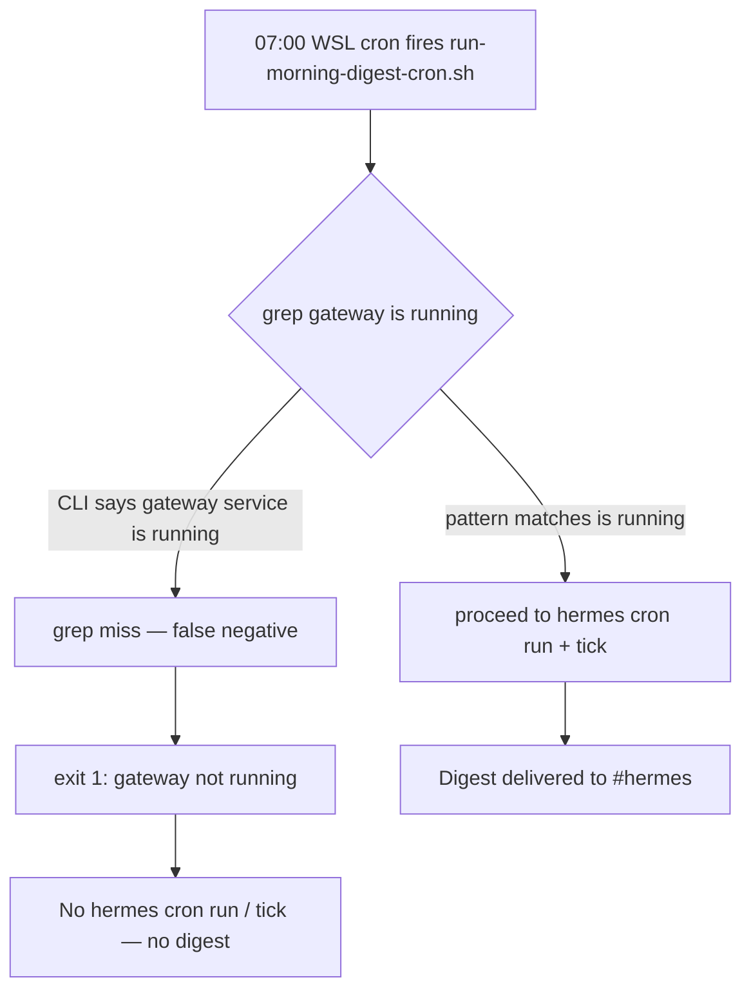

# Story 67.8: Fix Morning Digest Cron Gateway Check

Status: done

<!-- Ultimate context engine analysis completed — comprehensive developer guide created. -->

## Story

As a **CNS operator relying on the 07:00 morning-digest cron**,
I want **`run-morning-digest-cron.sh` to detect a live Hermes gateway using the current CLI output**,
so that **the digest runs every morning instead of aborting with a false "gateway is not running" error**.

## Context

| Topic | Detail |
|-------|--------|
| **Epic** | Epic 67 — Signal Quality + Source Expansion — **67-8 is an ops hotfix discovered during 2026-06-11 live validation** (deferred-work.md §Session kickoff 2026-06-11) |
| **Priority** | **P0** — blocks automated morning digest entirely |
| **Repo** | **Omnipotent.md only** — shell scripts + contract tests; no Hermes skill/task-prompt changes |
| **Predecessors** | **55-3** (cron runner + gateway gate); **36-1** (gateway launcher — deferred "fragile status grep"); **67-7** (prompt hardening — unrelated to this shell bug) |
| **Root cause (confirmed)** | `scripts/run-morning-digest-cron.sh` line 19 greps for substring **`gateway is running`**. Current Hermes CLI (systemd user service) prints **`✓ User gateway service is running`**. The literal phrase `gateway is running` is **not** a substring of `gateway service is running` → grep fails → cron aborts even when gateway is healthy. |
| **Evidence** | Live `hermes gateway status` on 2026-06-11: running state shows `✓ User gateway service is running`; stopped state shows `✗ User gateway service is stopped`. Exit code is **0 in both states** — cannot rely on exit code alone. |
| **Out of scope** | `hermes-gateway-start.sh` stale-PID recovery (**67-9**); task-prompt / SKILL.md changes; Convex; dashboard; Operator Guide unless AC requires a one-line grep note |

### Problem flow



### Sibling scripts (same bug class — fix in this story)

| Script | Line | Same grep? |
|--------|------|------------|
| `scripts/run-morning-digest-cron.sh` | 19 | **Primary** — Story 55-3 AC |
| `scripts/hermes-morning-digest.sh` | 22 | Yes — legacy Mode B runner; same false abort |

**Do not change** `scripts/hermes-gateway-start.sh` here — that is **67-9** (stale PID + launcher recovery).

## Acceptance Criteria

### 1. Cron runner accepts live gateway status (AC: cron-runner)

**Given** `hermes gateway status` reports `✓ User gateway service is running` (current Hermes systemd output)
**When** `bash scripts/run-morning-digest-cron.sh` runs with valid `.env.live-chain` and job-id file
**Then** the gateway preflight **does not** abort with "Hermes gateway is not running"
**And** the script proceeds to `hermes cron run` + `hermes cron tick` (may still fail on other missing deps — gateway gate must pass)

**Given** `hermes gateway status` reports `✗ User gateway service is stopped` (or equivalent not-running line)
**When** the cron runner executes
**Then** it exits **non-zero** with the existing abort message posture (no digest run when gateway truly down)

### 2. Robust running detection (AC: detection-pattern)

**Given** Hermes may change minor status formatting but retain semantic running/stopped markers
**When** implementing the fix
**Then** use a pattern that matches **current and prior** outputs, e.g.:
- **Preferred:** `grep -qiE 'gateway service is running|gateway is running'` (covers old + new text), **or**
- `grep -qi 'is running'` with a guard that stopped output (`is stopped`) does not false-positive — verify stopped line does not contain `is running`
**And** document the chosen pattern in Dev Agent Record with sample stdout from both states

**And** do **not** use `hermes gateway status` exit code alone (returns 0 when stopped on current install).

### 3. Legacy runner parity (AC: mode-b)

**Given** `scripts/hermes-morning-digest.sh` uses the same brittle grep
**When** this story closes
**Then** both cron runners share the **same** gateway-running helper or identical grep pattern (extract shared function only if it reduces duplication without over-engineering — inline matching both files is acceptable)

### 4. Contract tests updated (AC: verify)

**Given** `tests/hermes-morning-digest-skill.test.mjs` Story 55-3 case asserts `runBody.includes("gateway is running")`
**When** tests run
**Then** assertions reflect the **new** detection pattern (not the broken substring)
**And** `npm test` + `bash scripts/verify.sh` pass

### 5. No regression on gateway-down posture (AC: fail-closed)

**Given** gateway is genuinely stopped
**When** cron runner runs
**Then** behavior remains **fail-closed** — no silent skip; stderr explains gateway dependency (55-3 AC preserved)

## Tasks / Subtasks

- [x] Reproduce false negative: capture `hermes gateway status` stdout when running; confirm grep `gateway is running` fails (AC: 1)
- [x] Fix `scripts/run-morning-digest-cron.sh` gateway preflight (AC: 1, 2)
- [x] Fix `scripts/hermes-morning-digest.sh` gateway preflight (AC: 3)
- [x] Update `tests/hermes-morning-digest-skill.test.mjs` contract assertion (AC: 4)
- [x] Run `npm test` + `bash scripts/verify.sh` (AC: 4)
- [x] Dev Agent Record: paste before/after grep test commands (AC: 2)

## Dev Notes

### Current broken code

```19:22:scripts/run-morning-digest-cron.sh
if ! hermes gateway status 2>/dev/null | grep -qi "gateway is running"; then
  echo "run-morning-digest-cron: Hermes gateway is not running; aborting (no Discord delivery, no digest run)." >&2
  exit 1
fi
```

### Recommended fix (normative for dev agent)

```bash
# Matches: "✓ User gateway service is running" (current) and legacy "gateway is running"
if ! hermes gateway status 2>/dev/null | grep -qiE 'gateway service is running|gateway is running'; then
```

Verify stopped state:
```bash
hermes gateway status 2>&1 | grep -qi 'is running'  # must be false when stopped
```

### Files to touch

| File | Action |
|------|--------|
| `scripts/run-morning-digest-cron.sh` | **UPDATE** — gateway preflight |
| `scripts/hermes-morning-digest.sh` | **UPDATE** — same preflight |
| `tests/hermes-morning-digest-skill.test.mjs` | **UPDATE** — contract test ~L289 |

### Testing

```bash
# Unit/contract
npm test
bash scripts/verify.sh

# Manual (gateway must be running)
hermes gateway status
bash scripts/run-morning-digest-cron.sh
```

### Previous story intelligence

- **55-3** Dev Record noted gateway grep "correctly aborts when gateway down" on an install where status text already diverged — the false negative was latent until systemd wording shipped.
- **36-1** review deferred "Fragile `hermes gateway status` text/PID parsing" — this story closes that deferral for **cron runners only**.
- **deferred-work.md** §55-3: "Gateway status grep substring brittleness — matches existing 26-7 launcher pattern" — partially addressed here (cron); launcher in 67-9.

### References

- [Source: `scripts/run-morning-digest-cron.sh`:19-22]
- [Source: `scripts/hermes-morning-digest.sh`:22-24]
- [Source: `_bmad-output/implementation-artifacts/55-3-morning-digest-cron-automation.md` — Gateway + env table]
- [Source: `_bmad-output/implementation-artifacts/deferred-work.md` — Session kickoff 2026-06-11]
- [Source: `_bmad-output/implementation-artifacts/36-1-sprint-hygiene-hermes-gateway-auto-start.md` — deferred fragile grep]

## Dev Agent Record

### Agent Model Used

Claude Sonnet 4.6 (Cursor)

### Debug Log References

**Grep reproduction (gateway running, 2026-06-11):**
```
hermes gateway status stdout ends with: "✓ User gateway service is running"
Old: hermes gateway status 2>/dev/null | grep -qi "gateway is running"  → NO MATCH
New: hermes gateway status 2>/dev/null | grep -qiE 'gateway service is running|gateway is running'  → MATCH
Stopped guard: echo "✗ User gateway service is stopped" | grep -qi 'is running'  → NO FALSE POSITIVE
```

### Completion Notes List

- Replaced brittle `grep -qi "gateway is running"` with `grep -qiE 'gateway service is running|gateway is running'` in both cron runners (`run-morning-digest-cron.sh`, `hermes-morning-digest.sh`).
- Pattern matches current systemd output (`✓ User gateway service is running`) and legacy text; stopped state (`is stopped`) does not false-positive on `is running`.
- Contract test updated to assert new regex pattern in `run-morning-digest-cron.sh`.
- `npm test` and `bash scripts/verify.sh` pass.

### File List

- `scripts/run-morning-digest-cron.sh` (modified)
- `scripts/hermes-morning-digest.sh` (modified)
- `tests/hermes-morning-digest-skill.test.mjs` (modified)

### Change Log

- 2026-06-11: Fix morning-digest cron gateway preflight grep for current Hermes systemd status output (Story 67-8).
- 2026-06-11: Code review passed — status → done.

### Review Findings

- [x] [Review][Defer] `2>/dev/null` masks `hermes gateway status` errors [scripts/run-morning-digest-cron.sh:20] — deferred, pre-existing (55-3)
- [x] [Review][Defer] No behavioral mock tests for gateway preflight [tests/hermes-morning-digest-skill.test.mjs] — deferred, contract-test pattern per AC verify
- [x] [Review][Defer] Gateway status text coupling — future CLI format changes [scripts/*.sh] — deferred, acknowledged in 36-1 / 67-9 scope
- [x] [Review][Defer] No retry loop on transient gateway blip [scripts/*.sh] — deferred, out of scope for P0 hotfix
