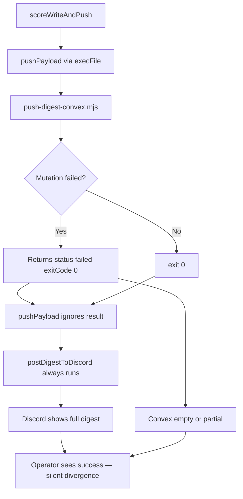
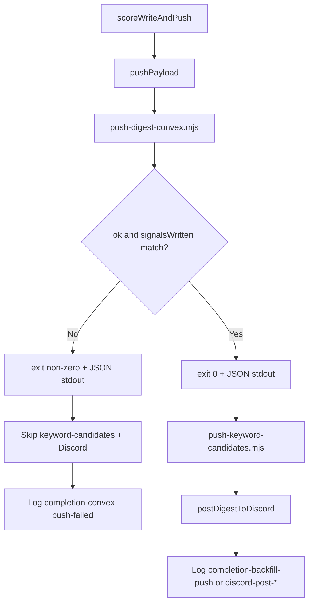

# Story 71.2: `pushPayload` Result Check — Gate Discord on Convex Outcome

Status: done

<!-- Ultimate context engine analysis completed — comprehensive developer guide created. -->

## Story

As a **CNS operator who trusts that Discord and Nexus show the same digest**,
I want **`push-digest-convex.mjs` to surface real failure via exit code + structured stdout and `run-digest-convex-completion.mjs` to skip Discord when Convex push fails or is partial**,
so that **a full digest never posts to `#hermes` while Convex has zero or partial rows for that date — and failed pushes are logged as retryable instead of `completion-backfill-push` success**.

## Context

| Topic | Detail |
|-------|--------|
| **Epic** | Epic 71 — Digest Job-State & Watchdog Truth |
| **Priority** | **P0 hotfix** — audit item #2; worst silent divergence (Discord full, Convex empty/partial) |
| **Repo** | **Omnipotent.md only** — no cns-dashboard schema changes |
| **Sequencing** | **First story in Epic 71** (before 71-1). User directive: land with `bash scripts/verify.sh` green before touching 71-1 |
| **Predecessors** | **70-2** (`postDigestToDiscord` after push); **68-10** (`run-digest-convex-completion.mjs` pipeline); **67-10** (`push-digest-convex.mjs` + watchdog spawn) |
| **Out of scope** | 71-1 `started`-state retry eligibility; 71-3 structured outcome JSON file + post-cron alert; 71-4 Discord-only repair; changing Convex mutations; keyword-candidates watchdog |

### Problem flow (today)



### Target flow (after 71-2)



## Acceptance Criteria

### 1. Structured push result + real exit codes (AC: push-script-contract)

**Given** `push-digest-convex.mjs` runs (CLI or imported `pushDigestToConvex`)
**When** the push completes on any path
**Then** it prints **one line of JSON to stdout** (machine-parseable, no other stdout noise):

```json
{ "ok": true, "runId": "...", "signalsWritten": 71, "error": null }
```

or on failure:

```json
{ "ok": false, "runId": "...", "signalsWritten": 3, "error": "Convex HTTP 500: ..." }
```

**And** field rules:
- `ok`: `true` only when create + all signals + finalize(`published`) succeed **and** `signalsWritten === payload.signals.length` (count only valid signal objects actually sent to `addDigestSignal`)
- `runId`: Convex `createDigestRun` id when created; `null` if create never succeeded
- `signalsWritten`: number of successful `addDigestSignal` mutations (0 on create failure)
- `error`: short string on failure; `null` on success

**And** process exit code:
- `0` when `ok: true`
- `1` on any mutation failure, network/auth error, validator rejection, or partial write (`signalsWritten < signals.length`)
- `2` on invalid input (`missing run.date`, unparseable `DIGEST_PUSH_JSON`)
- `0` with `{ ok: false, error: "missing-convex-env" }` when `CONVEX_URL` / `CONVEX_DEPLOY_KEY` absent — **preserve existing skip posture** (no fetch attempted; not a mutation failure)

**And** stderr retains human-readable `console.error` warnings (existing pattern) — stdout is **only** the JSON line for CLI consumers.

**And** `pushDigestToConvex()` return value aligns with stdout shape (export a shared formatter) so tests can import without spawning.

### 2. Orchestrator gates Discord on Convex outcome (AC: discord-gate)

**Given** `run-digest-convex-completion.mjs` reaches `scoreWriteAndPush` after artifact write
**When** `pushPayload` runs
**Then** it captures stdout from `push-digest-convex.mjs` (or calls `pushDigestToConvex` in a test-injectable path) and parses the JSON result
**And** if `ok: false` (including non-zero child exit):
- **Does not** call `postDigestToDiscord`
- **Does not** call `push-keyword-candidates.mjs` (§10 is downstream of successful §9)
- Logs `completion-convex-push-failed` with detail containing `error` and `signalsWritten` (truncated)
- Returns `{ action: 'completion-convex-push-failed', exitCode: 0 }` — preserve fire-and-forget cron posture for the **orchestrator process**; truth is in log action + push script exit code
**And** if `ok: true`:
- Proceeds to `push-keyword-candidates.mjs` then `postDigestToDiscord` (existing order)
- Logs `completion-backfill-push` / `discord-post-ok` / `discord-post-failed` as today

**And** partial-write detection: if `ok: true` in JSON but `signalsWritten !== payload.signals.length`, treat as `ok: false` (defensive — push script should already set `ok: false`, orchestrator double-checks).

### 3. Watchdog spawn benefits from non-zero exit (AC: watchdog-compat)

**Given** `push-digest-watchdog.mjs` spawns `push-digest-convex.mjs` via `spawnPushDigest`
**When** push fails
**Then** `pushExitCode !== 0` and watchdog logs `recovered-push-failed` (existing branch at line 245 — **no watchdog code change required** unless tests assumed exit 0 on failure)

### 4. Regression tests (AC: tests)

**New/updated tests must pass under `npm test` / `bash scripts/verify.sh`:**

| Test file | Scenario |
|-----------|----------|
| `tests/morning-digest-push-convex.test.mjs` | Failed create → `exitCode: 1`, stdout JSON `ok: false`; failed add → non-zero exit; happy path → `ok: true`, `signalsWritten` matches signal count |
| `tests/morning-digest-push-convex.test.mjs` | Partial write mock (add fails mid-loop) → `signalsWritten < length`, `ok: false`, exit `1` |
| `tests/morning-digest-push-convex.test.mjs` | Missing Convex env → exit `0`, `ok: false`, reason `missing-convex-env` (skip posture preserved) |
| `tests/run-digest-convex-completion.test.mjs` | Inject push failure (`ok: false` or mock throwing / non-zero spawn) → log contains `completion-convex-push-failed`, **no** `discord-post-ok`, **no** `completion-backfill-push` |
| `tests/run-digest-convex-completion.test.mjs` | Inject partial result (`signalsWritten: 1`, payload has 2 signals) → treated as failure, Discord not called |
| `tests/push-digest-watchdog.test.mjs` | Update if any test assumed push always exits 0 on failure — spawn `exitCode: 1` → `recovered-push-failed` |

**Testing pattern for orchestrator:** Prefer exporting `pushPayload` or adding optional `pushFn` inject to `scoreWriteAndPush` / `runDigestConvexCompletion` opts (mirror existing `watchdogFn`, `collectFn` pattern) — **do not** require live Convex in unit tests.

### 5. Verify gate (AC: verify)

**Given** implementation complete
**When** `bash scripts/verify.sh` runs
**Then** all tests pass
**And** no Hermes skill mirror sync required (no `task-prompt.md` changes in this story)

## Tasks / Subtasks

- [x] T1 — Extend `pushDigestToConvex` with `signalsWritten` counter and `formatPushResult()` helper (AC: #1)
  - [x] Increment counter only on successful `addDigestSignal`
  - [x] Set `ok: false` when caught error OR `signalsWritten < validSignalCount`
  - [x] Map `status: 'skipped'` → `{ ok: false, error: 'missing-convex-env' }`, exit `0`
  - [x] Map `status: 'error'` + invalid input → exit `2`
- [x] T2 — Update `push-digest-convex.mjs` CLI `main()` (AC: #1)
  - [x] `console.log(JSON.stringify(result))` on stdout
  - [x] `process.exit(result.exitCode)` — remove unconditional `process.exit(0)`
- [x] T3 — Refactor `pushPayload` in `run-digest-convex-completion.mjs` (AC: #2)
  - [x] Capture stdout + exit code from `execFileAsync` (or injectable `pushFn`)
  - [x] Parse JSON; branch before keyword-candidates + Discord
  - [x] Add `completion-convex-push-failed` log action
- [x] T4 — Tests (AC: #4)
  - [x] Update `morning-digest-push-convex.test.mjs` exit-code expectations (today asserts `exitCode: 0` on failure — **will break**)
  - [x] Add orchestrator gate tests with mocked push
- [x] T5 — `bash scripts/verify.sh` green (AC: #5)

### Review Findings

- [x] [Review][Dismiss] Missing-env skip conflated with `ok: true` success — **not an issue**: `formatPushResult({ status: 'skipped' })` returns `ok: false`, `error: 'missing-convex-env'`, `exitCode: 0`; orchestrator `normalizePushResult` requires `ok === true && signalsWritten === expectedCount`, so Discord/backfill cannot fire on env skip.
- [x] [Review][Patch] Add explicit zero-signal push success test [`tests/morning-digest-push-convex.test.mjs`] — `countValidSignals([]) === 0` and `formatPushResult({ status: 'ok', signalsWritten: 0, expectedCount: 0 })` → `ok: true`, `exitCode: 0`; logic is correct today but uncovered (operator-flagged audit item D).

## Dev Notes

### Files to touch (UPDATE — read before editing)

| File | Current behavior | This story changes |
|------|------------------|-------------------|
| `scripts/hermes-skill-examples/morning-digest/scripts/push-digest-convex.mjs` | Returns `{ status, exitCode: 0 }` always; CLI always exit 0 | Add `signalsWritten`, structured `{ ok, runId, signalsWritten, error }`, real exit codes, stdout JSON |
| `scripts/run-digest-convex-completion.mjs` | `pushPayload` fire-and-forget; always Discord | Parse push result; gate §10 + Discord; new failure log action |
| `tests/morning-digest-push-convex.test.mjs` | Expects `exitCode: 0` on mutation failure (lines 414–437) | Update to non-zero; assert stdout JSON |
| `tests/run-digest-convex-completion.test.mjs` | Backfill test expects `discord-post-failed` + `completion-backfill-push` when Discord token missing | Keep Discord-failure path working when **Convex ok**; add separate Convex-failure tests |
| `tests/push-digest-watchdog.test.mjs` | Spawn exit 0 only in happy recovery | Add/confirm non-zero spawn → `recovered-push-failed` |

**Do not modify** (unless test breakage forces minimal import path):
- `post-digest-discord.mjs` — unchanged; just called less often
- `push-keyword-candidates.mjs` — unchanged; skipped on Convex failure
- Convex dashboard mutations — out of scope

### Critical code anchors

**Broken `pushPayload` today** — no result inspection:

```225:233:scripts/run-digest-convex-completion.mjs
async function pushPayload(payload, env) {
  const digestPushJson = JSON.stringify(payload);
  const pushScript = join(scriptsDir, 'push-digest-convex.mjs');
  const candidatesScript = join(scriptsDir, 'push-keyword-candidates.mjs');
  const childEnv = { ...process.env, ...env, DIGEST_PUSH_JSON: digestPushJson };

  await execFileAsync('node', [pushScript], { cwd: repoRoot, env: childEnv, timeout: 45_000 });
  await execFileAsync('node', [candidatesScript], { cwd: repoRoot, env: childEnv, timeout: 45_000 });
}
```

**False-success push script today** — mutation failure still exit 0:

```163:181:scripts/hermes-skill-examples/morning-digest/scripts/push-digest-convex.mjs
    return { status: 'ok', reason: 'pushed', exitCode: 0, digestRunId };
  } catch (err) {
    // ...
    return { status: 'failed', reason, exitCode: 0, digestRunId };
  }
```

**Discord always follows push today**:

```309:320:scripts/run-digest-convex-completion.mjs
  try {
    await pushPayload(payload, env);
    const discordResult = await postDigestToDiscord(payload, env);
    // ...
    await log(successAction, 0);
    return { action: successAction, exitCode: 0 };
```

### Implementation guidance

1. **Shared result type** — export from `push-digest-convex.mjs`:

```javascript
/**
 * @returns {{ ok: boolean; runId: string | null; signalsWritten: number; error: string | null; exitCode: number }}
 */
export function formatPushResult({ status, digestRunId, signalsWritten, reason, expectedCount }) { ... }
```

2. **Count valid signals** before loop (same skip logic as today: skip non-objects). `expectedCount` = number of signals that would be pushed.

3. **`pushPayload` return type** — change to `Promise<{ ok: boolean; runId?: string; signalsWritten?: number; error?: string }>` so `scoreWriteAndPush` can branch.

4. **execFileAsync capture** — use `{ encoding: 'utf8' }` and parse **last non-empty line** of stdout as JSON (defensive against stderr warnings if any leak).

5. **Injectable `pushFn` for tests** — add to `runDigestConvexCompletion` opts:

```javascript
pushFn?: (payload, env) => Promise<{ ok: boolean; signalsWritten: number; error?: string }>
```

Wire through `scoreWriteAndPush` — default calls real `pushPayload`.

6. **Log action naming** — use exactly `completion-convex-push-failed` (71-1/71-3 will key off non-success terminal states). Do **not** log `completion-backfill-push` on Convex failure.

7. **Orchestrator exit code** — keep `runDigestConvexCompletion` returning `exitCode: 0` even on Convex failure (68-10 fire-and-forget). The **child** push script non-zero exit is what watchdog/orchestrator parse — 71-3 will add external alert later.

8. **67-10 AC tension** — story 67-10 said "push script always exit 0; watchdog mirrors that posture." **71-2 intentionally supersedes** that for mutation failures only. Document in completion notes. Skip-path (`missing-convex-env`) stays exit 0.

### Architecture compliance

- **Epic 70 deterministic pipeline** — preserve collect → dedupe → score → artifact → push → Discord order; only gate the last two steps on push truth
- **No WriteGate / vault_log_action** — not touched; operator approval not required
- **Hermes HOME isolation** — `resolveOperatorHome` / `mergeTrendIngestEnv` unchanged
- **cns-dashboard** — no schema changes; `digestRuns` / `digestSignals` mutations unchanged

### Library / framework requirements

- Node built-ins only (`child_process`, `fs/promises`) — no new npm deps
- Context7 not required (no new libraries)

### Testing requirements

- Run `npm test` for targeted files during dev
- **Gate:** `bash scripts/verify.sh` must pass before marking story done
- Mock `fetch` in push tests (existing pattern in `morning-digest-push-convex.test.mjs`)
- Mock `pushFn` / `postDigestToDiscord` in orchestrator tests — assert call counts

### Previous story intelligence (Epic 70 / 68-10 / 67-10)

| Story | Relevant learning |
|-------|-------------------|
| **67-10** | Watchdog already branches on `pushExitCode === 0` vs failed — non-zero exit codes will finally activate `recovered-push-failed` meaningfully |
| **68-10** | `scoreWriteAndPush` centralizes push+Discord; all backfill paths go through it — single fix point |
| **70-2** | `postDigestToDiscord` is non-fatal (logs `discord-post-failed`); Convex gate is **fatal for Discord** but not throw — different failure classes |
| **70-3** | `completion-no-signals` path writes artifact but skips push — unchanged |
| **Existing backfill test** | Uses real Convex URL with mock-less push hitting network or skip — test env has `CONVEX_URL` set; Discord fails on missing token but Convex may succeed. New tests must isolate Convex failure explicitly via `pushFn` mock |

### Git intelligence

Recent commits are session-close / epic-close hygiene — no conflicting digest work in flight. Epic 70 closed 2026-06-12 with live 07:00 cron verification (71 signals, Discord delivered).

### Project context reference

- Verify gate: `bash scripts/verify.sh` ([project-context.md](project-context.md))
- Epic 71 sequencing: 71-2 → 71-1 → 71-3 → 71-4 ([epic-71-digest-job-state-and-watchdog-truth.md](../planning-artifacts/epic-71-digest-job-state-and-watchdog-truth.md))
- Handoff: [docs/HANDOFF-2026-06-12-post-epic68-69-70.md](../../docs/HANDOFF-2026-06-12-post-epic68-69-70.md)

### References

- [Source: `_bmad-output/planning-artifacts/epic-71-digest-job-state-and-watchdog-truth.md` — Story 71-2 AC]
- [Source: `scripts/hermes-skill-examples/morning-digest/scripts/push-digest-convex.mjs`]
- [Source: `scripts/run-digest-convex-completion.mjs` — `pushPayload`, `scoreWriteAndPush`]
- [Source: `scripts/push-digest-watchdog.mjs` — `spawnPushDigest` exit-code branch]
- [Source: `_bmad-output/implementation-artifacts/67-10-push-watchdog-convex-push-failure-safe.md` — superseded exit-0-on-failure posture]
- [Source: `_bmad-output/implementation-artifacts/68-10-digest-convex-completion-gate.md`]
- [Source: `tests/morning-digest-push-convex.test.mjs` — lines 396-437 need exit-code updates]

## Dev Agent Record

### Agent Model Used

claude-4.6-sonnet-medium-thinking (Cursor)

### Debug Log References

- 67-10 exit-0-on-failure posture intentionally superseded for mutation failures; `missing-convex-env` skip path remains exit 0.
- Hermes skill parity required `install-hermes-skill-morning-digest.sh` after `push-digest-convex.mjs` mirror change.

### Completion Notes List

- Added `formatPushResult`, `countValidSignals`; `pushDigestToConvex` returns `{ ok, runId, signalsWritten, error, exitCode }` with real exit codes (0 success, 1 mutation/partial failure, 2 invalid input).
- CLI prints one JSON stdout line and exits per result.
- `pushPayload` parses child stdout/exit; gates keyword-candidates + Discord on Convex success; logs `completion-convex-push-failed` on failure.
- Injectable `pushFn` on `runDigestConvexCompletion` for unit tests; orchestrator double-checks partial writes via `normalizePushResult`.
- `bash scripts/verify.sh` green (979 npm tests + 642 vitest + lint + Hermes skill parity).

### File List

- scripts/hermes-skill-examples/morning-digest/scripts/push-digest-convex.mjs
- scripts/run-digest-convex-completion.mjs
- tests/morning-digest-push-convex.test.mjs
- tests/morning-digest-score-push-pipeline.test.mjs
- tests/run-digest-convex-completion.test.mjs
- tests/push-digest-watchdog.test.mjs
- _bmad-output/implementation-artifacts/sprint-status.yaml

### Change Log

- 2026-06-12: Story 71-2 — structured Convex push result, Discord gate, regression tests; verify green.
