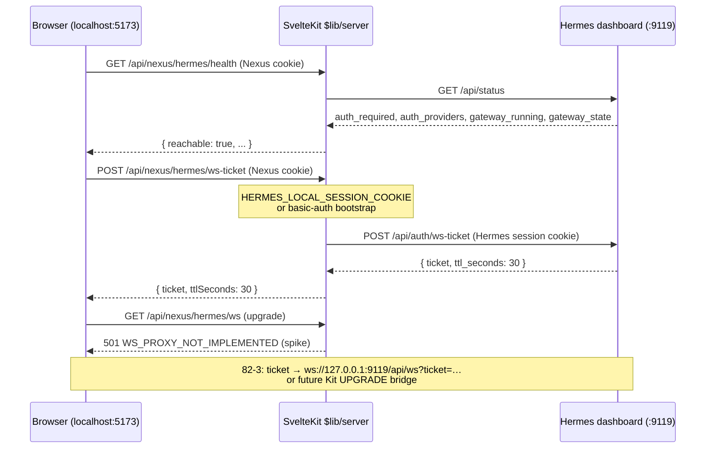

# SPIKE-OMNI-001 Findings — SvelteKit → Hermes `:9119/api/ws` ticket proxy

**Story:** 82-1  
**Status:** spike complete  
**Repo:** cns-dashboard (implementation) + Omnipotent.md (this doc)  
**Date:** 2026-06-28  
**ADR:** ADR-HERMES-013 (Local Nexus JARVIS voice proxy)

---

## Executive summary

Local Nexus (SvelteKit on `localhost:5173`) can reach the Hermes dashboard WebSocket at `127.0.0.1:9119/api/ws` **without exposing secrets to the browser**. The spike adds feature-flagged server routes under `/api/nexus/hermes/*` that hold Hermes OAuth session cookies (or basic-auth bootstrap) in `$lib/server`, probe dashboard health via `GET /api/status`, and mint single-use WS tickets via `POST /api/auth/ws-ticket`. The browser only calls same-origin Nexus routes and receives `{ ticket, ttlSeconds }` — never `API_SERVER_KEY`, never raw `:9119` URLs in client bundles. Full duplex WebSocket byte-bridging through SvelteKit is **not** implemented (501 stub); ticket + health paths are sufficient to unblock Story 82-2/82-3.

---

## Research (Context7 / library pins)

| Library | Context7 ID / query | Pin | Finding |
|---------|---------------------|-----|---------|
| SvelteKit | `resolve-library-id: sveltekit` → `/sveltejs/kit`; queries: `$lib/server` isolation, `+server.ts` handlers, WebSocket `UPGRADE` export | `@sveltejs/kit@^2.57.0`, `@sveltejs/adapter-vercel@^6.3.3` | No stable `UPGRADE` export in shipped Kit 2.57 types. Server routes + `$env/static/private` work on `nodejs20.x` runtime. Long-lived WS proxy incompatible with Vercel serverless. |
| Hermes Agent | `/nousresearch/hermes-agent`; queries: `web-dashboard`, `POST /api/auth/ws-ticket`, `/api/ws` auth, close codes | Local `~/.hermes/hermes-agent` | WS auth uses session cookies for HTTP + single-use `?ticket=` query param (30s TTL). Failures close with **4401** (auth/ticket) or **4403** (host/origin guard). |

**Pre-research (create-story 2026-06-26)** confirmed PR #12973 / `crossws` WS support remains experimental — spike documents 501 stub for `/api/nexus/hermes/ws`.

---

## Ticket flow



| Step | Actor | Action |
|------|-------|--------|
| 1 | Operator | OAuth login on Hermes dashboard (`hermes_session_at`, `hermes_session_rt` on `:9119`) |
| 2 | Operator | Paste cookies into `HERMES_LOCAL_SESSION_COOKIE` in `.env.local` **or** set basic-auth env vars |
| 3 | Browser | `GET /api/nexus/hermes/health` with Nexus session cookie + same-origin |
| 4 | Nexus server | `GET :9119/api/status` — no browser secret |
| 5 | Browser | `POST /api/nexus/hermes/ws-ticket` |
| 6 | Nexus server | `POST :9119/api/auth/ws-ticket` with held Hermes cookies |
| 7 | Browser | (82-3) Opens WS with ticket — spike returns 501 on `/api/nexus/hermes/ws` |

---

## ADR-HERMES-013 proof

| Rule | Evidence |
|------|----------|
| Browser never holds `API_SERVER_KEY` | Proxy uses dashboard OAuth cookies / WS tickets only. Gateway API bearer key not referenced in spike code. |
| Target dashboard `/api/ws` | Upstream ticket mint hits `:9119/api/auth/ws-ticket`; WS target documented as `ws://127.0.0.1:9119/api/ws?ticket=` — not gateway OpenAI port. |
| `$lib/server` holds credentials | `HERMES_LOCAL_*` read only from `$env/static/private` in `hermes-local-proxy.ts` and `+server.ts` routes. |
| Local-only activation | `HERMES_LOCAL_PROXY_ENABLED=true` required; Vercel default returns `enabled: false` without upstream probe. |
| Same codebase, divergent behavior | Flag + health gate — no forked repo. |

---

## Health gate design (NFR-VOICE-1 — UI in 82-3)

**Route:** `GET /api/nexus/hermes/health`

**Hermes upstream:** `GET :9119/api/status` returns `auth_required`, `auth_providers`, `gateway_running` (boolean), and `gateway_state` (string). There is **no** `backend_ready` field on the live API.

**Nexus mapping:** `backendReady` is derived as `gateway_running === true && gateway_state === 'running'`.

```typescript
type HermesLocalHealth = {
  enabled: boolean;       // HERMES_LOCAL_PROXY_ENABLED
  reachable: boolean;     // TCP + HTTP 200 from /api/status
  authRequired: boolean;
  authProviders: string[];
  backendReady: boolean;  // gateway_running && gateway_state === 'running'
  error?: 'UNREACHABLE' | 'CREDENTIALS_MISSING' | 'AUTH_FAILED';
};
```

**82-3 VoiceDrawer mount rule:** render voice UI only when `enabled && reachable && backendReady`. On Vercel: `enabled: false` → no VoiceDrawer.

---

## Failure modes

| Condition | HTTP / WS | Code | Recovery |
|-----------|-----------|------|----------|
| `:9119` down / WSL asleep | health 503 | `UNREACHABLE` / `HERMES_UNREACHABLE` | Start `hermes-dashboard.service` |
| Flag off | health 200 `enabled: false` | — | Expected on Vercel |
| Missing server creds | ws-ticket 503 | `HERMES_CREDENTIALS_MISSING` | Set `.env.local` session cookie or basic auth |
| Hermes session expired | ws-ticket 502 | `HERMES_AUTH_FAILED` | Re-login `:9119`, refresh `HERMES_LOCAL_SESSION_COOKIE` |
| Ticket expired (>30s) | WS close 4401 | `HERMES_TICKET_EXPIRED` | Re-POST ws-ticket immediately before upgrade |
| Ticket reused | WS close 4401 | `HERMES_TICKET_INVALID` | Mint fresh ticket per connection |
| Host/Origin mismatch | WS close 4403 | `HERMES_WS_GUARD_REJECTED` | Upstream Host `127.0.0.1:9119` |
| SvelteKit WS unavailable | ws route 501 | `WS_PROXY_NOT_IMPLEMENTED` | Use ticket path; see 82-3 options below |

---

## SvelteKit WS constraint

| Environment | WS proxy via SvelteKit | Recommendation |
|-------------|------------------------|----------------|
| `vite dev` (local) | No stable `UPGRADE` in Kit 2.57 | 82-3 option 1: experimental Kit UPGRADE when released; option 2: companion Node WS relay; option 3: HTTP/SSE subset |
| Vercel serverless | Not supported (no long-lived connections) | Health gate returns `enabled: false`; VoiceDrawer hidden |

**Spike decision:** Ticket + health routes ship; `/api/nexus/hermes/ws` returns **501** with `WS_PROXY_NOT_IMPLEMENTED`. This satisfies AC3 pass criteria.

### 82-3 options (from spike)

1. **Local dev:** Mint ticket via Nexus POST, browser connects directly to `ws://127.0.0.1:9119/api/ws?ticket=…` (still no API key; ticket is short-lived).
2. **Future Kit UPGRADE:** Same-origin WS bridge when `@sveltejs/kit` stabilizes crossws integration.
3. **Companion relay:** Fixed-port Node process for byte bridge (out of SvelteKit).

---

## Spike evidence

### Implemented routes (flag: `HERMES_LOCAL_PROXY_ENABLED=true`)

| Route | Method | Behavior |
|-------|--------|----------|
| `/api/nexus/hermes/health` | GET | Probe `/api/status` |
| `/api/nexus/hermes/ws-ticket` | POST | Mint ticket server-side |
| `/api/nexus/hermes/ws` | GET | 501 stub |

### Manual smoke (operator)

```bash
# Hermes dashboard status (WSL)
curl -s http://127.0.0.1:9119/api/status | jq '.auth_required, .auth_providers, .gateway_running, .gateway_state'

# Nexus dev server (requires HERMES_LOCAL_PROXY_ENABLED + Vercel protection cookie)
curl -s http://localhost:5173/api/nexus/hermes/health -H 'Cookie: <session>'
curl -s -X POST http://localhost:5173/api/nexus/hermes/ws-ticket \
  -H 'Cookie: <session>' -H 'Origin: http://localhost:5173' | jq .
```

### Bundle proof (no browser secrets)

```bash
rg -n 'API_SERVER_KEY|:9119|HERMES_LOCAL_' src/lib/components src/routes/nexus || true
# Expected: no matches (browser uses relative /api/nexus/hermes/* only)

rg -n 'HERMES_LOCAL_' src/lib/server src/routes/api/nexus/hermes
# Expected: server-only modules only
```

**Redacted curl example (ws-ticket success):**

```json
{ "ticket": "<redacted-single-use>", "ttlSeconds": 30 }
```

---

## Files added (cns-dashboard)

- `src/lib/server/hermes-local-proxy.ts`
- `src/lib/server/nexus-hermes-auth.ts`
- `src/routes/api/nexus/hermes/health/+server.ts`
- `src/routes/api/nexus/hermes/ws-ticket/+server.ts`
- `src/routes/api/nexus/hermes/ws/+server.ts`
- `tests/lib/hermes-local-proxy.test.ts`
- `tests/routes/api/nexus/hermes/health.test.ts`
- `tests/routes/api/nexus/hermes/ws-ticket.test.ts`

---

## Related

- [[epics-hermes-omniscient.md]] Epic 82
- [[architecture-hermes-omniscient.md]] ADR-HERMES-013
- [[74-7-hermes-desktop-live-chat-connection.md]] Desktop WS evidence
- Story 82-2 (voice_pane metadata), 82-3 (VoiceDrawer)
