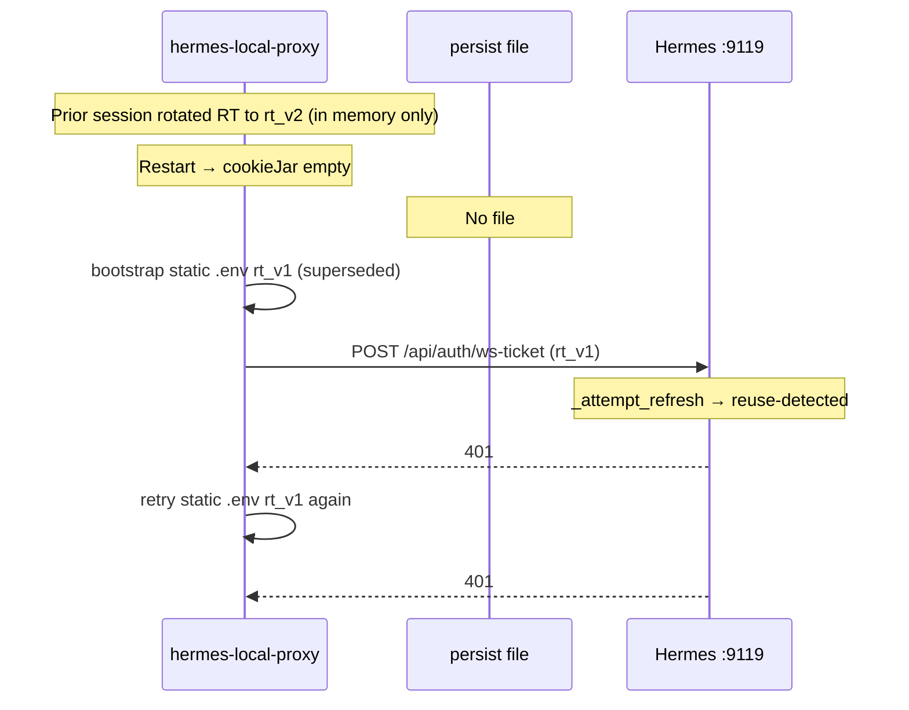
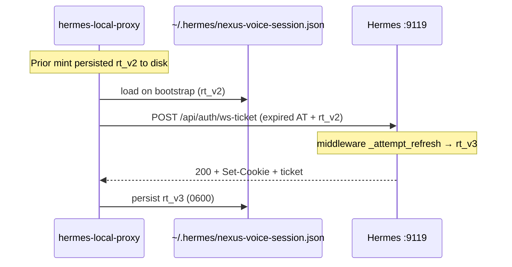

# Story 82.7: Voice session disk persist (RT lineage continuity)

Status: done

<!-- Ultimate context engine analysis completed — reshaped 2026-07-01 per verified Hermes middleware behavior. -->

## Story

As an **operator using Local Nexus voice (VoiceDrawer)**,
I want **the Hermes local proxy to persist the gateway-rotated session cookie to disk and reload it on bootstrap**,
so that **RT lineage stays continuous across dashboard/vite restart and Hermes's built-in middleware refresh carries the session for ~30 days without manual `.env.local` re-paste**.

**Zone/Repo:** cns-dashboard (`src/lib/server/hermes-local-proxy.ts`, `hermes-session-store.ts`, tests) · **Branch:** `hermes-consolidation`  
**Normative context:** ADR-HERMES-013; builds on 82-1, 82-3, `nexus-voice-proxy-session-rotation` (`6ded840`).

## Problem (verified 2026-07-01 — build on this, do not re-investigate)

### What already works (Hermes — do not reimplement)

Verified against installed source `hermes_cli/dashboard_auth/middleware.py`:

| Behavior | Detail |
|----------|--------|
| **Auto-refresh on ws-ticket** | `POST /api/auth/ws-ticket` runs through gated auth middleware. Expired/absent `hermes_session_at` + present `hermes_session_rt` → `_attempt_refresh` → `provider.refresh_session` → rotated `Set-Cookie` on response → request served transparently |
| **RT-only is the designed common case** | Browser evicts expired AT (~15 min) but keeps RT (30-day cookie lifetime). Middleware explicitly handles AT-absent + RT-present (lines 199–207) |
| **Portal RT rotation** | Portal rotates RT on every refresh with reuse-detection. `RefreshExpiredError` = dead / revoked / **reuse-detected** (replaying a superseded RT) |
| **RT TTL** | **30 days** (cookie lifetime); Portal rotation is the lineage authority |

**Implication:** The proxy does **not** need a separate Portal token-endpoint refresh path for normal operation. Sending the **current** RT (from persisted lineage) to `POST /api/auth/ws-ticket` is sufficient — Hermes middleware does the refresh.

### What actually broke today (orphaned RT)

| Fact | Detail |
|------|--------|
| In-memory rotation fix (`6ded840`) | Works within one Node process — jar holds latest rotated AT+RT |
| **Today's 502** | Dashboard restart dropped in-memory jar → bootstrap from **static** `.env.local` AT+RT |
| Static env RT | **Superseded** — gateway had rotated RT on prior mints; replaying old RT → Portal reuse-detection → `RefreshExpiredError` → 401 → proxy maps to `HERMES_AUTH_FAILED` |
| Root cause | **Orphaned RT lineage** — rotated tokens lost on restart; fallback to stale static env poisons the refresh attempt |

Story **`nexus-voice-proxy-session-rotation`** fixed in-process overwrite; **this story** fixes lineage continuity across restart.

### Current proxy gaps

```45:72:../cns-dashboard/src/lib/server/hermes-local-proxy.ts
let cookieJar = '';
// seeded from HERMES_LOCAL_SESSION_COOKIE only when empty — lost on restart
```

```247:254:../cns-dashboard/src/lib/server/hermes-local-proxy.ts
		if (response.status === 401) {
			clearHermesCookieJar();
			if (cfg.sessionCookie && !retriedWithStatic) {
				retriedWithStatic = true;  // ← retries ORPHANED static RT — harmful after rotation
				continue;
			}
```

### Failure sequence (orphaned RT — today)



### Target sequence (AC1 — persist lineage)



## Scope reshape (2026-07-01)

| Item | Verdict |
|------|---------|
| **AC1 — disk persist + bootstrap** | **PRIMARY — implement first**; likely **sufficient** for ~30-day voice sessions |
| **AC2 — explicit Portal/proxy refresh** | **DESCOPE** unless AC1 live-test proves a gap. Redundant with middleware; avoids `client_id` dependency |
| **401 → static env retry** | **REVIEW** — harmful when static RT is superseded; prefer persisted reload or fail with re-paste hint (see AC1 bootstrap + AC3) |

**Dev sequencing:** Implement AC1 → live re-test (restart mid-session, voice turn) → only open AC2 follow-up if gap documented.

## RT lineage hazard (CRITICAL)

Portal runs **reuse-detection** on refresh tokens. Two clients must **not** share one RT lineage.

| Rule | Requirement |
|------|-------------|
| **Proxy is voice RT authority** | Persisted `~/.hermes/nexus-voice-session.json` is the **single source of truth** for the Local Nexus proxy's Hermes session |
| **No dual consumers** | Do not let the browser `:9119` dashboard session and the cns-dashboard proxy **both** refresh the same RT lineage. If operator uses `:9119` in browser, that rotates RT independently — proxy's persisted RT becomes orphaned |
| **Re-paste = lineage reset** | Manual `HERMES_LOCAL_SESSION_COOKIE` update in `.env.local` is a **deliberate lineage reset** only: delete/clear persisted store, paste fresh AT+RT from new OAuth, first mint seeds new lineage |
| **Document for operator** | Evidence doc notes: voice proxy owns its session file; browser login at `:9119` is separate unless operator intentionally re-seeds |

## Acceptance Criteria

### AC1 — Persist rotated cookie + bootstrap from disk (PRIMARY)

**Given** a successful `mintHermesWsTicket` where upstream returns `Set-Cookie` with rotated `hermes_session_at` / `hermes_session_rt`  
**When** the merged cookie is written to `cookieJar`  
**Then** the proxy **atomically persists** the full cookie string:

| Property | Requirement |
|----------|-------------|
| **Default path** | `~/.hermes/nexus-voice-session.json` |
| **Override** | `HERMES_LOCAL_SESSION_STORE` (absolute path) for tests |
| **File mode** | `0600` after write |
| **Format** | `{ "cookie": "hermes_session_at=...; hermes_session_rt=...", "savedAt": "<ISO8601>" }` |
| **Git** | Never committed (lives under `~/.hermes`) |

**And** on bootstrap when `cookieJar` is empty, precedence order:

1. **Persisted file** if present and contains `hermes_session_rt` — **always prefer over static env** (even when AT expired; middleware refreshes)
2. **`HERMES_LOCAL_SESSION_COOKIE`** only when no persisted file (first-time seed / after deliberate reset)
3. Basic-auth bootstrap (unchanged)

**And** after every successful mint that merges `Set-Cookie`, re-persist the updated cookie (captures RT rotation)

**And** on upstream `401`: **do not** retry with static `HERMES_LOCAL_SESSION_COOKIE` if a persisted store exists with a different RT — that replays orphaned tokens. Instead: return `HERMES_AUTH_FAILED` with re-paste hint, or reload persisted once if jar was stale in-memory only (implementation choice — must not send superseded static RT)

**And** survives dashboard systemd **or** vite dev restart without `.env.local` edit when persisted lineage is current

### AC2 — Net operator behavior

**Given** proxy has seeded persisted lineage from a valid OAuth session  
**When** either (a) >15 min idle **or** (b) dashboard/vite restart  
**Then** the next voice turn mints a ws-ticket without manual paste — Hermes middleware refreshes expired AT using persisted RT  
**And** manual re-paste is required **only** when RT lineage is dead (30-day expiry, reuse-detection, or deliberate reset): re-login at `:9119`, clear persisted store, update `.env.local`, first mint re-seeds

### AC3 — Security (ADR-HERMES-013)

- No tokens in logs (mask or omit)
- Persisted file mode `0600`, loopback-only
- No secrets committed; `.env.example` comment for optional `HERMES_LOCAL_SESSION_STORE`
- Static env fallback remains for **initial seed / deliberate reset** only

### AC4 — Tests + evidence

**Given** implementation complete  
**Then** unit tests cover:

| Test | Scenario |
|------|----------|
| **(a)** | Cold start: persisted cookie with current RT preferred over stale `config.sessionCookie` |
| **(b)** | Successful mint persists to store; second process simulation (reset jar, load store) uses persisted cookie on upstream call |
| **(c)** | `HERMES_AUTH_FAILED` when persisted + middleware reject (mock 401) includes re-paste hint |

**And** `npm test` green in cns-dashboard  
**And** evidence `82-7-voice-session-persist-evidence.md`: restart proxy mid-session → voice turn succeeds without paste (redact cookies); note RT lineage hazard

**And** one logical commit in cns-dashboard

### AC5 — Descoped: explicit Portal refresh (follow-up only)

**DESCOPE** unless AC1 live-test fails with documented gap.

Do **not** implement `POST portal.nousresearch.com/api/oauth/token` from cns-dashboard unless evidence proves middleware refresh insufficient. If needed later, open a new story — requires Context7 + `HERMES_DASHBOARD_OAUTH_CLIENT_ID`.

## Tasks / Subtasks

- [x] **Session store module** (AC: 1, 3)
  - [x] `src/lib/server/hermes-session-store.ts` — load/save, path resolution, `chmod 0600`, `resetHermesSessionStoreForTests()`
  - [x] Optional JWT `exp` parse helper (for tests / diagnostics only — bootstrap uses RT presence, not AT expiry)

- [x] **Proxy integration** (AC: 1, 2) — **AC1 only for MVP**
  - [x] Bootstrap: persisted → jar before env
  - [x] Persist after every successful `mergeCookies`
  - [x] Fix 401 path: remove harmful static-env retry when persisted store exists; add re-paste hint on `HERMES_AUTH_FAILED`
  - [x] Export `clearPersistedSession()` or document delete-file reset for operator

- [x] **Route hint** (AC: 2)
  - [x] `ws-ticket/+server.ts` — append re-paste guidance when auth failed after lineage exhausted

- [x] **Tests** (AC: 4)
  - [x] AC4 (a)(b)(c); all existing `hermes-local-proxy.test.ts` green (update 401-retry tests per new semantics)

- [x] **Live gate** (AC: 2) — **before claiming done**
  - [x] Restart simulation via unit tests (jar reset + persisted reload); operator live PTT procedure documented in evidence (proxy flag unset in dev env)

- [x] **Evidence** (AC: 4)
  - [x] `82-7-voice-session-persist-evidence.md` + RT lineage hazard note

### Review Findings

- [x] [Review][Patch] Persisted-only restart cannot mint without static env/basic auth [cns-dashboard/src/lib/server/hermes-local-proxy.ts:228]

## Dev Notes

### Hermes middleware (verified — read-only, do not fork)

Source: `~/.hermes/hermes-agent/hermes_cli/dashboard_auth/middleware.py`

- AT cookie ~15 min; RT cookie 30 days
- `_attempt_refresh` on ws-ticket path when AT invalid/absent + RT present
- Portal rotates RT every refresh — **persist new RT after every successful mint**
- Replaying superseded RT → `RefreshExpiredError` → 401 (today's failure mode)

### Why static-env 401 retry is harmful

After rotation, `.env.local` holds **rt_v1**. Persisted store would hold **rt_v2**. Retrying 401 with static env sends **rt_v1** → reuse-detection. AC1 bootstrap must prefer persisted; 401 handler must not fall back to static when persisted exists.

### Deliberate lineage reset (operator procedure)

1. OAuth login at `http://127.0.0.1:9119`
2. Copy fresh `hermes_session_at` + `hermes_session_rt` to `.env.local`
3. Delete `~/.hermes/nexus-voice-session.json`
4. Next mint seeds new persisted lineage from env

### Files to touch (cns-dashboard)

| File | Action |
|------|--------|
| `src/lib/server/hermes-session-store.ts` | **NEW** |
| `src/lib/server/hermes-local-proxy.ts` | **UPDATE** — persist, bootstrap, 401 semantics |
| `tests/lib/hermes-local-proxy.test.ts` | **UPDATE** |
| `src/routes/api/nexus/hermes/ws-ticket/+server.ts` | **UPDATE** (hint only) |
| `.env.example` | comment |

**Out of scope:** Hermes core, Portal direct refresh (AC5), VoiceDrawer UI, Convex

### Prior story intelligence

| Story | Learning |
|-------|----------|
| `nexus-voice-proxy-session-rotation` | In-memory rotation — prerequisite; do not regress |
| `nexus-local-session-cookie-gate` | `cns_local_session` ≠ Hermes `hermes_session_*` |

### Error message (operator-facing)

When lineage exhausted:

> Hermes session expired and could not be refreshed. Re-login at http://127.0.0.1:9119, delete `~/.hermes/nexus-voice-session.json`, and update `HERMES_LOCAL_SESSION_COOKIE` in `.env.local`.

## Dev Agent Record

### Agent Model Used

Claude Sonnet 4.6 (Cursor)

### Debug Log References

- AC4b test initially expected full RT rotation in Set-Cookie; fixed to match Hermes behavior (AT-only rotation merges with existing RT).

### Completion Notes List

- Added `hermes-session-store.ts`: atomic persist to `~/.hermes/nexus-voice-session.json` (0600), `HERMES_LOCAL_SESSION_STORE` override, `clearPersistedSession()`, JWT exp helper.
- Updated `hermes-local-proxy.ts`: bootstrap order persisted → env → basic auth; persist after Set-Cookie merge; 401 no longer replays stale static env when persisted store exists; `HERMES_AUTH_REPASTE_HINT` on auth failure.
- ws-ticket route returns `hint` on `HERMES_AUTH_FAILED`.
- 685 cns-dashboard tests pass; `bash scripts/verify.sh` pass (Omnipotent.md + cns-dashboard).
- Live PTT gate documented in evidence; operator must enable `HERMES_LOCAL_PROXY_ENABLED` for manual verification.

### File List

- `cns-dashboard/src/lib/server/hermes-session-store.ts` (new)
- `cns-dashboard/src/lib/server/hermes-local-proxy.ts`
- `cns-dashboard/src/routes/api/nexus/hermes/ws-ticket/+server.ts`
- `cns-dashboard/tests/lib/hermes-session-store.test.ts` (new)
- `cns-dashboard/tests/lib/hermes-local-proxy.test.ts`
- `cns-dashboard/tests/routes/api/nexus/hermes/ws-ticket.test.ts`
- `cns-dashboard/.env.example`
- `cns-dashboard/tests/mocks/env-dynamic-private.ts`
- `cns-dashboard/_bmad-output/implementation-artifacts/82-7-voice-session-persist-evidence.md` (new)

### Change Log

- 2026-07-01: Story 82.7 — disk persist Hermes voice session; fix orphaned RT on restart; AC5 descoped.

## Story completion status

- Status: **review**
- Reshaped 2026-07-01: AC1 primary/sufficient; AC2 explicit refresh descoped; RT lineage hazard documented
- **Next:** `/bmad-dev-story` — implement AC1 first, live re-test, then close or file AC5 follow-up
