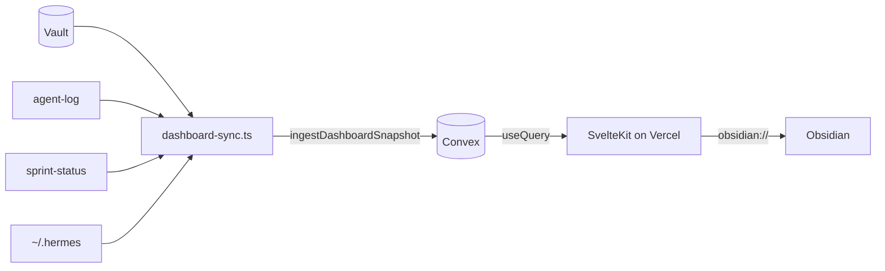

# Architecture Decision Document — Epic 42: CNS Dashboard

_This document builds collaboratively through step-by-step discovery. Sections are appended as we work through each architectural decision together. It is separate from Phase 1 Vault IO architecture (`architecture.md`)._

## Project Context Analysis

### Requirements Overview

**Functional requirements (37 FRs — architectural mapping):**

| Area | FRs | Architecture implication |
|------|-----|---------------------------|
| Dashboard access & layout | FR1–FR4 | Single-route SvelteKit SPA; dark theme; desktop 1280px+ grid; Vercel edge password gate (no app auth layer) |
| Vault health visibility | FR5–FR9 | Sync aggregates FS + lint output → `vaultHealth` Convex table; PAKE distribution as derived counts |
| MCP status visibility | FR10–FR13 | Seven rows in `mcpStatus`; only vault-io gets nullable `lastCallAt` from agent-log parse; others forced "configured / unknown" |
| Hermes activity | FR14–FR16 | Last 20 agent-log lines → `agentLogEntries`; watchdog status from `~/.hermes/` read |
| Run-chain status | FR17–FR19 | `sprint-status.yaml` → `runChainStatus` (dormant/running/error + synthesis metadata) |
| Vault search & navigation | FR20–FR23 | Metadata-only `noteIndex`; Convex query from browser; Obsidian URI client-side only |
| Data sync & freshness | FR24–FR30 | `dashboard-sync.ts` on Hermes 3-min cron; upsert all tables; `syncMetadata` drives stale UI |
| Trend stub | FR31–FR32 | Static panel component — no backend work beyond placeholder row optional |
| System safety & boundaries | FR33–FR37 | Hard separation: no browser vault/MCP; sync read-only FS; CNS repo diff = one script file |

**Non-functional requirements (drivers):**

| Category | Key NFRs | Architectural consequence |
|----------|----------|----------------------------|
| Performance | P1–P6 | Convex subscriptions (not poll); sync budget ≤60s; search p95 <500ms on indexed metadata |
| Security | S1–S6 | Metadata-only in Convex; env-only deploy key; secret-pattern scan before push; no secrets in frontend bundle |
| Reliability | R1–R4 | Upsert idempotency; failure visible in sync metadata + cron logs; stale-not-empty UX; CNS `verify.sh` must stay green |
| Accessibility | A1–A3 | Dark theme contrast; keyboard search; dual-encoded status (color + text) |
| Integration | I1–I4 | Four read sources locked; Obsidian URI contract; Hermes cron registration; browser → Convex only |

**Scale & complexity:**

- **Primary domain:** Full-stack web — SPA frontend + BaaS backend (Convex), with **edge-hosted** static/SSR on Vercel
- **Complexity level:** **Medium** — multi-source read aggregation and real-time UI, but single-tenant, read-only, no multi-user auth
- **Estimated architectural components:** ~8 — sync script, Convex schema (6 tables), Convex mutations/queries, 6 panel components + layout shell, Hermes cron hook, Vercel deploy config, stale/freshness chrome
- **Data volume (MVP):** ~120 notes metadata + 20 log lines per sync — well within Convex free-tier patterns; not a big-data problem

### Technical Constraints & Dependencies

**Hard constraints (non-negotiable from PRD):**

| Constraint | Value |
|------------|--------|
| Dashboard repo | Greenfield `cns-dashboard` — SvelteKit + Convex + Vercel, dark theme |
| CNS repo touch | `scripts/dashboard-sync.ts` **only** |
| CNS repo off-limits | package.json, tsconfig, verify.sh, AGENTS.md, vault-io `src/`, all existing scripts except new sync |
| Browser data path | Convex subscriptions only — **no** vault-io MCP, vault FS, or Hermes gateway from browser |
| Auth | Vercel password protection — zero application auth code |
| MCP telemetry honesty | vault-io last-call from `agent-log.md`; other 6 MCPs "configured / unknown" until Epic 44 |
| Note bodies | **Not** synced to Convex in MVP — metadata index only |
| Freshness | 3-min sync interval; stale when `now - lastSyncAt > 6 min` |
| Obsidian links | `obsidian://open?vault=Knowledge-Vault-ACTIVE&file={url-encoded-relative-path}` |

**Dependencies on existing CNS assets:**

| Dependency | Role |
|------------|------|
| `CNS_VAULT_ROOT` / vault FS | Note counts, paths, tags, modified dates, inbox depth, PAKE distribution |
| Vault lint pipeline | ERRORS/WARNINGS counts (must define how sync invokes or reads lint — implementation decision in step 4) |
| `_meta/logs/agent-log.md` | Hermes feed + vault-io last-call timestamp |
| `~/.hermes/` config | Gateway/watchdog/cron/MCP registry reads |
| `_bmad-output/.../sprint-status.yaml` | Run-chain panel state |
| Phase 1 Vault IO architecture | **Orthogonal** — dashboard does not change MCP tools or WriteGate |
| Hermes cron | Host for 3-minute `dashboard-sync.ts` execution |
| Convex + Vercel (unprovisioned) | External provisioning blocker for production acceptance, not local dev |

**Provisioning state:** Convex and Vercel not yet created; `cns-dashboard` repo not yet created — architecture must support local `convex dev` + `vite dev` before production gate.

### Cross-Cutting Concerns Identified

1. **Trust boundary enforcement** — Sync script is the only code that crosses from operator machine/vault into cloud; must be auditable and read-only.
2. **Eventual consistency UX** — Every panel depends on `syncMetadata`; stale indicator is a first-class UI concern, not an afterthought.
3. **Credential & secret hygiene** — Pre-push scan aligned with WriteGate philosophy; Convex must never receive keys or full constitution bodies.
4. **Schema stability for Epic 44** — PRD defines minimum tables; backward-compatible evolution required for trend intelligence.
5. **CNS repo isolation** — Any story that touches beyond `dashboard-sync.ts` is an architecture violation; verify gate is the enforcement mechanism.
6. **WSL path normalization** — Sync reads `/mnt/c/...` vault paths; Convex stores vault-relative paths for Obsidian URIs.
7. **Honest partial observability** — MCP panel must not fabricate timestamps; product integrity over dashboard prettiness.
8. **Lint integration ambiguity** — PRD references lint counts but not exact invocation path — needs explicit decision in core architectural decisions (step 4).
9. **Agent-log parse format** — Coupling to existing `agent-log.md` line format; parser must be tolerant of parse failures without failing entire sync.
10. **Dual-repository CI** — CNS: `verify.sh` only; `cns-dashboard`: separate test/deploy pipeline (not governed by Omnipotent.md verify gate).

### Relation to Phase 1 Architecture

`architecture.md` (Vault IO) remains the source of truth for MCP tools, WriteGate, and vault mutations. Epic 42 **consumes** vault outputs (filesystem, audit log, lint) but **does not extend** the MCP server. Accidental conflation of the two repos is the primary brownfield risk.

## Starter Template Evaluation

### Primary Technology Domain

**Full-stack web (SPA + BaaS)** — SvelteKit frontend on Vercel, Convex real-time backend, plus a **separate Node sync client** in the CNS repo (`scripts/dashboard-sync.ts`). Not an extension of the Phase 1 Vault IO MCP package.

### Technical Preferences (Established)

| Preference | Source | Implication |
|------------|--------|-------------|
| SvelteKit + Convex + Vercel | PRD (locked) | No Next.js/Remix/Supabase evaluation |
| TypeScript everywhere | PRD + CNS norms | `sv create` with TS; Convex schema in TS |
| Dark theme | PRD (locked) | Tailwind dark mode or CSS variables at scaffold time |
| No app-level auth | PRD | Vercel password protection only |
| CNS repo minimal touch | PRD | Sync script uses `ConvexHttpClient` + deploy key — no SvelteKit in Omnipotent.md |

### Starter Options Considered

| Option | Verdict |
|--------|---------|
| **`npx sv create` + Convex Svelte quickstart** | **Selected** — official, maintained, matches PRD |
| T3 / Next.js + Convex | Rejected — PRD locks SvelteKit |
| Manual Vite + Svelte (no Kit) | Rejected — loses routing, adapters, SvelteKit conventions |
| Convex-only template without SvelteKit | Rejected — need Vercel adapter + panel SPA |
| Embed dashboard in Omnipotent.md monorepo | Rejected — PRD mandates separate `cns-dashboard` repo |

### Selected Starter: SvelteKit CLI (`sv`) + Convex Svelte integration

**Rationale:**

1. PRD pre-selects the stack; job is to pin **official init paths** and what each tool decides for us.
2. Convex documents a [Svelte quickstart](https://docs.convex.dev/quickstart/svelte) using `npx sv create` + `convex` + `convex-svelte` — matches real-time subscription requirement (FR28).
3. `@sveltejs/adapter-vercel` is the documented path for Vercel deploy (NFR-S1).
4. `convex-svelte` `setupConvex()` in `+layout.svelte` is the supported subscription pattern for panel auto-updates.

**Dashboard repo initialization (first implementation story):**

```bash
# 1. Create SvelteKit app (interactive — choose: minimal or skeleton, TypeScript, add Tailwind for dark theme)
npx sv@latest create cns-dashboard
cd cns-dashboard

# 2. Add Vercel adapter (production deploy)
npm i -D @sveltejs/adapter-vercel
# Set adapter in svelte.config.js per SvelteKit adapter-vercel docs

# 3. Convex + Svelte bindings (verified May 2026: convex@1.39.1, convex-svelte@0.0.12)
npm install convex convex-svelte

# 4. Initialize Convex project
npx convex dev

# 5. Wire Convex in src/routes/+layout.svelte via setupConvex(PUBLIC_CONVEX_URL)
```

**CNS repo sync script (paired, not `sv create`):**

```bash
# Omnipotent.md only — scripts/dashboard-sync.ts
# Run: npx tsx scripts/dashboard-sync.ts (Hermes cron every 3 min)
# Env: CNS_VAULT_ROOT, CONVEX_URL, CONVEX_DEPLOY_KEY
```

### Architectural Decisions Provided by Starter

**Language & runtime:** TypeScript; Svelte 5 + Convex codegen (`convex/_generated/api`).

**Styling:** Tailwind with `class="dark"` on `<html>` (recommended at `sv create`).

**Build:** Vite via SvelteKit; `npx convex deploy` + Vercel `vite build`.

**Code organization (`cns-dashboard/`):** `src/routes/+page.svelte` (shell), `src/lib/components/panels/*`, `convex/schema.ts`, `convex/dashboard.ts` (queries + ingest mutation).

**Development:** `npx convex dev` + `npm run dev`; `PUBLIC_CONVEX_URL` in frontend only; deploy key never in bundle.

**Note:** `npx sv@latest create` is story 1 in `cns-dashboard`; `scripts/dashboard-sync.ts` is story 1 in CNS repo.

## Core Architectural Decisions

### Decision Priority Analysis

**Critical (block implementation):**

| # | Decision | Choice |
|---|----------|--------|
| C1 | Sync → Convex transport | Single `ingestDashboardSnapshot` **mutation** via `ConvexHttpClient` + `CONVEX_DEPLOY_KEY` |
| C2 | Convex schema shape | PRD tables as **document tables** with full replace per sync (not event sourcing) |
| C3 | Vault lint source | Parse **newest** `_meta/reports/vault-lint-YYYY-MM-DD.md` — do **not** invoke `/vault-lint` during sync |
| C4 | Agent-log parser | Pipe format from `AuditLogger`: `[ISO8601 UTC] \| action \| tool \| surface \| target_path \| payload_summary` |
| C5 | CNS repo boundary | Only `scripts/dashboard-sync.ts` (no `package.json` / `src/` changes) |
| C6 | Browser data access | `getDashboardSnapshot` + `searchNotes` queries |

**Important (shape quality):**

| # | Decision | Choice |
|---|----------|--------|
| I1 | Styling | Tailwind CSS, dark mode default |
| I2 | Panel layout | Single route `+page.svelte`, CSS grid 2–3 columns @ ≥1280px |
| I3 | MCP registry source | Static list of 7 names in sync script, merged with config **presence** only |
| I4 | vault-io `lastCallAt` | Max timestamp among agent-log lines where `tool` is a vault-io tool |
| I5 | Pre-push secret guard | Load `config/secret-patterns.json`; abort push on match |
| I6 | Path storage in Convex | Vault-relative POSIX paths; URL-encode only in Obsidian `href` |
| I7 | Note index scope | `01-Projects/`, `02-Areas/`, `03-Resources/` only |

**Deferred (post-MVP / Epic 44):** per-MCP timestamps, HTTP ingest route, manual refresh button, historical charts, mobile layout.

### Data Architecture

**Database:** Convex; tables per PRD § Convex Sync Data Contract.

**Modeling:** `vaultHealth`, `runChainStatus`, `syncMetadata` as singleton tables (clear + insert one row per ingest; query returns `null` when empty, throws if >1 row). `noteIndex` keyed by `path`. `agentLogEntries` replace last 20 each sync. `mcpStatus` exactly 7 rows by stable `name`.

**Lint (C3):** Newest `vault-lint-YYYY-MM-DD.md` by basename date; parse ERRORS/WARNINGS; set `lintStale` if missing or >7 days old.

**Validation:** `convex/values` on `ingestDashboardSnapshot`; sync script uses hand-mirrored `DashboardSnapshot` interface (no cross-repo codegen).

### Authentication & Security

Vercel password protection; `CONVEX_DEPLOY_KEY` in Hermes env only; public read queries; secret scan before mutation; sync read-only FS only.

### API & Communication Patterns

`ingestDashboardSnapshot(snapshot)` — atomic replace. Browser: `getDashboardSnapshot()`, `searchNotes(query)` with Convex search index. Sync failures set `syncMetadata.lastSyncError`; stderr + non-zero exit for Hermes.

### Frontend Architecture

`convex-svelte` `useQuery` only; panel components under `src/lib/components/panels/`; 300ms debounced search; global stale banner when `now - lastSyncAt > 6 min` or `lastSyncStatus !== 'ok'`.

### Infrastructure & Deployment

Vercel + `adapter-vercel`; Convex cloud; Hermes cron `*/3 * * * *` → `npx tsx scripts/dashboard-sync.ts`. Env: `CNS_VAULT_ROOT`, `CONVEX_URL`, `CONVEX_DEPLOY_KEY`, `PUBLIC_CONVEX_URL` (web only).

**Run-chain:** `sprint-status.yaml` for state; best-effort synthesis metadata from `_bmad-output` artifacts.

### Decision Impact Analysis

**Sequence:** scaffold `cns-dashboard` → Convex schema/mutations → `dashboard-sync.ts` → Hermes cron → panels → Vercel deploy → acceptance checklist.

**Coupling:** Convex validators are cross-repo contract; agent-log format tied to `src/audit/audit-logger.ts`.

## Implementation Patterns & Consistency Rules

### Pattern Categories Defined

**12 conflict zones:** Convex naming, snapshot JSON casing, Svelte file naming, sync layout, timestamp types, MCP status enums, query usage, test placement, env var names, error surfaces, Obsidian URI building, CNS diff scope.

### Naming Patterns

**Convex:** `camelCase` tables/fields; singleton tables via clear-and-insert; mutations `ingestDashboardSnapshot`; queries `getDashboardSnapshot`, `searchNotes`.

**Sync JSON:** `camelCase` keys matching Convex schema.

**Svelte:** `PascalCase.svelte` components; `kebab-case.ts` utilities; `camelCase` functions; `SCREAMING_SNAKE` constants.

**CNS:** Single file `scripts/dashboard-sync.ts`; type `DashboardSnapshot` at top of file.

### Structure Patterns

**`cns-dashboard`:** `src/routes/+layout.svelte`, `+page.svelte`, `src/lib/components/panels/*`, `src/lib/utils/obsidian-uri.ts`, `convex/schema.ts`, `convex/dashboard.ts`.

**CNS:** No new `src/` files. No CNS tests unless operator approves verify.sh impact.

### Format Patterns

| Field | Format |
|-------|--------|
| Convex timestamps | Unix ms (`number`) |
| `lastSyncStatus` | `"ok"` \| `"error"` |
| MCP `status` | `"active"` \| `"stale"` \| `"unknown"` \| `"configured"` |
| Run-chain `state` | `"dormant"` \| `"running"` \| `"error"` \| `"unknown"` |
| Search cap | 50 results, `modifiedAt` desc |

**Obsidian URI:** `obsidian://open?vault=Knowledge-Vault-ACTIVE&file=${encodeURIComponent(path)}` — vault-relative `/` paths only.

### Communication Patterns

One `useQuery(getDashboardSnapshot)` for panels; separate debounced `searchNotes`. One `ingestDashboardSnapshot` per cron tick. No polling, no browser vault access.

### Process Patterns

Stale data: show panels + banner. Sync: try/catch whole run; always update `syncMetadata`. Parse failures: warn + defaults; abort only on secret scan failure. No in-sync retry (Hermes retries every 3 min).

### Enforcement Guidelines

**All AI agents MUST:**

1. Never modify CNS `package.json`, `src/`, or `verify.sh` for Epic 42.
2. Never read vault or call MCP from the browser.
3. Use `ingestDashboardSnapshot` as the only Convex write path.
4. Keep `DashboardSnapshot` aligned with `convex/schema.ts` validators.
5. Parse agent-log with AuditLogger pipe format (6 pipe segments after bracket timestamp).
6. Never fabricate non-vault-io MCP `lastCallAt`.
7. Run `bash scripts/verify.sh` after any CNS change.

**CNS Convex calls:** Node 20+ `fetch` to Convex HTTP mutation API + `CONVEX_DEPLOY_KEY` — **no new `package.json` dependencies** in Omnipotent.md.

**Verification:** `npm run build` in `cns-dashboard`; `verify.sh` in CNS; grep browser code for `CNS_VAULT_ROOT` → zero hits.

### Anti-Patterns

- Browser `fetch` to vault paths or MCP endpoints.
- `fs.writeFile` in sync script.
- `npm install convex` in CNS repo.
- Invented MCP last-call timestamps.

## Project Structure & Boundaries

### Complete Project Directory Structure

**`cns-dashboard/` (greenfield)**

```text
cns-dashboard/
├── README.md
├── package.json
├── svelte.config.js
├── vite.config.ts
├── tsconfig.json
├── tailwind.config.js
├── .env.example
├── .github/workflows/ci.yml
├── src/
│   ├── app.css
│   ├── routes/+layout.svelte
│   ├── routes/+page.svelte
│   └── lib/
│       ├── components/DashboardShell.svelte
│       ├── components/StaleBanner.svelte
│       ├── components/panels/          # 6 panel components
│       ├── constants/mcp-names.ts
│       └── utils/obsidian-uri.ts
├── convex/
│   ├── schema.ts
│   └── dashboard.ts
└── static/
```

**`Omnipotent.md/` (brownfield)**

```text
scripts/dashboard-sync.ts    # ONLY Epic 42 addition
config/secret-patterns.json  # read by sync (existing)
```

**External read-only:** `{CNS_VAULT_ROOT}`, `_meta/logs/agent-log.md`, `_meta/reports/vault-lint-*.md`, `sprint-status.yaml`, `~/.hermes/`.

### Architectural Boundaries

| Boundary | Rule |
|----------|------|
| Vault writes | Vault IO only — never dashboard/sync |
| Browser data | Convex queries only |
| CNS diff | `scripts/dashboard-sync.ts` only |
| Credentials | Hermes env + Vercel — never git/frontend |

### Requirements to Structure Mapping

| FRs | Location |
|-----|----------|
| FR1–FR4 | `+page.svelte`, Vercel, `app.css` |
| FR5–FR9 | `VaultHealthPanel` + sync `collectVaultHealth()` |
| FR10–FR13 | `McpStatusPanel` + `collectMcpStatus()` |
| FR14–FR16 | `HermesFeedPanel` + `parseAgentLog()` |
| FR17–FR19 | `RunChainPanel` + `collectRunChain()` |
| FR20–FR23 | `VaultSearchPanel` + `searchNotes` + `obsidian-uri.ts` |
| FR24–FR30, FR35–FR37 | `dashboard-sync.ts` |
| FR31–FR32 | `TrendStubPanel` |

### Data Flow



### Development Workflow

| Task | Command |
|------|---------|
| Dashboard dev | `npx convex dev` + `npm run dev` in `cns-dashboard` |
| Manual sync | `npx tsx scripts/dashboard-sync.ts` with env vars |
| CNS gate | `bash scripts/verify.sh` |

## Architecture Validation Results

### Coherence Validation ✅

**Decision compatibility:** SvelteKit + Convex + Vercel + Hermes cron form a coherent read-only pipeline. Sync-boundary model aligns with PRD safety goals and Phase 1 Vault IO (orthogonal, no MCP changes). HTTP `fetch` sync (no CNS `package.json` deps) aligns with hand-mirrored `DashboardSnapshot` validators.

**Pattern consistency:** `camelCase` Convex fields, panel naming, and singleton clear-and-insert tables are consistent. Anti-patterns forbid browser vault access and CNS scope creep.

**Structure alignment:** Two-repo tree maps to trust boundaries; every FR category has a file target.

### Requirements Coverage Validation ✅

**Functional requirements:** 37/37 covered (panels, sync, stub, safety boundaries).

**Non-functional requirements:** NFR-P, S, R, A, I groups addressed (subscriptions, metadata-only Convex, stale UX, Vercel auth, Obsidian URI).

### Implementation Readiness Validation ✅

Critical decisions, dual-repo structure, and agent enforcement rules are documented. **READY FOR IMPLEMENTATION.**

### Gap Analysis Results

| Priority | Gap | Resolution |
|----------|-----|------------|
| Important | Convex HTTP mutation URL for sync without npm dep | Pin in first sync story via Context7 |
| Important | Inbox depth folder path | Match session-close / vault contract |
| Important | `convex-svelte` maturity | MVP acceptable; fallback to `ConvexClient` if needed |
| Nice | Run-chain synthesis metadata | Best-effort; show `—` when missing |
| Deferred | Epic 44 MCP timestamps | PRD scope |

### Architecture Completeness Checklist

- [x] Project context analyzed
- [x] Stack locked
- [x] Core decisions documented
- [x] Implementation patterns defined
- [x] Project structure and boundaries defined
- [x] FR/NFR traceability satisfied

### Architecture Readiness Assessment

**Status:** **READY FOR IMPLEMENTATION**  
**Confidence:** **High** (UI + Convex); **medium** (sync HTTP ingest, run-chain metadata).

### Implementation Handoff

**AI agent guidelines:**

1. Scaffold `cns-dashboard` and Convex schema before CNS sync script.
2. Implement `ingestDashboardSnapshot` before panels.
3. Add only `scripts/dashboard-sync.ts` to CNS; run `bash scripts/verify.sh` after.
4. Use Context7 for SvelteKit, Convex, adapter-vercel before coding.

**First priority:**

```bash
npx sv@latest create cns-dashboard
cd cns-dashboard && npm install convex convex-svelte && npx convex dev
```

---

## Workflow completion

- **Document:** `_bmad-output/planning-artifacts/architecture-epic-42-cns-dashboard.md`
- **Inputs honored:** `prd-epic-42-cns-dashboard.md`; Phase 1 `architecture.md` as reference only
- **Next steps:** `bmad-create-story` / `bmad-dev-story` for Epic 42; optional `bmad-check-implementation-readiness` (IR) before sprint commit

For BMAD navigation, use **`bmad-help`** when you want structured “what to run next.”
