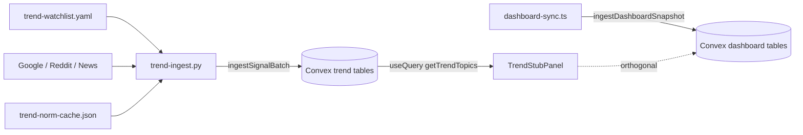

# Architecture Decision Document — Epic 44: CNS Trend Intelligence Layer 1

_This document is separate from Phase 1 Vault IO architecture (`architecture.md`) and Epic 42 dashboard architecture (`architecture-epic-42-cns-dashboard.md`). It formalizes the signal ingest data contract, Convex schema, and `ingestSignalBatch` behaviour so implementation stories do not invent conflicting merge or momentum logic._

## Project Context Analysis

### Requirements Overview

**Functional requirements (46 FRs — architectural mapping):**

| Area | FRs | Architecture implication |
|------|-----|---------------------------|
| Watchlist | FR1–FR6 | YAML on operator machine is authority; Convex `watchlist` is mirror; slug algorithm fixed |
| Collection & normalisation | FR7–FR20 | Python collectors only; unified `SignalEvent` wire shape; dry-run without HTTP |
| Convex storage | FR21–FR27 | **`ingestSignalBatch` mutation** owns inserts, momentum, `trendTopics` merge, retention prune |
| Trend panel | FR28–FR35 | `getTrendTopics` + `getSignalSources`; replace `TrendStubPanel` mocks |
| Source health | FR36–FR40 | `signalSources` table + optional panel footer; per-source cron isolation |
| Safety & boundaries | FR41–FR46 | Orthogonal to Epic 42; no `ingestDashboardSnapshot` changes |

**Non-functional drivers:**

| Category | Key NFRs | Architectural consequence |
|----------|----------|----------------------------|
| Performance | P1–P4, P2 | Materialised `trendTopics` only in browser; no `signalEvents` scan in UI |
| Security | S1–S5 | Env-only secrets; pre-push secret scan; no vault writes from ingest |
| Reliability | R1–R6 | Per-source partial runs; idempotent `dedupeKey`; concurrent cron merge semantics |
| Integration | I1–I4 | Same HTTP mutation API as `dashboard-sync.ts`; deploy key; production Convex |

**Scale & complexity:**

- **Primary domain:** Scheduled Python pipeline + Convex BaaS extension + one Svelte panel upgrade
- **Complexity:** **Medium** — three external APIs, normalisation, **server-side aggregation** (not trivial CRUD)
- **Brownfield:** Live `cns-dashboard` on Vercel + Convex `amiable-ox-862`; Epic 42 tables and `ingestDashboardSnapshot` **frozen**

### Technical Constraints & Dependencies

| Constraint | Value |
|------------|--------|
| CNS repo touch | `scripts/trend-ingest.py` + operator config/docs only |
| CNS off-limits | `package.json`, `tsconfig`, `verify.sh`, `AGENTS.md`, `src/`, `dashboard-sync.ts` |
| Write paths | `dashboard:ingestDashboardSnapshot` (42) **unchanged**; `trends:ingestSignalBatch` (44) **new** |
| Ingest runtime | WSL Python cron — not Vercel |
| Cron | News + Reddit `*/15 * * * *`; Google Trends `0 * * * *` |
| Watchlist | `~/.hermes/trend-watchlist.yaml` |
| Secrets | `~/.hermes/trend-ingest.env` mode 600 |
| Production | `https://cns-dashboard-three.vercel.app` + `amiable-ox-862.convex.cloud` |

**Dependencies on Epic 42:**

| Asset | Role |
|-------|------|
| `scripts/dashboard-sync.ts` | Reference HTTP push pattern (`POST /api/mutation`, `Convex ${deployKey}`) |
| `convex/schema.ts` (6 tables) | Untouched by Epic 44 |
| `TrendStubPanel.svelte` | Replaced/wired — same grid slot |
| `config/secret-patterns.json` | Reused by trend-ingest pre-push scan |

### Cross-Cutting Concerns

1. **Dual write path isolation** — Dashboard sync and trend ingest must never touch each other's tables in one mutation.
2. **Server-side materialisation** — `trendTopics` merge and momentum **must not** be duplicated in Python; prevents concurrent-cron races.
3. **Honest zeros** — Failed API ≠ `normalized_value: 0`; architecture enforces skip-write on source error.
4. **Contract stability for Epic 45** — `signalEvents` retention and field names are migration-sensitive.
5. **CNS verify gate** — Only `scripts/trend-ingest.py` in production paths.

### Relation to Epic 42 Architecture

Epic 42 established: operator machine → Convex HTTP → `convex-svelte` read-only browser. Epic 44 **reuses the transport** and **adds parallel tables + mutation namespace** (`convex/trends.ts`). Do not extend `ingestDashboardSnapshot` or `dashboardSnapshotValidator` with trend fields.

---

## Starter / Stack Evaluation

### Primary Technology Domain

**Brownfield extension** — no new frontend framework. Additions:

| Layer | Choice | Rationale |
|-------|--------|-----------|
| Backend | Convex (existing deployment) | Same as Epic 42; real-time panel |
| Ingest client | Python 3.11+ on WSL | PRD-locked; pytrends, PRAW, requests |
| Dashboard | SvelteKit + `convex-svelte` (existing) | Wire `TrendStubPanel` → `useQuery` |
| CNS transport | stdlib `urllib` or `requests` in script only | No new npm deps in Omnipotent.md |

### Rejected Alternatives

| Option | Verdict |
|--------|---------|
| Compute `trendTopics` in Python | **Rejected** — duplicates merge logic; breaks concurrent 15m/60m cron |
| Extend `ingestDashboardSnapshot` | **Rejected** — violates NFR-I2 and Epic 42 freeze |
| Browser-side collector calls | **Rejected** — FR41 |
| Hosted microservice (Option A) | **Deferred** — schema supports future swap |

---

## Core Architectural Decisions

### Decision Priority Analysis

**Critical (block implementation):**

| # | Decision | Choice |
|---|----------|--------|
| C1 | Trend write path | Single mutation **`trends:ingestSignalBatch`** via HTTP — same auth/URL pattern as `dashboard-sync.ts` |
| C2 | Where momentum & `trendTopics` merge run | **Inside Convex mutation only** — Python sends raw normalised events + source health + watchlist snapshot |
| C3 | Epic 42 mutation freeze | **No edits** to `ingestDashboardSnapshot`, `dashboard.ts` ingest path, or Epic 42 table validators |
| C4 | Concurrent cron semantics | **Merge** per `(topicSlug, source)` on `sourceBreakdown`; never clear-and-replace trend tables |
| C5 | `dedupeKey` window anchor | `windowStartMs = collectedAt - (windowHours * 3600_000)` floored to UTC hour boundary |
| C6 | Retention (MVP) | Cap **500** `signalEvents` per `topicSlug`; prune oldest after each batch insert |
| C7 | `momentum_score` aggregate | **Mean** of `momentum` over **non-stale** `sourceBreakdown` entries (equal weight); if none, `0` |
| C8 | Stale threshold | News/Reddit: `now - collectedAt > 30 min`; Trends: `> 2 h` |
| C9 | `topicSlug` algorithm | Lowercase trim → replace non `[a-z0-9]+` runs with `-` → collapse repeats → max 80 chars |
| C10 | CNS repo boundary | Only `scripts/trend-ingest.py` (+ story/planning artifacts) |

**Important (shape quality):**

| # | Decision | Choice |
|---|----------|--------|
| I1 | Convex module split | `convex/trends.ts` (mutations/queries) + `convex/trendValidators.ts`; extend `schema.ts` only |
| I2 | Batch arg shape | `SignalIngestBatch` validator (see § Wire Contract) |
| I3 | Partial source runs | Batch includes `activeSources: SourceName[]`; mutation updates only those `signalSources` rows and matching breakdown arms |
| I4 | Python contract | Typed dict / `@dataclass` mirroring `SignalIngestBatch` at top of `trend-ingest.py` |
| I5 | Pre-push guard | Scan serialised batch JSON with `config/secret-patterns.json` before HTTP (same philosophy as sync) |
| I6 | Panel query | `getTrendTopics({ limit: 10 })` sorted by `momentumScore` desc; `getSignalSources()` for health strip |
| I7 | First-observation momentum | `0` when no prior event for `(topicSlug, source, region)` tuple |
| I8 | ε for momentum formula | `1e-6` |

**Deferred (Epic 45+):** `lifecycle_stage` scoring, Discord alerts, sparklines, Option A microservice, HTTP route auth beyond deploy key.

---

## Signal Ingest Data Contract (Normative)

### Write Path Matrix

| Mutation | Path | Caller | Tables |
|----------|------|--------|--------|
| `ingestDashboardSnapshot` | `dashboard:ingestDashboardSnapshot` | `dashboard-sync.ts` | Epic 42 only — **frozen** |
| `ingestSignalBatch` | `trends:ingestSignalBatch` | `trend-ingest.py` | `signalEvents`, `trendTopics`, `signalSources`, `watchlist` |

### Wire Contract: `SignalIngestBatch`

Python **builds** this object; Convex **validates** and **executes** side effects.

```typescript
// convex/trendValidators.ts — normative shapes (camelCase fields)

type SourceName = "google_trends" | "reddit" | "news";
type SignalType = "search_volume" | "mention_count" | "article_count";

type SignalEventInput = {
  topicSlug: string;
  keyword: string;
  source: SourceName;
  signalType: SignalType;
  value: number;
  normalizedValue: number;      // 0..1
  region: string;               // default "global"
  windowHours: number;
  collectedAt: number;          // Unix ms
  dedupeKey: string;
  ingestRunId: string;
  metadata: Record<string, unknown>; // must include normalisationMethod
};

type SignalSourcePatch = {
  name: SourceName;
  status: "ok" | "partial" | "error";
  lastRun: number;
  errorCount: number;           // absolute count from caller for this run's outcome
  lastError: string | null;
};

type WatchlistEntry = {
  topicSlug: string;
  keyword: string;
  region: string;
  addedAt: number;
};

type SignalIngestBatch = {
  ingestRunId: string;          // UUID v4 per script invocation
  activeSources: SourceName[];  // sources that ran this tick (e.g. ["news"] or ["google_trends"])
  events: SignalEventInput[];
  watchlist: WatchlistEntry[];
  signalSources: SignalSourcePatch[];
};
```

**Python MUST NOT send** pre-computed `trendTopics` rows or `momentum` — Convex derives momentum from stored history.

### `dedupeKey` Construction

```
windowStartMs = collectedAt - (windowHours * 3_600_000)
windowStartHour = floor_to_utc_hour(windowStartMs)
dedupeKey = sha256_hex(`${topicSlug}|${source}|${signalType}|${windowStartHour}`)
```

Use hex digest string (64 chars). Same key on re-ingest → skip insert (idempotent).

### Normalisation Methods (enforced in Python collectors)

| Source | Raw | `normalizedValue` | `metadata.normalisationMethod` |
|--------|-----|-------------------|--------------------------------|
| Google Trends | interest 0–100 | `interest / 100` | `trends_interest_over_100` |
| Reddit | mention count | 7-day min-max vs keyword history **in Python** for current window | `reddit_7d_minmax` |
| News | article count | 7-day min-max vs keyword history **in Python** | `news_7d_minmax` |

Min-max history for Reddit/News: Python maintains a **local JSON cache** under `~/.hermes/trend-norm-cache.json` (operator machine only) keyed by `topicSlug|source` — **not** Convex. Convex stores outcomes only. Cache updated after successful collect, before push.

### Momentum (Convex-only)

Per inserted event (after dedupe pass), for tuple `(topicSlug, source, region)`:

```
prior = latest signalEvents.normalizedValue where same tuple and collectedAt < this.collectedAt
momentum = prior == null ? 0 : clamp((normNow - prior) / max(prior, 1e-6), -1, 1)
```

Store `momentum` on the `signalEvents` document (denormalised for Epic 45 history queries).

### `trendTopics` Materialisation (Convex-only)

After processing all events in batch:

1. For each affected `topicSlug`, load or create `trendTopics` doc.
2. For each `(topicSlug, source)` touched, **upsert** `sourceBreakdown[]` entry:
   - `{ source, normalizedValue, momentum, collectedAt, stale }`
   - `stale` computed from § C8 thresholds vs `now`
3. Do **not** remove breakdown entries for sources absent from this batch.
4. `momentumScore` = mean of non-stale breakdown `momentum` values (C7).
5. `sources` = unique source names present in breakdown.
6. `lastUpdated` = max `collectedAt` in breakdown.
7. `volume` = optional sum of raw `value` from latest event per source in this batch (implementation convenience).

`lifecycleStage`: field **reserved** — store `null` in MVP; omit from panel.

### `watchlist` Sync

Each batch: **replace mirror** for watchlist table — delete docs whose `topicSlug` not in batch list, upsert batch entries. Authority remains YAML on disk; Convex is not an edit UI.

### `signalSources`

Upsert by `name` from `signalSources[]` patches in batch. `errorCount` in patch is **replacement** for rolling count when status returns `ok` (reset to 0) or **increment** on repeated errors — architecture choice: **Python sends absolute** `errorCount` after local run; Convex stores as given.

### Retention (C6)

After inserts, per affected `topicSlug`: if count > 500, delete oldest by `collectedAt` until ≤ 500. Run inside same mutation (bounded work per batch).

### pytrends Partial-Run Semantics (Python)

- Per-keyword try/except.
- 429/403: stop trends loop for run; set `signalSources` patch `partial` or `error`.
- Captcha/empty: **no event** for that keyword; do not emit `normalizedValue: 0`.
- Exit `0` if HTTP push succeeds with ≥1 event **or** successful `signalSources` health update.

---

## Convex Schema (Authoritative)

Add to `cns-dashboard/convex/schema.ts`:

```typescript
// trendValidators imported — field names camelCase

signalEvents: defineTable({
  topicSlug: v.string(),
  keyword: v.string(),
  source: sourceNameValue,
  signalType: signalTypeValue,
  value: v.number(),
  normalizedValue: v.number(),
  momentum: v.number(),
  region: v.string(),
  windowHours: v.number(),
  collectedAt: v.number(),
  dedupeKey: v.string(),
  ingestRunId: v.string(),
  metadata: v.any(),
})
  .index("by_dedupeKey", ["dedupeKey"])
  .index("by_topicSlug_collectedAt", ["topicSlug", "collectedAt"]),

trendTopics: defineTable({
  topicSlug: v.string(),
  keyword: v.string(),
  sources: v.array(v.string()),
  sourceBreakdown: v.array(sourceBreakdownEntryValidator),
  momentumScore: v.number(),
  volume: v.optional(v.number()),
  lifecycleStage: v.union(v.string(), v.null()),
  lastUpdated: v.number(),
}).index("by_topicSlug", ["topicSlug"]),

signalSources: defineTable({
  name: sourceNameValue,
  status: v.union(v.literal("ok"), v.literal("partial"), v.literal("error")),
  lastRun: v.number(),
  errorCount: v.number(),
  lastError: v.union(v.string(), v.null()),
}).index("by_name", ["name"]),

watchlist: defineTable({
  topicSlug: v.string(),
  keyword: v.string(),
  region: v.string(),
  addedAt: v.number(),
}).index("by_topicSlug", ["topicSlug"]),
```

```typescript
// sourceBreakdownEntryValidator
v.object({
  source: sourceNameValue,
  normalizedValue: v.number(),
  momentum: v.number(),
  collectedAt: v.number(),
  stale: v.boolean(),
})
```

**Index note:** `by_dedupeKey` must enforce uniqueness at application layer (check before insert); Convex unique indexes require careful migration — use query-then-insert in mutation.

### Queries

| Query | Args | Returns |
|-------|------|---------|
| `getTrendTopics` | `{ limit?: number }` default 10 | `trendTopics[]` sorted `momentumScore` desc, `stripConvexDoc` |
| `getSignalSources` | none | All `signalSources` sorted by `name` |

**NFR-P2:** Queries read `trendTopics` and `signalSources` only — never scan full `signalEvents` in browser path.

### Mutation: `ingestSignalBatch`

| Step | Action |
|------|--------|
| 1 | Validate `SignalIngestBatch` |
| 2 | Sync `watchlist` mirror (replace semantics) |
| 3 | Upsert `signalSources` from patches |
| 4 | For each event: if `dedupeKey` exists → skip; else insert + compute momentum |
| 5 | Rebuild affected `trendTopics` materialisation |
| 6 | Prune `signalEvents` per topicSlug > 500 |
| 7 | Return `{ inserted, skipped, topicsUpdated }` |

**Atomicity:** Single mutation transaction — partial batch failure rolls back entire push (Python retries next cron).

---

## Implementation Patterns & Consistency Rules

### Naming

| Layer | Convention |
|-------|------------|
| Convex tables | `camelCase` plural: `signalEvents`, `trendTopics` |
| Convex fields | `camelCase` (`normalizedValue`, `momentumScore`, `lastUpdated`) |
| Python → JSON | `camelCase` keys matching Convex (use explicit dict keys, not snake_case) |
| Mutation path | `trends:ingestSignalBatch` |
| CNS script | `scripts/trend-ingest.py` |
| Env file | `~/.hermes/trend-ingest.env` |

### HTTP Push (CNS)

Mirror `dashboard-sync.ts`:

```python
INGEST_MUTATION_PATH = "trends:ingestSignalBatch"
# POST {CONVEX_URL}/api/mutation
# Authorization: Convex {CONVEX_DEPLOY_KEY}
# Body: {"path": "trends:ingestSignalBatch", "args": { batch }, "format": "json"}
```

Env vars (minimum): `CONVEX_URL`, `CONVEX_DEPLOY_KEY`, plus per-source API keys documented in operator guide.

### Enforcement — All AI Agents MUST

1. Never modify `ingestDashboardSnapshot` or Epic 42 table shapes for Epic 44 work.
2. Never compute `trendTopics` merge or momentum in Python (collectors + normalisation only).
3. Never add npm dependencies to Omnipotent.md.
4. Never call external trend APIs from SvelteKit.
5. Keep `SignalIngestBatch` aligned between `convex/trendValidators.ts` and Python mirror type.
6. Run `bash scripts/verify.sh` after any CNS script change.
7. Use `camelCase` in JSON wire format (Convex convention established in 42-2).

### Anti-Patterns

- Sending full `trendTopics` from Python (bypasses merge authority).
- Clear-and-replace on `signalEvents` or `trendTopics` tables.
- Writing `normalizedValue: 0` on API failure.
- Sharing one mutation for dashboard + trend data.
- Adding trend fields to `dashboardSnapshotValidator`.

---

## Project Structure & Boundaries

### `cns-dashboard/` additions

```text
convex/
  schema.ts              # ADD four tables (do not remove Epic 42 tables)
  trendValidators.ts     # NEW — SignalIngestBatch + enums
  trends.ts              # NEW — ingestSignalBatch, getTrendTopics, getSignalSources
tests/convex/
  trends.test.ts         # NEW — ingest idempotency, merge, retention cap
src/lib/components/panels/
  TrendStubPanel.svelte  # MODIFY — useQuery live data; remove stub badge when data exists
```

### `Omnipotent.md/` additions

```text
scripts/trend-ingest.py           # ONLY production code addition
config/secret-patterns.json       # READ only (existing)
```

### Operator machine (not in repo)

```text
~/.hermes/trend-watchlist.yaml
~/.hermes/trend-ingest.env        # chmod 600
~/.hermes/trend-norm-cache.json   # Reddit/News min-max cache
```

### Data Flow



### Requirements → Structure Mapping

| FRs | Location |
|-----|----------|
| FR1–FR6 | `trend-ingest.py` watchlist module + YAML schema |
| FR7–FR20 | `trend-ingest.py` collectors + normalisation |
| FR21–FR27 | `convex/trends.ts` `ingestSignalBatch` |
| FR28–FR35 | `TrendStubPanel.svelte` + `getTrendTopics` |
| FR36–FR40 | `getSignalSources` + ingest logging |
| FR41–FR46 | Boundaries enforced by repo layout + review |

---

## Architecture Validation Results

### Coherence Validation ✅

- Dual mutation paths on orthogonal tables — no cross-contention with 3-min dashboard sync.
- Server-side merge resolves concurrent 15m and 60m cron without last-writer-wins on full documents.
- PRD data contract preserved; architecture **narrows** ambiguous choices (retention, aggregate score, where momentum runs).

### Requirements Coverage ✅

- 46/46 FRs mapped to Convex module, Python script, or panel.
- Signal Ingest Data Contract from PRD elevated to **wire validator + mutation algorithm**.

### Implementation Readiness ✅

**Status:** **READY FOR STORY CUTTING**  
**Confidence:** **High** for schema/mutation; **medium** for Reddit/News min-max cache ergonomics (operator-visible cache file).

### Gaps Resolved (vs PRD alone)

| PRD ambiguity | Architecture resolution |
|---------------|-------------------------|
| Retention "90 days OR 500" | **500 per topicSlug** cap with mutation prune |
| `momentum_score` undefined | Mean of non-stale source momentums |
| Where merge runs | **Convex only** |
| Reddit/News min-max history | Local `~/.hermes/trend-norm-cache.json` |
| `dedupeKey` window | UTC hour floor on window start |

### Remaining Operator-Guide Items (not blocking code)

- NewsAPI quota tier documentation
- Cron install shell snippet
- `trend-ingest.env.example` variable list

---

## Implementation Handoff

### Recommended Story Sequence

| Order | Story focus | Repo |
|-------|-------------|------|
| 1 | Convex schema + `trendValidators` + `ingestSignalBatch` + tests | cns-dashboard |
| 2 | `getTrendTopics` + `getSignalSources` + tests | cns-dashboard |
| 3 | `trend-ingest.py` skeleton + HTTP push + dry-run | Omnipotent.md |
| 4 | Collectors (trends, reddit, news) + norm cache | Omnipotent.md |
| 5 | `TrendStubPanel` live wire-up | cns-dashboard |
| 6 | Cron docs + operator guide (vault) | docs / Hermes |

**Do not** implement collectors before story 1 — Python depends on frozen wire contract.

### First Implementation Commands

```bash
# cns-dashboard
cd /home/christ/ai-factory/projects/cns-dashboard
# Add convex/trendValidators.ts, convex/trends.ts, extend schema.ts
npx convex dev --once && npm test

# Omnipotent.md (after Convex deployed)
python scripts/trend-ingest.py --dry-run
bash scripts/verify.sh
```

### AI Agent Guidelines

1. Read this document + PRD § Signal Ingest Data Contract before editing schema.
2. Implement `ingestSignalBatch` before Python collectors.
3. Treat `convex/trendValidators.ts` as normative over PRD prose if drift occurs — update PRD in a separate doc pass only when intentional.
4. Context7 for Convex mutation HTTP API if transport details needed.

---

## Workflow Completion

- **Document:** `_bmad-output/planning-artifacts/architecture-epic-44-trend-intelligence-layer-1.md`
- **Inputs honored:** `prd-epic-44-trend-intelligence-layer-1.md`; Epic 42 architecture as pattern reference only
- **Next step:** `bmad-create-epics-and-stories` / `bmad-create-story` — cut stories against § Implementation Handoff sequence; optional `bmad-check-implementation-readiness` (IR) before sprint commit

For BMAD navigation, use **`bmad-help`**.
