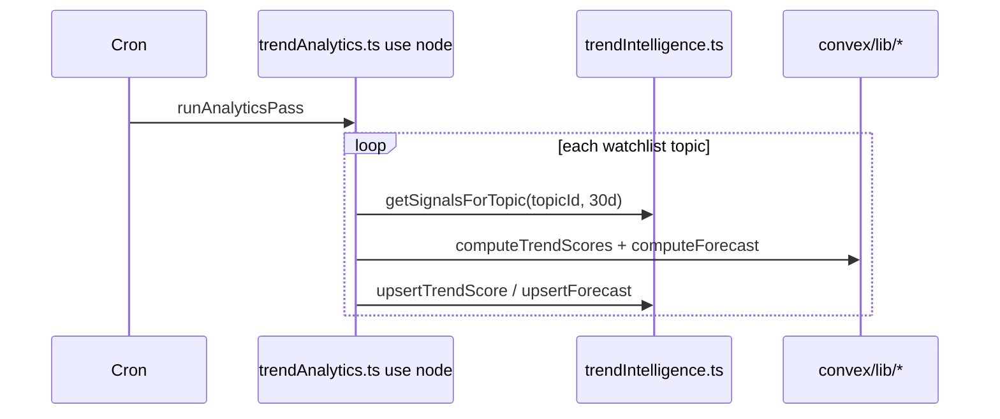

# Architecture Decision Document — Epic 45: Trend Intelligence Engine (Layer 2)

_This document is normative for Epic 45 implementation in `cns-dashboard`. It locks runtime boundaries (`"use node"` placement), Convex module split, schema FK strategy, and the Epic 46 query contract before any algorithm or action code is written._

## Project Context Analysis

### Requirements Overview

Epic 44 delivers raw signals (`signalEvents`, materialised `trendTopics`, `watchlist`). Epic 45 adds **computed intelligence** in four new tables and hourly / ingest-triggered analytics. Epic 46 consumes **public queries only** — no client-side scoring.

| Layer | Responsibility | Runtime |
|-------|----------------|---------|
| Layer 1 | Lifecycle + investment score | Pure TS in `lib/trendAnalyzer.ts` |
| Layer 2 | Trend type + breakpoints | `simple-statistics` in `lib/trendAnalysisService.ts` |
| Layer 3 | ARIMA forecast + anomaly detection | `arima` WASM in `lib/predictiveAnalytics.ts` |

**Non-goals (frozen):** UI changes, new ingest sources, Discord alert delivery, K-means, ADF test, full SARIMA.

### Technical Constraints

| Constraint | Value |
|------------|--------|
| Output repo | `cns-dashboard` only |
| CNS repo (`Omnipotent.md`) | Planning artifacts + `sprint-status.yaml` only |
| Epic 44 freeze | No changes to `ingestSignalBatch` merge semantics until Story 45-5 (anomaly scheduler hook only) |
| Epic 42 freeze | Dashboard tables and `ingestDashboardSnapshot` untouched |
| Production Convex | `amiable-ox-862.convex.cloud` |
| Watchlist size | ≤8 topics MVP (≤12 later) — sequential analytics pass is acceptable |

### Cross-Cutting: `topicSlug` vs `topicId`

Epic 44 stores **`topicSlug`** on `signalEvents` and `watchlist`. Epic 45 intelligence tables store **`topicId: Id<"trendTopics">`** per PRD — this is intentional:

- **Ingest path** continues to use slugs (Python wire contract unchanged).
- **Intelligence path** joins via `trendTopics._id` for stable FK and Epic 46 deep links (`/trends/:topicId`).
- **Resolution rule:** Every analytics pass and public query resolves `watchlist.topicSlug` → `trendTopics` row → `_id` before reading/writing `trendScores` / `trendForecasts` / `trendAnomalies`.

If a watchlist slug has no `trendTopics` row yet (never ingested), skip scoring; queries omit that topic.

---

## Core Architectural Decisions

### C1 — `"use node"` placement (NON-NEGOTIABLE)

| File | `"use node"` | Rationale |
|------|----------------|-----------|
| `convex/trendAnalytics.ts` | **YES — file-level only** | Sole entry for `internalAction`; loads `arima` WASM; 512MB Node runtime |
| `convex/trendIntelligence.ts` | **NO** | Queries + mutations; default Convex runtime |
| `convex/lib/*.ts` | **NO** | Pure algorithm modules; imported **only** from `trendAnalytics.ts` for Layer 3 |
| `convex/trends.ts` | **NO** | Epic 44 ingest unchanged |
| `convex/schema.ts` | **NO** | Schema only |

**Rules for agents:**

1. Never add `"use node"` to `trendIntelligence.ts` — mutations must stay in default runtime so `ctx.db` in `internalMutation` is available without cross-runtime friction.
2. Never import `arima` or `simple-statistics` from `trendIntelligence.ts` or any `query` / `mutation` file.
3. `trendAnalytics.ts` orchestrates via `ctx.runQuery` / `ctx.runMutation` — it does **not** access `ctx.db` directly.
4. Unit tests for `lib/*` run under Vitest on Node locally; Convex bundles lib into the Node action at deploy time.

### C2 — Module split: action vs intelligence API

```
convex/
  schema.ts                    ← append 4 tables (Story 45-1)
  trendValidators.ts           ← Epic 44 + Epic 45 row validators (Story 45-1)
  trends.ts                    ← Epic 44 ingest + getTrendTopics (FROZEN except 45-5 hook)
  trendIntelligence.ts         ← public queries + internalQuery/internalMutation (NO "use node")
  trendAnalytics.ts            ← "use node"; internalAction only (Stories 45-4, 45-5, 45-6)
  crons.ts                     ← hourly runAnalyticsPass (Story 45-4)
  lib/
    signalUtils.ts             ← rolling window, MA, normalisation helpers (45-4+)
    trendAnalyzer.ts           ← Layer 1 pure TS (45-2)
    trendAnalysisService.ts    ← Layer 2 simple-statistics (45-3)
    predictiveAnalytics.ts     ← Layer 3 forecast + anomaly (45-5, 45-6)
```

| Module | Exports | Called by |
|--------|---------|-----------|
| `trendIntelligence.ts` | `getLatestScores`, `getTopicScoreHistory`, `getRecentAnomalies`, `getTopicForecast`, `getTopicSignalHistory`; internal: `getAllTopics`, `getSignalsForTopic`, `upsertTrendScore`, `upsertForecast`, `insertAnomalies` | Browser (public), `trendAnalytics.ts` (internal) |
| `trendAnalytics.ts` | `runAnalyticsPass`, `checkAnomalies` | `crons.ts`, `scheduler` from ingest (45-5) |

### C3 — Analytics pass flow



- **Sequential** loop over watchlist topics (≤8); no fan-out required for MVP.
- Skip topic when `< 5` signal points after load.
- **Upsert:** at most one current score row per `topicId` — query `by_topicId`, patch if exists else insert (Story 45-4).

### C4 — Anomaly path (Story 45-5)

After `ingestSignalBatch` succeeds, schedule:

```typescript
await ctx.scheduler.runAfter(0, internal.trendAnalytics.checkAnomalies, {
  topicSlug,
  newSignalIds: [...], // or collectedAt range — implementation detail in 45-5
});
```

`checkAnomalies` runs in Node action, reads 7-day window via `getSignalsForTopic`, writes `trendAnomalies` via `insertAnomalies` mutation. Sets `trendScores.hasAnomaly` on affected topic.

### C5 — NPM dependencies

Add to `cns-dashboard/package.json` (Stories 45-3 and 45-6 — not 45-1):

```json
"simple-statistics": "^7.8.9",
"arima": "^0.2.8"
```

### C6 — Cron

```typescript
// convex/crons.ts
crons.interval("run trend analytics", { hours: 1 }, internal.trendAnalytics.runAnalyticsPass);
```

### C7 — Score row upsert and history

- **Current score:** one row per `topicId` in `trendScores` (upsert replaces in place).
- **History for charts:** Story 45-7 may add append-only history; MVP uses single row — `getTopicScoreHistory` returns all rows for `topicId` (initially 0–1 rows until history policy defined). Story 45-1 implements query against table as-is.

### C8 — Epic 46 query contract (public, default runtime)

| Query | Args | Returns |
|-------|------|---------|
| `getLatestScores` | optional `limit` | Watchlist topics with latest score each; sorted `investmentScore` desc (45-7 polish) |
| `getTopicScoreHistory` | `topicId`, optional `limit` | `trendScores` rows for topic, `computedAt` desc |
| `getRecentAnomalies` | `hours` (default 24) | Anomalies with `detectedAt >= now - hours`, desc |
| `getTopicForecast` | `topicId` | Latest `trendForecasts` row or null |
| `getTopicSignalHistory` | `topicId`, `days` (default 30) | Normalised signal points from `signalEvents` via slug |

All public queries strip `_id` / `_creationTime` where returning DTOs to UI — or retain `_id` on score/forecast docs for Convex subscriptions (Epic 46 uses `topicId` from `trendTopics`).

---

## Convex Schema Additions (Authoritative)

Append to `cns-dashboard/convex/schema.ts`. Import validators from `trendValidators.ts`.

```typescript
trendScores: defineTable(trendScoreRowValidator)
  .index("by_topicId", ["topicId"])
  .index("by_computedAt", ["computedAt"]),

trendForecasts: defineTable(trendForecastRowValidator)
  .index("by_topicId", ["topicId"]),

trendAnomalies: defineTable(trendAnomalyRowValidator)
  .index("by_topicId", ["topicId"])
  .index("by_detectedAt", ["detectedAt"]),

trendAlerts: defineTable(trendAlertRowValidator)
  .index("by_topicId", ["topicId"])
  .index("by_active", ["active"]),
```

Field-level definitions match PRD §5 exactly (`lifecycleStage`, `trendType`, risk fields, `hasAnomaly`, etc.). Validators exported as `*RowValidator` for schema + tests.

**`trendAlerts`:** store-only in Epic 45–46; no evaluation job until Epic 47.

---

## Story → File Mapping

| Story | Delivers |
|-------|----------|
| 45-1 | `schema.ts`, `trendValidators.ts`, `trendIntelligence.ts` queries |
| 45-2 | `lib/trendAnalyzer.ts` + unit tests |
| 45-3 | `lib/trendAnalysisService.ts` + `simple-statistics` |
| 45-4 | `trendAnalytics.ts`, `crons.ts`, upsert mutations, integration test |
| 45-5 | anomaly in `predictiveAnalytics.ts`, ingest scheduler hook |
| 45-6 | ARIMA forecast wired in `runAnalyticsPass` |
| 45-7 | soak + `getLatestScores` sort polish + `getTopicSignalHistory` normalisation |

---

## Testing Strategy

| Scope | Location |
|-------|----------|
| Validator accept/reject | `tests/convex/trend-intelligence-validators.test.ts` |
| Query behaviour | `tests/convex/trend-intelligence.test.ts` with `convex-test` |
| lib algorithms | `tests/convex/lib/*.test.ts` or `tests/lib/` |
| WASM smoke | Story 45-6 — import `arima` in Node action test |

Gate: `npm test` in `cns-dashboard`; CNS `bash scripts/verify.sh` must remain green (Omnipotent.md).

---

## Risks (from PRD, architecture mitigations)

| Risk | Mitigation |
|------|------------|
| WASM fails in Convex Node | 45-6 smoke test before cron; `LINEAR_EXTRAPOLATION` fallback |
| &lt;14 points for ARIMA | Fallback built into Layer 3 |
| `topicSlug` / `topicId` drift | Resolve only through `trendTopics.by_topicSlug` |
| Action timeout | Sequential ≤8 topics; fan-out deferred |

---

## Definition of Done (Architecture)

- [x] `"use node"` confined to `trendAnalytics.ts`
- [x] Query/mutation surface in `trendIntelligence.ts` without Node deps
- [x] Algorithm isolation under `convex/lib/`
- [x] Epic 46 query contract named and typed
- [x] `topicId` FK strategy documented

_Agents must read this document before implementing Stories 45-2 onward._
