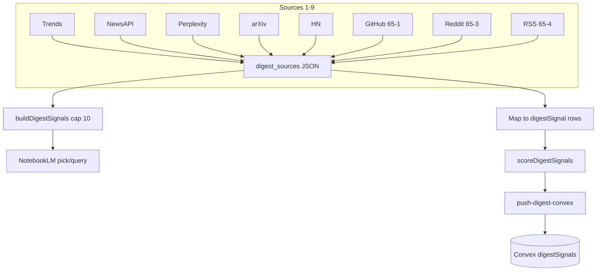

# Architecture: Epic 65 — Native Source Adapter Expansion v1

**Author:** Chris Taylor (architecture workflow)  
**Date:** 2026-06-09  
**Status:** Complete — normative for stories 65-1 through 65-5

## 0. Document Purpose

This architecture is the **normative technical contract** for Epic 65 story authoring and implementation. It owns:

- ADR-E65-001 through ADR-E65-006
- `digestSourceTypeValue` / `digestSectionValue` extension (FR-1)
- Per-adapter fetch URLs, stdout JSON contracts, and env var tables
- **Signal emission shapes** that match Epic 64 `normalizeEngagement()` branches already implemented in `score-digest-signals.mjs`
- Reddit spike gate criteria and 65-3 branch selection
- Morning-digest pipeline integration points
- Story-to-section traceability for `/bmad-create-story` and `/bmad-dev-story`

**Primary inputs:** `prd-epic-65-native-source-adapters.md`, `architecture-epic-64-scoring-engine.md` (§3 schema, §6.1 engagement caps — **do not reimplement or alter formulas**).

**Anti-drift rule:** Adapters emit **raw** engagement counts in `sourceMetadata`. Normalization is Epic 64's job. Never invent alternate field names or pre-normalized scores.

---

## 1. System Context

### 1.1 Current state (post–Epic 64)

| Component | Location | Today |
|-----------|----------|-------|
| Collectors | `fetch-*-rss.mjs`, `hermes-run-*.sh` | Google Trends, NewsAPI, Perplexity, arXiv, HN |
| Signal mapping | `task-prompt.md` §9 | Five source types; HN → `points`/`commentCount` |
| Scoring | `score-digest-signals.mjs` | Five dimensions + `normalizeEngagement` with **github/reddit branches already coded** |
| Schema | `cns-dashboard/convex/validators.ts` | `sourceMetadata` has `stars`/`forks`/`upvotes`; **no** `github`/`reddit`/`rss` literals yet |
| Notebook routing | `pick-signal-notebook.mjs` | `buildDigestSignals()` cap 10; source-order assembly |

### 1.2 Target state (Epic 65)

```
~/.hermes/trend-ingest.env (config)
    → fetch-github-signals.mjs     ─┐
    → spike-reddit-public-json.mjs  │ (65-2 gate only — not production ingest)
    → fetch-reddit-signals.mjs     ─┤
    → fetch-rss-signals.mjs        ─┘
    → task-prompt Sources 7–9 (new)
    → map stdout → digestSignal[] (unscored, strict Convex shape)
    → scoreDigestSignals()         # Epic 64 — unchanged algorithms
    → push-digest-convex.mjs
    → Convex digestSignals
```

**Parallel path (unchanged):** `pick-signal-notebook.mjs` / NotebookLM routing — extended `digest_sources` keys optional; routing SSOT remains F1 scoring, not `rankScore`.

### 1.3 Repo boundary

| Layer | Repo | Responsibility |
|-------|------|----------------|
| Adapter fetch + mapping | Omnipotent.md | New `fetch-*-signals.mjs`, Hermes wrappers, task-prompt |
| Scoring | Omnipotent.md | **Read-only consumer** — priors table extension only (§5.4) |
| Schema | cns-dashboard | `validators.ts` literals (65-1 cross-repo touch) |
| Trend-ingest Reddit | Omnipotent.md Epic 44 | **Separate pipeline** — no shared fetch module in v1 |

---

## 2. Architecture Decision Records

### ADR-E65-001 — Native Node adapters in morning-digest path

**Status:** Accepted  
**Context:** Epic 65 requires GitHub, Reddit, and RSS ingest into the ranked digest pipeline. Existing collectors (arXiv, HN) are CNS-native Node scripts with stdout JSON, exit 0 on failure, and `mergeTrendIngestEnv`.  
**Decision:** All Epic 65 adapters are Node `.mjs` modules under `scripts/hermes-skill-examples/morning-digest/scripts/`, invoked via `scripts/session-close/hermes-run-*.sh` wrappers. **No Python, no PRAW, no subprocess to last30days.**  
**Consequences:**
- Mirror `fetch-hn-rss.mjs` / `fetch-arxiv-rss.mjs` patterns: exported `run*Fetch`, fixture-injectable fetch, always `process.exit(0)` on fetch failure.
- Hermes skill sync after script changes (Epic 64 retro).

---

### ADR-E65-002 — Emit shapes matching coded `normalizeEngagement`, not new ones

**Status:** Accepted  
**Context:** Epic 64-4 implemented `normalizeEngagement()` with `github` and `reddit` switch branches **before** adapters exist. `sourceMetadataValidator` already accepts engagement fields.  
**Decision:** Adapters **must** map platform data to the exact field names and `sourceType` literals the scoring module reads. Adapters **must not** emit `normalizedEngagement`, dimension `scores`, or cross-source engagement comparisons.  
**Consequences:**
- Story ACs include fixture round-trip: adapter row → `normalizeEngagement()` → non-null for github/reddit when required fields present.
- `rss` rows omit engagement fields; `normalizeEngagement` returns `null` (default branch) — momentum uses Path B per Epic 64 §5.5.

**Normative implementation reference** (`score-digest-signals.mjs`):

```javascript
// github: requires sourceMetadata.stars (finite number)
0.85 * logNorm(stars, GH_STARS_CAP) + 0.15 * logNorm(forks, GH_FORKS_CAP)

// reddit: requires sourceMetadata.upvotes (finite number)
0.75 * logNorm(upvotes, RD_UPVOTES_CAP) + 0.25 * logNorm(commentCount, RD_COMMENTS_CAP)

// Caps (exported constants — do not duplicate in adapters):
GH_STARS_CAP = 50000, GH_FORKS_CAP = 5000
RD_UPVOTES_CAP = 10000, RD_COMMENTS_CAP = 2000
```

---

### ADR-E65-003 — 65-2 spike gates 65-3 (mirror 64-1)

**Status:** Accepted  
**Context:** Reddit unattended cron risk (429, 403, HTML blocks). Epic 64 established schema-first gating.  
**Decision:** Story **65-2** is mandatory before **65-3**. Spike documents GO/NO-GO per PRD FR-6. No production Reddit rows in `DIGEST_PUSH_JSON` until 65-3 completes.  
**Consequences:**
- Sprint metadata: `65-2 blocks: 65-3`.
- 65-3 story Context must cite 65-2 artifact outcome.
- 65-2 may run parallel to 65-1 (no schema dependency).

---

### ADR-E65-004 — Epic 44 trend-ingest vs Epic 65 morning-digest Reddit

**Status:** Accepted  
**Decision:** No shared Reddit fetch module between `trend-ingest.py` (44-3-2) and morning-digest adapters. Document boundary only; duplicate fetch logic acceptable in v1.  
**Consequences:** Config, Convex tables, and failure modes remain independent.

---

### ADR-E65-005 — last30days remains reference codebook (extends ADR-E64-005)

**Status:** Accepted  
**Decision:** Study `~/ai-factory/projects/last30days-skill-reference` for URL patterns and field extraction ideas. Clean-room Node reimplementation with MIT attribution comments where algorithmically derived. Zero runtime coupling.  
**Consequences:** Repo grep / review checklist: no `last30days` in import graph or `package.json`.

---

### ADR-E65-006 — Schema literals + scoring prior tables extended together in 65-1

**Status:** Accepted  
**Context:** New `sourceType` values need Convex validator literals **and** non-zero `SOURCE_PRIOR` / `TREND_PROXY_PRIOR` entries for sensible `urgency` and Path B `momentum`. Formulas unchanged.  
**Decision:** Story 65-1 extends:
1. `digestSourceTypeValue` + `digestSectionValue` in cns-dashboard
2. `SOURCE_PRIOR` and `TREND_PROXY_PRIOR` constant maps in `score-digest-signals.mjs` (§5.4)

**Consequences:** Not a scoring algorithm change — table entries only. Tests assert new priors are non-zero where specified.

---

## 3. Schema Extension (Story 65-1 / FR-1)

Primary file: `cns-dashboard/convex/validators.ts`

### 3.1 `digestSourceTypeValue` extension

```typescript
export const digestSourceTypeValue = v.union(
  v.literal('google_trends'),
  v.literal('newsapi'),
  v.literal('arxiv'),
  v.literal('hackernews'),
  v.literal('deep_signal'),
  // Epic 65 — add:
  v.literal('github'),
  v.literal('reddit'),
  v.literal('rss'),
);
```

Apply identically to `digestSignalInputValidator` and `digestSignalRowValidator`.

### 3.2 `digestSectionValue` extension

Section and sourceType are paired per task-prompt strict contract:

```typescript
export const digestSectionValue = v.union(
  v.literal('trends'),
  v.literal('headlines'),
  v.literal('arxiv'),
  v.literal('hackernews'),
  v.literal('deep_signal'),
  // Epic 65 — add:
  v.literal('github'),
  v.literal('reddit'),
  v.literal('rss'),
);
```

### 3.3 `sourceMetadataValidator` — no field additions required

Epic 64-1 already defines the engagement fields adapters use:

| Field | Validator | Used by |
|-------|-----------|---------|
| `stars` | `v.optional(v.number())` | github → `normalizeEngagement` |
| `forks` | `v.optional(v.number())` | github (optional weight 0.15) |
| `upvotes` | `v.optional(v.number())` | reddit → `normalizeEngagement` |
| `commentCount` | `v.optional(v.number())` | reddit, hackernews |
| `points` | `v.optional(v.number())` | hackernews (65-5) |
| `publishedAt` | `v.optional(v.string())` | urgency recency |
| `author` | `v.optional(v.string())` | rss display/audit |

**Rule:** Omit optional keys when absent. **Never `null`.**

### 3.4 Cross-repo test gate

- Extend `cns-dashboard/tests/convex/digest.test.ts` — accept `sourceType: 'github'` with `sourceMetadata.stars`.
- `bash scripts/verify.sh` green with `CNS_DASHBOARD_ROOT` set.

---

## 4. Adapter Module Design

### 4.1 Shared adapter conventions

| Convention | Normative value |
|------------|-----------------|
| Config merge | `mergeTrendIngestEnv()` + `resolveOperatorHome()` from `fetch-arxiv-rss.mjs` |
| stdout | Single JSON object + newline; `{ error: "<short reason>" }` on failure |
| Exit code | **Always 0** on fetch/parse failure (matches HN/arXiv) |
| Timeout | 15s per HTTP request; 45s Hermes terminal wrapper |
| User-Agent | `CNS-morning-digest/1.0` |
| Disable flag | `MORNING_DIGEST_<SOURCE>_ENABLED` — falsy values: `0`, `false`, `no`, `off` |
| Fixture tests | Inject `fetch` mock or `fixtureJson` / `fixtureXml` option — no live network in CI |
| External ID | `sha256(url \|\| title).slice(0, 16)` via Node `crypto` |

### 4.2 Module inventory

| Module | Story | stdout root key |
|--------|-------|-----------------|
| `fetch-github-signals.mjs` | 65-1 | `repos[]` |
| `spike-reddit-public-json.mjs` | 65-2 | `cycles[]` (spike artifact — not digest ingest) |
| `fetch-reddit-signals.mjs` | 65-3 | `posts[]` |
| `fetch-rss-signals.mjs` | 65-4 | `entries[]` |

Hermes wrappers (new):

| Wrapper | Invokes |
|---------|---------|
| `scripts/session-close/hermes-run-github.sh` | `fetch-github-signals.mjs` |
| `scripts/session-close/hermes-run-reddit.sh` | `fetch-reddit-signals.mjs` |
| `scripts/session-close/hermes-run-rss.sh` | `fetch-rss-signals.mjs` |

---

## 5. Signal Emission Contract (Adapter → Scoring → Push)

### 5.1 Mapping table (normative — extends task-prompt §9)

| section | sourceType | stdout source | title | url | sourceMetadata |
|---------|------------|---------------|-------|-----|----------------|
| `github` | `github` | `repos[]` | `title` (full name or display) | `url` | `stars` **required**; `forks`, `publishedAt` optional |
| `reddit` | `reddit` | `posts[]` | `title` | `url` | `upvotes` **required**; `commentCount`, `publishedAt` optional |
| `rss` | `rss` | `entries[]` | `title` | `url` | `publishedAt`, `author` optional; **no engagement fields** |

**Pre-scoring `rank`:** Placeholder integer (e.g. section order); replaced by `scoreDigestSignals` sort.

### 5.2 Engagement cap table (Epic 64 §6.1 — reference only, implemented)

Adapters emit **raw counts**. Scoring applies:

| sourceType | Required for `normalizeEngagement` | Optional | Formula (in `normalizeEngagement`) |
|------------|-----------------------------------|----------|--------------------------------------|
| `github` | `sourceMetadata.stars` | `forks` | `0.85·logNorm(stars,50000) + 0.15·logNorm(forks,5000)` |
| `reddit` | `sourceMetadata.upvotes` | `commentCount` | `0.75·logNorm(upvotes,10000) + 0.25·logNorm(comments,2000)` |
| `rss` | — | `publishedAt` | returns `null`; momentum Path B |

```
logNorm(value, cap) = round(clamp(100 * log10(1 + value) / log10(1 + cap), 0, 100))
```

**Regression fixtures (must pass in adapter + scoring tests):**

| Input | Expected `normalizedEngagement` |
|-------|--------------------------------|
| github `{stars: 50000, forks: 5000}` | 100 |
| github `{stars: 500}` | 48 (primary-only) |
| reddit `{upvotes: 10000, commentCount: 2000}` | 100 |
| reddit `{upvotes: 500, commentCount: 50}` | non-null; drives Path A momentum |
| rss any | `null` |

### 5.3 Stdout fetch contracts

#### GitHub (65-1)

```json
{
  "repos": [
    {
      "title": "owner/repo",
      "url": "https://github.com/owner/repo",
      "stars": 1234,
      "forks": 56,
      "publishedAt": "2026-06-01T12:00:00.000Z"
    }
  ]
}
```

Failure: `{"error":"github disabled"}` | `{"error":"http-403"}` | etc.

#### Reddit (65-3)

```json
{
  "posts": [
    {
      "title": "Post title",
      "url": "https://www.reddit.com/r/.../comments/...",
      "upvotes": 42,
      "commentCount": 7,
      "publishedAt": "2026-06-09T08:00:00.000Z"
    }
  ]
}
```

Field mapping from Reddit JSON: `data.score` → `upvotes`; `data.num_comments` → `commentCount`; `data.title` → `title`; permalink → absolute `url`.

#### RSS (65-4)

```json
{
  "entries": [
    {
      "title": "Article title",
      "url": "https://example.com/post",
      "publishedAt": "2026-06-09T07:00:00.000Z",
      "author": "Author Name"
    }
  ]
}
```

### 5.4 Scoring prior extension (65-1 — constants only)

Add to `score-digest-signals.mjs` (no formula changes):

**`SOURCE_PRIOR` (urgency §5.4):**

| sourceType | sourcePrior |
|------------|-------------|
| `github` | 5 |
| `reddit` | 8 |
| `rss` | 5 |

**`TREND_PROXY_PRIOR` (momentum Path B §5.5):**

| sourceType | trendProxy |
|------------|------------|
| `github` | 40 |
| `reddit` | 42 |
| `rss` | 30 |

Existing sources unchanged. Unknown types continue to default `0`.

---

## 6. Per-Adapter Fetch Design

### 6.1 GitHub adapter (65-1)

**Strategy (resolves PRD §8 OQ-1):** Env-configured **search queries**, not hardcoded trending.

| Env var | Required | Default | Purpose |
|---------|----------|---------|---------|
| `MORNING_DIGEST_GITHUB_ENABLED` | no | enabled | Feature flag |
| `MORNING_DIGEST_GITHUB_QUERIES` | yes when enabled | — | Comma-separated GitHub search query strings (e.g. `agent framework stars:>100,llm tooling`) |
| `MORNING_DIGEST_GITHUB_MAX_REPOS` | no | `5` | Total cap across all queries |
| `MORNING_DIGEST_GITHUB_PER_QUERY` | no | `3` | Max repos per query |
| `GITHUB_TOKEN` | no | — | Optional PAT for rate-limit headroom |

**API:** `GET https://api.github.com/search/repositories?q={encodeURIComponent(query)}&sort=stars&order=desc&per_page={perQuery}`

**Headers:** `Accept: application/vnd.github+json`, `User-Agent: CNS-morning-digest/1.0`, `Authorization: Bearer ${GITHUB_TOKEN}` when token set.

**Mapping:** `full_name` → `title`; `html_url` → `url`; `stargazers_count` → `stars`; `forks_count` → `forks`; `created_at` or `pushed_at` → `publishedAt` (prefer `pushed_at` for recency).

**Dedupe:** By `html_url` across queries.

**Reference study (read-only):** last30days GitHub collector URL/query patterns — translate, do not import.

---

### 6.2 Reddit public-JSON spike (65-2) — gate only

**Purpose:** Validate unattended cron viability. **Not production ingest.**

| Env var | Purpose |
|---------|---------|
| `MORNING_DIGEST_REDDIT_SUBREDDITS` | Comma-separated subreddit names (no `r/` prefix) |
| `MORNING_DIGEST_REDDIT_SPIKE_CYCLES` | Default `3` |
| `MORNING_DIGEST_REDDIT_SPIKE_DELAY_MS` | Default `180000` (3 min between cycles) |

**Endpoint (public-JSON path):**

```
GET https://www.reddit.com/r/{subreddit}/hot.json?limit=10&raw_json=1
```

**Headers:** `User-Agent: CNS-morning-digest/1.0` (Reddit requires descriptive UA).

**Spike stdout artifact:**

```json
{
  "cycles": [
    {
      "cycle": 1,
      "subreddit": "MachineLearning",
      "httpStatus": 200,
      "latencyMs": 842,
      "parseOk": true,
      "postCount": 10,
      "blockIndicator": null
    }
  ],
  "summary": {
    "totalCycles": 3,
    "parseSuccessRate": 1.0,
    "p95LatencyMs": 1200,
    "sustainedBlock": false
  }
}
```

**GO/NO-GO (PRD FR-6 — normative):**

| Outcome | Criteria | 65-3 branch |
|---------|----------|-------------|
| **PASS** | ≥80% cycles parseable with ≥1 post; no sustained 429/403 pattern; p95 latency <15s | Public-JSON adapter |
| **FAIL** | Sustained 429/403, >50% empty/blocked, or HTML/captcha parse failures | Credential fallback only |
| **PARTIAL** | Intermittent failures | Operator decision in story artifact; 65-3 must document mitigation |

---

### 6.3 Reddit adapter (65-3) — blocked by 65-2

**Branch A — Public-JSON GO (from spike PASS):**

Same endpoint as §6.2. Map `data.children[].data` fields per §5.3.

| Env var | Purpose |
|---------|---------|
| `MORNING_DIGEST_REDDIT_ENABLED` | Feature flag (production) |
| `MORNING_DIGEST_REDDIT_SUBREDDITS` | Targets |
| `MORNING_DIGEST_REDDIT_MAX_POSTS` | Default `5` total |
| `MORNING_DIGEST_REDDIT_PER_SUBREDDIT` | Default `3` |

**Branch B — Credential fallback (spike FAIL or operator override):**

OAuth **script/app** read-only token flow:

| Env var | Purpose |
|---------|---------|
| `REDDIT_CLIENT_ID` | OAuth app id |
| `REDDIT_CLIENT_SECRET` | OAuth secret |
| `REDDIT_USERNAME` | Optional — user-agent context |
| `REDDIT_PASSWORD` | Optional — only if password grant approved by operator |

**API:** `GET https://oauth.reddit.com/r/{subreddit}/hot?limit={n}&raw_json=1` with `Authorization: Bearer {token}`.

Token acquisition: implement `fetchRedditAppToken()` in same module — client_credentials or password grant per operator config documented in 65-3 story after spike. **Finalize grant type in 65-3 story file based on 65-2 artifact** (architecture defers to spike outcome).

**Failure isolation:** `{ "error": "reddit disabled" }` or fetch failure → task-prompt `(source unavailable: …)`; digest continues.

---

### 6.4 RSS / Substack adapter (65-4)

**Package:** `rss-parser` (npm — verify ≥14 days published at install per security policy).

| Env var | Required | Default | Purpose |
|---------|----------|---------|---------|
| `MORNING_DIGEST_RSS_ENABLED` | no | enabled | Feature flag |
| `MORNING_DIGEST_RSS_FEEDS` | yes when enabled | — | Comma-separated feed URLs |
| `MORNING_DIGEST_RSS_MAX_PER_FEED` | no | `3` | Entries per feed |
| `MORNING_DIGEST_RSS_MAX_TOTAL` | no | `10` | Total cap |

**Fetch:** Sequential feed URLs with 15s timeout each. Dedupe by normalized URL, then title.

**Mapping:** `item.title` → `title`; `item.link` → `url`; `item.isoDate` or `item.pubDate` → ISO8601 `publishedAt`; `item.creator` or `item.author` → `author`.

**No engagement fields** — `normalizeEngagement` returns `null`; `rankScore` uses momentum weight redistribution (Epic 64 §8.2).

---

### 6.5 HN engagement upgrade (65-5, optional)

When implemented, ensure push-path mapping (task-prompt §9):

- RSS `score` → `sourceMetadata.points`
- RSS `comments` → `sourceMetadata.commentCount`

`fetch-hn-rss.mjs` already parses `score`/`comments` in stdout; gap is **digestSignal assembly** in task-prompt agent step, not fetch. No change to `normalizeEngagement` HN branch (already coded).

---

## 7. Morning Digest Pipeline Integration (FR-12)

### 7.1 Source numbering (extends task-prompt)

| Source | Script | Discord section header |
|--------|--------|------------------------|
| 7 | `hermes-run-github.sh` | **GitHub** |
| 8 | `hermes-run-reddit.sh` | **Reddit** (post-65-3 only) |
| 9 | `hermes-run-rss.sh` | **Newsletters / RSS** |

Insert after Source 5 (HN), before Source 6 (NotebookLM). Each source: independent terminal call, 45s timeout, failure → `(source unavailable: …)`.

### 7.2 `digest_sources` assembly

Extend JSON passed to `pick-signal-notebook.mjs`:

```json
{
  "trends": [...],
  "headlines": [...],
  "perplexityText": "...",
  "arxiv": [...],
  "hackernews": [...],
  "github": [{ "title": "...", "url": "...", "stars": 1234 }],
  "reddit": [{ "title": "...", "url": "...", "upvotes": 42 }],
  "rss": [{ "title": "...", "url": "..." }]
}
```

### 7.3 `buildDigestSignals` cap-10 allocation (resolves PRD §8 OQ-3)

Extend `buildDigestSignals()` source-order (lowest priority last):

1. trends (top 3 by `normalizedValue`)
2. headlines (top 2)
3. perplexity (top 2 sentences)
4. arxiv (existing cap)
5. hackernews (existing cap)
6. **github (top 2 by stars)**
7. **reddit (top 2 by upvotes)** — when present
8. **rss (top 1)**

Then `dedupeSignals()` → max 10 titles for NotebookLM routing.

**Ranking SSOT for Nexus cockpit:** `rankScore` after scoring — not `buildDigestSignals` order.

### 7.4 Scoring and push (unchanged)

Post-Discord flow remains:

```
digest_push_payload.signals = unscored rows from §5.1 mapping
  → scoreDigestSignals(signals, ctx)
  → digest_push_payload.signals = scored_signals
  → push-digest-convex.mjs
  → push-keyword-candidates.mjs
```

Adapters do **not** call scoring. Task-prompt agent builds unscored `signals[]` from Sources 1–9, then scoring terminal replaces array.

### 7.5 Pipeline diagram



---

## 8. Failure and Degraded Modes

| Failure | Behavior |
|---------|----------|
| Single adapter fetch error | Section bullet `(source unavailable: …)`; other sources continue |
| GitHub token missing | Unauthenticated API (lower rate limit); degrade, don't abort |
| Reddit spike FAIL | 65-3 uses credential branch; if credentials missing → unavailable section |
| Reddit prod fetch 429 | Log stderr; `{ error: "http-429" }`; unavailable section |
| RSS feed parse error | Skip feed; continue others; error only if all feeds fail |
| Convex push validation | Existing push script behavior — stderr warning, exit 0 |
| Scoring throw | Unscored push fallback (Epic 64 §9) |

---

## 9. Story Traceability

| Story | Architecture sections | FR IDs | Key deliverables |
|-------|----------------------|--------|------------------|
| **65-1** | §3, §4.2, §5.1–5.2, §6.1, §7 | FR-1, FR-2, FR-3, FR-4, FR-16 | `validators.ts`, `fetch-github-signals.mjs`, priors §5.4, task-prompt Source 7 |
| **65-2** | §6.2, ADR-E65-003 | FR-5, FR-6, FR-16 | `spike-reddit-public-json.mjs`, GO/NO-GO artifact |
| **65-3** | §5.3, §6.3 | FR-7, FR-8, FR-16 | `fetch-reddit-signals.mjs`, branch per spike |
| **65-4** | §5.3, §6.4, §7.3 | FR-9, FR-10, FR-16 | `fetch-rss-signals.mjs`, `rss-parser` |
| **65-5** (opt) | §6.5 | FR-11 | HN push-path metadata alignment |

### 9.1 Gate discipline

```
65-2 (Reddit spike) ──blocks──▶ 65-3 (Reddit adapter)

65-1, 65-4 — soft depend on Epic 64 scoring live; FR-1 required before Convex push of new types
65-2 — no schema dependency; parallel with 65-1
65-5 — optional; no blockers
```

### 9.2 Recommended execution order

1. `/bmad-create-story 65-2` — spike (parallel)
2. `/bmad-create-story 65-1` — schema + GitHub
3. `/bmad-create-story 65-3` — **after 65-2 done**
4. `/bmad-create-story 65-4` — RSS
5. `/bmad-create-story 65-5` — optional HN

---

## 10. Test Requirements

| Test file | Coverage |
|-----------|----------|
| `tests/morning-digest-github-adapter.test.mjs` (new) | Config, parse, stdout shape, digestSignal mapping fixture |
| `tests/morning-digest-reddit-spike.test.mjs` (new) | Cycle logging, GO/NO-GO summary |
| `tests/morning-digest-reddit-adapter.test.mjs` (new) | Public-JSON parse, field mapping, normalizeEngagement round-trip |
| `tests/morning-digest-rss-adapter.test.mjs` (new) | XML fixtures, dedupe, caps |
| `tests/morning-digest-score-signals.test.mjs` (extend) | Prior entries for github/reddit/rss; adapter fixture → Path A momentum |
| `tests/morning-digest-push-convex.test.mjs` (extend) | New sourceType round-trip |
| `cns-dashboard/tests/convex/digest.test.ts` (extend) | Validator literals §3 |

**Mandatory integration assertion (65-1, 65-3):**

```javascript
const norm = normalizeEngagement({
  sourceType: 'github',
  title: 'test/repo',
  sourceMetadata: { stars: 500, forks: 10 },
});
assert(norm !== null && norm >= 0 && norm <= 100);
```

**Gate:** `bash scripts/verify.sh` green before any story marked done.

---

## 11. Open Questions — Resolved

| PRD open question | Architecture resolution |
|-------------------|-------------------------|
| GitHub query strategy | §6.1 — env `MORNING_DIGEST_GITHUB_QUERIES` search API |
| RSS feed list source | §6.4 — comma-separated `MORNING_DIGEST_RSS_FEEDS` in `trend-ingest.env` |
| buildDigestSignals slot budget | §7.3 — extended source-order with per-source caps |
| Reddit credential fallback scope | §6.3 — finalize OAuth grant in 65-3 story after spike; architecture defines env vars |
| FR-1 timing | Bundled into 65-1 first AC group |
| Live digest smoke before cron | Operator gate recommended (Epic 64 retro T1); not story blocker |

---

## 12. Out of Scope Reminder

- Scoring formula changes (Epic 64 locked)
- ProductHunt / X / TikTok adapters
- Epic 44 trend-ingest unification
- Dashboard UI source badges
- Vault-semantic relevance
- last30days runtime dependency

---

## 13. Downstream Handoff

| Next workflow | Action |
|---------------|--------|
| `/bmad-create-story 65-2` | Spike gate — may start immediately |
| `/bmad-create-story 65-1` | Schema §3 + GitHub §6.1 + mapping §5 |
| `/bmad-create-story 65-3` | After 65-2 artifact — cite GO/NO-GO |
| `/bmad-create-story 65-4` | RSS §6.4 |
| `/bmad-dev-story` | Implement against §4–§7; reference §5.2 caps, not duplicate |

**Normative engagement upstream:** `architecture-epic-64-scoring-engine.md` §6.1 and `score-digest-signals.mjs` `normalizeEngagement()` — stories reference sections, do not copy-alter formulas.

**Normative path:** `_bmad-output/planning-artifacts/architecture-epic-65-native-source-adapters.md`
