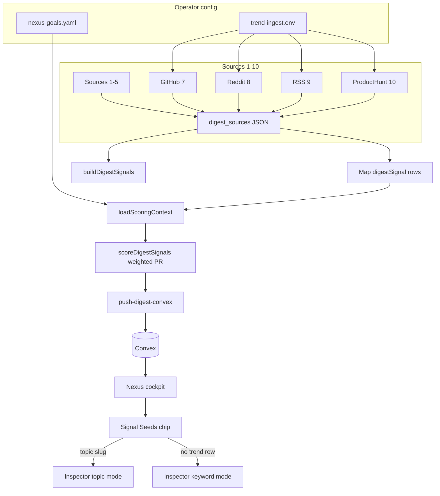

# Architecture: Epic 67 — Signal Quality + Source Expansion

**Author:** Chris Taylor (architecture workflow)  
**Date:** 2026-06-09  
**Status:** Complete — normative for stories 67-1 through 67-6

## 0. Document Purpose

This architecture is the **normative technical contract** for Epic 67 story authoring and implementation. It owns:

- ADR-E67-002 through ADR-E67-007 (binding on top of ADR-E67-001)
- ProductHunt Source 10 adapter contract (stdout, env, GraphQL query, digest mapping)
- `nexus-goals.yaml` loader + weighted `scorePersonalRelevance` extension
- Signal Seeds chip → Inspector resolution (topic mode + keyword mode)
- Operator validation gates (67-1 live digest, 67-6 Compare smoke)
- Reddit OAuth retry wiring (operator-gated 67-2)
- Story-to-section traceability for `/bmad-create-story` and `/bmad-dev-story`

**Primary inputs:** `prd-epic-67-2026-06-09`, operator brief (2026-06-09), ADR-E67-001.

**Anti-drift rules:**

- Adapters emit **raw** engagement in `sourceMetadata`; normalization stays in `normalizeEngagement()` (Epic 64).
- No Python subprocesses; no `last30days` runtime dependency.
- All new Omnipotent.md scripts use `resolveOperatorHome()` — never raw `os.homedir()`.
- cns-dashboard changes go through BMAD stories only.

---

## 1. System Context

### 1.1 Current state (post–Epic 66)

| Component | Location | Today |
|-----------|----------|-------|
| Adapters Sources 7–9 | `fetch-github-signals.mjs`, `fetch-reddit-signals.mjs`, `fetch-rss-signals.mjs` | Merged; **not operator-validated in live digest** |
| Scoring | `score-digest-signals.mjs` | Five dimensions; `personalTokens` from sprint, entities, watchlist, keyword candidates — **no goals file** |
| Schema | `cns-dashboard/convex/validators.ts` | `github`, `reddit`, `rss` literals present; **`producthunt` not yet in union** (test fixture references it) |
| Inspector | `NexusInspectorDrawer.svelte` | Topic-slug keyed; Compare enabled via `NEXUS_COMPARE_ENABLED` |
| Signal Seeds | `NexusSignalSeedsRail.svelte` | Track/Dismiss wired; **chip body does not open inspector** |
| Operator config | `~/.hermes/trend-ingest.env` | GitHub/RSS configured; Reddit OAuth blocked; no ProductHunt token |

### 1.2 Target state (Epic 67)

```
~/.hermes/trend-ingest.env
~/.hermes/nexus-goals.yaml          ← new (67-3)
    ↓
Sources 1–9 (validated 67-1) + Source 10 ProductHunt (67-5)
    ↓
scoreDigestSignals() with goal-weighted personalRelevance (67-3)
    ↓
Convex digestSignals (+ producthunt rows)
    ↓
Nexus cockpit: chips resolve → topic or keyword inspector (67-4)
    ↓
Compare smoke across ≥2 runs (67-6)
```

### 1.3 Repo boundary

| Layer | Repo | Responsibility |
|-------|------|----------------|
| Adapters + scoring | Omnipotent.md | ProductHunt fetch, goals loader, validation artifacts |
| Schema literal | cns-dashboard | `producthunt` in `digestSourceTypeValue` (67-5) |
| Inspector UX | cns-dashboard | Chip click, keyword mode, slug resolver (67-4) |
| Operator gates | Operator + artifacts | 67-1 live digest, 67-2 Reddit OAuth, 67-6 Compare smoke |

---

## 2. Architecture Decision Records

### ADR-E67-001 — last30days codebook only (binding, pre-existing)

**Status:** Accepted — see `docs/ADR-E67-001-last30days-codebook-only.md`.  
Epic 67 inherits without modification.

---

### ADR-E67-002 — ProductHunt via native GraphQL adapter (Source 10)

**Status:** Accepted  
**Context:** Operator wants daily launch intelligence. PRD FR-10–FR-12; addendum A1. ADR-E67-001 prohibits last30days subprocess.  
**Decision:** Implement `fetch-producthunt-launches.mjs` calling Product Hunt public GraphQL at `https://api.producthunt.com/v2/api/graphql` with developer token from env.  
**Consequences:**

- Script path: `scripts/hermes-skill-examples/morning-digest/scripts/fetch-producthunt-launches.mjs`
- Wrapper: `scripts/session-close/hermes-run-producthunt.sh`
- Hermes sync after merge (Epic 64 retro pattern)
- Study `~/ai-factory/projects/last30days-skill-reference` Product Hunt section **read-only** for field mapping

**Env key (normative):** `PRODUCTHUNT_API_KEY` in `~/.hermes/trend-ingest.env`.  
`mergeTrendIngestEnv` reads the same file as other adapters. PRD/addendum alias `PRODUCTHUNT_API_TOKEN` → document in `trend-ingest.env.example` as equivalent comment only; implementation reads **`PRODUCTHUNT_API_KEY`**.

**GraphQL query (normative shape):**

```graphql
query DailyLaunches($after: DateTime!) {
  posts(order: VOTES, postedAfter: $after, first: 10) {
    edges {
      node {
        name
        tagline
        url
        votesCount
        createdAt
      }
    }
  }
}
```

- `$after` = start of previous calendar day in ISO 8601 (operator timezone UTC unless env override added later).
- Take top **10** by `votesCount` after fetch (API `order: VOTES` + `first: 10`).
- `[ASSUMPTION: free developer token available; if denied, story documents NO-GO and degraded Source 10 section]`

**Stdout contract (normative — key is `launches`, not `repos`/`posts`/`entries`/`stories`):**

```json
{
  "launches": [
    {
      "title": "Launch name",
      "tagline": "One-line description",
      "url": "https://www.producthunt.com/posts/...",
      "votesCount": 412
    }
  ]
}
```

On failure: `{"error":"<short reason>"}` and **exit 0**.

**Anti-pattern:** Do not emit `name` in stdout — map GraphQL `name` → stdout `title` inside the adapter.

---

### ADR-E67-003 — `producthunt` engagement via dedicated `normalizeEngagement` branch

**Status:** Accepted  
**Context:** `normalizeEngagement()` has `hackernews`, `github`, `reddit` branches. `producthunt` is not covered by `reddit` switch fall-through.  
**Decision:** Add `case 'producthunt':` reusing reddit upvote formula with Product Hunt caps:

```javascript
case 'producthunt': {
  if (!Number.isFinite(meta.upvotes)) {
    return null;
  }
  return Math.round(
    0.75 * logNorm(meta.upvotes, RD_UPVOTES_CAP) +
      0.25 * logNorm(commentCount, RD_COMMENTS_CAP),
  );
}
```

**Mapping (adapter → digestSignal):**

| stdout field | digestSignal field |
|--------------|-------------------|
| `title` | `title` |
| `tagline` | `summary` |
| `url` | `url` |
| `votesCount` | `sourceMetadata.upvotes` |
| `publishedAt` (if added) | `sourceMetadata.publishedAt` |

- `section`: `producthunt`
- `sourceType`: `producthunt`

---

### ADR-E67-004 — `nexus-goals.yaml` weighted personalRelevance (no Convex schema change)

**Status:** Accepted  
**Context:** FR-6, FR-7; operator brief specifies 2× weight for goal phrases vs sprint/entity tokens.  
**Decision:** Extend `loadScoringContext()` to load `~/.hermes/nexus-goals.yaml` via `resolveOperatorHome()`. Extend `scorePersonalRelevance()` with weighted token tiers. Scoring remains **pre-push** in morning-digest — no Convex mutation.

**Schema (normative):**

```yaml
version: 1
goals:
  - phrase: "AI agent orchestration tools"
    weight: 2.0
  - phrase: "solo operator automation"
    weight: 1.5
```

| Rule | Value |
|------|-------|
| Max phrases | 20 (`goals[]` entries) |
| Tokenization | Same `tokenizeForScoring()` as sprint tokens |
| Default weight | `2.0` when `weight` omitted |
| Sprint / entity / watchlist / keyword-candidate tokens | **1.0** (unchanged tier) |
| Missing / malformed file | Empty goal set; stderr diagnostic once; no throw |

**Scoring algorithm (normative):**

```javascript
// ctx.goalWeightedTokens: Array<{ token: string, weight: number }>
// ctx.personalTokens: string[] at weight 1.0 (existing sources, excluding goal duplicates)

function weightedPersonalF1(signalTokens, weightedRefTokens) {
  // For each reference token with weight w:
  //   intersection contribution += w when token in signalTokens
  //   precision denominator uses signal token count
  //   recall denominator uses sum of matched reference weights
  // Scale to 0–100 like f1Score; clamp
}

export function scorePersonalRelevance(signal, ctx) {
  const signalTokens = tokenizeSignalText(signal.title, signal.summary);
  const baseTier = weightedPersonalF1(signalTokens, ctx.personalTokens.map(t => ({ token: t, weight: 1 })));
  const goalTier = weightedPersonalF1(signalTokens, ctx.goalWeightedTokens);
  const combined = Math.max(baseTier, goalTier); // goal tier can dominate when matched
  const epicBonus = ctx.epicNumericTokens.some((t) => signalTokens.includes(t)) ? 15 : 0;
  return clamp(combined + epicBonus, 0, 100);
}
```

`goalWeightedTokens` built by flat-mapping each `goals[].phrase` through `tokenizeForScoring`, attaching phrase-level `weight` to every token from that phrase.

**Example file:** `scripts/nexus-goals.yaml.example` in Omnipotent.md (operator copies to `~/.hermes/nexus-goals.yaml`).

---

### ADR-E67-005 — Signal Seeds resolve topic first, keyword mode fallback

**Status:** Accepted — **supersedes PRD FR-8 no-match no-op** per operator brief  
**Context:** `keywordCandidates.term` is lowercase normalized storage key (e.g. `sveltekit`). `trendTopics.topicSlug` is lowercase slug. Chips have no click handler; inspector opens only on `topicSlug` from trend index. Some seeds lack a `trendTopics` row.  
**Decision:** Two-mode inspector open — **no new Convex tables**.

**Resolution order (67-4):**

1. Load `trendTopics` (existing `getTrendTopics` query in layout/drawer).
2. **Exact slug match:** `slugify(term) === topic.topicSlug` (case-insensitive).
3. **Keyword match:** normalized `displayTerm` equals normalized `topic.keyword` (case-fold, whitespace collapse).
4. **Topic mode:** `openInspectorForTopic(matchedSlug)` — existing path.
5. **Keyword mode:** no trend row → `openInspectorForKeyword(term)` — new path.

**Keyword mode behavior:**

- Extend `NexusDrawerPayload`:

```typescript
export type NexusDrawerPayload =
  | { mode: 'topic'; topicSlug: string }
  | { mode: 'keyword'; keywordTerm: string; displayLabel: string };
```

- `NexusInspectorDrawer` branches on `mode`:
  - **topic:** existing queries (`getTopicBySlug`, score history, WoW, trace, related signals).
  - **keyword:** skip topic-scoped Convex queries; set `digestFocusKeyword = displayLabel || keywordTerm`; reuse `getLatestDigestBrief` + `getDigestSignalsForRun` + `resolveScoredDigestSignal()` (already matches title/summary).
  - Show keyword-mode header: `"Signals matching: {displayLabel}"`; hide hero sparkline / related-topics strip when no `topicSlug`.
  - Investigation actions (Explain, Compare, Trace, Ask AI) operate on resolved `digestSignalId` when a scored signal exists — same as topic mode.

**Shared util:** `resolveSeedToInspectorTarget(term, displayTerm, topics)` in `src/lib/utils/nexus-signal-seeds.ts` (exported for unit tests).

**Chip UX:** Wrap chip main body (`nx-signal-chip-main`) in `<button>` or add `onclick` on main div; Track/Dismiss remain separate buttons with `stopPropagation`.

---

### ADR-E67-006 — Reddit OAuth retry is operator-gated; epic proceeds without it

**Status:** Accepted  
**Context:** FR-4, FR-5; Epic 65 captcha blocker.  
**Decision:** Story 67-2 wires env + validates when credentials exist. Epic **completes without Reddit** if operator documents NO-GO. No public-JSON production fallback (ADR-E65-003 stands).

**Subreddits (normative — operator brief):**

```
MORNING_DIGEST_REDDIT_SUBREDDITS=MachineLearning,LocalLLaMA,SideProject,entrepreneur,artificial,singularity
```

Note: PRD addendum A5 included `devops` — **operator brief omits it**; architecture follows operator brief for 67-2.

**Env keys in `~/.hermes/trend-ingest.env`:**

| Key | Purpose |
|-----|---------|
| `REDDIT_CLIENT_ID` | OAuth app |
| `REDDIT_CLIENT_SECRET` | OAuth app |
| `REDDIT_USER_AGENT` | `platform:app-id:version (by /u/username)` |
| `REDDIT_USERNAME` / `REDDIT_PASSWORD` | Password grant (65-3 path) |
| `MORNING_DIGEST_REDDIT_SUBREDDITS` | Comma-separated, no `r/` prefix |

---

### ADR-E67-007 — Live validation and Compare smoke are operator artifacts, not code stories

**Status:** Accepted  
**Context:** 67-1 and 67-6 are production-confidence gates.  
**Decision:** Stories produce markdown artifacts under `_bmad-output/implementation-artifacts/` with pass/fail checklists. No new automation required in MVP unless story author adds optional `hermes-run-morning-digest` wrapper invocation.

---

## 3. Schema Extensions (cns-dashboard)

### 3.1 `digestSourceTypeValue` — add `producthunt`

**File:** `convex/validators.ts`

```typescript
export const digestSectionValue = v.union(
  // ... existing ...
  v.literal('producthunt')  // add alongside github, reddit, rss
);

export const digestSourceTypeValue = v.union(
  // ... existing ...
  v.literal('producthunt')
);
```

`sourceMetadataValidator` already supports `upvotes` and `commentCount` — no change required.

### 3.2 No Convex changes for 67-3 or 67-4

- Goals file is operator Hermes config (not WriteGate / not vault).
- Inspector keyword mode is client-side payload branching only.

---

## 4. ProductHunt Adapter — Source 10 (67-5)

### 4.1 Files

| File | Action |
|------|--------|
| `scripts/hermes-skill-examples/morning-digest/scripts/fetch-producthunt-launches.mjs` | **Create** |
| `scripts/session-close/hermes-run-producthunt.sh` | **Create** |
| `scripts/hermes-skill-examples/morning-digest/references/task-prompt.md` | **Add Source 10 block** (mirror Sources 7–9) |
| `scripts/hermes-skill-examples/morning-digest/scripts/pick-signal-notebook.mjs` | Extend `buildDigestSignals` with `producthunt` key (top 2 by votes) |
| `scripts/hermes-skill-examples/morning-digest/scripts/score-digest-signals.mjs` | Add `producthunt` prior + `normalizeEngagement` branch |
| `~/.hermes/skills/cns/morning-digest/...` | Hermes sync post-merge |

### 4.2 task-prompt.md Source 10 (normative outline)

```text
## Source 10 — Product Hunt

terminal(command="bash scripts/session-close/hermes-run-producthunt.sh", workdir=resolved_repo_root, timeout=45)

Stdout shape (Product Hunt only):
{ "launches": [{ "title": "...", "tagline": "...", "url": "...", "votesCount": 42 }] }

Threading:
1. Parse launches[] only — not repos/posts/entries/stories
2. Map votesCount → sourceMetadata.upvotes
3. section producthunt, sourceType producthunt
4. On failure: **Product Hunt** + (source unavailable: …) → continue to Source 6
```

Insert **after Source 9**, **before Source 6** (reorder Source 6 header to "after Source 10" in task-prompt).

Update §9 `digest_sources` assembly JSON to include `"producthunt": [...]`.

Update §9 mapping table row:

| sourceType | section | stdout key | title field | summary | url | engagement |
|------------|---------|------------|-------------|---------|-----|------------|
| `producthunt` | `producthunt` | `launches[]` | `title` | `tagline` | `url` | `votesCount` → `upvotes` |

### 4.3 Env vars

| Variable | Default | Notes |
|----------|---------|-------|
| `PRODUCTHUNT_API_KEY` | — | Required when enabled |
| `MORNING_DIGEST_PRODUCTHUNT_ENABLED` | `true` | `0`/`false` disables |
| `MORNING_DIGEST_PRODUCTHUNT_MAX_LAUNCHES` | `10` | Cap after sort |

### 4.4 `buildDigestSignals` allocation (extends Epic 65 §7.3)

Source order after Epic 67:

1. trends (3) → headlines (2) → perplexity (2) → arxiv → hackernews → github (2) → reddit (2) → rss (1) → **producthunt (2 by votesCount)**

Cap-10 dedupe unchanged; Nexus `rankScore` remains ranking SSOT.

### 4.5 Adapter implementation pattern

Mirror `fetch-github-signals.mjs`:

- `mergeTrendIngestEnv` from `fetch-arxiv-rss.mjs`
- `resolveOperatorHome` for env file path
- 15s fetch timeout
- Exported `runProductHuntFetch` for fixture tests
- GraphQL POST with `Authorization: Bearer ${apiKey}`

---

## 5. personalRelevance v2 — nexus-goals.yaml (67-3)

### 5.1 Loader (`loadNexusGoals`)

Add to `score-digest-signals.mjs`:

```javascript
const NEXUS_GOALS_MAX_PHRASES = 20;
const DEFAULT_GOAL_WEIGHT = 2.0;
const GOALS_PATH = join(operatorHome, '.hermes', 'nexus-goals.yaml');

// parse with lightweight YAML (existing parse patterns in repo) or line-safe subset parser
// validate version === 1 (ignore unknown versions with stderr warning)
// truncate to 20 phrases
```

Return `goalWeightedTokens` on `ScoringContext`.

### 5.2 Tests (`tests/morning-digest-score-signals.test.mjs`)

| Case | Assertion |
|------|-----------|
| Valid goals file | Goal phrase in title → higher `personalRelevance` than without |
| Missing file | Empty goals; no throw |
| Malformed YAML | Empty goals; stderr diagnostic |
| Per-phrase weight 1.5 | Weight honored vs default 2.0 |
| 21st phrase | Truncated to 20 |

### 5.3 Fixture delta (FR-7 acceptance)

Signal title: `"Nexus intelligence cockpit ships scoring panel"`  
Goal phrase: `"Nexus intelligence cockpit"`  
Expect ≥15 point delta vs identical run without goals file (PRD FR-7).

---

## 6. Signal Seeds → Inspector (67-4)

### 6.1 `resolveSeedToInspectorTarget`

**File:** `cns-dashboard/src/lib/utils/nexus-signal-seeds.ts`

```typescript
export type InspectorTarget =
  | { mode: 'topic'; topicSlug: string }
  | { mode: 'keyword'; keywordTerm: string; displayLabel: string };

export function slugifySeedTerm(term: string): string {
  return term.trim().toLowerCase().replace(/\s+/g, '-').replace(/[^a-z0-9-]/g, '');
}

export function normalizeSeedLabel(value: string): string {
  return value.trim().toLowerCase().replace(/\s+/g, ' ');
}

export function resolveSeedToInspectorTarget(
  term: string,
  displayTerm: string,
  topics: Array<{ topicSlug: string; keyword: string }>
): InspectorTarget | null {
  const slug = slugifySeedTerm(term);
  const bySlug = topics.find((t) => t.topicSlug.toLowerCase() === slug);
  if (bySlug) return { mode: 'topic', topicSlug: bySlug.topicSlug };

  const label = normalizeSeedLabel(displayTerm);
  const byKeyword = topics.find((t) => normalizeSeedLabel(t.keyword) === label);
  if (byKeyword) return { mode: 'topic', topicSlug: byKeyword.topicSlug };

  // Keyword mode fallback (ADR-E67-005)
  if (term.trim()) {
    return { mode: 'keyword', keywordTerm: term.trim(), displayLabel: displayTerm.trim() || term.trim() };
  }
  return null;
}
```

### 6.2 Context API

Extend `nexus-context.ts`:

```typescript
openInspectorForKeyword: (keywordTerm: string, displayLabel: string) => void;
```

Sets `drawerPayload = { mode: 'keyword', keywordTerm, displayLabel }`, opens drawer.

Update `NexusDrawerPayload` type; migrate existing `{ topicSlug }` to `{ mode: 'topic', topicSlug }` at all call sites (hero, anomaly feed, drawer topic picker).

### 6.3 `NexusInspectorDrawer` branches

| `mode` | `topicSlug` query | `digestFocusKeyword` | Hero / WoW / trace |
|--------|-------------------|----------------------|--------------------|
| `topic` | active | from `headerMeta.keyword` | full |
| `keyword` | skip | `displayLabel` | hidden / empty state |

Reuse `signalMatchesKeyword` logic via existing `resolveScoredDigestSignal`.

### 6.4 Tests

| File | Coverage |
|------|----------|
| `tests/unit/nexus-signal-seeds.test.ts` (new or extend) | slug match, keyword match, keyword mode fallback |
| Component test / manual QA | Track/Dismiss do not open inspector |

---

## 7. Operator Validation Gates

### 7.1 Live digest validation (67-1) — FR-1–FR-3

**Not a code story.** Operator runs full morning-digest with Convex push.

| Check | Pass criteria |
|-------|---------------|
| Signal count | ≥30 `digestSignals` with `rankScore` |
| Scoring coverage | `rankScore` on ≥80% of signals |
| GitHub | ≥1 `sourceType: github`, `sourceMetadata.stars` |
| RSS | ≥1 `sourceType: rss` |
| personalRelevance | ≥1 signal with `scores.personalRelevance > 0` |
| Inspector | GitHub/RSS open with Signal Intelligence panel |
| Degraded mode | Failed source → `(source unavailable: …)` only |

**If GitHub/RSS produce 0 signals:** diagnose fetch scripts directly (`hermes-run-github.sh`, `hermes-run-rss.sh`) before blaming task-prompt mapping.

**Artifact:** `_bmad-output/implementation-artifacts/67-1-live-digest-validation.md`

### 7.2 Reddit OAuth retry (67-2) — FR-4, FR-5

Operator creates app at `old.reddit.com/prefs/apps`. Developer wires env + documents GO/NO-GO. Manual `hermes-run-reddit.sh` must emit `posts[]` when GO.

### 7.3 Compare smoke test (67-6) — FR-13, FR-14

**Prerequisites:**

- `NEXUS_COMPARE_ENABLED=true` (Convex)
- `PUBLIC_NEXUS_COMPARE_ENABLED=true` (client, if prod UI)
- ≥2 digest runs within 7 days with overlapping `digestFocusKeyword`

**Steps:**

1. Run morning digest twice on consecutive days (stable watchlist keyword, e.g. `ai agents`).
2. Open inspector on topic appearing in both runs (topic mode) → **Compare**.
3. Verify streamed response references prior-run data.
4. Record `investigationSessions` id.

**Artifact:** `_bmad-output/implementation-artifacts/67-6-compare-smoke-test.md`

---

## 8. Pipeline Diagram (post–Epic 67)



---

## 9. Failure and Degraded Modes

| Failure | Behavior |
|---------|----------|
| ProductHunt API denied / 401 | `{ error: "auth" }`; unavailable section; digest continues |
| ProductHunt rate limit | `{ error: "rate-limit" }`; degraded |
| `nexus-goals.yaml` missing | Empty goals; base personalRelevance only |
| Reddit NO-GO (67-2) | Epic completes; SM-2 reddit clause waived |
| Chip → no topics + empty term | `resolveSeedToInspectorTarget` returns null; no open |
| Compare single run | 67-6 blocked until second run; document wait |
| Live digest <30 signals | 67-1 fail; tune caps in artifact |

---

## 10. Story Traceability

| Story | Architecture sections | FR IDs | Key deliverables |
|-------|----------------------|--------|------------------|
| **67-1** | §7.1, ADR-E67-007 | FR-1–FR-3 | Validation artifact; Epic 65 retro P1 closure |
| **67-2** | §7.2, ADR-E67-006 | FR-4, FR-5 | `trend-ingest.env.example`; GO/NO-GO notes |
| **67-3** | §5, ADR-E67-004 | FR-6, FR-7 | Goals loader, weighted scorer, example YAML |
| **67-4** | §6, ADR-E67-005 | FR-8, FR-9 | Chip click, keyword mode, context payload |
| **67-5** | §3, §4, ADR-E67-002/003 | FR-10–FR-12 | Adapter, wrapper, task-prompt Source 10, schema |
| **67-6** | §7.3, ADR-E67-007 | FR-13, FR-14 | Compare smoke artifact |

### 10.1 Gate discipline

```
67-1 (live digest) ──gates──▶ 67-5 (ProductHunt) production confidence

67-3, 67-4 — parallel with 67-1 (no adapter deps)

67-2 — operator-gated; may slip; does not block epic completion

67-6 — requires ≥2 digest runs; best after 67-1 green
```

### 10.2 Recommended execution order

1. `/bmad-create-story 67-1` — validation gate (operator + artifact)
2. `/bmad-create-story 67-3` + `67-4` — parallel
3. `/bmad-create-story 67-2` — when operator ready
4. `/bmad-create-story 67-5` — after 67-1 pass
5. `/bmad-create-story 67-6` — after second digest run

---

## 11. Test Requirements

| Test file | Coverage |
|-----------|----------|
| `tests/morning-digest-producthunt-adapter.test.mjs` (new) | GraphQL parse fixture, stdout `launches[]`, mapping, `normalizeEngagement` round-trip |
| `tests/morning-digest-score-signals.test.mjs` (extend) | Goals loader, weighted personalRelevance, 20-phrase cap |
| `tests/morning-digest-push-convex.test.mjs` (extend) | `producthunt` sourceType push |
| `cns-dashboard/tests/convex/digest.test.ts` (extend) | `producthunt` validator literal |
| `cns-dashboard/tests/unit/nexus-signal-seeds.test.ts` (new/extend) | `resolveSeedToInspectorTarget` cases |

**Mandatory integration assertion (67-5):**

```javascript
const norm = normalizeEngagement({
  sourceType: 'producthunt',
  title: 'Test Launch',
  sourceMetadata: { upvotes: 500 },
});
expect(norm).not.toBeNull();
```

**Verify gate:** `bash scripts/verify.sh` green before each story done.

---

## 12. Open Questions Resolved

| PRD §8 question | Architecture resolution |
|-----------------|-------------------------|
| ProductHunt API tier | ADR-E67-002: free developer token; NO-GO + unavailable section if denied |
| Goal phrase weight | Per-phrase `weight` in YAML; default 2.0; sprint tier 1.0 |
| Reddit captcha | ADR-E67-006: operator-gated NO-GO OK |
| Chip no-match | ADR-E67-005: **keyword mode** opens inspector (supersedes PRD no-op) |
| 67-1 automation | Manual operator run; artifact required |

---

## 13. PRD Divergence Log

| Item | PRD | Architecture (operator brief) | Winner |
|------|-----|------------------------------|--------|
| Chip no-match | No inspector open | Keyword mode inspector | **Architecture** |
| Reddit subreddits | includes `devops` | omits `devops` | **Architecture** |
| ProductHunt env key | `PRODUCTHUNT_API_TOKEN` | `PRODUCTHUNT_API_KEY` | **Architecture** |
| ProductHunt script name | `fetch-producthunt-signals.mjs` | `fetch-producthunt-launches.mjs` | **Architecture** |
| stdout launch name field | `name` in addendum | `title` in stdout | **Architecture** |

---

## 14. Why This Architecture

Epic 65–66 shipped adapters and inspector actions, but production trust requires **validated live runs**, **personalized scoring**, **seed-to-inspector UX**, and **one more high-signal source**. Epic 67 keeps the Epic 64 scoring engine and Epic 65 adapter patterns intact while closing operator-facing gaps with minimal schema surface (one literal, zero new tables) and explicit validation artifacts that future epics can gate on.
