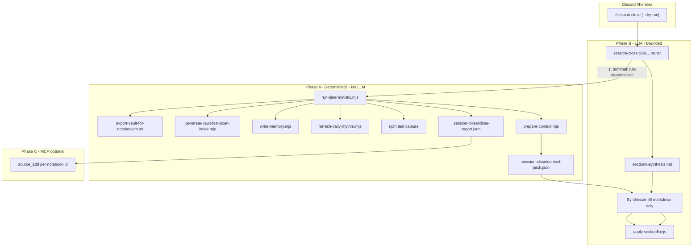

# Architecture Decision Document — Session-Close Context Reduction (FR-17..19)

_This document is the technical source of truth for refactoring Hermes `/session-close` so deterministic file operations run without LLM involvement, and the LLM pass is bounded to AGENTS.md Section 8 synthesis (~5k tokens max). It scopes **only** FR-17..19 from `prd-cns-dashboard-2026-05-28`; it does not change Vault IO, WriteGate, or dashboard sync._

**Note:** The PRD file at `_bmad-output/planning-artifacts/prds/prd-cns-dashboard-2026-05-28/prd.md` was not present in the repo at architecture time. FR definitions below are taken from the operator brief in that PRD slice; reconcile numbering when the PRD lands.

---

## Executive summary

Today, `/session-close` loads a **monolithic** skill package (`SKILL.md` + 450-line `task-prompt.md` + pitfalls) and instructs the Hermes agent to read large repo/vault artifacts inline. Observed runs consume **~52k tokens** before useful work completes. Most of that work is **deterministic** (export script, fast-scan generator, MEMORY template, eleven AUTO markers, `npm test`) and already has partial script support (`export-vault-for-notebooklm.sh`, `generate-vault-fast-scan-index.mjs`, `dashboard-sync.ts` collectors).

**Decision:** Introduce a **two-phase close pipeline**:

1. **Phase A — Deterministic (zero LLM):** Node/bash orchestrator under `scripts/session-close/` performs all file mutations and emits a small `context-pack.json` + `close-report.json`.
2. **Phase B — LLM (bounded):** A **slim** skill reads only the context pack + current Section 8 excerpt, writes replacement Section 8 markdown, and calls **`apply-section8.mjs`** to patch AGENTS and sync copies. Optional **Phase C:** NotebookLM `source_add` fan-out using notebook IDs from the report (MCP-only, no export body in context).

Target: **≤5k tokens** on the LLM path (hard ceiling **6k** including tool call overhead).

---

## Requirements mapping (FR-17..19)

| FR | Intent (from operator brief) | Architecture owner |
|----|------------------------------|--------------------|
| **FR-17** | Run vault export, fast-scan index, MEMORY.md, CNS-Daily-Rhythm AUTO blocks, and related filesystem work **without** LLM reads of source files | `scripts/session-close/run-deterministic.mjs` (+ existing scripts) |
| **FR-18** | LLM invoked **only** for AGENTS.md **Section 8** narrative synthesis from a pre-digested context pack | Slim `references/section8-synthesis.md` + `prepare-context.mjs` |
| **FR-19** | Enforce token budget, document skill/Hermes config contract, verify in CI | Token ledger in context pack, skill metadata, `tests/session-close-pipeline.test.mjs` |

**Non-goals (unchanged):**

- WriteGate / Vault IO mutators for `AI-Context/**`
- `git commit` / `git push` in session-close
- Changing NotebookLM connector semantics (`title` not `source_name`, `ready: false` is success)
- Per-skill Hermes model routing (remains deferred until native API exists; design leaves a hook)

---

## Current-state analysis

### Token burn drivers (~52k observed)

| Source | Est. tokens | Why it hurts |
|--------|---------------|--------------|
| `task-prompt.md` + `SKILL.md` + pitfalls | 12–18k | Loaded wholesale every activation |
| Full `sprint-status.yaml` | 4–8k | Agent reads entire YAML |
| Three story artifacts (full files) | 10–25k | "Read enough to extract" → full bodies |
| Full `AGENTS.md` (800+ lines) | 15–25k | Needed for §8 replace + changelog anchor |
| Step 6.6 inline Python spec + execute_code | 8–15k | Duplicates `generate-vault-fast-scan-index.mjs` |
| Step 6.7 AUTO spec (11 markers) | 5–8k | Duplicates parsable rules |
| Vault export / note bodies | 0–20k | Failure mode when agent reads output |
| NotebookLM MCP payloads | 1–3k | Acceptable if bounded to status lines |

### Existing assets to reuse

| Asset | Location | Reuse |
|-------|----------|-------|
| Vault export | `scripts/export-vault-for-notebooklm.sh` | Phase A as-is |
| Fast-scan index | `scripts/generate-vault-fast-scan-index.mjs` (`npm run vault:fast-scan`) | Phase A; **stop** reimplementing in `execute_code` |
| Sprint/lint/Hermes collectors | `scripts/dashboard-sync.ts` | Extract shared read helpers into `scripts/session-close/lib/read-sources.mjs` |
| Install path | `scripts/install-hermes-skill-session-close.sh` | Copy slim skill + bundled `scripts/` references |
| Contract tests | `tests/hermes-session-close-skill.test.mjs` | Extend for pipeline + token caps |

---

## Target architecture

### Pipeline overview



### Phase ordering (real close)

| Order | Step | Executor | Writes |
|-------|------|----------|--------|
| 0 | Resolve repo root (`OMNIPOTENT_REPO` / fallback) | Script | — |
| 1 | `prepare-context.mjs` (parse sprint, 3 stories, current §8 header) | Script | `context-pack.json` |
| 2 | Export vault | `export-vault-for-notebooklm.sh` | `scripts/output/vault-export-for-notebooklm.md` |
| 3 | Fast-scan index | `npm run vault:fast-scan` | `AI-Context/vault-fast-scan-index.md` |
| 4 | **LLM:** synthesize Section 8 from pack only | Hermes | `section8-draft.md` (temp) |
| 5 | Apply §8 + version bump + changelog + sync AGENTS | `apply-section8.mjs` | repo + vault AGENTS copies |
| 6 | MEMORY.md from §8 + sprint | `write-memory.mjs` | vault `MEMORY.md` |
| 7 | Daily rhythm AUTO blocks | `refresh-daily-rhythm.mjs` | `CNS-Daily-Rhythm.md` |
| 8 | `npm test` (if not done in 1) for AUTO:TESTS | Script | rhythm inner only |
| 9 | NotebookLM fan-out | Hermes MCP **or** `notebooklm-fanout.mjs` | external |
| 10 | Discord reply from `close-report.json` | Hermes | — |

**Dry-run:** Phase A runs with `--dry-run` (no writes, no export, no `source_add`); still builds `context-pack.json` for preview; Phase B produces §8 preview only (no `apply-section8`).

**Rationale for §8 before MEMORY/rhythm:** MEMORY and `AUTO:AGENTS_VERSION` depend on post-close AGENTS header. Export and fast-scan do not depend on §8 and stay early to maximize parallelism in script.

---

## Token budget design (FR-19)

### Budget ledger

| Artifact | Max tokens (ceil(chars/4)) | Producer | Consumer |
|----------|----------------------------|----------|----------|
| `context-pack.json` | **3,500** | `prepare-context.mjs` | LLM only |
| `section8-draft.md` | **1,500** | LLM | `apply-section8.mjs` |
| Slim skill + synthesis prompt | **800** | repo skill | LLM |
| Tool I/O overhead reserve | **1,200** | — | Hermes |
| **Total LLM path** | **≤5,000** (hard stop **6,000**) | — | — |

### `context-pack.json` schema (normative)

```json
{
  "generated_at": "ISO-8601",
  "mode": "real | dry-run",
  "repo_root": "/abs/path/Omnipotent.md",
  "vault_root": "/abs/path/Knowledge-Vault-ACTIVE",
  "agents": {
    "version": "2.1.12",
    "section8_excerpt": "…existing §8 only, max 1200 tokens…",
    "changelog_anchor_row": "| 2026-05-28 | 2.1.12 | …"
  },
  "sprint": {
    "active_epics": [{"id": "epic-38", "status": "in-progress", "stories": ["38-2 ready-for-dev"]}],
    "project_status_line": "Phase 6 complete; Epics 38, 43 in progress"
  },
  "recent_stories": [
    {"basename": "43-1-…", "title": "…", "status": "done", "bullet": "≤200 chars"}
  ],
  "deterministic": {
    "export_path": "…/vault-export-for-notebooklm.md",
    "export_bytes": 1234567,
    "fast_scan_rows": 55,
    "tests": "609 passing | FAILED (…)",
    "vault_lint": {"scanned": 115, "clean": 115, "errors": 0, "warnings": 0, "stale": false}
  },
  "notebooklm_targets": [
    {"notebook_id": "…", "title": "CNS Vault Architecture"}
  ],
  "token_budget": {
    "pack_tokens": 2800,
    "pack_limit": 3500
  }
}
```

**Enforcement:**

- `prepare-context.mjs` truncates `recent_stories` to 3 bullets, sprint fragments to caps in existing task-prompt, and `section8_excerpt` by sliding window on `## 8.` .. `## 9.`.
- If `pack_tokens > pack_limit`, drop `section8_excerpt` first, then shorten story bullets (never drop sprint active epics).
- CI test: fixture pack must stay under 3,500; golden `section8-draft` under 1,500.

### What the LLM must not load

- `task-prompt.md` (retired from activation path; kept as `references/task-prompt.legacy.md` for audit)
- Full `AGENTS.md`, `sprint-status.yaml`, story files, export file, vault trees
- Step 6.6 / 6.7 prose (replaced by script `--help` for operators only)

---

## Script layer (`scripts/session-close/`)

| Script | Responsibility |
|--------|----------------|
| `run-deterministic.mjs` | CLI entry: `--dry-run`, orchestrates A steps, writes `close-report.json` |
| `prepare-context.mjs` | Builds bounded `context-pack.json` |
| `apply-section8.mjs` | Reads draft §8; replaces `## 8.`..`## 9.`; patch version/changelog; byte-sync both AGENTS paths + planning mirror |
| `write-memory.mjs` | Deterministic MEMORY template (≤2000 chars) from pack + post-apply AGENTS |
| `refresh-daily-rhythm.mjs` | Port of Step 6.7 `replace_auto` logic; shares parsers with `dashboard-sync.ts` where possible |
| `lib/read-sources.mjs` | Sprint YAML, story glob+excerpt, vault-lint report, Hermes config, project map |
| `lib/token-estimate.mjs` | `ceil(utf8.length / 4)` consistent with fast-scan skill |
| `lib/paths.mjs` | `OMNIPOTENT_REPO`, `CNS_VAULT_ROOT`, canonical `/mnt/c/...` defaults |

**npm prelude:** Single `lib/npm-env.sh` sourced by scripts that invoke `npm test` (fixes deferred PATH issue from 43-1).

**Output directory:** `<repo_root>/.session-close/` (gitignored). Hermes skill uses `${HERMES_SKILL_DIR}` only for references; scripts resolve via `OMNIPOTENT_REPO`.

**NotebookLM fan-out (Phase C):**

- **Preferred:** `close-report.json` lists `{notebook_id, export_path}`; slim skill instructs: call `source_add` once per row with `title: "My Knowledge Base"`, `wait: false` — **no** `file_path` content in prompts.
- **Stretch:** `notebooklm-fanout.mjs` via MCP subprocess — only if Hermes cannot reliably issue MCP after terminal phase; not required for FR-17..19 MVP.

---

## Skill package refactor

### Directory layout (repo mirror → `~/.hermes/skills/cns/session-close/`)

```text
session-close/
├── SKILL.md                      # Router only (~60–80 lines)
├── references/
│   ├── section8-synthesis.md     # LLM-only instructions
│   ├── trigger-pattern.md          # unchanged semantics
│   ├── config-snippet.md         # updated env block
│   ├── discord-reply-template.md   # render from close-report.json
│   └── task-prompt.legacy.md       # archived monolith (not loaded)
└── scripts/                      # optional copy or symlink to repo scripts/session-close/
```

### `SKILL.md` router (behavioral contract)

1. Validate trigger (`/session-close`, `--dry-run` only).
2. **Mandatory first action:**  
   `node "${OMNIPOTENT_REPO}/scripts/session-close/run-deterministic.mjs" [--dry-run]`  
   (use terminal toolset, not `execute_code` Python.)
3. Read **only** `.session-close/context-pack.json` and follow `references/section8-synthesis.md`.
4. Write §8 draft to `.session-close/section8-draft.md` (or stdout heredoc) within token cap.
5. Real close: `node …/apply-section8.mjs --draft .session-close/section8-draft.md`.
6. Read `.session-close/close-report.json` for Discord reply + NotebookLM IDs.
7. Pitfalls trimmed to **5** LLM-relevant items (changelog anchor, no memory tool, `title` not `source_name`, compaction handoff, no export paste).

Remove from SKILL activation: full pitfalls encyclopedia, Step 6.6/6.7 prose, MEMORY/fast-scan generation instructions.

### `section8-synthesis.md` contents

- Required §8 markdown shape (from current task-prompt Steps 3–3 template)
- Input: fields from `context-pack.json` only
- Output: single markdown fragment **without** wrapping `## 8.` (apply script adds boundaries) OR with boundaries — pick one in implementation and test
- Explicit: do not invent epics not in `sprint.active_epics`

---

## Hermes / operator config changes (FR-19)

### `~/.hermes/config.yaml` (channel binding — unchanged list)

```yaml
discord:
  channel_skill_bindings:
    - id: '1500733488897462382'
      skills:
        - hermes-url-ingest-vault
        - triage
        - session-close
```

### Recommended additions

```yaml
# ~/.hermes/session-close.env (new, sourced by gateway wrapper or documented for operator)
OMNIPOTENT_REPO=/home/christ/ai-factory/projects/Omnipotent.md
CNS_VAULT_ROOT=/mnt/c/Users/Christopher Taylor/Knowledge-Vault-ACTIVE
```

Document in `references/config-snippet.md`: gateway should export these before Discord sessions (same pattern as `dashboard-sync.env`).

### Skill frontmatter

```yaml
metadata:
  hermes:
    tags: [cns, hermes, session-close, agents-md, notebooklm]
    requires_toolsets: [terminal]
    related_skills: [hermes-url-ingest-vault, triage]
```

When Hermes ships per-skill model selection: set `session-close` to **Haiku-class** model (policy in `deferred-work.md`).

---

## Security and policy (unchanged)

| Rule | Enforcement |
|------|-------------|
| WriteGate on `AI-Context/**` | Scripts use `fs.writeFile` on canonical vault paths; no Vault IO mutators |
| Discord untrusted input | Only slash + `--dry-run`; scripts ignore message body |
| No secrets in Discord | `close-report.json` has paths + counts only |
| Partial close | `close-report.json` carries `failure_class` per step; §8 failure does not delete export |

---

## Migration and stories (implementation sequence)

| Story | Deliverable |
|-------|-------------|
| **SC-1** | `scripts/session-close/` scaffold + `prepare-context.mjs` + pack schema tests |
| **SC-2** | `run-deterministic.mjs` wires export + fast-scan + test capture + report |
| **SC-3** | `refresh-daily-rhythm.mjs` + `write-memory.mjs` (port 6.5–6.7) |
| **SC-4** | `apply-section8.mjs` + AGENTS sync tests (byte-identical mirrors) |
| **SC-5** | Slim skill package + install script + update `hermes-session-close-skill.test.mjs` |
| **SC-6** | Operator guide §15.4 + dry-run smoke in #hermes |

**Verify gate:** `bash scripts/verify.sh` must include pipeline unit tests; no change to Vault IO MCP signatures.

---

## Acceptance criteria

1. **Token:** Hermes session metrics show **≤6k** input tokens for `/session-close` after Phase A completes (operator-measured; CI enforces pack/draft sizes).
2. **Parity:** Real close still updates: both AGENTS copies, export file, MEMORY, fast-scan index, all 11 AUTO markers, NotebookLM fan-out.
3. **Dry-run:** No writes except `.session-close/*`; Discord preview matches former behavior.
4. **Determinism:** Unchanged inputs → unchanged bytes for script-generated files (MEMORY, fast-scan, rhythm).
5. **Regression:** Existing `tests/hermes-session-close-skill.test.mjs` passes with updated paths/wording.

---

## Risks and mitigations

| Risk | Mitigation |
|------|------------|
| Hermes still loads old monolithic skill from cache | Bump skill `version` in frontmatter; reinstall via `install-hermes-skill-session-close.sh`; gateway restart |
| Agent skips Phase A script | SKILL states steps 1–3 are **hard gates**; report `failure_class: pipeline` if pack missing |
| `apply-section8` regex drift on §8/§9 | Golden-file test on fixture AGENTS |
| WSL cross-device MEMORY symlink | Keep `write-memory.mjs` writing canonical vault path (existing pitfall) |
| NotebookLM MCP unavailable | Phase A completes; Phase C reports `notebooklm: skipped` in report |

---

## ADR summary

| ID | Decision | Status |
|----|----------|--------|
| ADR-SC-001 | Two-phase pipeline: deterministic scripts first, LLM for §8 only | Accepted |
| ADR-SC-002 | Bounded I/O via `context-pack.json` (3.5k) + `section8-draft` (1.5k) | Accepted |
| ADR-SC-003 | Reuse `generate-vault-fast-scan-index.mjs`; ban inline vault scan in skill | Accepted |
| ADR-SC-004 | Retire `task-prompt.md` from activation; archive as legacy | Accepted |
| ADR-SC-005 | NotebookLM fan-out remains MCP from agent with IDs from report only | Accepted |
| ADR-SC-006 | Per-skill Haiku routing deferred; env file documents `OMNIPOTENT_REPO` | Accepted |

---

## Open items

1. Confirm FR-17..19 wording in `prd-cns-dashboard-2026-05-28/prd.md` when committed; adjust IDs if dashboard PRD uses FR-17..19 for run-chain instead.
2. Decide whether `notebooklm-fanout.mjs` is MVP or follow-up (FR-19 satisfied with bounded MCP list).
3. Extract shared parsers from `dashboard-sync.ts` vs duplicate in `.mjs` — prefer **shared `.mjs` lib** to avoid TS/ESM import friction in Hermes terminal.

---

_Architecture complete for FR-17..19. Next BMAD step: `/bmad-create-story` for SC-1 or shard epics in sprint tracker._
