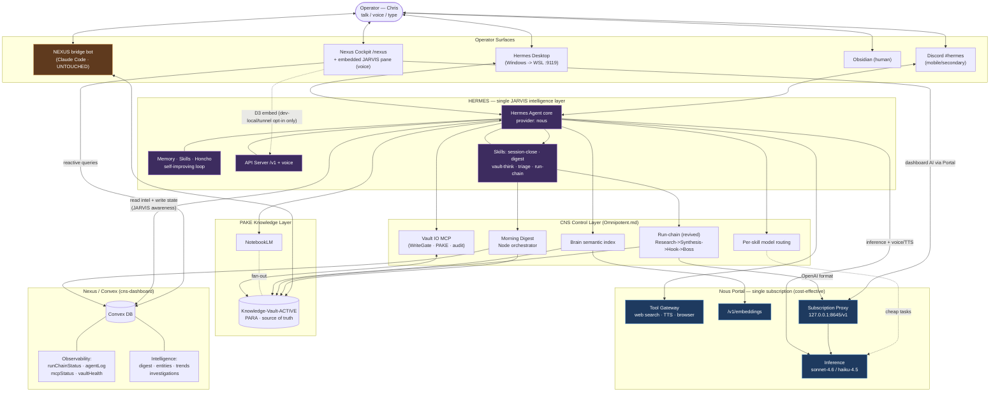

# Architecture Vision — Hermes JARVIS End State

**Companion to:** `prd-hermes-consolidation.md`
**Status:** Vision diagram for `bmad-create-architecture` input · **Date:** 2026-06-24

> This is the **target end state** once all epics (A–D) are built — not current state.
> It is a north-star picture, not a locked design. The architecture phase resolves the
> open questions in PRD §10 (especially the FR12 event-awareness mechanism).

> **⚠️ Updated post-architecture (ADR-HERMES-001, topology a):** the Vercel-hosted cockpit
> **cannot reach** WSL-local Hermes (`:9119`). So the `Cockpit ⇄ API (embed)` arrow below is
> **Epic D3 — dev-local/tunnel opt-in only, NOT production.** In production, the cockpit's
> "live agent" feel comes from **FR12 data-awareness** (Convex `/hermes/awareness` HTTP pull +
> webhook push) and a **Vercel-safe async "ask Hermes" box** (via `hermes-dispatch` → reply in
> Discord/Desktop). The conversational + voice JARVIS surface is **Hermes Desktop / Discord.**

---

## Full-picture diagram

---

## How to read it

- **Hermes (purple) is the center** — one intelligence layer reachable from Desktop, Discord, and the embedded cockpit pane, all sharing the same memory/skills/Honcho user-model so intelligence compounds across surfaces.
- **Nous Portal (blue) is the single fuel source** — inference, voice/TTS, embeddings, and the proxy that revives run-chain and powers the dashboard's own AI. One bill replaces openai-codex + OpenRouter + dead Anthropic + standalone TTS.
- **The new JARVIS seam** is the bold bidirectional arrow `Hermes <-> Convex` (FR12) — Hermes reads live intelligence (digest / entities / trends / investigations) and writes its own state into the observability tables, so the cockpit reflects a live agent, not a 3-minute snapshot. *The exact mechanism is the #1 architecture question (PRD §10.1).*
- **NEXUS bridge (orange) sits to the side, untouched**, on its own vault path — the "keep both bots" boundary (NFR8).
- **The engine and vault governance stay exactly as built** — Vault IO MCP's WriteGate / PAKE / audit still gates every write; run-chain's hook/boss/weapons logic is revived by credential (FR11), not rewritten.

---

## What is genuinely NEW vs an upgrade of an existing seam

| Element | New build? | Notes |
|---|---|---|
| Portal provider switch | Config | Verified CLI path |
| Hermes Desktop + dashboard service | Config + systemd | Native Hermes |
| Voice (push-to-talk + TTS) | Config | Native Hermes + Portal Tool Gateway |
| "Grows smarter" (memory/skills/Honcho) | Native | Used, not built |
| Embedded cockpit chat pane | **New** | Hermes API Server + session-key |
| FR12 bidirectional Convex awareness | **New (the real build)** | Upgrades existing 3-min snapshot seam |
| Dashboard AI via Portal | Rewire | `explain`/`summarise-risk`/investigation off dead OpenRouter |
| Per-skill model routing | Activate | Layer-3 engine already built, was blocked on Hermes-native API |
| Run-chain revival | Credential | Engine untouched (FR11 decision) |
