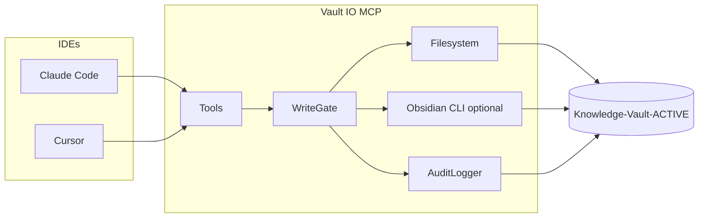

# Architecture Decision Document — CNS Phase 1 (Vault IO)

_This document is the single technical source of truth for Phase 1 implementation. It aligns the PRD, `CNS-Phase-1-Spec.md`, and the constitution in `AGENTS.md` so agents implement the same boundaries, tools, and behaviors._

## Executive summary

Phase 1 adds no separate web app. The **implementable system** in this repo is a **local MCP server (Vault IO)** plus **specs and scripts** that verify it. The **live vault** (`Knowledge-Vault-ACTIVE/`) holds the folder contract, `AI-Context/AGENTS.md`, shims, schemas, and logs. Architecture **locks** runtime (Node + TypeScript), MCP stack, path and safety model, search semantics, audit logging, and repository layout so Cursor and Claude Code sessions stay consistent on WSL.

---

## Project context analysis

### Requirements overview

**Functional requirements (architectural mapping):**

| Area | FRs (PRD) | Architecture implication |
|------|-----------|---------------------------|
| Constitution load | FR1–FR3 | Out of Vault IO code: vault shims (`CLAUDE.md`, `.cursorrules`) + `AI-Context/AGENTS.md`. Repo documents symlink or copy strategy in README only. |
| Vault structure | FR4–FR6 | Contract enforced by docs + optional scaffold script; `vault_create_note` routing encodes default destinations by `pake_type`. |
| Read / discover | FR7–FR11 | `vault_search` (scoped, capped), `vault_read`, `vault_read_frontmatter`, `vault_list`; default search excludes `_meta/logs/` unless scope includes it. |
| Write / mutate | FR12–FR16, FR27 | Single write pipeline: validate PAKE (non-Inbox), resolve path under vault, apply protected-path rules, then fs + optional Obsidian CLI for `vault_move`. |
| Safety | FR17–FR21, NFR-S1–S2 | `VaultBoundary` + `ProtectedPaths` modules; secret scan on write paths defined below. |
| Audit | FR22–FR24, NFR-S3 | `AuditLogger` append-only; structured line, no full body; hash or truncate tool args. |
| Integration | FR25–FR28, NFR-I1 | Stdio MCP; config supplies vault root + optional Obsidian CLI path; same server for Cursor and Claude Code. |

**Non-functional requirements:**

- **NFR-P1:** Startup is dominated by IDE + MCP spawn; server must initialize quickly (lazy-load heavy deps if any).
- **NFR-P2:** `vault_search` **must** require explicit `scope` OR use a configured default scope (never whole vault); **max 50** hits per call.
- **NFR-P3:** Interactive latency on WSL: target **p95 under 2 seconds** for single-note read/write/move on a fixture vault; document exceptions for very large files.
- **NFR-R1:** Atomic writes where practical (write temp + rename) for new/changed notes; failed validation must not leave partial files.
- **NFR-R2:** `scripts/verify.sh` must pass before Phase 1 is claimed done (implies `package.json` + tests in repo).

**Scale and complexity:**

- **Domain:** Local developer tool (MCP stdio server), medium complexity due to security and path edge cases on WSL.
- **Primary components:** MCP tool surface, filesystem adapter, optional Obsidian CLI adapter, YAML/frontmatter + schema validation, secret scanner, audit logger.
- **Estimated modules (repo):** `src/server`, `src/tools/*`, `src/security`, `src/vault`, `src/audit`, `tests/fixtures`.

### Technical constraints and dependencies

- **WSL** and cross-mount paths (`/mnt/...`): all vault paths resolved with `path.resolve` and verified to sit under a **single configured vault root** after normalization.
- **No database** in Phase 1; **no** full-vault index in Phase 1.
- **Human-only zones** (agent writes denied): `AI-Context/`, `_meta/schemas/`, `_meta/` structural changes; `_meta/logs/` only via audit module (append).
- **Obsidian CLI:** optional; `vault_move` tries CLI when configured and available, else filesystem move + wikilink rewrite per spec.

### Cross-cutting concerns

Path safety, PAKE validation, secret patterns, audit semantics, and MCP error shape must be **shared** across all tools so no tool bypasses policy by accident.

---

## Starter template evaluation

### Primary technology domain

**Local MCP server (API/backend style package),** not a browser UI. There is no Next.js or Nest app in Phase 1.

### Starter options considered

| Option | Verdict |
|--------|---------|
| **Manual TypeScript package** (Node, `tsx` dev, `tsc` build) | **Selected.** Matches PRD preference and minimal surface. |
| Python MCP server | Rejected for Phase 1; PRD locks TypeScript. |
| Full monorepo (Turborepo) | Deferred; add only if a second package appears. |

### Selected approach: TypeScript MCP package

**Rationale:** Aligns with PRD “TypeScript on Node,” `@modelcontextprotocol/sdk`, and `tsx`. Keeps verify gate simple (`npm test`, lint, typecheck).

**Initialization (first implementation story):**

```bash
cd /home/christ/ai-factory/projects/Omnipotent.md
npm init -y
npm install @modelcontextprotocol/sdk zod
npm install -D typescript tsx @types/node vitest
npx tsc --init
```

**Versions (verified 2026-04-01):**

- **Node:** **22.x LTS** (or current LTS on developer machine); engines field `>=20`.
- **`@modelcontextprotocol/sdk`:** **^1.29.0** (npm `latest` at time of writing).
- **`zod`:** **^3** (schema validation for tool inputs and internal DTOs).
- **`typescript`:** **^5.8** (pin exact minor in lockfile during implementation).
- **`vitest`:** **^3** for unit and integration tests.

**Architectural decisions provided by this stack:**

- **Language and runtime:** TypeScript on Node, ESM recommended (`"type": "module"`).
- **MCP transport:** Stdio only for Phase 1.
- **Validation:** Zod at MCP boundary; YAML/frontmatter parsed then validated against PAKE rules.

---

## Core architectural decisions

### Decision priority analysis

**Critical (block implementation if vague):**

1. Vault root configuration and path canonicalization.
2. Protected path matrix vs PRD FR18/NFR-S1.
3. `vault_search` scope + cap (NFR-P2).
4. Secret pattern location and application scope (PRD follow-up).
5. Audit log line format and forbidden content (NFR-S3).
6. `vault_move` Obsidian vs fallback (FR27).

**Important:**

- Default directory for `vault_create_note` when `WorkflowNote` lacks project context.
- Fixture vault layout for CI and local dev.

**Deferred (post–Phase 1):**

- Log rotation automation (PRD: human may trim).
- `~/vault-cache/` rsync batch pipeline (spec §6).
- Gemini CLI QA.

### 1. Configuration

| Decision | Choice |
|----------|--------|
| Vault root | Environment variable **`CNS_VAULT_ROOT`** required at server start; optional second source: MCP config JSON field `vaultRoot` if the host passes config (implementation picks one precedence: **env overrides file**). |
| Default search scope | **`CNS_VAULT_DEFAULT_SEARCH_SCOPE`** (vault-relative directory). If unset, `vault_search` **requires** explicit `scope` and fails with actionable error (satisfies “no default full-vault scan”). |
| Obsidian CLI | Optional **`CNS_OBSIDIAN_CLI`** absolute path; if unset or non-executable, `vault_move` uses fallback only. |

### 2. Path model and vault boundary

- Resolve: `resolved = path.resolve(vaultRoot, userPath)` then ensure `resolved.startsWith(vaultRoot + path.sep)` (after both sides normalized with `path.normalize`).
- **Reject** `..` escape and absolute paths outside root.
- **Working directory** of the MCP process is irrelevant; only configured `vaultRoot` matters.

### 3. Protected paths (agent write model)

Writes from MCP tools **deny** with stable error codes:

| Path pattern | Agent writes |
|--------------|--------------|
| `AI-Context/**` | **Deny** (human-edit-only) |
| `_meta/schemas/**` | **Deny** |
| `_meta/logs/**` | **Deny** direct file put/patch; **only** `AuditLogger.append` may append `agent-log.md` |
| `_meta/**` | **Deny** mkdir, rename, delete; **allow** writes only to explicitly whitelisted files if later added (Phase 1: **deny** any create under `_meta` except audit path above) |
| `04-Archives/**` | **Allow** with caution per constitution; Phase 1 tools **allow** only if spec explicitly allows (spec lists read-only for humans; **default deny agent creates** in Archives unless product owner opens this in a story) |

**Clarification for implementation:** PRD FR18 says no agent writes to constitution/schemas/logs. **Archives:** treat as **allow read + allow move into** when operator requests, **deny** blind bulk cleanup. Initial implementation: **same as other writable areas** except constitution/schemas/logs; if product wants stricter Archives, flip in one policy table.

**Simpler rule table for Phase 1 code:**

- **Deny:** any path under `AI-Context/`, `_meta/schemas/`, or writing anywhere under `_meta/` **except** append-only to `_meta/logs/agent-log.md` via logger.
- **Allow:** notes under `00-Inbox/` without PAKE validation on create (raw capture); **optional** relaxed validation per spec (Inbox: no schema required).

### 4. PAKE validation

- **Parser:** `gray-matter` or equivalent to split YAML frontmatter from body.
- **Schemas:** Load YAML or JSON schema from repo **mirror** under `specs/cns-vault-contract/schemas/` **or** read from vault `_meta/schemas/*.md` as human-readable; **normative validation** shipped **in repo** as JSON Schema or Zod definitions generated from Phase 1 spec so tests do not depend on a live D: drive.
- **Applies to:** `vault_create_note`, `vault_update_frontmatter`, and any write outside `00-Inbox/`.

### 5. Secret pattern scanning (PRD clarification)

| Decision | Choice |
|----------|--------|
| **Where patterns live** | Repo: `config/secret-patterns.json` at repository root (versioned defaults). Optional vault override: `Knowledge-Vault-ACTIVE/_meta/schemas/secret-patterns.json` merged **on top** (vault adds patterns, cannot remove baseline deny rules). |
| **Where applied** | **Full note body + all frontmatter string values** on create/update/append (including `vault_append_daily` content). |
| **On match** | Reject write; return MCP error with code `SECRET_PATTERN` and **no** echo of matched substring. |
| **False positives** | Operator edits pattern JSON; document in module `security.md`. |

### 6. `vault_search`

- **Implementation:** `ripgrep` (`rg`) subprocess **if available**; else fall back to Node line scanner **only within scope** (no rg install is a dev env concern; CI installs rg).
- **Parameters:** `query`, `scope` (required if no env default), `maxResults` default 50, cap **50**.
- **Exclusions:** Respect `.gitignore` if present; always exclude `_meta/logs/` unless scope is exactly under logs (operator diagnostics).

### 7. `vault_move`

1. If `CNS_OBSIDIAN_CLI` set, attempt `obsidian move` (exact args documented in code comments from Obsidian CLI help).
2. On failure or missing CLI: filesystem rename + **wikilink scan** limited to vault (simple `[[...]]` path/title replace for moved filename); document limitations for complex embeds.

### 8. Audit logging

- **File:** `{vaultRoot}/_meta/logs/agent-log.md`.
- **Line format:** `[ISO8601] | action | tool | surface | target_path | payload_summary`
- **surface:** From MCP metadata if available (`_meta` request info) else `unknown`.
- **payload_summary:** **SHA-256 hex of canonical JSON args, truncated to 16 chars**, or first **120 chars** of string args **never** including full note body; for large content, hash only.

### 9. MCP tool error contract

All tools return errors suitable for agents:

```json
{
  "code": "VAULT_BOUNDARY | PROTECTED_PATH | SCHEMA_INVALID | SECRET_PATTERN | NOT_FOUND | IO_ERROR | UNSUPPORTED",
  "message": "human readable",
  "details": { "path": "optional" }
}
```

Use MCP structured content or `isError: true` per SDK patterns.

### Decision impact and implementation sequence

1. Package scaffold + config + path guard.
2. Audit logger (append-only) + protected path policy.
3. Frontmatter + PAKE validation library.
4. Read tools (`read`, `read_frontmatter`, `list`, `search`).
5. Write tools (`create_note`, `update_frontmatter`, `append_daily`).
6. `vault_move` + Obsidian fallback.
7. Wire `vault_log_action` and ensure every mutator calls it.
8. Fixture vault integration tests + `verify.sh` green.

---

## Implementation patterns and consistency rules

### Naming

| Area | Convention |
|------|------------|
| TypeScript files | `kebab-case.ts` |
| Types / classes | `PascalCase` |
| Functions | `camelCase` |
| MCP tool names | Exact spec: `vault_search`, `vault_read`, … |
| Error codes | `SCREAMING_SNAKE_CASE` string enum |

### Structure

- **Tests:** Colocated `*.test.ts` next to module **or** `tests/integration/`; fixture vault under `tests/fixtures/minimal-vault/`.
- **One tool per file** under `src/tools/` recommended to reduce merge conflicts between agents.

### Formats

- **Timestamps:** ISO 8601 UTC in audit log; frontmatter dates per PAKE `YYYY-MM-DD`.
- **Line endings:** LF only on write (PRD / AGENTS).

### Error handling

- **No silent failures.** IO errors propagate as `IO_ERROR`.
- **Validation first** before any filesystem write.

### Enforcement

- **All AI agents MUST** use the policy table for protected paths and must not add alternate write paths that skip audit.
- **Verify:** `npm test` includes boundary + secret + audit tests.

### Anti-patterns

- Raw `fs.writeFile` in tool handlers without going through `WriteGate` (single policy choke point).
- Logging full tool `content` or note bodies in audit or debug logs.

---

## Project structure and boundaries

### Repository layout (this repo: `Omnipotent.md`)

```text
Omnipotent.md/
├── package.json
├── tsconfig.json
├── config/
│   └── secret-patterns.json
├── specs/
│   └── cns-vault-contract/          # normative spec copies / schemas for tests
├── scripts/
│   └── verify.sh
├── src/
│   ├── index.ts                     # MCP stdio entry
│   ├── config.ts                    # env + validation
│   ├── paths.ts                     # resolve + boundary checks
│   ├── write-gate.ts                # protected paths + secret scan + PAKE
│   ├── audit/
│   │   └── audit-logger.ts
│   ├── pake/
│   │   ├── parse-frontmatter.ts
│   │   └── validate.ts
│   ├── search/
│   │   └── vault-search.ts
│   ├── obsidian/
│   │   └── move.ts
│   └── tools/
│       ├── vault-search.ts
│       ├── vault-read.ts
│       ├── vault-read-frontmatter.ts
│       ├── vault-list.ts
│       ├── vault-create-note.ts
│       ├── vault-update-frontmatter.ts
│       ├── vault-append-daily.ts
│       ├── vault-move.ts
│       └── vault-log-action.ts
├── tests/
│   ├── fixtures/
│   │   └── minimal-vault/           # Knowledge-Vault-ACTIVE subset
│   └── integration/
│       └── vault-io.test.ts
├── _bmad-output/planning-artifacts/
│   ├── prd.md
│   └── architecture.md              # this file
└── docs/
```

### Boundaries

| Boundary | Definition |
|----------|------------|
| **MCP public API** | The eight tools; no REST in Phase 1. |
| **Vault IO vs vault content** | Code lives in git repo; **content** lives in `Knowledge-Vault-ACTIVE/` at runtime. |
| **Write gate** | Only module that combines boundary, protected paths, secrets, and PAKE before IO. |

### Data flow



### Requirements to structure mapping

- **FR7–FR11, NFR-P2:** `src/search/vault-search.ts` + `src/tools/vault-search.ts`.
- **FR12–FR16, FR27:** `src/tools/vault-*.ts` + `write-gate.ts` + `pake/`.
- **FR17–FR21:** `paths.ts` + `write-gate.ts`.
- **FR22–FR24:** `audit/audit-logger.ts`.
- **NFR-S2:** `config/secret-patterns.json` + scanner in `write-gate.ts`.

---

## Architecture validation results

### Coherence

- TypeScript + MCP SDK + Zod + stdio are consistent.
- Search, audit, and protected paths align with PRD and Phase 1 spec.
- `vault_move` dual path matches FR27 and spec §5.

### Requirements coverage

- **Functional:** FR1–FR3 are vault + shim deliverables (documented in spec, not only in server); FR4–FR28 mapped in tables above.
- **NFR:** P1–P3, S1–S3, R1–R2, I1–I2 addressed; Gemini explicitly out of scope for Phase 1.

### Implementation readiness

- Decisions are concrete enough for agents to implement without guessing.
- Remaining **product** choices (exact default search scope value) are env-driven and documented.

### Gap analysis

| Priority | Gap | Resolution |
|----------|-----|------------|
| Nice | Obsidian CLI exact flags vary by version | Pin supported CLI version in README when first implemented |
| Nice | Wikilink rewrite completeness | Document known limits; Phase 2 could add AST-based markdown |

### Architecture completeness checklist

- [x] Project context analyzed
- [x] Stack locked (Node, TS, MCP SDK, Zod, Vitest)
- [x] Core decisions documented with versions/pins strategy
- [x] Implementation patterns defined
- [x] Repo structure and boundaries defined
- [x] FR/NFR traceability satisfied for Vault IO

### Readiness assessment

**Status:** **READY FOR IMPLEMENTATION**  
**Confidence:** **High** for MCP server scope; **medium** for Obsidian CLI edge cases until tested on target CLI version.

### Implementation handoff

**AI agent guidelines:**

1. Implement behind `WriteGate`; never duplicate policy checks in a single tool only.
2. Keep MCP tool names and shapes aligned with `CNS-Phase-1-Spec.md` §5.
3. Run `bash scripts/verify.sh` before claiming story complete.

**First implementation priority:** Scaffold npm package, stdio MCP server registering no-op tools, then add `paths.ts` tests and `CNS_VAULT_ROOT` validation.

---

## Workflow completion

- **Document:** `_bmad-output/planning-artifacts/architecture.md`
- **Inputs honored:** `CNS-Phase-1-Spec.md`, `prd.md` (and constitution referenced by PRD).
- **Next steps:** Run story implementation (`bmad-dev-story` / Ralph) against this doc; mirror any normative schema changes back into `specs/cns-vault-contract/`.

For BMAD navigation and follow-on workflows, use the **`bmad-help`** skill when you want a structured “what to run next” from the installed module config.
