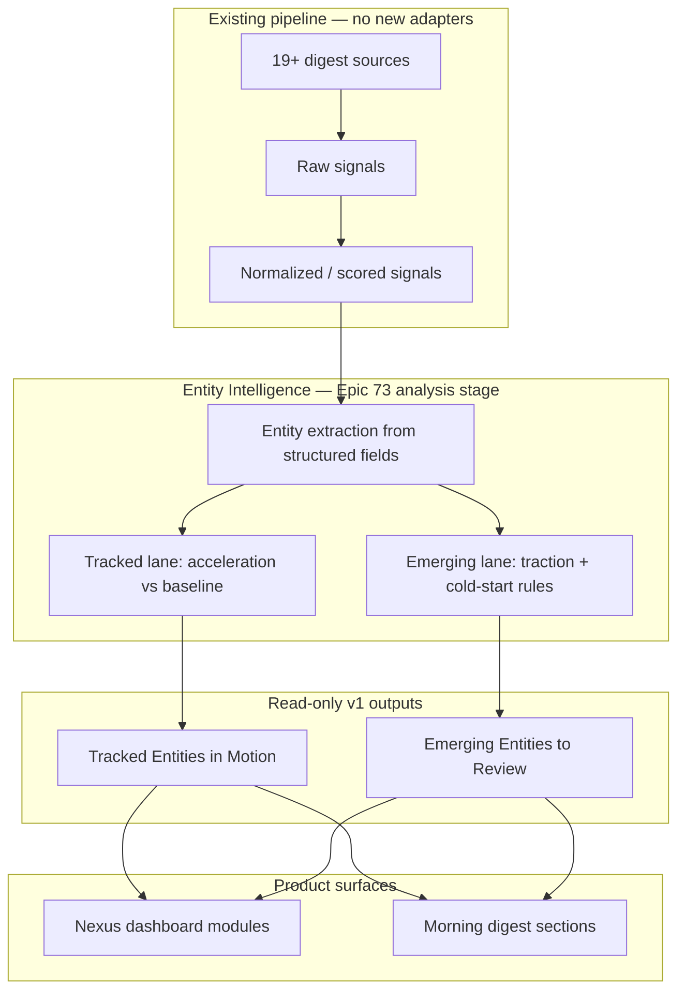
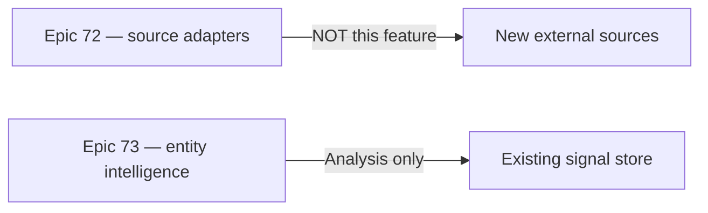

# Architecture Diagrams

Conceptual data flow from source PRD. Implementation details deferred to architecture (Q1–Q5).

## Nexus signal model (existing)

```
sources -> raw signals -> classified entities -> scored events -> dashboard feeds -> actions
```

## Entity intelligence insertion point

This feature inserts between scored signals and product presentation as an entity-intelligence analysis stage.

```
1. Existing sources produce normalized signals.
2. The entity-intelligence stage reads author/profile/entity-adjacent fields and signal metadata.
3. It builds candidate entities and tracked-entity activity summaries over defined windows.
4. It scores them for emergence or acceleration.
5. It emits two output sets: tracked entities in motion, and emerging entities to review.
6. The dashboard and digest render those outputs with evidence and reasoning.
```

## Dual-lane product model



## Epic boundary



## Strategic phases

| Phase | Scope |
|---|---|
| v1 | Emergence from inbound signals + tracked-entity monitoring |
| v2 | Richer free-text extraction; better company/product coverage |
| v3 | Topic-driven outbound discovery beyond current signal set |
