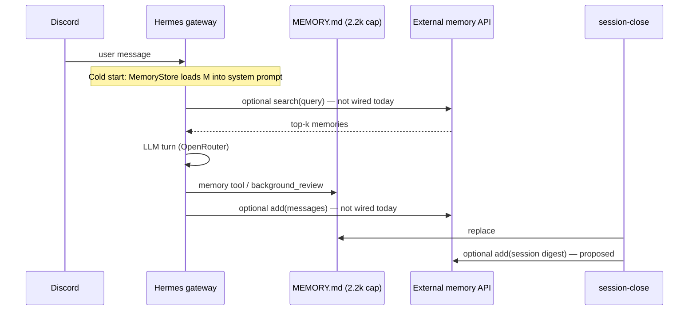

# 57-4: External Memory Provider Evaluation — Mem0 vs Honcho

**Epic:** 57 — Hermes `MEMORY.md` CNS State freshness  
**Story:** 57-4  
**Date:** 2026-06-02  
**Type:** Research spike (no implementation)  
**Author:** CNS research (Cursor / BMAD create-story + spike execution)

---

## Executive Summary

Hermes already provides **bounded** persistent memory via `~/.hermes/memories/MEMORY.md` (`memory_char_limit: 2200`, ~800 tokens). Epic 57 stories **57-2** and **57-3** automated **CNS State** and vault-lint telemetry inside that cap. The remaining gap is **unbounded cross-session learning** (operator preferences, project history, accumulated context beyond one close cycle).

Three commercial memory layers (**Mem0**, **Honcho**, **Zep**) and two build paths (**LangMem**, **Convex custom**) were evaluated against CNS constraints: local Hermes on WSL2, HTTPS API-key SaaS acceptable, **no operator-run self-hosted memory stack** (Postgres/Qdrant/Redis on WSL), and **vault privacy** (governed content must not silently egress).

| Candidate | Fit for CNS (1–5) | HTTPS SaaS | Maturity | Privacy risk |
|-----------|-------------------|------------|----------|--------------|
| Mem0 Platform | 4 | Yes | High (Py + TS SDK, MCP) | High — full conversation excerpts |
| Honcho | 4 | Yes | High (peer model, reasoning APIs) | High — peer representations + messages |
| Zep Cloud | 3 | Yes | High (enterprise KG) | High — episodes + business data fusion |
| LangMem | 2 | No (library + your DB) | Medium | Medium — depends on store you operate |
| Convex custom | 3 | Yes (existing deployment) | N/A (greenfield) | Medium — operator-controlled tenant |
| Status quo (Hermes MEMORY) | 3 | N/A | Shipped | Low |

**Recommendation: `defer`**

Defer adoption of Mem0, Honcho, or Zep until Epic 57 local memory proves insufficient **and** measurable acceptance gates exist (see [Deferred work](#deferred-work-and-next-epic)). The near-term path is to extend **deterministic, local** memory (session-close summaries, optional vault-side PAKE “operator preference” notes) rather than ship conversation text to a third-party memory vendor. If cross-session memory becomes mandatory before gates are defined, the preferred **build** direction is **`build on Convex`** (episodic session-close digests only, no raw vault bodies)—not a commercial memory SaaS pilot on production Hermes.

---

## Candidate Profiles

### Mem0

**What it is:** Universal memory layer for agents—managed **Mem0 Platform** (`api.mem0.ai`) plus **Apache 2.0 OSS** (library + optional Docker self-hosted server).

**API & data model**

- Hosted: `MemoryClient(api_key)` — `add(messages, user_id=...)`, `search(query, user_id=...)`, `get_all`, `update`, `delete`, batch and webhooks.
- Messages are condensed into **memory records** (facts/preferences), not raw chat logs in the prompt.
- Scoping: `user_id`, optional `agent_id`, `run_id`; V3 API adds filters and paginated `get_all`.
- Optional **graph memory** on higher tiers.

**Pricing (Platform, public pricing page, 2026)**

| Tier | Monthly | Add requests | Retrieval requests | Projects |
|------|---------|--------------|------------------|----------|
| Hobby | Free | 10,000 | 1,000 | 1 |
| Starter | $19 | 50,000 | 5,000 | 1 |
| Growth | $79 | 200,000 | 20,000 | 3 |
| Pro | $249 | 500,000 | 50,000 | Unlimited |
| Enterprise | Custom | Custom | Custom | Custom |

Startup program: 3 months Pro for eligible startups (&lt;$5M funding).

**Retrieval quality**

- Marketed **multi-signal retrieval** (V3); third-party reviews cite strong agent-memory benchmarks; independent CNS eval not run in this spike.
- Latency: platform-optimized; not measured on WSL → Mem0 cloud from this environment.

**SDK maturity**

- **Python:** `pip install mem0ai` — `MemoryClient` / OSS `Memory()` — primary, well documented.
- **TypeScript:** `npm install mem0ai` — async `MemoryClient`, feature parity for core CRUD/search.
- **MCP:** `mem0ai/mem0-mcp` — drop-in tools for agent harnesses.

**Self-host option**

- **Available** (`docker compose`, `make bootstrap` in `mem0ai/mem0` repo) with dashboard and API keys.
- **Out of scope for CNS operator constraint** in this spike (operator does not want to run Qdrant/Postgres stacks locally). Self-host remains relevant for air-gapped or BYOC futures.

**Sources:** [mem0.ai/pricing](https://mem0.ai/pricing), Context7 `/mem0ai/mem0`, GitHub `mem0ai/mem0`.

---

### Honcho

**What it is:** Open-source memory library with managed API at `api.honcho.dev` — **peer-centric** model (users, agents, groups as peers), sessions, representations, and a **reasoning-first** `peer.chat()` API.

**API & data model**

- Core objects: **workspace → peers → sessions → messages**.
- Ingestion: store messages in sessions; Honcho builds **peer cards**, **working representations**, **summaries** asynchronously (“dreaming” tasks).
- Retrieval: `peer.search()`, `peer.chat(query, reasoning_level=...)`, `session.get_context()` (token-limited, format helpers `.to_openai()` / `.to_anthropic()`).
- Privacy controls: `SessionPeerConfig` (who learns about whom).

**Pricing (Honcho 3.0, public docs)**

- **Ingestion:** ~**$2 per million tokens** of message content (~$0.001 minimum per call).
- **Advanced retrieval:** `peer.chat()` priced per query by **reasoning level** (~$0.001–$0.50).
- Several read APIs (e.g. `peer.card()`, `session.get_context()`) **free** with SIWX wallet auth on agentcash surface; managed API uses API keys at `app.honcho.dev`.
- **$100 free credits** on new accounts.

**Retrieval quality**

- Public benchmarks (LongMem, LoCoMo, BEAM) claim SOTA with **low context use** (~5% median window)—attractive for token cost.
- Reasoning-based answers differ from vector-only RAG; better for “what does this operator care about?” worse for verbatim citation unless configured.

**SDK maturity**

- Python-first (`Honcho` client); TypeScript SDK exists in ecosystem docs.
- Migration guide from Mem0 published (`docs.honcho.dev`).

**Self-host option**

- **Available** (FastAPI server, PostgreSQL, Redis, Docker Compose) — **excluded** by operator “no self-hosted infra” preference for this decision.
- Self-host still incurs **LLM + embedding** bills separate from Honcho software.

**Sources:** [docs.honcho.dev](https://docs.honcho.dev), [Honcho 3 announcement](https://blog.plasticlabs.ai/blog/Honcho-3), GitHub `plastic-labs/honcho`.

---

### Zep

**What it is:** **Context engineering** platform—temporal **knowledge graph** (Context Graph) fusing chat and optional business data; OSS **Graphiti** is the graph engine only.

**API & data model**

- Users, threads, episodes (messages/data objects); graph entities/edges with custom ontologies (Pydantic/Zod).
- Invalidates/updates facts over time (temporal reasoning).
- Retrieval: unified context API, &lt;200ms claimed at scale.

**Pricing (Zep Cloud, public pricing, 2026)**

| Tier | Monthly | Included credits | Notes |
|------|---------|------------------|-------|
| Trial | — | 1,000/mo | Free tier |
| Flex | $125 | 50,000 | Overage ~$25 / 10k credits |
| Flex Plus | $375 | 200,000 | Overage ~$75 / 40k credits |
| Enterprise | Custom | Custom | BYOK, BYOC, HIPAA BAA |

Credits scale with episode size (~1 credit per 350 bytes). Memories/retrieval/users **unmetered** on paid tiers (per pricing table).

**Retrieval quality**

- Strong on **temporal** and structured user-state benchmarks (LongMemEval +18.5% cited by vendor).
- Heavier than Mem0/Honcho for “remember Chris prefers concise Discord replies.”

**SDK maturity**

- Python, TypeScript, Go SDKs; dashboard and webhooks on cloud tier.
- **Graphiti** OSS for self-hosted graph only—**no** full Zep orchestration self-hosted commercially.

**Self-host option**

- **Graphiti only** (build/operate surrounding system). Full Zep = cloud-managed. Aligns poorly with “no self-hosted infra” unless operator accepts **cloud-only** Zep.

**Sources:** [getzep.com/pricing](https://www.getzep.com/pricing), [Zep vs Graphiti](https://help.getzep.com/zep-vs-graphiti).

---

### LangMem (LangChain)

**What it is:** OSS SDK (`langmem`) for memory extraction, consolidation, and prompt optimization—**storage-agnostic** but **native to LangGraph** `BaseStore`.

**API & data model**

- `create_manage_memory_tool` / `create_search_memory_tool` for in-conversation hot path.
- Background memory manager for consolidation.
- Production persistence via **your** `AsyncPostgresStore` or similar—not a turnkey HTTPS memory API.

**Pricing**

- Library: free. Cost = LangGraph hosting + DB + embedding/LLM calls you already pay.

**Fit for Hermes**

- **Poor drop-in:** Hermes is not LangGraph-native; integration implies a parallel agent stack or heavy custom bridge.
- Violates “HTTPS API key, zero ops” unless paired with LangGraph Platform managed memory (another vendor path).

**Sources:** [langchain-ai/langmem](https://github.com/langchain-ai/langmem), [LangMem docs](https://langchain-ai.github.io/langmem/).

---

### Build on Convex (CNS existing backend)

**What exists today**

- `cns-dashboard` Convex deployment (`amiable-ox-862.convex.cloud`): dashboard snapshots, trend intelligence, notebook query logging—not semantic agent memory.

**What a CNS memory layer would require**

- New tables: e.g. `agentMemories` (peer_id, session_id, text, embedding, createdAt, source: `session-close` | `discord-turn`).
- Vector index + `searchMemories` query; ingest mutation called from **session-close** (deterministic digest) and optionally Hermes MCP tool.
- Embeddings: still require an external embedding API (OpenRouter/OpenAI) unless a local embedder is added on WSL—**metadata and summaries** can stay vault-local until embed step.

**Pros**

- Single tenant under operator control; no Mem0/Honcho data processor agreement.
- Aligns with existing Convex ops skill on the team.
- Can enforce **allowlist**: only session-close-generated bullets, never raw vault paths.

**Cons**

- Greenfield epic (schema, security, retention, dashboard UI optional).
- Does not solve embedding egress if full note text is embedded.
- Convex is still **cloud**—not “data never leaves operator environment,” but narrower than multi-tenant memory SaaS.

---

### Other notes

- **Hermes Membase plugin** (`/aristoapp/hermes-membase`): hybrid vector + graph memory for Hermes—worth a future spike if self-host becomes acceptable; not evaluated in depth here.
- **Vault PAKE notes** (`03-Resources/`, `AI-Context/`): already the governed long-term store; external memory must not duplicate or bypass WriteGate.

---

## Integration Sketch (Hermes / CNS)

| Injection point | Read (retrieve) | Write (persist) | Effort | Notes |
|-----------------|-----------------|-----------------|--------|-------|
| **Cold start** | Search provider → append “Retrieved memory” block | — | High | Hermes loads `MEMORY.md` via `MemoryStore`; extra block needs upstream hook or MCP pre-flight |
| **Pre-reply (per message)** | MCP `search` tool or gateway middleware | — | Medium | Agent calls search when needed; adds latency + API cost |
| **Per-turn** | — | `memory` tool (local) + optional `add` to provider | Low–Med | Native `memory` tool already writes local file |
| **Post-turn** | — | `background_review` → provider `add` | Med | Mirror learning loop; must filter vault content |
| **session-close** | — | Deterministic digest → provider `add` | **Low** | Best first integration: only structured close-report fields |
| **vault-lint** | — | Optional lint summary | Low | Same pattern as 57-3 line patch |

**Recommended integration order (if adoption un-deferred):**

1. **session-close only** — write compact bullets (priorities, decisions, fan-out class); never raw vault files.  
2. **MCP tools** — `memory_search` / `memory_add` registered in Hermes MCP config (Mem0 MCP or thin Honcho wrapper).  
3. **Pre-prompt hook** — only if upstream Hermes exposes gateway extension; otherwise skip.

---

## Privacy Analysis

| Data class | Stays local today | If sent to Mem0/Honcho/Zep | Mitigation |
|------------|-------------------|----------------------------|------------|
| Full vault notes / PAKE bodies | Yes (Vault IO) | **Yes, if agent reads and includes in `add()`** | Disable tool-based vault→external paths; close-report-only ingest |
| `AGENTS.md` constitution | Loaded locally | **Yes, if excerpted in messages** | Allowlist sections; no full § paste |
| Discord thread content | Local logs + provider LLM (OpenRouter) | **Yes — stored in memory vendor** | Operator DPA review; region selection |
| `MEMORY.md` CNS State | Local file | Duplicated if synced | Redundant with 57-2; don’t mirror telemetry-only lines |
| API keys / paths | Must never leave | Risk if agent memorizes | Memory content policies + scanner |
| Convex custom | WSL → Convex cloud | Summaries only if gated | Schema validation on ingest mutation |

**Conclusion:** Any commercial memory provider means **conversation-derived content and operator-identifying preferences leave the WSL machine** to vendor infrastructure (and possibly sub-processors). That conflicts with CNS **WriteGate** culture unless:

1. External memory is **opt-in** per workspace with written data classification, and  
2. Ingest is **machine-driven** (session-close script), not free-form agent `add` on vault reads.

OpenRouter already processes prompts in the cloud; adding Mem0/Honcho is a **second retention surface** with long-term storage and cross-session recall—higher risk than ephemeral inference.

---

## Research Question Index

| # | Question | Answer location |
|---|----------|-----------------|
| 1 | Mem0 | [Mem0 profile](#mem0) |
| 2 | Honcho | [Honcho profile](#honcho) |
| 3 | Alternatives | [Zep](#zep), [LangMem](#langmem-langchain), [Convex](#build-on-convex-cns-existing-backend) |
| 4 | Hermes integration | [Integration Sketch](#integration-sketch-hermes--cns) |
| 5 | Privacy | [Privacy Analysis](#privacy-analysis) |
| 6 | Recommendation | [Recommendation](#recommendation--next-steps) |

---

## Recommendation + Next Steps

### Recommendation: **`defer`**

**Rationale**

1. **Epic 57 addressed the urgent problem** — stale CNS/vault telemetry in `MEMORY.md` without new vendors.  
2. **Operator constraints** favor HTTPS SaaS but **reject operating** self-hosted memory infra; commercial options still introduce **persistent third-party storage** and cost unpredictability.  
3. **Hermes integration is non-trivial** for read-path injection; value is highest for organic cross-session preferences, which are not yet quantified.  
4. **Privacy / WriteGate:** unconstrained agent writes to Mem0/Honcho would replicate vault knowledge off-machine; unacceptable without policy + gated ingest.  
5. **Deferred-work precedent:** *“Thin retrieval and Mem0 backlog items lack measurable acceptance gates”* — adoption without metrics repeats past deferral.  
6. **If build is required soon**, **`build on Convex`** beats Mem0/Honcho for tenant control and session-close-only digests—but that is a **separate epic**, not this spike’s adopt recommendation.

**Do not adopt now:** Mem0, Honcho, or Zep for production Hermes Discord until gates pass.

### Deferred work and next epic

Define measurable gates before story **57-5** (proposed):

| Gate | Example threshold |
|------|-------------------|
| Memory cap pressure | `MEMORY.md` at ≥90% cap for 14 consecutive days |
| Operator manual re-teach | Same preference restated ≥3 times across sessions |
| Retrieval latency | p95 &lt; 500ms from WSL to candidate API |
| Monthly cost cap | &lt;$50 at projected Discord volume |
| False recall | &lt;5% wrong preference injections in sampled review |

**If gates fail after 30 days — preferred order**

1. Expand **local** memory: second file `MEMORY-long.md` with higher cap (Hermes config change + constitution amendment story).  
2. **`build on Convex`** — session-close episodic table + MCP search tool.  
3. Pilot **Mem0 Hobby** or **Honcho credits** on a **non-production** Hermes profile with close-report-only ingest.

### Story closure

- Decision doc: this file.  
- Implementation: none (spike).  
- Follow-up: optional 57-5 implementation story after gates defined.

---

## References

- Hermes memory: Context7 `/nousresearch/hermes-agent` — `website/docs/user-guide/features/memory.md`, `configuration.md`, `background_review.py`
- Mem0: Context7 `/mem0ai/mem0`; https://mem0.ai/pricing
- Honcho: https://docs.honcho.dev; https://blog.plasticlabs.ai/blog/Honcho-3
- Zep: https://www.getzep.com/pricing; https://help.getzep.com/zep-vs-graphiti
- LangMem: https://github.com/langchain-ai/langmem
- CNS repo: `_bmad-output/implementation-artifacts/57-2-*.md`, `57-3-*.md`, `29-2-*.md`, `deferred-work.md`
